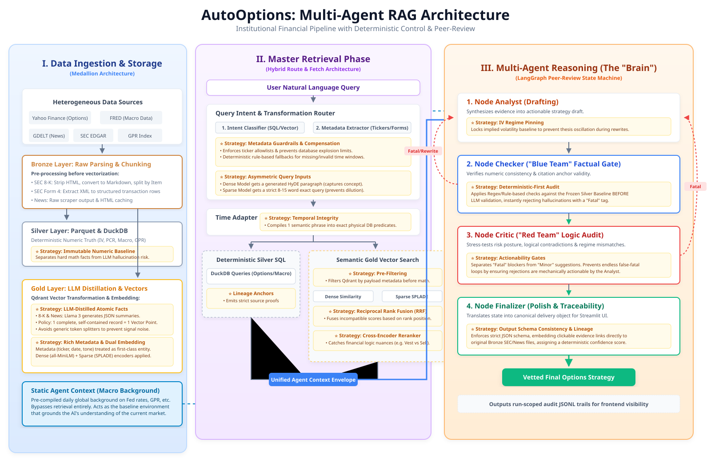
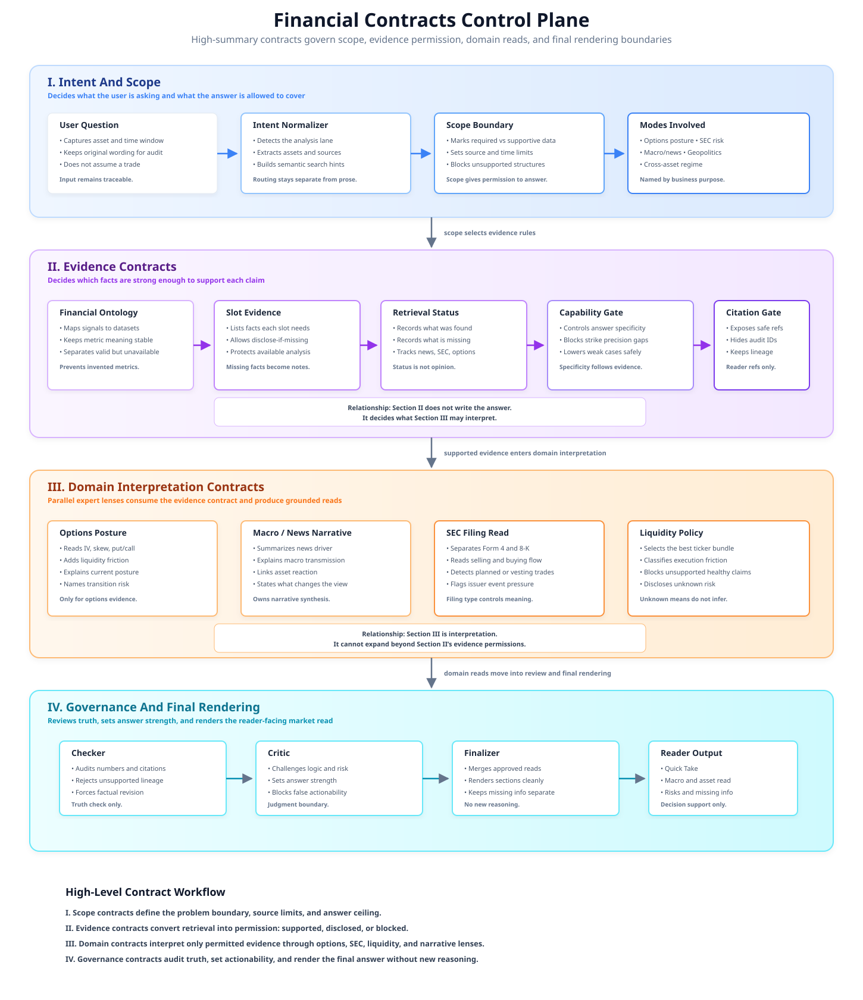
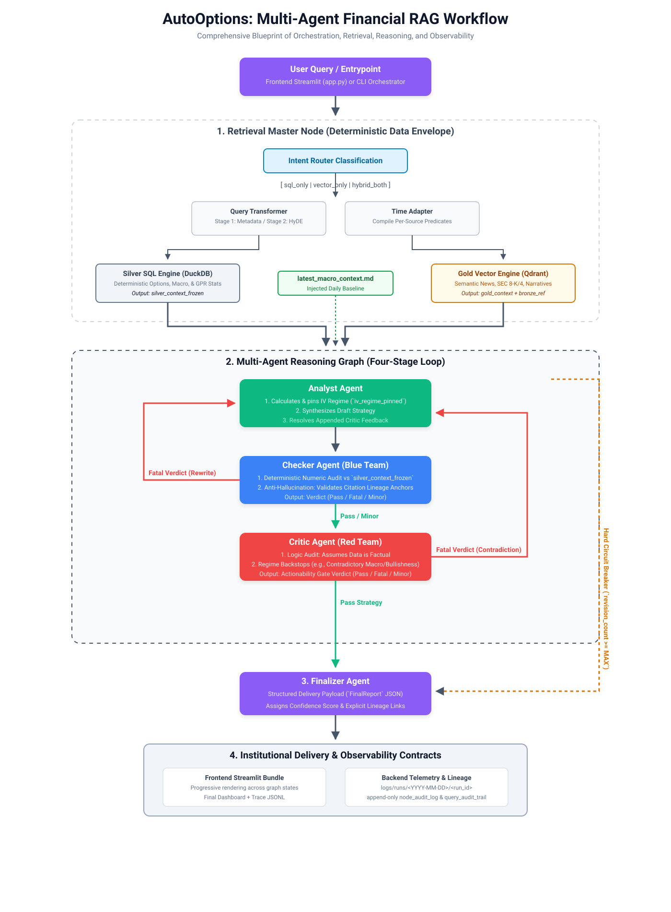
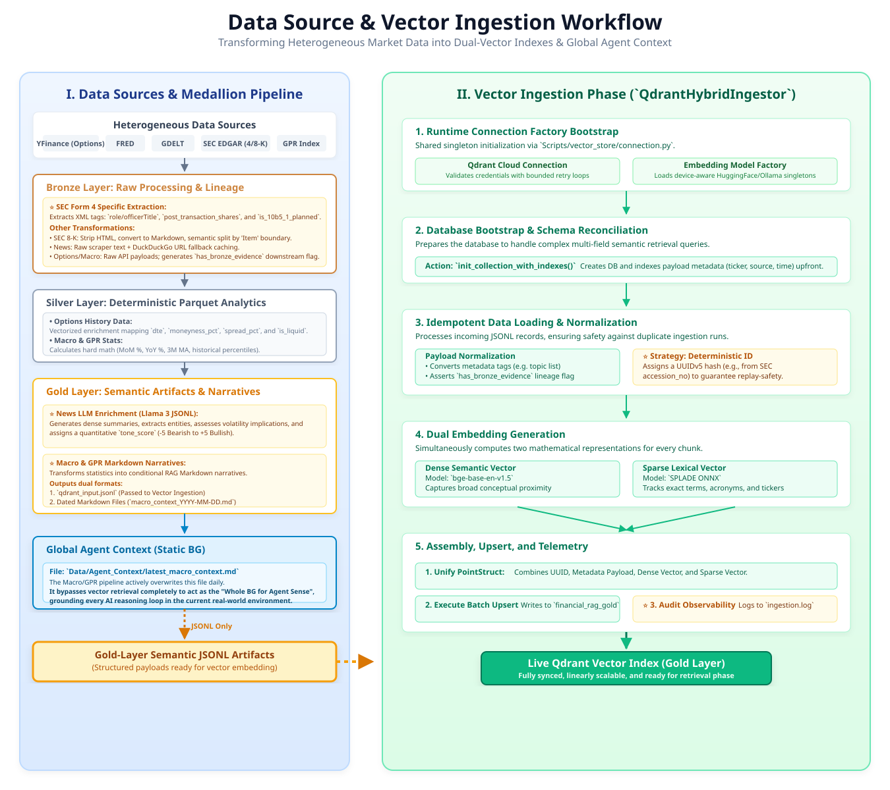
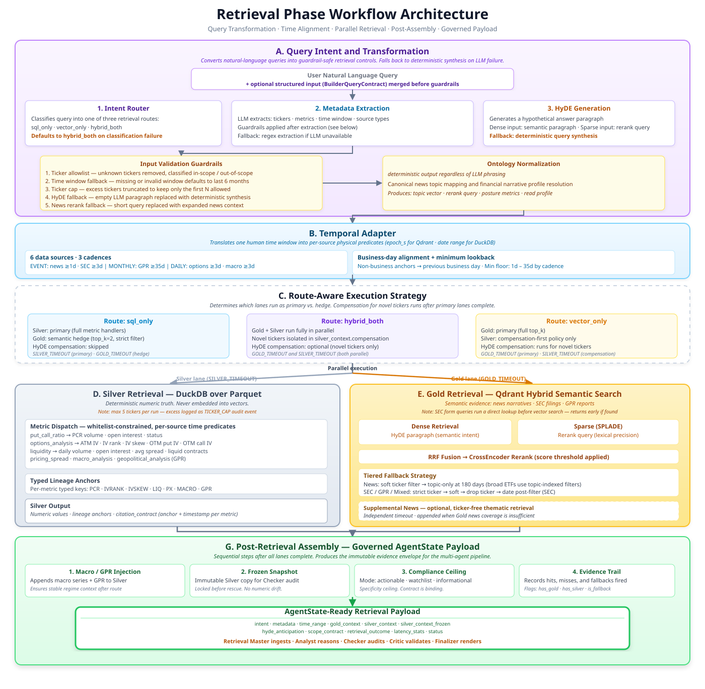
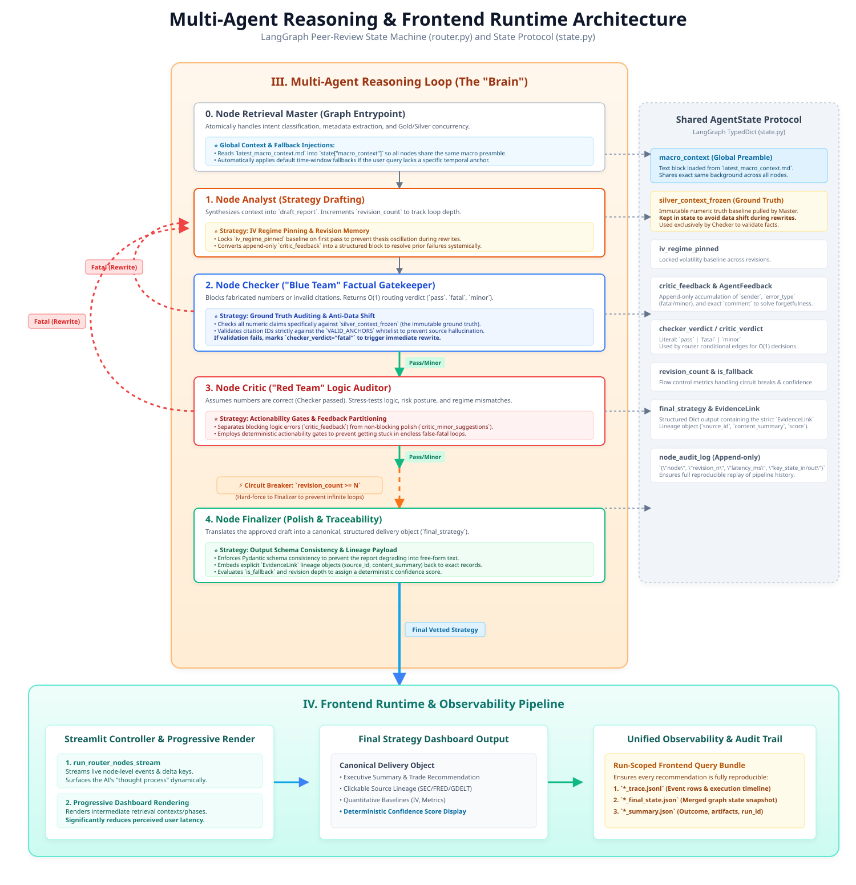

# AutoOptions — Contract-Governed Financial Intelligence Platform

AutoOptions is a contract-governed multi-agent RAG platform that fuses options chains, macro series, SEC filings, and geopolitical signals into evidence-anchored market intelligence.

- **Numeric grounding:** all financial metrics queried via deterministic Silver SQL — never embedded into vectors
- **Compliance-gated output:** three evidence-bounded modes (`actionable_options` / `directional_watchlist` / `informational_only`)
- **Full audit lineage:** typed `lineage_anchors` carried from Silver retrieval through Checker audit to final report

> The raw information exists. The translation layer does not.
> AutoOptions is that layer.

## Recent Improvements

### Finalizer Structure Visibility Enforcement (In-Event)

**Branch**: `improvement-in-event` | **Baseline**: `baseline-pre-event` at `76fb0a9`

Fixed a two-directional leak in the Finalizer's `structure_visibility_mode` enforcement (Phase 2 Item 4 / Workstream C):

- **Problem**: The Finalizer dropped legally-allowed illustrative structure (rate: 0.429) and could promote structure when the mode forbade it.
- **Fix**: Added `FinalizerRenderGuard` — a deterministic, post-LLM enforcement gate in `Scripts/agents/finalizer.py` that enforces three modes: `no_structure` strips all trade ideas, `illustrative_structure` preserves examples labeled non-live, `recommended_structure` passes through.
- **Verification**: 15 drift-guard regression tests in `Scripts/tests/test_finalizer_structure_guard.py` (no LLM required).
- **Eval cases**: Expanded from 5 → 12 cases in `Scripts/tests/router_e2e_queries.json` with structure visibility scenarios.
- **Skill**: `.agents/skills/finalizer-render-guard/SKILL.md`
- **ADLC Worksheet**: `docs/adlc_worksheet.md`


## Table of Contents
- [1. Financial Logic and Problem Framing](#1-financial-logic-and-problem-framing)
  - [1.1 The Information Gap](#11-the-information-gap)
  - [1.2 Why Existing Tools Break Here](#12-why-existing-tools-break-here)
  - [1.3 The Cross-Asset Financial Thesis](#13-the-cross-asset-financial-thesis)
  - [1.4 Financial Constraints Drive System Design](#14-financial-constraints-drive-system-design)
  - [1.5 Financial Contracts Control Plane](#15-financial-contracts-control-plane)
- [2. Architecture Blueprint](#2-architecture-blueprint)
- [3. Core Outcomes — System Capabilities at a Glance](#3-core-outcomes--system-capabilities-at-a-glance)
- [4. Data Sources, Rationale, and Medallion Lifecycle](#4-data-sources-rationale-and-medallion-lifecycle)
- [5. Runtime Workflow](#5-runtime-workflow)
- [6. Qdrant Ingestion and Retrieval Pipeline — Implementation Detail](#6-qdrant-ingestion-and-retrieval-pipeline--implementation-detail)
- [7. Multi-Agent Orchestration and Contract Governance](#7-multi-agent-orchestration-and-contract-governance)
- [8. Runtime Requirements and Operating Commands](#8-runtime-requirements-and-operating-commands)
  - [8.1 Prerequisites](#81-prerequisites-reproducible-baseline)
  - [8.2 Hardware and Deployment Tracks](#82-hardware-and-deployment-tracks)
  - [8.3 Environment Setup](#83-environment-setup)
  - [8.4 Reproducible First Run](#84-reproducible-first-run)
  - [8.5 Design Tradeoffs](#85-design-tradeoffs)
  - [8.6 Validation and Test Protocol](#86-validation-and-test-protocol)
- [9. Module Topology and Documentation Index](#9-module-topology-and-documentation-index)
- [10. Roadmap](#10-roadmap)
  - [10.1 Phase 2 Contract Hardening](#101-phase-2-contract-hardening)
  - [10.2 Financial Analysis Direction](#102-financial-analysis-direction)
  - [10.3 Sample Output](#103-sample-output)

## 1. Financial Logic and Problem Framing

### 1.1 The Information Gap
Macro signals that move markets are publicly visible — Fed rates, geopolitical risk indexes, dollar dynamics, CPI prints. Corporate events, SEC filings, news narratives, and options-chain conditions are available in separate places. For most users, the path from raw evidence to a coherent view of "what matters now" remains opaque.


---

### 1.2 Why Existing Tools Break Here
Three structural problems that neither static dashboards nor generic RAG systems solve:

| Failure Mode | Root Cause |
|---|---|
| **Modality fragmentation** | A complete signal requires macro numbers, narrative sentiment, SEC regulatory text, and live options chains — across different formats and update cadences. No single tool ingests all four. |
| **Semantic-vs-numeric conflict** | Vector retrieval handles context well but approximates badly on precise numerics. Routing IV, Greeks, and rates through the same embedding space as news narratives degrades both. |
| **Static signal weights** | Commodity ETF analysis is macro-regime driven; single-name equity analysis is event-driven. A system that cannot dynamically shift signal emphasis based on query intent and asset type will misroute evidence. |

---

### 1.3 The Cross-Asset Financial Thesis
Options mechanics are universal — strike, expiry, IV, Greeks, and liquidity apply equally to commodity ETFs and equities. AutoOptions treats these mechanics as one possible lens inside a broader information layer. The **signal sources that shape market interpretation differ fundamentally by asset class**:

| Asset Class | Core Signal Drivers | Primary Data Sources |
|---|---|---|
| **Commodity ETFs** (`GLD`, `SLV`) | Fed policy, real rates, CPI, dollar index, GPR, risk-off flow | FRED macro series, news narratives, GPR index |
| **Single-name equities** | Insider behavior, material corporate events, earnings catalysts | SEC Form 4 (transactions), Form 8-K (disclosures), options chain |

This divergence means a single retrieval path or a single evidence type cannot cover both. Separate signal tracks are a direct consequence of the cross-asset signal structure.

Signal pathway: `macro and event signals → market context and volatility regime view → optional reference structures when supported by evidence`

---

### 1.4 Financial Constraints Drive System Design
Every major architectural decision in AutoOptions is a direct consequence of the financial thesis above:

| Financial Constraint | System Design Response |
|---|---|
| ETF and equity paths need different signal weighting | Intent-classified retrieval routing (`sql_only` / `vector_only` / `hybrid_both`) per query |
| Options chains go stale intraday; macro series update monthly; SEC filings are event-triggered | Source-aware `TimePredicate` windows compiled per data type — not a single global lookback window |
| IV, rates, and liquidity must be exact, not approximated | Numeric data exclusively via DuckDB Silver SQL over Parquet — never embedded into vectors |
| Factual accuracy, numeric consistency, risk logic, and schema compliance are separable quality concerns | Contract-governed control loop: `Retrieval Master → Analyst → Checker → Critic → Finalizer` — one ownership boundary per node |

---

### 1.5 Financial Contracts Control Plane

The contract plane governs the entire pipeline — from intent resolution to final rendering. Each stage narrows what the next stage may claim, producing a staged, auditable evidence envelope.

**I. Intent → Scope**
User query resolves to asset, time window, and analysis lane. Scope defines the answer ceiling — what the system is permitted to cover — before retrieval begins.

**II. Evidence Permissions**
Retrieved data converts to permission states: supported, disclosed-if-missing, or blocked. Unknown metrics surface as unavailable; answer specificity is capped to what the data supports.

**III. Domain Reads (parallel)**
Options posture, macro/news narrative, SEC filing reads, and liquidity policy each interpret only evidence permitted by Stage II — through separate, non-overlapping lenses.

**IV. Governance → Final Rendering**
Checker audits numeric truth and citation anchors. Critic sets `recommendation_mode` and `actionability_mode`. Finalizer renders the terminal answer from `finalizer_input_card` without adding new financial reasoning.

→ Reference: [Financial Contracts Control Plane](./docs/core/Financial_Contracts_Control_Plane.md)

---
## 2. Architecture Blueprint



### Contract Governance View



### Live Demo

Watch the full end-to-end query flow — options chain read, macro backdrop, IV regime detection, and governed report rendering.

[Watch demo on Google Drive](https://drive.google.com/file/d/15w92FwAJPmnfo-6oIbWJyY-Fhh_tCRia/view?usp=drive_link)

---

## 3. Core Outcomes — System Capabilities at a Glance

> Four engineering pillars that separate AutoOptions from a standard RAG demo.

---

#### Pillar I — Intelligent Multi-Source Data Foundation
*What it is:* a cadence-driven ingestion DAG that turns five heterogeneous source families into a clean, retrieval-ready Medallion stack.

- Integrates **5+ active source families** (FRED, options chains, SEC, GPR, news) across **4 time granularities** (`TRADING_DAILY`, `DAILY`, `WEEKLY`, `MONTHLY`).
- Parses **API JSON + scraped HTML + Form 4 XML + Form 8-K HTML**; Bronze preserves SEC EDGAR accession links for end-to-end lineage trace-back.
- Enforces idempotent upsert and replay-safe run-state anchors to prevent duplicate writes across daily runs.
- Applies **source-specific pre-vectorization strategies** — each data class is enriched differently before hitting Qdrant:
  - **Form 4 (insider transactions):** deterministic rule-based scoring — transaction-code polarity (`P`/`S`), 10b5-1 plan discount, C-suite multipliers, and post-holding awareness — to produce auditable, low-variance signal.
  - **Form 8-K (material events):** semantic item chunking by `Item X.XX` boundaries + HTML-to-Markdown normalization before LLM compression; eliminates boilerplate noise and preserves event-section granularity for precise retrieval.
  - **News and GPR narratives:** LLM-distilled summary units at ingestion time — one coherent, causally-complete narrative block per article or monthly signal; avoids the low-precision fragment problem of sentence-level chunking.
  - **Options chains and macro data:** never embedded — queried exclusively via DuckDB Silver SQL contracts for deterministic numeric truth.

→ Reference: [Data Source Summary](./docs/Data_source_docs/Data_source_summary.md) · [SEC Data](./docs/Data_source_docs/SEC_data.md) · [Embedding and Chunking Strategy](./docs/Strategy_choices_docs/Embedding_Chunking_and_Retrieval_Fusion_Strategy.md)

---

#### Pillar II — Hybrid Retrieval and Query Intelligence
*What it is:* a three-route retrieval engine with two-stage query transformation and a multi-channel fusion stack that keeps semantic recall and numeric precision separate.

- **Dual-vector indexing** (dense + sparse) with lineage-preserving payloads and accession-based deterministic IDs prevents duplicate vectors and citation drift.
- **3-route intent classification** (`sql_only`, `vector_only`, `hybrid_both`) with typed metadata extraction + HyDE semantic expansion for each route.
- **Source-aware `TimePredicate` windows** compiled per source type to keep daily/monthly/event datasets on physically valid time bounds.
- **Asymmetric hybrid Gold retrieval** (dense + sparse + RRF fusion + cross-encoder rerank) with strict-to-relaxed fallback tiers for high recall and high precision.
- **DuckDB Silver SQL** as the deterministic numeric system of record; typed lineage anchors (`MACRO_*`, `LIQ_*`, `PCR_AGG_*`, `PX_*`, `GPR_*`) are emitted per query result, carried into `silver_context_frozen`, and verified by the Checker against the immutable baseline.

→ Reference: [Retrieval Architecture](./docs/Query_retrieval_docs/Retrieval_Architecture_and_Strategy.md) · [Query Intent](./docs/Query_retrieval_docs/Query_intent_docs.md) · [Qdrant Retriever](./docs/Query_retrieval_docs/Qdrant_retriever_docs.md) · [Silver SQL Tools](./docs/Query_retrieval_docs/Silver_SQL_Tools.md)

---

#### Pillar III — Contract-Governed Multi-Agent Reasoning

*What it is:* a LangGraph state-machine with five role-isolated nodes, driven by five runtime contract layers and a centralized prompt control plane.

- **Role isolation by design:** five role-isolated nodes, each with one ownership boundary. No node can override another's domain.
- **Five runtime contract layers** govern the graph rather than prompt chaining: financial ontology (metric allowlists, query-family slot definitions), reasoning and actionability (`data_capability_profile`, IV regime archetypes), slot-evidence and disclosure (per-slot validation, coverage scoring), role prompt contracts (explicit operating mandates per node), and global typed state (`AgentState` with immutable `silver_context_frozen` as the Checker audit baseline).
- **LangGraph + LangChain integration:** LangGraph manages the state-machine topology, conditional routing after Checker and Critic, and the `AGENT_MAX_REVISIONS` circuit-breaker; LangChain provides `Document`-style semantic ingestion, `ChatPromptTemplate`-driven role prompting, and structured-output control in the finalization path.

→ Reference: [Agent Architecture](./docs/agent/Agent_Architecture.md) · [LLM Pool Operations Guide](./docs/modular_guide/LLM_Pool_Operations_Guide.md)

---

#### Pillar IV — Operational Strategy, Parallel Retrieval, and Observability
*What it is:* a route-aware execution strategy that balances latency, evidence coverage, hardware placement, and replayable auditability.

Gold vector retrieval, Silver SQL retrieval, HyDE compensation, supplemental news, and macro/GPR patch injection execute as a route-aware concurrent plan. Each lane operates independently so evidence can arrive under separate failure budgets without blocking the pipeline.

| Lane | Execution | Failure isolation |
|---|---|---|
| Gold (semantic) | `dense + sparse + RRF + CrossEncoder rerank`; branched fallback cascade (news-only: soft-ticker tiers; SEC/GPR/mixed: hard → soft → drop) | `GOLD_TIMEOUT`; exception-isolated via `asyncio.gather` |
| Silver (numeric) | `DuckDB` over Parquet; metric-dispatched; `TimePredicate`-windowed per source type | `SILVER_TIMEOUT`; degraded context assembled rather than blocked |
| HyDE compensation | Novel-ticker Silver probe; isolated under `silver_context.compensation` | `HE_NOVEL_TICKERS_CAP` prevents ticker explosion |
| Supplemental news | Ticker-free thematic news retrieval appended when Gold news coverage is insufficient | Independent timeout; appended, not replacing primary Gold |
| Macro / GPR patch | Post-retrieval injection of latest regime context with `MACRO_*` / `GPR_*` lineage anchors | Runs after primary route; always appended regardless of Silver status |

→ Reference: [Embedding, Chunking, and Retrieval Fusion Strategy](./docs/Strategy_choices_docs/Embedding_Chunking_and_Retrieval_Fusion_Strategy.md) · [Observability](./docs/modular_guide/Observability.md) · [LLM Pool Operations Guide](./docs/modular_guide/LLM_Pool_Operations_Guide.md) · [Time Schema Audit](./docs/Data_source_docs/Time_Schema_Audit.md)

---
## 4. Data Sources, Rationale, and Medallion Lifecycle

### 4.1 Source Registry and Business Value

| Source Domain | Acquisition Layer | Silver/Gold Contract | Core Business Value |
| --- | --- | --- | --- |
| FRED macro series | `fredapi` pipeline | Parquet + narrative context | Real-rate/CPI regime guidance for precious-metal pricing |
| Options market data | `yfinance` scrapers | Silver Parquet (structured) | IV/OI/moneyness/liquidity truth set |
| SEC filings | SEC EDGAR ingestion + processing | Bronze parsed Form 4 XML + Form 8-K HTML; Gold enriched semantic JSONL | Insider flow + material event intelligence with traceable accession-level lineage |
| Geopolitical risk | `GPR_index.py` | Silver metrics + Gold narrative/JSONL | Risk-off lead indicator for metals and volatility |
| Global news (GDELT + full text) | `news_scraper.py` | Bronze raw/full text + Gold enriched JSONL | Event/tone-driven volatility context |


### 4.2 Medallion Processing Contract
1. **Bronze:** raw source-native payloads (JSONL/HTML/XML/CSV).
2. **Silver:** deterministic normalized Parquet tables (numeric system of record).
3. **Gold:** retrieval-ready semantic artifacts (JSONL/Markdown) for vector search.
4. **Agent Context:** prompt convenience snapshots, never replacing Silver truth.

---

## 5. Runtime Workflow



---

## 6. Qdrant Ingestion and Retrieval Pipeline — Implementation Detail



### 6.1 Ingestion and Indexing Principles
- Inject structured metadata before vectorization (`ticker`, `source_type`, `form_type`, timestamps, lineage IDs) to enable deterministic filtering.
- Use schema-enforced upsert and payload indexing for high-selectivity retrieval at query time.
- Run asymmetric hybrid retrieval channels: dense semantic vectors (HyDE paragraph) + sparse lexical vectors (rerank query) with server-side fusion.
- Apply cross-encoder reranking and score gating so only high-signal chunks enter downstream reasoning.
- Preserve idempotency and auditability via accession/url-based lineage and retrieval audit trails.



### 6.2 Retrieval Execution Logic
1. Classify route intent (`sql_only`, `vector_only`, `hybrid_both`) and transform query into typed metadata + HyDE payload via two-stage LLM extraction with five production guardrails.
2. Compile per-source `TimePredicate` windows (business-day-safe for daily, month-safe for monthly, min-lookback-floored for event sources) and build smart metadata filters.
3. Execute route-specific retrieval plan with independent `GOLD_TIMEOUT` and `SILVER_TIMEOUT` budgets under `asyncio.gather(..., return_exceptions=True)`.
4. Run asymmetric hybrid Gold retrieval: branched by query type — news-only uses soft-ticker tiers; SEC/GPR/mixed uses hard-to-drop cascade — with `dense + sparse + RRF + CrossEncoder rerank`.
5. Run Silver deterministic retrieval: metric-dispatched DuckDB queries over Parquet with `TimePredicate`-bound windows, ticker cap, and typed lineage anchors.
6. Optionally apply HyDE entity compensation to query novel whitelisted tickers under `silver_context.compensation` without overwriting primary Silver truth.
7. Inject macro series and GPR patches post-retrieval; write `silver_context_frozen` as the immutable Checker baseline.
8. Assemble one `AgentState`-ready payload with `scope_contract`, `retrieval_outcome`, `time_range`, `hyde_anticipation`, status, and latency telemetry.

---

## 7. Multi-Agent Orchestration and Contract Governance



### 7.1 Agent Responsibilities
Runtime control chain: `Retrieval Master → Analyst → Checker → Critic → Finalizer`.

- **Retrieval Master:** compiles the evidence envelope and emits `scope_contract`, `retrieval_outcome`, `silver_context_frozen`, `time_range`, and `hyde_anticipation`.
- **Analyst:** drafts an evidence-grounded market read from that envelope, pins IV regime across revisions, and seeds the first `finalizer_input_card`.
- **Checker:** audits factual integrity, numeric consistency, citation anchors, and slot coverage; it does not decide recommendation mode.
- **Critic:** challenges strategy logic and owns `recommendation_mode`, `actionability_mode`, `structure_visibility_mode`, and `revision_constraints`; it refreshes the `finalizer_input_card`.
- **Finalizer:** consumes the card first and renders the final schema/report with section placement and mode enforcement only; it does not add new financial reasoning.

The `finalizer_input_card` is the preferred handoff into final rendering. It packages evidence lines, mode decisions, minor edits, scope summaries, retrieval outcomes, and capability context so the final report remains governed by upstream contracts.

### 7.2 Model Deployment

| Node | Primary model | Ollama alternative |
|---|---|---|
| Router | `gpt-4o-mini` | `llama3:latest` |
| Analyst | `gpt-4o` | `options-expert-v1:latest` |
| Checker | `gpt-4o-mini` | `llama3:latest` |
| Critic | `gpt-4o-mini` | `options-expert-v1:latest` |
| Finalizer | `gpt-4o` | `options-expert-v1:latest` |

Provider and model are independently configurable per role via `<NODE>_PROVIDER` and `<NODE>_MODEL` in `.env`. Ollama path activates under `docker compose --profile ollama up`.

### 7.3 Contract and Governance Layer
- Role prompt contracts enforce hard operating boundaries: Checker is explicitly forbidden from strategy evaluation; Finalizer is explicitly forbidden from new financial reasoning.
- `revision_constraints` is the single source of truth for Finalizer boundary behavior, built by Critic and carried into `finalizer_input_card`.
- `silver_context_frozen` is the immutable numeric baseline written by Retrieval Master and used exclusively by Checker for deterministic audit — preventing revision-loop numeric drift.

### 7.4 Workflow Governance
- Hard circuit-breaker at `AGENT_MAX_REVISIONS`; revision cap forces Finalizer regardless of pending findings.
- Checker emits two separate output channels: `critic_feedback` (fatal, reopens Analyst loop) and `checker_edit_suggestions` (non-blocking, passed directly to Finalizer).
- Append-only `node_audit_log` captures per-node latency, verdict, and finding count for replay and observability.
- Backend run logs, node audit events, latency stats, and frontend query bundles share compatible audit semantics under `logs/`.

→ Reference: [Agent Architecture](./docs/agent/Agent_Architecture.md) · [Retrieval Master](./docs/agent/Node_Retrieval_Master.md) · [Analyst](./docs/agent/Node_Analyst.md) · [Checker](./docs/agent/Node_Checker.md) · [Critic](./docs/agent/Node_Critic.md) · [Finalizer](./docs/agent/Node_Finalizer.md)

---

## 8. Runtime Requirements and Operating Commands

### 8.1 Prerequisites (Reproducible Baseline)
- Python `3.10+` with `pip`.
- A running Ollama endpoint (default `http://localhost:11434`) with required models pulled — **required only for Track B (Ollama); skip if using Track A (OpenAI)**.
- A reachable Qdrant instance with API access.
- FRED credential and SEC-compliant user agent.
- Optional OpenAI-compatible credential for fallback and transform roles.

### 8.2 Hardware and Deployment Tracks

> Both tracks share the same retrieval stack architecture. The difference is where LLM inference runs and how GPU capacity is allocated between reasoning and encoding.

**Track A — OpenAI (cloud inference)**
- **2 GPU** — dedicated to dense encoder + SPLADE sparse encoder; prevents retrieval timeout under concurrent Gold/Silver load
- **2+ CPU cores** — DuckDB Silver queries, orchestration
- LLM inference via OpenAI API; no local GPU required for reasoning
- Activate: `docker compose up` (default)

**Track B — Ollama (local inference)**
- **4 GPU** minimum VRAM pool — for `options-expert-v1` (custom fine-tune, base `llama3:70B`); 70B-class models require ~35–40 GB VRAM in fp16 or ~20 GB in int4
- **6 CPU threads** (`FASTEMBED_THREADS=6`) — SPLADE sparse encoder runs on CPU to preserve GPU headroom for the 70B model
- Dense encoder and cross-encoder reranker: CPU
- Activate: `docker compose --profile ollama up`

| Runtime tier | Track A (OpenAI) | Track B (Ollama) | Key controls |
|---|---|---|---|
| LLM reasoning | OpenAI API | GPU (`options-expert-v1` / `llama3`) | `<NODE>_PROVIDER`, `<NODE>_MODEL`, `OLLAMA_BASE_URL`, `OLLAMA_CUSTOM_MODEL_NAME` |
| Dense encoder | GPU | CPU | `EMBEDDING_DEVICE`, `EMBEDDING_MODEL_NAME` |
| SPLADE sparse encoder | GPU | CPU (6 threads) | `RETRIEVER_DEVICE`, `FASTEMBED_THREADS`, `SPARSE_MODEL_NAME` |
| Cross-encoder reranker | CPU | CPU | `RERANKER_MODEL_NAME` |
| Silver numeric (DuckDB) | CPU | CPU | `DATA_LAKE_ROOT`, `SILVER_TIMEOUT`, `SILVER_MAX_TICKERS` |
| Gold semantic (Qdrant) | CPU + Qdrant | CPU + Qdrant | `QDRANT_HOST`, `QDRANT_API_KEY`, `GOLD_TIMEOUT` |
| HyDE / ticker fanout | CPU | CPU | `HE_NOVEL_TICKERS_CAP`, `TICKER_EXPLOSION_CAP`, `TICKER_EXPLOSION_KEEP` |
| Agent graph governance | Provider-configurable | Provider-configurable | `ANALYST_PROVIDER`, `CHECKER_PROVIDER`, `CRITIC_PROVIDER`, `FINALIZER_PROVIDER`, `AGENT_MAX_REVISIONS` |

All variables documented in [`.env.sample`](.env.sample). Production secrets stay in local `.env` only.

### 8.3 Environment Setup
1. Create and activate a virtual environment.
2. Install dependencies from `requirements.txt`.
3. Copy `.env.sample` to `.env` and populate secrets/endpoints.

```bash
python -m venv .venv
# Windows PowerShell: .venv\Scripts\Activate.ps1
# macOS/Linux: source .venv/bin/activate
pip install -r requirements.txt
cp .env.sample .env
```

Minimum `.env` keys to validate before first run:
- `FRED_API_KEY`
- `SEC_USER_AGENT`
- `QDRANT_HOST`
- `QDRANT_API_KEY`
- `OLLAMA_BASE_URL`
- `OLLAMA_CUSTOM_MODEL_NAME`
- `OLLAMA_ROUTER_MODEL`
- `OPENAI_API_KEY` (if fallback is enabled)

### 8.4 Reproducible First Run

#### Core backend checks
```bash
python -m Scripts warmup --roles analyst router checker
python -m Scripts ingest
python Scripts/vector_store/ingestion.py --no-full-refresh
python -m Scripts query "Past week FOMC and 10Y yields impact on SPY puts?"
python Scripts/tests/test_router_e2e.py
```

#### Frontend checks
```bash
streamlit run Frontend/app.py
```

Suggested starter queries:
- `Today SPY put-call ratio and IV skew for hedge posture`
- `Past week GLD GPR context and 10Y yields for setup to watch`
- `Past month AAPL Form 4 insider selling and liquidity for signal impact`
- `Past week QQQ VIX regime and news narrative for options read`

Frontend query UX reference: [User Query Playbook](./docs/modular_guide/User_Query_Guide.md).

User-friendly frontend priorities:
- Make the first screen explain the product in market-intelligence language, then keep the analysis workspace focused on the user's query.
- Keep the Quick Take visible as the primary canvas highlight before deeper audit, routing, and evidence views.
- Add a Query Builder with asset dropdown, time-window segmented control, signal chips, goal selection, and generated prompt preview.
- Phrase query feedback as next-step guidance: asset, signal/event, time window, and goal.
- Render lagging macro indicators as a compact, horizontally scrollable evidence strip so slow-cycle context stays visible without crowding the chat.
- Prefer progressive disclosure for institutional detail: show summary first, then report, audit, and raw context when needed.

### 8.5 Design Tradeoffs

These tradeoffs are intentional. Understanding them is essential before adjusting timeouts, disabling fallbacks, or extending the contract plane.

AutoOptions accepts higher schema and node-ownership complexity — per-source time windows across four data cadences, three evidence-gated output modes, and mandatory missing-data disclosure — in exchange for auditable evidence coverage, compliance-bounded actionability, and output that degrades transparently.

| Strategy | Benefit | Tradeoff |
|---|---|---|
| Gold/Silver concurrent retrieval | Lowers end-to-end wait while preserving both lanes | More complex partial-failure assembly |
| GPU retrieval encoders | Prevents timeout under concurrent Gold/Silver load | Requires dedicated GPU allocation separate from LLM inference |
| Independent timeouts | Prevents one slow engine from blocking the run | May produce degraded answers that must be disclosed |
| HyDE compensation | Improves recall for entities not explicit in the user query | Requires whitelist and caps to avoid ticker explosion |
| Contract governance | Reduces hallucination and actionability drift | Adds schema and node-ownership complexity |

---

### 8.6 Validation and Test Protocol

Validation checklist:
- Query renders progressive sections before final report completion.
- Header, lagging macro indicators, Query Guide, and Quick Take highlight render cleanly on desktop and mobile widths.
- Backend run-scoped logs appear under `logs/runs/<today>/<run_id>/`.
- Frontend bundle files appear under `logs/frontend_query/<today>/`.
- `query_audit_trail.jsonl` includes resolvable paths to trace/final_state/summary artifacts.

## 9. Module Topology and Documentation Index

| Module Domain | High-Level Responsibility | Primary Code Surface | Key Operational Outputs | Detailed Documentation |
| --- | --- | --- | --- | --- |
| Agent graph runtime | Executes deterministic multi-agent control loop (`retrieval_master -> analyst -> checker -> critic -> finalizer`) with revision circuit-breakers and node telemetry | `Scripts/agents/` | `final_report`, `node_audit_log`, revision-aware state transitions | [`docs/agent/Agent_Architecture.md`](./docs/agent/Agent_Architecture.md) |
| Agent node specifications | Defines node-level role ownership, input/output state contracts, verdict semantics, and card handoff rules | `Scripts/agents/` | node-specific state deltas, audit events, `finalizer_input_card`, `final_strategy` | [`Retrieval Master`](./docs/agent/Node_Retrieval_Master.md) · [`Analyst`](./docs/agent/Node_Analyst.md) · [`Checker`](./docs/agent/Node_Checker.md) · [`Critic`](./docs/agent/Node_Critic.md) · [`Finalizer`](./docs/agent/Node_Finalizer.md) |
| Financial contract control plane | Governs intent, scope, evidence sufficiency, data capability, SEC semantics, posture, narrative rendering, and actionability boundaries | `Scripts/core/`, `Scripts/retrieval/schema.py`, `Scripts/agents/state.py` | `scope_contract`, `retrieval_outcome`, `data_capability_profile`, `revision_constraints`, `finalizer_input_card` | [`docs/core/Financial_Contracts_Control_Plane.md`](./docs/core/Financial_Contracts_Control_Plane.md) |
| Retrieval and query transform | Performs intent routing, metadata extraction, HyDE anticipation, Gold/Silver hybrid retrieval, and time-window predicate compilation | `Scripts/retrieval/` | retrieval payloads (`metadata`, `gold_context`, `silver_context`, `time_range`, `hyde_anticipation`) | [`docs/Query_retrieval_docs/Retrieval_Architecture_and_Strategy.md`](./docs/Query_retrieval_docs/Retrieval_Architecture_and_Strategy.md) |
| Retrieval strategy and performance | Documents chunking policy, dense/sparse/rerank model choices, route-aware parallel retrieval, timeout strategy, CPU/GPU placement, and retrieval tradeoffs | `Scripts/retrieval/master_retriever.py`, `Scripts/retrieval/qdrant_retriever.py` | concurrent Gold/Silver context, HyDE anticipation, compensation lane, latency stats | [`docs/Strategy_choices_docs/Embedding_Chunking_and_Retrieval_Fusion_Strategy.md`](./docs/Strategy_choices_docs/Embedding_Chunking_and_Retrieval_Fusion_Strategy.md) |
| Data ingestion and processing | Runs cadence-driven ingestion DAG from external sources to Bronze/Silver/Gold datasets | `Scripts/data_collection/`, `Scripts/orchestration/` | medallion-layer datasets under `Data/1_Bronze_Raw`, `Data/2_Silver_Processed`, `Data/3_Gold_Semantic` | [`docs/Data_source_docs/Data_source_summary.md`](./docs/Data_source_docs/Data_source_summary.md) |
| Vector store layer | Ingests Gold semantic artifacts and manages retrieval index connectivity | `Scripts/vector_store/` | Qdrant-ingested semantic collections and ingestion audit metadata | [`docs/Vector_store_docs/Vector_Ingestion.md`](./docs/Vector_store_docs/Vector_Ingestion.md) |
| Orchestration CLI plane | Provides production entrypoints for `ingest`, `daemon`, `status`, `query`, and `warmup` with run-state persistence | `Scripts/orchestration/cli.py`, `Scripts/main.py`, `Scripts/__main__.py` | run-scoped state updates, stage execution summaries, operational command surface | [`docs/modular_guide/Orchestration.md`](./docs/modular_guide/Orchestration.md) |
| Frontend execution plane | Streams node-by-node execution progress and renders a final evidence-grounded market intelligence dashboard | `Frontend/` | frontend query bundles (`*_trace.jsonl`, `*_summary.json`, `*_final_state.json`) | [`docs/modular_guide/Frontend Runtime Guide.md`](./docs/modular_guide/Frontend_Runtime_Guide.md) |
| User query UX | Defines human-readable prompt patterns, supported query families, and current routing limitations | `docs/modular_guide/User_Query_Guide.md`, `Frontend/contracts.py` | query templates, query quality suggestions, route-aware user guidance | [`docs/modular_guide/User Query Guide.md`](./docs/modular_guide/User_Query_Guide.md) |
| Observability and audit | Standardizes backend + frontend telemetry contracts for replayability and compliance traceability | `Scripts/observability/`, `Frontend/audit.py` | `logs/runs/<YYYY-MM-DD>/<run_id>/...` and `logs/frontend_query/<YYYY-MM-DD>/...` artifacts | [`docs/modular_guide/Observability.md`](./docs/modular_guide/Observability.md) |
| LLM control plane | Centralizes role-level model selection, warmup policy, and fallback behavior | `Scripts/core/llm_pool.py`, `Scripts/core/financial_config.py` | warmup health status and role-aligned model runtime behavior | [`docs/modular_guide/LLM Pool Operations Guide.md`](./docs/modular_guide/LLM_Pool_Operations_Guide.md) |
| Testing and guardrails | Validates end-to-end routing correctness, retrieval contract integrity, and safety rules | `Scripts/tests/` | regression evidence for routing, retrieval, and guardrail behavior | [`docs/modular_guide/Documentation Control Plane.md`](./docs/modular_guide/Documentation_Control_Plane.md) |

---

## 10. Roadmap

### 10.1 Phase 2 Contract Hardening

The current contract model is coherent across intent, scope, evidence, posture, narrative, critic governance, and final rendering. Phase 2 focuses on making those boundaries harder to drift, easier to test, and safer for future contributors. No production changes are required; these are near-term hardening workstreams.

| Workstream | Goal | Key deliverables |
|---|---|---|
| **A. Contract drift guardrails** | Lock posture activation and mode ceiling rules against implementation drift | Regression tests for `read_profile == "posture_read"` activation; scope-ceiling conservatism tests |
| **B. Handoff schema hardening** | Reduce silent field drift in cross-node dictionary handoffs | Typed Pydantic validators for `revision_constraints` and `finalizer_input_card`; backward-compatible serialization |
| **C. Finalizer render boundary** | Ensure Finalizer remains a renderer, not a financial reasoning node | Render-safe input schema; `no_structure` and `illustrative_structure` mode enforcement tests |
| **D. Evidence carry robustness** | Reduce brittleness from answer text matching in slot coverage evaluation | Structured evidence-carry metadata on Analyst output; text alias matching as fallback audit |

→ Reference: [Financial Contract Control Plane Phase 2](./docs/Improvement/Financial_Contract_Control_Plane_Phase2.md)

---

### 10.2 Financial Analysis Direction

Planned deepening of the financial contract layer toward institutional analysis quality:

- **Multi-leg options structures:** extend `actionable_options` mode to support spread definitions (vertical, iron condor) with explicit risk/reward disclosure per leg
- **Regime-conditional posture logic:** encode IV regime archetypes (low / elevated / spike) directly into Critic's actionability ceiling rather than narrative-only framing
- **SEC event materiality scoring:** extend Form 8-K ingestion with item-level materiality tiers to differentiate routine filings from market-moving disclosures
- **Cross-asset correlation signals:** integrate correlation regime (risk-on / risk-off / decorrelated) as an explicit `scope_contract` field for commodity ETF queries

→ Reference: [Phase 2 Roadmap](./docs/Improvement/Financial_Contract_Control_Plane_Phase2.md)

---

### 10.3 Sample Output

The system produces a structured, evidence-anchored report with up to six governed sections. The output degrades transparently: sections absent from the evidence surface as explicit disclosure rather than silence.

| Section | Content |
|---|---|
| **Quick Take** | Concise posture conclusion anchored to numeric evidence |
| **Macro / Event Backdrop** | GPR, VIX, GLD/SLV, and macro series context |
| **Asset / Options Read** | PCR, ATM IV, IV rank, IV skew, liquidity tier |
| **Recommendation Mode** | `actionable_options` / `directional_watchlist` / `informational_only` with rationale |
| **Risks / What Would Change the View** | Evidence-bounded risk disclosure |
| **Missing Info Disclosure** | Explicit statement of evidence gaps; present when Silver coverage is incomplete |

→ Examples: [SPY Market Read](./docs/report_example/SPY_Market_Read.md) · [QQQ Options Strategy Report](./docs/report_example/Options_Strategy_Report.md)
