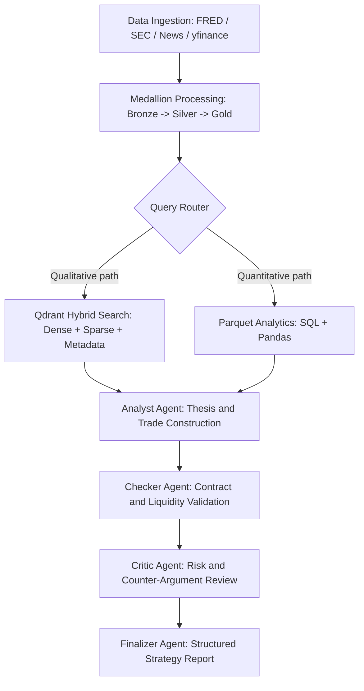
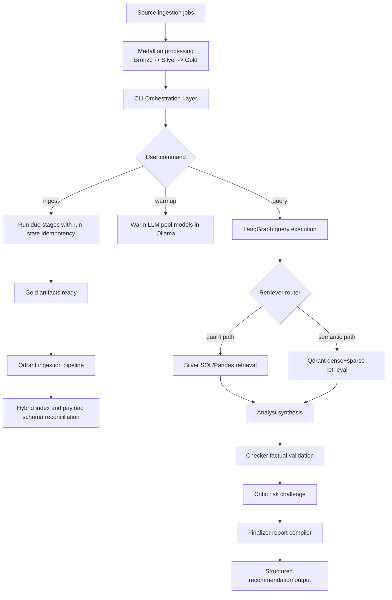

# Multi-Modal Multi-Agent Financial RAG System

## 1. Strategic Objectives (Goal)
The primary objective of this project is to democratize institutional-grade options trading by bridging the gap between quantitative market data and qualitative semantic insights. By leveraging a **Medallion Architecture**, the system automates the identification of cross-asset volatility arbitrage opportunities (e.g., GLD/SLV vs. correlated equities). 

**Core outcomes:**
- Reduce trading hallucinations via multi-agent cross-examination (Analyst -> Checker -> Critic -> Finalizer).
- Fuse fragmented data domains (FRED / GPR / SEC / News / options chains) into a single query surface.
- Produce auditable, reproducible recommendation artifacts for paper-trading workflows.

---

## 2. High-Level System Architecture
The system operates on a **Dual-Track Data Engine** designed to handle the heterogeneity of financial markets:
* **Quantitative Track (Structured):** Processes high-frequency numeric data 
(Parquet) via SQL-like tools or Pandas Agents to ensure 100% accuracy in 
pricing and Greeks.
* **Qualitative Track (Unstructured):** Processes news and SEC filings 
through a Hybrid RAG pipeline (Dense + Sparse + Metadata filtering) in Qdrant.
* **State Machine Orchestration:** Uses **LangGraph** to govern the 
transition between data retrieval, analysis, and risk auditing.



---
## 3. Operational Workflow & Multi-Agent Logic
### Workflow Orchestration (Execution Lifecycle)



---
## 4. Medallion Data Governance & Schema
Data is partitioned into three logical layers to ensure lineage and high 
information density:
| Layer | Data Profile | Storage | Governance Objective |
| :--- | :--- | :--- | :--- |
| `1_Bronze_Raw` | Raw, minimally transformed captures | HTML / XML / JSONL | Traceability, replay, and source-level audits |
| `2_Silver_Processed` | Deterministic structured tables | Parquet | Accurate numeric analytics (prices, IV, macro) |
| `3_Gold_Semantic` | Retrieval-ready semantic records | JSONL / Markdown | Hybrid search relevance and citation grounding |
| `Agent_Context` | Session-level macro memory | Markdown snapshots | Shared context injection across all agent roles |

---

## 5. Quality Assurance & Evaluation Framework (Evaluation)
The evaluation standard is designed to mirror production controls used in institutional research tooling.

### 1) Retrieval and grounding quality
- **Faithfulness (RAGAS):** verifies the report is supported by retrieved evidence.
- **Context Precision (RAGAS):** checks whether retrieved chunks are topically and temporally relevant.
- **Time-barrier compliance:** validates retrieval respects `unified_timestamp/publish_timestamp` filters.

### 2) Deterministic market validation
- **Contract existence checks:** Checker validates recommended option contracts against live `yfinance` chain data.
- **Liquidity guardrails:** enforce minimum open interest / quote sanity checks before contract inclusion.
- **Numeric drift controls:** configurable tolerances (for example, `CHECKER_NUMERIC_TOLERANCE`) to detect unstable conclusions.

### 3) Regression and model governance
- **Golden dataset replay:** historical complex QA set for non-regression across prompt/model updates.
- **Role-level warmup validation:** ensure both expert and router model tiers are online before live querying.
- **Auditability:** centralized logs and runtime state snapshots support post-mortem investigations.

---

## 6. Operational CLI Playbook
All examples below are production-safe with the current CLI entrypoint (`python -m Scripts`).

### A. Warmup command
```bash
python -m Scripts warmup
python -m Scripts warmup --roles analyst router
```

### B. Data collection (orchestration pipeline)
```bash
python -m Scripts ingest
python -m Scripts ingest --only news_daily options_daily
python -m Scripts ingest --force
python -m Scripts status --json
```

### C. Qdrant ingestion
```bash
python Scripts/vector_store/ingestion.py
python Scripts/vector_store/ingestion.py --no-full-refresh
python Scripts/vector_store/ingestion.py --indexes-only
```

### D. Query command
```bash
python -m Scripts query "Generate a hedged options idea for AAPL this week."
python -m Scripts query --warmup "Compare GLD and SLV options risk-reward under current macro regime."
```

### E. GPU node with single-terminal constraint (no extra terminal allowed)
Use a **single sequential runbook** in one shell session:

```bash
python -m Scripts warmup --roles analyst router && python -m Scripts ingest && python Scripts/vector_store/ingestion.py --no-full-refresh && python -m Scripts query "What is the best risk-defined setup for QQQ this week?"
```

If you need a background scheduler without opening another terminal (PowerShell):
```powershell
$daemon = Start-Job -ScriptBlock { python -m Scripts daemon --poll-seconds 30 --warmup }
Receive-Job -Id $daemon.Id -Keep
```

---

## 7. Compute Topology: CPU vs GPU Model Utilization
### CPU-heavy components
- Data ingestion scripts (FRED/SEC/News/yfinance ETL).
- Parquet processing and SQL/Pandas numeric analysis.
- Most filesystem, scheduling, and orchestration logic.

### GPU-preferred components
- Ollama expert model (`options-expert-v1:latest`) for analyst/checker/critic/finalizer and query transform.
- Router model (`llama3:latest`) can run on CPU, but lower-latency routing benefits from GPU if available.

### Configuration controls
- `RETRIEVER_DEVICE=cpu|cuda` controls retriever-side model device preference.
- `EMBEDDING_DEVICE=cpu|cuda` controls embedding model placement.
- `OLLAMA_KEEP_ALIVE=30m` avoids repeated model eviction/cold-start.

---

## 8. Environment Blueprint
Use the sample at `/.env.sample` as the canonical template. Copy it to `.env` and fill secrets before running the pipeline.

---

### 9. Implementation Prerequisites
All dependencies are consolidated into a single deployment command. The 
infrastructure is fully containerized for portability.
```bash
pip install requests pandas numpy pyarrow yfinance fredapi python-dotenv beautifulsoup4 markdownify langchain-ollama langchain-huggingface langgraph qdrant-client pydantic rich fastembed newspaper3k duckduckgo-search
```
**Environment Requirements:**
* **Local Inference:** Ollama (running `llama3` or `mistral`).
* **Vector Store:** Qdrant Cloud or Dockerized Qdrant.
* **Credentials:** `.env` file containing `FRED_API_KEY` and `SEC_USER_AGENT`.
---

## 10. Supporting Technical Documentation
- Architecture deep dive: [`docs/ARCHITECTURE.md`](docs/ARCHITECTURE.md)
- Orchestration details: [`docs/Orchestration.md`](docs/Orchestration.md)
- Agent architecture: [`docs/agent/Agent_Architecture.md`](docs/agent/Agent_Architecture.md)
- Observability model: [`docs/Observability.md`](docs/Observability.md)
- Retrieval strategy: [`docs/Query_retrieval_docs/Retrieval_Architecture_and_Strategy.md`](docs/Query_retrieval_docs/Retrieval_Architecture_and_Strategy.md)
- Qdrant ingestion design: [`docs/Vector_store_docs/Vector_Ingestion.md`](docs/Vector_store_docs/Vector_Ingestion.md)
- Qdrant connection setup: [`docs/Vector_store_docs/Qdrant_connection.md`](docs/Vector_store_docs/Qdrant_connection.md)
- Data platform master reference: [`docs/Data_source_docs/Data_source_summary.md`](docs/Data_source_docs/Data_source_summary.md)
- Macro and market data dossier: [`docs/Data_source_docs/macro_market_data.md`](docs/Data_source_docs/macro_market_data.md)
- News ingestion dossier: [`docs/Data_source_docs/market_news_data.md`](docs/Data_source_docs/market_news_data.md)
- SEC filing dossier: [`docs/Data_source_docs/SEC_data.md`](docs/Data_source_docs/SEC_data.md)
- GPR dossier: [`docs/Data_source_docs/GPR_Index.md`](docs/Data_source_docs/GPR_Index.md)
- Time schema and cadence contract: [`docs/Data_source_docs/Time_Schema_Audit.md`](docs/Data_source_docs/Time_Schema_Audit.md)