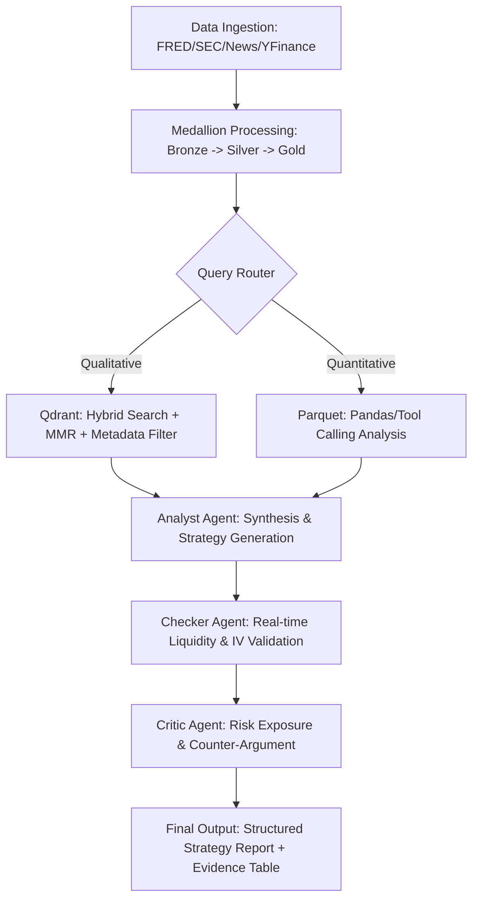

# Multi-Modal Multi-Agent Financial RAG System

### 1. Strategic Objectives (Goal)
The primary objective of this project is to democratize institutional-grade options trading by bridging the gap between quantitative market data and qualitative semantic insights. By leveraging a **Medallion Architecture**, the system automates the identification of cross-asset volatility arbitrage opportunities (e.g., GLD/SLV vs. correlated equities). 

**Core Problem Solved:**
* **Eliminating Hallucinations:** Prevents "trading hallucinations" by enforcing a multi-agent checker-critic loop.
* **Unified Intelligence:** Syncs fragmented macro signals (FRED/GPR) with micro-market structures (Option Chains/SEC Filings).
* **Signal Precision:** Converts raw volatility into actionable paper-trading strategies with logical evidence.

---

### 2. High-Level System Architecture
The system operates on a **Dual-Track Data Engine** designed to handle the heterogeneity of financial markets:

* **Quantitative Track (Structured):** Processes high-frequency numeric data (Parquet) via SQL-like tools or Pandas Agents to ensure 100% accuracy in pricing and Greeks.
* **Qualitative Track (Unstructured):** Processes news and SEC filings through a Hybrid RAG pipeline (Dense + Sparse + Metadata filtering) in Qdrant.
* **State Machine Orchestration:** Uses **LangGraph** to govern the transition between data retrieval, analysis, and risk auditing.

---

### 3. Operational Workflow & Multi-Agent Logic
The following workflow defines the lifecycle of a query, from ingestion to the final strategy report:



---

### 4. Medallion Data Governance & Schema
Data is partitioned into three logical layers to ensure lineage and high information density:

| Layer | Type | Storage | Purpose |
| :--- | :--- | :--- | :--- |
| **1_Bronze_Raw** | Unstructured | HTML / XML | Raw captures for debugging and regulatory look-back (TTL: 30 days). |
| **2_Silver_Structured** | Structured | Parquet | Time-series for Option Chains, IV, and Macro levels. Direct tool-access only. |
| **3_Gold_Semantic** | Refined | JSONL / MD | LLM-distilled summaries for vectorization (Qdrant) and Global System Prompts. |
| **Agent_Context** | Snapshot | Markdown | Daily "Global Subconscious" (Macro/GPR) injected into every Agent's prompt. |

---

### 5. Quality Assurance & Evaluation Framework (Evaluation)
To maintain an institutional standard, the system is evaluated across three dimensions:

* **RAGAS Benchmarking:**
    * **Faithfulness:** Measures if the strategy is strictly derived from retrieved SEC/News data.
    * **Context Precision:** Validates the temporal relevance of recalled signals (Metadata-driven).
* **Fact-Checking (Deterministic Validation):**
    * The **Checker Agent** must ping live `yfinance` APIs to verify that any recommended option contract actually exists and has sufficient open interest.
* **The "Golden Dataset":**
    * A curated set of 50+ complex historical QA pairs used as a ground-truth baseline to prevent regression during model or prompt updates.

---

### 6. Implementation Prerequisites
All dependencies are consolidated into a single deployment command. The infrastructure is fully containerized for portability.

**One-liner Installation:**
```bash
pip install requests pandas numpy pyarrow yfinance fredapi python-dotenv beautifulsoup4 markdownify langchain-ollama langchain-huggingface langgraph qdrant-client pydantic rich fastembed newspaper3k duckduckgo-search
```

**Environment Requirements:**
* **Local Inference:** Ollama (running `llama3` or `mistral`).
* **Vector Store:** Qdrant Cloud or Dockerized Qdrant.
* **Credentials:** `.env` file containing `FRED_API_KEY` and `SEC_USER_AGENT`.