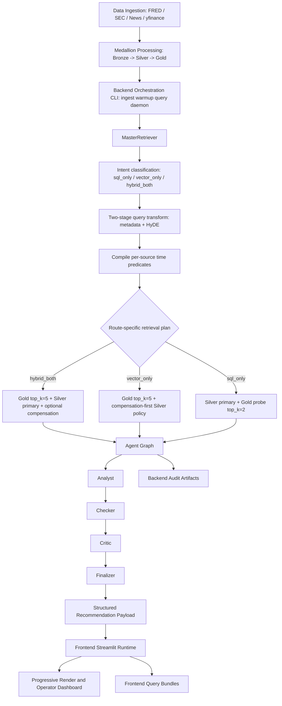
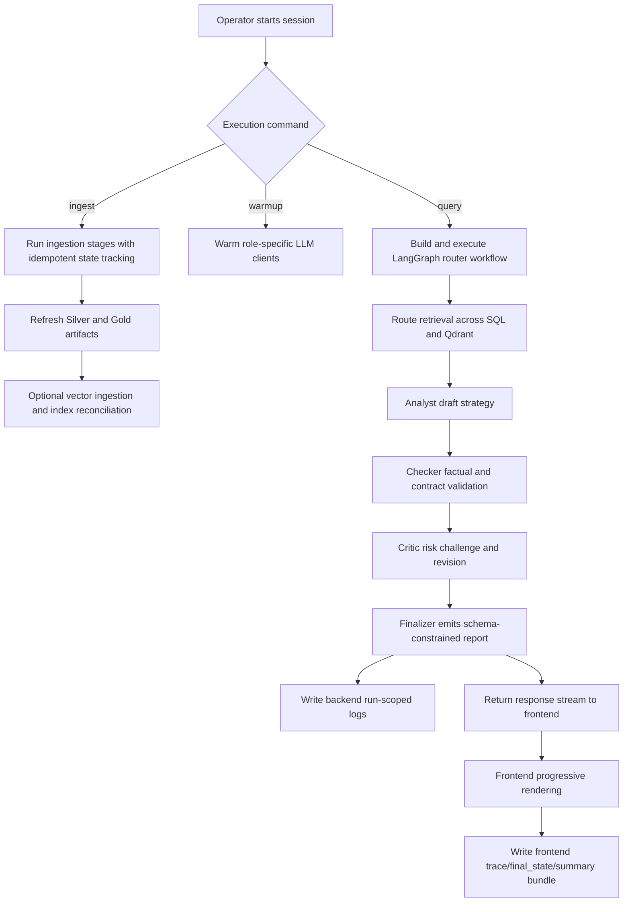

# AutoOptions Recommendation Chatbot

## 1. Strategic Goal and Mission Baseline

### Program Objective
The project democratizes institutional-quality options research by bridging:
- **structured quantitative signals** (IV, OI, moneyness, macro series), and
- **unstructured qualitative signals** (SEC filings, geopolitical risk, global news).

Using a Medallion architecture and multi-agent validation, the system detects cross-asset volatility opportunities across:
- commodity ETFs (for example `GLD`, `SLV`), and
- related single-name equities and index-linked options.

### Core Outcomes
- **Part A - Multi-source auto-ingestion at quantified cadence:** integrates **5+ active source families** (FRED, options chains, SEC, GPR, news) across **4 time granularities** (`TRADING_DAILY`, `DAILY`, `WEEKLY`, `MONTHLY`), with comprehensive metadata (ticker, source_type, timestamps, lineage/accession IDs) and parsing across **API JSON + scraped HTML + Form 4 XML + Form 8-K HTML**; Bronze preserves original SEC EDGAR links for clickable trace-back.
- **Part B - Ingestion and retrieval accuracy strategy:** uses dual-vector indexing (**dense + sparse**) with lineage-preserving payloads, deterministic IDs (including SEC accession-based UUID strategy), and idempotent upsert/replay behavior to prevent duplicate writes and citation drift.
- **Part C - Query acceleration and robustness:** executes **3 route modes** (`sql_only`, `vector_only`, `hybrid_both`) with **2-stage transform** (typed metadata + HyDE), source-aware `TimePredicate` windows, explicit fallback policy, hybrid Gold retrieval (**dense + sparse + RRF + rerank**), and DuckDB Silver deterministic retrieval for numeric truth.
- **Part D - Deterministic multi-agent quality control:** LangGraph-governed `Analyst -> Checker -> Critic -> Finalizer` loop reduces factual and logic hallucinations while keeping revision decisions auditable and status-explicit (`success` / `partial_failure`).
- **Part E - Model and prompt governance:** deploys a domain-tuned options stack (`options-expert` on the Llama3 family, with configurable **70B primary profile** and **7B lightweight profile**) plus OpenAI-compatible backup (`gpt-4o-mini`); prompt contracts inject reasoning structure and runtime status guards to mitigate time/data drift.
- **Part F - LangChain integration clarity:** LangChain is used in both retrieval and orchestration surfaces, including `Document`-style semantic ingestion flow, ChatPromptTemplate-driven query/agent prompting, and structured-output control in transformation/finalization paths.

### Execution Intent
This repository connects ingestion, retrieval, analytics, multi-agent reasoning, and frontend rendering under one observability contract.

---

## 2. Project Scope and Financial Logic

### 2.1 Problem This System Solves
- **Data overload and modality fragmentation:** traders must combine macro, news, filing, and option-chain signals across different assets.
- **Context-switch bottlenecks:** static rule systems cannot dynamically reweight analysis based on ticker type and market regime.
- **Semantic-vs-numeric gap:** traditional vector retrieval is weak on precise option numerics without metadata-aware filtering.

### 2.2 Cross-Asset Thesis
- Options mechanics are shared across equities and commodity ETFs (strike, expiry, IV, Greeks, liquidity).
- Signal interpretation changes by asset context:
  - **Commodity ETF path (`GLD`/`SLV`):** rates, CPI, dollar index, GPR, risk-off flow.
  - **Single-name equity path:** SEC insider behavior, material filings (`8-K`), company-specific catalysts.

### 2.3 Technical Upgrade Scope
- Transition from linear scripts to a LangGraph state-machine workflow with revision circuit-breakers and node telemetry ([Agent Architecture](./docs/agent/Agent_Architecture.md)).
- Introduce route-specific retrieval strategy (`sql_only`, `vector_only`, `hybrid_both`) with typed query transformation and HyDE semantic expansion ([Query Intent](./docs/Query_retrieval_docs/Query_intent_docs.md)).
- Apply source-aware time predicate compilation to keep daily/monthly/event datasets on physically valid windows ([Time Schema Audit](./docs/Data_source_docs/Time_Schema_Audit.md)).
- Use asymmetric hybrid retrieval (dense + sparse + rerank) with metadata-governed fallback tiers for high recall and precision ([Qdrant Retriever Docs](./docs/Query_retrieval_docs/Qdrant_retriever_docs.md)).
- Enforce deterministic numeric grounding through Silver SQL contracts and lineage anchors ([Silver SQL Tools](./docs/Query_retrieval_docs/Silver_SQL_Tools.md)).
- Keep ingestion idempotent and replay-safe via run-state anchors and dedup-oriented processing ([Data Source Summary](./docs/Data_source_docs/Data_source_summary.md)).

---

## 3. Institutional Architecture Blueprint



---

## 4. Data Sources, Rationale, and Medallion Lifecycle

### 4.1 Source Registry and Business Value

| Source Domain | Acquisition Layer | Silver/Gold Contract | Core Business Value |
| --- | --- | --- | --- |
| FRED macro series | `fredapi` pipeline | Parquet + narrative context | Real-rate/CPI regime guidance for precious-metal pricing |
| Options market data | `yfinance` scrapers | Silver Parquet (structured) | IV/OI/moneyness/liquidity truth set |
| SEC filings | SEC EDGAR ingestion + processing | Bronze parsed Form 4 XML + Form 8-K HTML; Gold enriched semantic JSONL | Insider flow + material event intelligence with traceable accession-level lineage |
| Geopolitical risk | `GPR_index.py` | Silver metrics + Gold narrative/JSONL | Risk-off lead indicator for metals and volatility |
| Global news (GDELT + full text) | `news_scraper.py` | Bronze raw/full text + Gold enriched JSONL | Event/tone-driven volatility context |
| COT positioning (planned extension) | planned tabular ingest | Parquet | Smart-money positioning bias |
| PDF/vision research (planned extension) | planned multimodal parsers | JSONL semantic artifacts | Chart-heavy institutional narrative extraction |

### 4.2 Medallion Processing Contract
1. **Bronze:** raw source-native payloads (JSONL/HTML/XML/CSV).
2. **Silver:** deterministic normalized Parquet tables (numeric system of record).
3. **Gold:** retrieval-ready semantic artifacts (JSONL/Markdown) for vector search.
4. **Agent Context:** prompt convenience snapshots, never replacing Silver truth.

---

## 5. Qdrant Pipeline and Hybrid Search Strategy

### 5.1 Ingestion and Indexing Principles
- Inject structured metadata before vectorization (`ticker`, `source_type`, `form_type`, timestamps, lineage IDs) to enable deterministic filtering.
- Use schema-enforced upsert and payload indexing for high-selectivity retrieval at query time.
- Run asymmetric hybrid retrieval channels: dense semantic vectors (HyDE paragraph) + sparse lexical vectors (rerank query) with server-side fusion.
- Apply cross-encoder reranking and score gating so only high-signal chunks enter downstream reasoning.
- Preserve idempotency and auditability via accession/url-based lineage and retrieval audit trails.

### 5.2 Retrieval Execution Logic
1. Classify route intent (`sql_only`, `vector_only`, `hybrid_both`) and transform query into typed metadata + HyDE payload.
2. Compile per-source `TimePredicate` windows and build smart metadata filters (ticker/source/topic/SEC-specific controls).
3. Execute route-specific retrieval plan with independent Gold/Silver timeout budgets.
4. Run hybrid Gold retrieval (`dense + sparse + RRF + rerank`) under strict-to-relaxed fallback tiers when needed.
5. Run Silver deterministic retrieval with metric allowlist, ticker caps, and lineage anchors.
6. Optionally apply HyDE entity compensation to query additional Silver entities without contaminating primary truth.
7. Assemble one AgentState-ready payload with `time_range`, `hyde_anticipation`, `status`, and latency telemetry.

### 5.3 Why This Matters for Options Workflows
- Prevents stale macro/news/filing evidence from driving live strategy by enforcing source-aware time windows.
- Preserves numeric integrity through Silver-grounded values while keeping semantic breadth from Gold retrieval.
- Improves SEC signal quality by handling Form 4 XML insider transactions and Form 8-K HTML event disclosures as first-class retrieval evidence.
- Reduces silent failure risk by returning explicit degradation state and route-level telemetry.
- Supports institutional cross-domain synthesis with traceable evidence links from recommendation back to raw source lineage.

Reference docs: [Retrieval Architecture and Strategy](./docs/Query_retrieval_docs/Retrieval_Architecture_and_Strategy.md), [Query Intent](./docs/Query_retrieval_docs/Query_intent_docs.md), [Qdrant Retriever Docs](./docs/Query_retrieval_docs/Qdrant_retriever_docs.md), [Silver SQL Tools](./docs/Query_retrieval_docs/Silver_SQL_Tools.md), [SEC Data](./docs/Data_source_docs/SEC_data.md).

---

## 6. Multi-Agent Orchestration and Prompting Control

### 6.1 Agent Responsibilities
- **Analyst:** drafts strategy from merged context with citation discipline.
- **Checker:** verifies factual integrity, numeric consistency, and anchor correctness.
- **Critic:** challenges strategic logic, regime fit, and risk posture.
- **Finalizer:** emits schema-constrained final report for downstream consumers.

### 6.2 Prompt and Governance Layer
- Global context injection from latest macro snapshot.
- Role-specific prompts with hard constraints and structured output contracts.
- Deterministic state fields for revisions, verdict routing, and fallback signaling.

### 6.3 Workflow Governance
- Circuit-breaker on revision loops.
- Append-only audit logs for node-level replay.
- Separation of blocking findings vs non-blocking refinements.

---

## 7. Runtime Workflow and Operating Commands

### Runtime Workflow


### Core Command Surface
```bash
python -m Scripts ingest
python -m Scripts daemon
python -m Scripts status
python -m Scripts warmup --roles analyst router checker
python -m Scripts query "Past week FOMC and 10Y yields impact on SPY puts?"
```

### Engineering Strategy
- **Deterministic state flow:** time anchors and run IDs enable replay.
- **Hybrid evidence model:** numeric facts and semantic context are merged before final recommendation.
- **Role-gated quality controls:** factual and risk guardrails are separated by role.
- **Dual-surface observability:** backend runs and frontend bundles share compatible audit semantics.

---

## 8. Frontend Interface and Delivery Experience

The Streamlit frontend acts as a control tower for:
- query input and session interaction,
- node-by-node progress visibility,
- final recommendation rendering,
- artifact traceability (trace, summary, final_state bundles).

Expected UX outputs:
- concise quick-take response,
- structured final report view,
- audit and routing diagnostics,
- context and evidence panes.

---

## 9. Module Topology and Documentation Index

| Module Domain | High-Level Responsibility | Primary Code Surface | Key Operational Outputs | Detailed Documentation |
| --- | --- | --- | --- | --- |
| Agent graph runtime | Executes deterministic multi-agent control loop (`retrieval_master -> analyst -> checker -> critic -> finalizer`) with revision circuit-breakers and node telemetry | `Scripts/agents/` | `final_strategy`, `node_audit_log`, revision-aware state transitions | [`docs/agent/Agent_Architecture.md`](./docs/agent/Agent_Architecture.md) |
| Retrieval and query transform | Performs intent routing, metadata extraction, HyDE anticipation, Gold/Silver hybrid retrieval, and time-window predicate compilation | `Scripts/retrieval/` | retrieval payloads (`metadata`, `gold_context`, `silver_context`, `time_range`, `hyde_anticipation`) | [`docs/Query_retrieval_docs/Retrieval_Architecture_and_Strategy.md`](./docs/Query_retrieval_docs/Retrieval_Architecture_and_Strategy.md) |
| Data ingestion and processing | Runs cadence-driven ingestion DAG from external sources to Bronze/Silver/Gold datasets | `Scripts/data_collection/`, `Scripts/orchestration/` | medallion-layer datasets under `Data/1_Bronze_Raw`, `Data/2_Silver_Processed`, `Data/3_Gold_Semantic` | [`docs/Data_source_docs/Data_source_summary.md`](./docs/Data_source_docs/Data_source_summary.md) |
| Vector store layer | Ingests Gold semantic artifacts and manages retrieval index connectivity | `Scripts/vector_store/` | Qdrant-ingested semantic collections and ingestion audit metadata | [`docs/Vector_store_docs/Vector_Ingestion.md`](./docs/Vector_store_docs/Vector_Ingestion.md) |
| Orchestration CLI plane | Provides production entrypoints for `ingest`, `daemon`, `status`, `query`, and `warmup` with run-state persistence | `Scripts/orchestration/cli.py`, `Scripts/main.py`, `Scripts/__main__.py` | run-scoped state updates, stage execution summaries, operational command surface | [`docs/modular_guide/Orchestration.md`](./docs/modular_guide/Orchestration.md) |
| Frontend execution plane | Streams node-by-node execution progress and renders final institutional strategy dashboard | `Frontend/` | frontend query bundles (`*_trace.jsonl`, `*_summary.json`, `*_final_state.json`) | [`docs/modular_guide/Frontend Runtime Guide.md`](./docs/modular_guide/Frontend_Runtime_Guide.md) |
| Observability and audit | Standardizes backend + frontend telemetry contracts for replayability and compliance traceability | `Scripts/observability/`, `Frontend/audit.py` | `logs/runs/<YYYY-MM-DD>/<run_id>/...` and `logs/frontend_query/<YYYY-MM-DD>/...` artifacts | [`docs/modular_guide/Observability.md`](./docs/modular_guide/Observability.md) |
| LLM control plane | Centralizes role-level model selection, warmup policy, and fallback behavior | `Scripts/core/llm_pool.py`, `Scripts/core/financial_config.py` | warmup health status and role-aligned model runtime behavior | [`docs/modular_guide/LLM Pool Operations Guide.md`](./docs/modular_guide/LLM_Pool_Operations_Guide.md) |
| Testing and guardrails | Validates end-to-end routing correctness, retrieval contract integrity, and safety rules | `Scripts/tests/` | regression evidence for routing, retrieval, and guardrail behavior | [`docs/modular_guide/Documentation Control Plane.md`](./docs/modular_guide/Documentation_Control_Plane.md) |

---

## 10. Validation and Test Protocol

### Core backend checks
```bash
python -m Scripts warmup --roles analyst router checker
python -m Scripts ingest
python Scripts/vector_store/ingestion.py --no-full-refresh
python -m Scripts query "Past week FOMC and 10Y yields impact on SPY puts?"
python Scripts/tests/test_router_e2e.py
```

### Frontend checks
```bash
streamlit run Frontend/app.py
```

Validation checklist:
- Query renders progressive sections before final report completion.
- Backend run-scoped logs appear under `logs/runs/<today>/<run_id>/`.
- Frontend bundle files appear under `logs/frontend_query/<today>/`.
- `query_audit_trail.jsonl` includes resolvable paths to trace/final_state/summary artifacts.

---

## 11. Final Delivery Targets

The intended industrial delivery includes:
1. Automated ingestion pipelines across macro, options, SEC, and news domains.
2. Multi-agent RAG backend with hybrid retrieval and role-based review controls.
3. Streamlit operator console with real-time progress and evidence visibility.
4. Daily cross-asset options strategy report (JSON/Markdown) with confidence and lineage links.

---

## 12. Dependency Surface and Linked Specifications

### Linked documentation
- [Agent Architecture](./docs/agent/Agent_Architecture.md)
- [Retrieval Architecture and Strategy](./docs/Query_retrieval_docs/Retrieval_Architecture_and_Strategy.md)
- [Data Source Summary](./docs/Data_source_docs/Data_source_summary.md)
- [Time Schema Audit](./docs/Data_source_docs/Time_Schema_Audit.md)
- [Observability](./docs/modular_guide/Observability.md)
- [Frontend Runtime Guide](./docs/modular_guide/Frontend_Runtime_Guide.md)
- [LLM Pool Operations Guide](./docs/modular_guide/LLM_Pool_Operations_Guide.md)
- [Documentation Control Plane](./docs/modular_guide/Documentation_Control_Plane.md)
- [Architecture](./docs/modular_guide/ARCHITECTURE.md)

### Critical code directories
- `Scripts/agents/`
- `Scripts/orchestration/`
- `Scripts/retrieval/`
- `Scripts/observability/`
- `Frontend/`
- `Data/`

### One-line install
```bash
pip install -r requirements.txt
```
