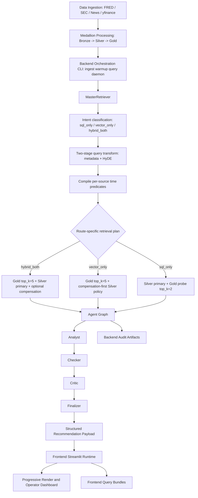
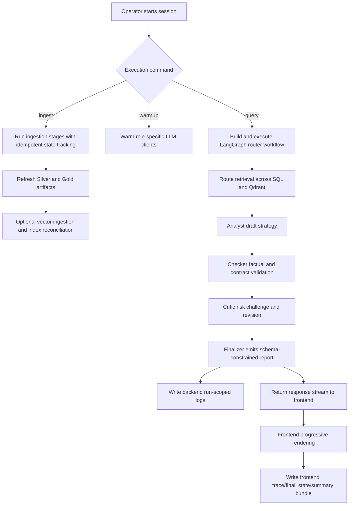

# Institutional Execution Lifecycle Reference (Frontend + Backend)

## 1. Strategic Goal and Mission Baseline

### Program Objective
The primary objective of this project is to democratize institutional-grade options trading by bridging the gap between quantitative market data and qualitative semantic insights. By leveraging a **Medallion Architecture**, the system automates the identification of cross-asset volatility arbitrage opportunities (e.g., GLD/SLV vs. correlated equities).

**Core outcomes:**
- Reduce trading hallucinations via multi-agent cross-examination (Analyst -> Checker -> Critic -> Finalizer).
- Fuse fragmented data domains (FRED / GPR / SEC / News / options chains) into a single query surface.
- Produce auditable, reproducible recommendation artifacts for paper-trading workflows.

### Execution Intent
This repository delivers a full lifecycle architecture where data ingestion, vector retrieval, structured analytics, multi-agent reasoning, and frontend rendering are linked under a single observability contract.

---

## 2. Institutional Architecture Blueprint



---

## 3. Code Strategy and Workflow Governance

### Runtime Workflow


### Engineering Strategy
- **Deterministic state flow:** time anchors and run identifiers enforce replayability.
- **Hybrid evidence model:** structured numerical facts and semantic narrative context are merged before final recommendation.
- **Role-gated quality controls:** Checker and Critic enforce factual and risk guardrails before final output.
- **Dual-surface observability:** backend run logs and frontend query bundles share compatible audit semantics.

---

## 4. Output Data Schema and Storage Contracts

| Domain | Schema / Artifact | Core Fields | Path Pattern | Producer |
| --- | --- | --- | --- | --- |
| Agent runtime state | `AgentState` (`TypedDict`) | route, retrieval payloads, revisions, final report fields, node audit trail | `Scripts/agents/state.py` (runtime memory contract) | Agent graph nodes |
| Agent feedback | `AgentFeedback` (`BaseModel`) | node, verdict, severity, rationale, suggested revisions | `Scripts/agents/state.py` | Checker and Critic |
| Final recommendation | `final_strategy` (`FinalReport.model_dump()`) | thesis, contracts, risk controls, confidence, evidence links | response payload + audit snapshots | Finalizer |
| Retrieval trail | `retriever_audit_trail.jsonl` | query, filters, source route, hit counts, timing | `logs/runs/<YYYY-MM-DD>/<run_id>/retrieval/retriever_audit_trail.jsonl` | Retriever layer |
| Query transform trail | `query_audit_trail.jsonl` | extracted intents, metadata filters, HyDE output, model info | `logs/runs/<YYYY-MM-DD>/<run_id>/query_transform/query_audit_trail.jsonl` | Query transform |
| Router e2e trace | `*_trace.jsonl` | node event timeline, route changes, delta keys, elapsed seconds | `logs/runs/<YYYY-MM-DD>/<run_id>/router_e2e/` | Router executor |
| Router e2e summary | `*_summary.json` | outcome, confidence, nodes executed, failures, evidence count | `logs/runs/<YYYY-MM-DD>/<run_id>/router_e2e/` | Router executor |
| Router e2e final state | `*_final_state.json` | final merged graph state snapshot | `logs/runs/<YYYY-MM-DD>/<run_id>/router_e2e/` | Router executor |
| Frontend trace bundle | `*_trace.jsonl` | frontend-streamed node events and timings | `logs/frontend_query/<YYYY-MM-DD>/` | `Frontend/audit.py` |
| Frontend summary bundle | `*_summary.json` | outcome, confidence, node count, artifact references | `logs/frontend_query/<YYYY-MM-DD>/` | `Frontend/audit.py` |
| Frontend final state bundle | `*_final_state.json` | json-safe final graph snapshot for replay | `logs/frontend_query/<YYYY-MM-DD>/` | `Frontend/audit.py` |
| Frontend index trail | `query_audit_trail.jsonl` | query metadata + links to bundle artifacts | `logs/frontend_query/<YYYY-MM-DD>/query_audit_trail.jsonl` | `Frontend/audit.py` |
| Bronze raw data | Source-native JSONL/HTML/XML | minimally transformed source records | `Data/1_Bronze_Raw/...` | Ingestion jobs |
| Silver processed data | Parquet tables | normalized options/macro/market columns | `Data/2_Silver_Processed/...` | Processing layer |
| Gold semantic data | retrieval-ready JSONL/Markdown | chunk text + metadata for vector retrieval | `Data/3_Gold_Semantic/...` | Semantic layer |

---

## 5. Validation and Test Protocol

### Core backend checks
```bash
python -m Scripts warmup --roles analyst router checker
python -m Scripts ingest
python Scripts/vector_store/ingestion.py --no-full-refresh
python -m Scripts query "Past week FOMC and 10Y yields impact on SPY puts?"
python Scripts/tests/test_router_e2e.py
```

### Frontend checks
```bash
streamlit run Frontend/app.py
```

Validation checklist:
- Query renders progressive sections before final report completion.
- Backend run-scoped logs appear under `logs/runs/<today>/<run_id>/`.
- Frontend bundle files appear under `logs/frontend_query/<today>/`.
- `query_audit_trail.jsonl` includes resolvable paths to trace/final_state/summary artifacts.

---

## 6. Dependency Surface and Linked Specifications

### Linked documentation
- [Backend System Reference](./Backend_README.md)
- [User Query Guide](./docs/User_Query_Guide.md)
- [Observability](./docs/Observability.md)
- [LLM Pool](./docs/LLM_Pool.md)
- [Frontend Runtime Guide](./docs/frontend_readme.md)
- [Orchestration Runtime Guide](./docs/Orchestration.md)
- [Agent Architecture](./docs/agent/Agent_Architecture.md)
- [Retrieval Architecture and Strategy](./docs/Query_retrieval_docs/Retrieval_Architecture_and_Strategy.md)
- [Modular Guide](./docs/modular_guide/README.md)

### Critical code directories
- `Scripts/agents/`
- `Scripts/orchestration/`
- `Scripts/retrieval/`
- `Scripts/observability/`
- `Frontend/`
- `Data/`

### One-line library installation
```bash
pip install -r requirements.txt
```
