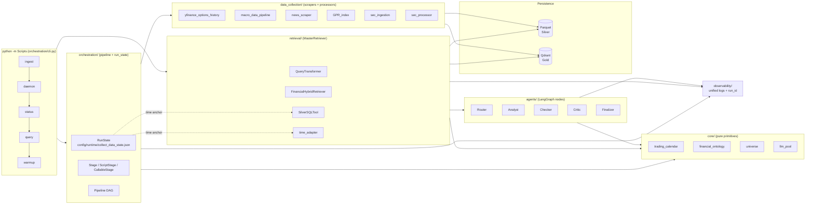
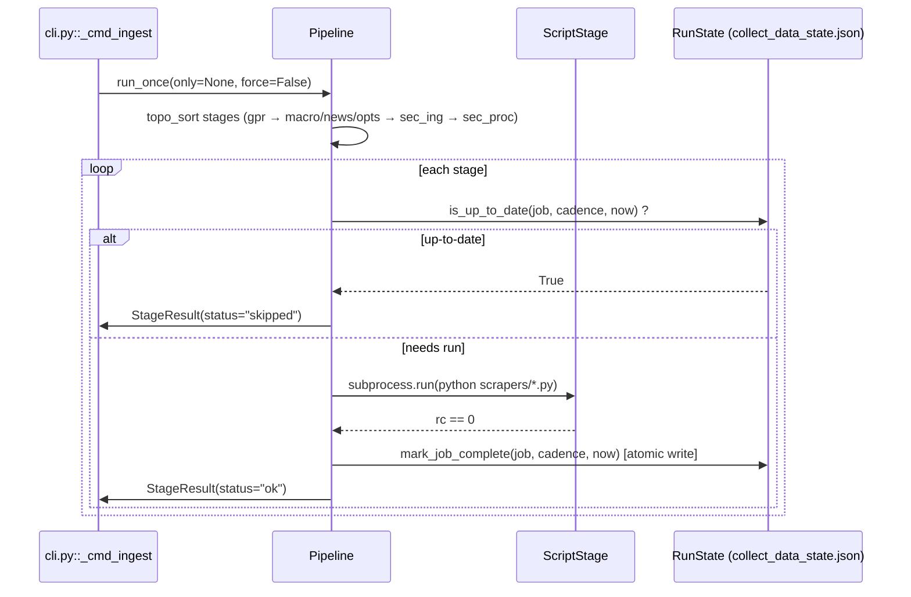
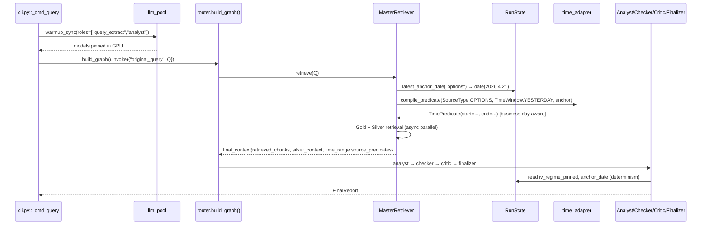

# System Architecture — Automated Options Recommendation Bot

_Last updated: 2026-04-22 — revision 2 (orchestration layer, lazy package
facades, unified observability, LLM pool)_

This document is the authoritative map of the bot. It describes **what
each package does**, **how the runtime fits together**, and **which
contracts the layers must honour**. Subordinate docs — linked in-line —
drill down into individual subsystems.

- [docs/Orchestration.md](./Orchestration.md) — pipeline DAG, CLI, runtime state
- [docs/Observability.md](./Observability.md) — unified logs + audit paths
- [docs/LLM_Pool.md](./LLM_Pool.md) — Llama 70B warmup / keep-alive strategy
- [docs/Data_source_docs/](./Data_source_docs/) — Qdrant / Parquet schemas
- [docs/Query_retrieval_docs/](./Query_retrieval_docs/) — retrieval policy details
- [docs/test/2026-04-22/router_e2e_deep_analysis.md](./test/2026-04-22/router_e2e_deep_analysis.md) — audit report driving the current hardening

---

## 1. System Topology



Five architectural invariants make the above diagram tractable at
runtime:

1. **`core/` has zero external side-effects.** No network, no LLM
   clients, no scrapers. Everything else may depend on `core/`.
2. **`Scripts/core/__init__.py` and `Scripts/retrieval/__init__.py`**
   are PEP-562 lazy façades — importing the package does not drag
   LangChain / Ollama / pydantic until a lazy attribute is touched.
3. **`RunState` is the single source of truth for time anchors.**
   Scrapers advance `config/runtime/collect_data_state.json`; agents
   read from it. No layer computes "yesterday" from wall-clock time.
4. **Logs route through `Scripts.observability.audit`.** Every module
   writes to `logs/runs/{YYYY-MM-DD}/{run_id}/…` via `audit_path()`.
5. **LLM clients come from `Scripts.core.llm_pool`.** Agents request
   `get_ollama("analyst")` / `get_ollama("checker")` rather than
   instantiating `ChatOllama` directly. See [LLM_Pool.md](./LLM_Pool.md).

---

## 2. Package Inventory

### 2.1 `Scripts/core/` — Pure Primitives Layer

| Module | Responsibility |
| --- | --- |
| `trading_calendar.py` | Business-day arithmetic (`is_business_day`, `previous_business_day`, `n_business_days_back`). Hard-coded US market holidays through 2027; zero external dependencies. |
| `financial_ontology.py` | Allow-lists, regex tables and metric→column maps consumed by `query_transform`, `sql_tools` and `router`. |
| `financial_config.py` | Static Modelfile system-prompt generation for the fine-tuned `options-expert` model. |
| `universe.py` | Loader for `config/universe/*.json` (equities / ETFs / pipelines). Cached JSON I/O only. |
| `prompt_templates.py`, `intent_router_prompt_templates.py` | Prompt strings shared between `query_transform` and the router intent few-shot. |
| `few_shot_config.py`, `few_shot_intent.py` | Curated few-shot examples for structured extraction and routing. |
| `llm_pool.py` | Process-wide model singleton cache + warmup. See [LLM_Pool.md](./LLM_Pool.md). |

The package `__init__.py` implements PEP-562 lazy loading: importing
the sub-module triggers its actual load and memoises the result in
module globals.

### 2.2 `Scripts/orchestration/` — Pipeline + CLI

| Module | Responsibility |
| --- | --- |
| `run_state.py` | `RunState` handle, `Cadence` enum, `run_key` arithmetic, `DATASET_ANCHOR_KEYS` map. Atomic writes, tolerant reads. |
| `stages.py` | `Stage` base, `ScriptStage` (subprocess adapter, zero-migration for legacy scrapers), `CallableStage` (in-process for new stages). |
| `pipeline.py` | `Pipeline` topological runner; `build_default_pipeline()` factory assembling the 6 existing data jobs. |
| `cli.py` | argparse entry point: `ingest` / `daemon` / `status` / `query` / `warmup`. |

See [Orchestration.md](./Orchestration.md) for the DAG, the idempotency
contract, and CLI usage.

### 2.3 `Scripts/observability/` — Unified Logs

| Module | Responsibility |
| --- | --- |
| `audit.py` | `start_run(tag)`, `current_run_id()`, `audit_path(module, anchor, filename=)`, `configure_root_logger()`, `get_audit_logger()`. |

See [Observability.md](./Observability.md) for the directory layout and
the migration recipe for legacy loggers.

### 2.4 `Scripts/retrieval/` — Gold + Silver Retrievers

| Module | Responsibility |
| --- | --- |
| `schema.py` | Pydantic data types — `QueryIntent`, `MetadataExtraction`, `TimeWindow`, `SourceType`, `RetrievedChunk`, `SQLResult`. Dependency-free at import time. |
| `query_transform.py` | Two-stage LLM query transformer (structured extract + HyDE). |
| `qdrant_retriever.py` | `FinancialHybridRetriever` — Qdrant hybrid search (dense + sparse + metadata pre-filter). |
| `sql_tools.py` | `SilverSQLTool` — Parquet-backed Silver queries with Dynamic Time Anchor. |
| `time_adapter.py` | `TimePredicate` + `compile_predicate()` — converts logical `TimeWindow` + `TimeGranularity` into per-source epoch ranges. Business-day-aware for DAILY sources. |
| `master_retriever.py` | `MasterRetriever` — orchestrates query transform → parallel Gold / Silver retrieval → macro injection. |

`Scripts/retrieval/__init__.py` eagerly re-exports the Pydantic data
types (used everywhere, no heavyweight deps) and lazily exposes the
LLM-backed classes. Agents that want to bypass the façade for
minimum-latency cold-starts import directly from the leaf module
(`from Scripts.retrieval.master_retriever import MasterRetriever`).

### 2.5 `Scripts/agents/` — LangGraph Nodes

| Module | Responsibility |
| --- | --- |
| `state.py` | `AgentState` TypedDict — the LangGraph shared state (including `iv_regime_pinned`, `time_range.source_predicates`). |
| `router.py` | Graph construction + master_retrieval_node + control-flow. |
| `analyst.py` | Generates `draft_report`; pins `iv_regime` on first pass for determinism across revisions. |
| `checker.py` | Deterministic regex audit + LLM veracity check; sentinel whitelist; rescue re-queries with rehydrated `TimePredicate`. |
| `critic.py` | Adversarial critique (bull/bear). |
| `finalizer.py` | Renders the final report; enforces deterministic `report_date` and reconciles `SourceCitation.source_type` against the deterministic `evidence_pool`. |
| `prompts.py` | All prompt templates for the graph. |

Package `__init__.py` is intentionally import-empty — each agent pulls
heavy LangChain types, so consumers reach agents by leaf module path.

### 2.6 `Scripts/data_collection/` — Scrapers + Processors

| Path | Cadence | RunState key |
| --- | --- | --- |
| `scrapers/yfinance_options_history.py` | DAILY | `options_daily` |
| `scrapers/macro_data_pipeline.py` | TRADING_DAILY | `macro_trading_daily` |
| `scrapers/news_scraper.py` | DAILY | `news_daily` |
| `scrapers/GPR_index.py` | MONTHLY | `gpr_monthly` |
| `scrapers/sec_ingestion.py` | WEEKLY | `sec_ingestion_weekly` |
| `processors/sec_processor.py` | WEEKLY (dep on ingestion) | `sec_processor_weekly` |
| `collect_data.py` | Legacy daemon — now a thin wrapper over `RunState` for back-compat. |

### 2.7 `Scripts/vector_store/` — Qdrant Client + Ingestion

`connection.py` exposes `get_qdrant_client()` and `get_embedding_model()`.
`ingestion.py` defines `QdrantIngestor` which upserts the three Gold
collections (`sec_filings`, `news_documents`, `gpr_index`) from their
respective Silver Parquet / JSONL sources.

---

## 3. Runtime Workflows

### 3.1 Data Ingestion (one-shot or daemon)

```text
$ python -m Scripts ingest [--only STAGE ...] [--force] [--dry-run]
```



All state transitions are atomic — a Ctrl+C mid-write cannot corrupt
the file that agents depend on for time anchoring (Section 4).

### 3.2 Inference Query (RAG)

```text
$ python -m Scripts query --warmup "yesterday's AAPL IV skew?"
```



Three determinism guarantees built into this flow:

- `time_range.source_predicates` is **serialised into `AgentState`** so
  that the Checker's rescue re-queries hit the same Parquet slice the
  original retrieval used. No more `start_date` drift between revisions.
- `iv_regime` is **pinned** after the Analyst's first computation and
  reused across revisions — strategy recommendations stop oscillating.
- `report_date` is **forced** to `state["time_range"]["anchor_date"]`
  in the Finalizer — the LLM never gets to invent a date.

---

## 4. Contracts

### 4.1 Time-Anchor Contract (single source of truth)

`config/runtime/collect_data_state.json`:

```json
{
  "last_run_keys": {
    "options_daily":         "2026-04-21",
    "macro_trading_daily":   "2026-04-21",
    "news_daily":            "2026-04-21",
    "gpr_monthly":           "2026-04",
    "sec_ingestion_weekly":  "2026-W16",
    "sec_processor_weekly":  "2026-W16"
  },
  "updated_at": "2026-04-22T15:09:02"
}
```

- **Writers**: orchestration `Pipeline` (atomic). No other module writes.
- **Readers**:
  - `RunState.latest_anchor_date(dataset)` — agent layer.
  - `RunState.is_up_to_date(job, cadence)` — pipeline layer.
- **Invariant**: `latest_anchor_date` **never** returns a date in the
  future of ``date.today()`` unless a deliberate backfill wrote one.
  It **may** return a weekend date (e.g. Saturday manual backfill),
  which `time_adapter` then snaps to the previous trading day for
  DAILY sources.

### 4.2 Logs Contract

- **Run-scoped** (default for new code): `logs/runs/{YYYY-MM-DD}/{run_id}/{module}/{module}.log|jsonl`
- **Flat** (back-compat for offline tools): `logs/{module}/{YYYY-MM-DD}/<filename>`
- Use `Scripts.observability.audit_path(module, anchor, filename=)`
  — never hand-build log paths.

### 4.3 LLM Contract

- Agents call `Scripts.core.llm_pool.get_ollama("analyst")`,
  `get_ollama("checker")`, etc. — never `ChatOllama(...)` directly.
- Role configuration lives in `llm_pool.ROLE_TABLE`; env overrides
  (`OLLAMA_CUSTOM_MODEL_NAME`, `OLLAMA_ROUTER_MODEL`, `OLLAMA_KEEP_ALIVE`)
  reshape production without code changes.
- Warmup is opt-in at the CLI edge (`--warmup`) or as a standalone
  subcommand (`python -m Scripts warmup --roles analyst router`).
- Retrieval-side models (dense / sparse / reranker) are **not** served
  by the pool — they are HuggingFace / `fastembed` artefacts managed by
  `Scripts/vector_store/connection.py`. See §5.2 and
  `docs/Query_retrieval_docs/Retrieval_Architecture_and_Strategy.md`.

---

## 5. Model Registry

The system runs exactly five externally-hosted models. The table below
is the **single source of truth** — `llm_pool.py`, the retriever, and
the ingestion pipeline all resolve to these artefacts.

### 5.1 Ollama-served LLMs (runtime)

| Ollama tag | Origin | Env var | Consumers |
| --- | --- | --- | --- |
| `options-expert-v1:latest` | fine-tune `FROM Llama-3.3-70B-Instruct-Q4_K_M.gguf` (see `modelfile`) | `OLLAMA_CUSTOM_MODEL_NAME` | Analyst, Checker, Critic, Finalizer, `QueryTransformer` (extractor + HyDE) |
| `llama3:latest` | vanilla Meta Llama-3 8B | `OLLAMA_ROUTER_MODEL` | `MasterRetriever.router_llm` (intent), `news_scraper` sentiment, `sec_processor` form parser |

> `OLLAMA_BASE_MODEL` (`llama3.3:70b`) is used only by
> `Scripts/models/create_options_expert.py` to rebuild the fine-tune.
> It is **not** an agent-facing runtime model.

### 5.2 Retrieval models (HuggingFace / fastembed)

| Purpose | Artefact | Env var | Home |
| --- | --- | --- | --- |
| Dense embedding | `BAAI/bge-base-en-v1.5` | `EMBEDDING_MODEL_NAME` | `Scripts/vector_store/connection.py::get_embedding_model` |
| Sparse (SPLADE) | `prithivida/Splade_PP_en_v1` | `SPARSE_MODEL_NAME` | `Scripts/retrieval/qdrant_retriever.py` |
| Cross-encoder reranker | `BAAI/bge-reranker-v2-m3` | `RERANKER_MODEL_NAME` | `Scripts/retrieval/qdrant_retriever.py` |

---

## 6. Environment Variables

| Variable | Default | Consumer |
| --- | --- | --- |
| `OLLAMA_BASE_URL` / `OLLAMA_HOST` | `http://localhost:11434` | `llm_pool` |
| `OLLAMA_KEEP_ALIVE` | `30m` | `llm_pool` — pins 70B in GPU |
| `OLLAMA_CUSTOM_MODEL_NAME` | `options-expert-v1:latest` | Expert tier (agents + `QueryTransformer`) |
| `OLLAMA_ROUTER_MODEL` | `llama3:latest` | Router tier (`MasterRetriever`) |
| `OLLAMA_INGESTION_MODEL` | falls back to `OLLAMA_ROUTER_MODEL` | Ingestion-time sentiment / SEC parser |
| `EMBEDDING_MODEL_NAME` | `BAAI/bge-base-en-v1.5` | Dense retrieval |
| `SPARSE_MODEL_NAME` | `prithivida/Splade_PP_en_v1` | Sparse retrieval |
| `RERANKER_MODEL_NAME` | `BAAI/bge-reranker-v2-m3` | Cross-encoder rerank |
| `QDRANT_HOST` / `QDRANT_URL` | `http://localhost:6333` | `vector_store` |
| `QDRANT_API_KEY` | unset | `vector_store` (cloud) |

---

## 7. Operational Runbook (excerpt)

| Task | Command |
| --- | --- |
| Check ingest freshness | `python -m Scripts status` |
| Run due ingests | `python -m Scripts ingest` |
| Force SEC re-processing | `python -m Scripts ingest --only sec_processor_weekly --force` |
| Start daemon with LLM warm | `python -m Scripts daemon --warmup` |
| Warm LLM only | `python -m Scripts warmup --roles analyst router` |
| Ask a question | `python -m Scripts query --warmup "..."` |
| Tail today's orchestrator log | `Get-Content -Wait logs/runs/$(Get-Date -Format yyyy-MM-dd)/*/orchestrator.log` |

---

## 8. Change Log of Architectural Invariants

| Date | Change | Rationale |
| --- | --- | --- |
| 2026-04-22 | Introduced `Scripts/orchestration/` | Collapse ad-hoc ingest scripts + agent CLIs behind one entry point. |
| 2026-04-22 | `config/runtime/collect_data_state.json` elevated to "single time-anchor source" | Eliminates wall-clock drift between scrapers and agents. |
| 2026-04-22 | `Scripts/core/__init__.py` and `Scripts/retrieval/__init__.py` turned lazy | Imports no longer pull LangChain/Ollama into the CLI's fast paths. |
| 2026-04-22 | `Scripts.core.llm_pool` | Enables Llama 70B warmup + singleton caching. |
| 2026-04-22 | `Scripts.observability.audit` | Unifies logs under `logs/runs/{date}/{run_id}/`. |
| 2026-04-22 | `TimePredicate` serialised into `AgentState` | Checker's rescue re-queries use the same time window as initial retrieval — fixes `latest_atm_iv` oscillation. |
