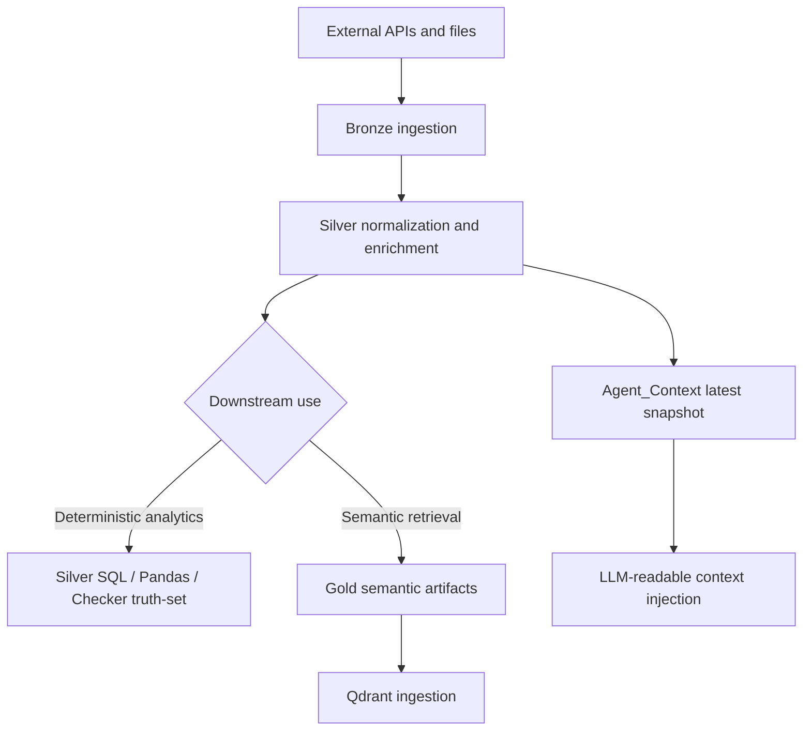

# Data Source Architecture and Registry

This document is the unified source-of-truth for the project data platform. It consolidates the former storage-layout guide and the source registry into one operational reference covering source origin, cadence, medallion placement, storage contracts, downstream consumers, and retrieval implications.

---

## I. Executive Design Mandate

The data platform is designed around a strict principle:

- **Bronze** preserves traceability.
- **Silver** preserves deterministic numeric truth.
- **Gold** preserves retrieval-ready semantic compression.
- **Agent Context** provides stable prompt-time convenience, but never overrides structured truth.

This separation is critical to the architecture because the system serves two fundamentally different workloads:

- **Quantitative path:** exact numeric analytics over Parquet.
- **Qualitative path:** hybrid semantic retrieval over Qdrant.

---

## II. Enterprise Data Architecture

```text
External Sources
├─ Yahoo Finance (options, indices, ETFs)
├─ FRED (macro series)
├─ GDELT / web article capture
├─ SEC EDGAR
└─ GPR academic series
        │
        ▼
Data/1_Bronze_Raw
├─ Raw scrape output, parsed filing artifacts, replay/debug evidence
└─ Objective: lineage, traceability, recoverability
        │
        ▼
Data/2_Silver_Processed
├─ Structured Parquet for options, macro history, GPR history
└─ Objective: deterministic analytics and numeric source-of-truth
        │
        ▼
Data/3_Gold_Semantic
├─ Qdrant-ready JSONL
├─ semantic narratives / summaries
└─ Objective: retrieval-ready artifacts for agent reasoning
        │
        ▼
Data/Agent_Context
└─ stable latest snapshot for prompt injection only
```

---

## III. Data Production Workflow



---

## IV. Medallion Storage Topology

### 1. Canonical storage tree

```text
Data/
├── 1_Bronze_Raw/
│   ├── SEC_Parsed_JSON/
│   │   └── {YYYY-MM-DD}/
│   │       ├── {TICKER}.jsonl
│   │       └── _SUMMARY.json
│   ├── News_Scrapes/
│   │   └── {YYYY-MM-DD}/
│   │       ├── Raw/raw_gdelt_{topic}.jsonl
│   │       └── Full_text/full_text_{topic}.jsonl
│   └── GPR_index/
│       └── {YYYY-MM-DD}/gpr_preview.csv
│
├── 2_Silver_Processed/
│   ├── Options_Market_Data/
│   │   └── {YYYY-MM-DD}/{SYMBOL}_options_{YYYY-MM-DD}.parquet
│   ├── Macro_History/
│   │   └── {YYYY-MM-DD}/macro_snapshot_{YYYY-MM-DD}.parquet
│   └── GPR_index/
│       └── gpr_monthly_enriched.parquet
│
├── 3_Gold_Semantic/
│   ├── SEC_Insider_Trades/
│   │   └── {YYYY-MM-DD}/qdrant_ready.jsonl
│   ├── News_Qdrant/
│   │   └── {YYYY-MM-DD}/qdrant_{topic}_processed.jsonl
│   ├── Macro_Narratives/
│   │   └── {YYYY-MM-DD}/macro_context_{YYYY-MM-DD}.md
│   └── GPR_index/
│       ├── {YYYY-MM-DD}/gpr_narrative_corpus.md
│       └── {YYYY-MM-DD}/qdrant_gpr_input.jsonl
│
└── Agent_Context/
    └── latest_macro_context.md
```

### 2. Layer responsibilities

| Layer | Primary purpose | Typical format | Used by |
|:---|:---|:---|:---|
| `1_Bronze_Raw` | Raw evidence retention and replay | JSONL / CSV / parsed source artifacts | Operators, debugging, reprocessing |
| `2_Silver_Processed` | Deterministic analytical truth | Parquet | SQL tools, Checker, quant logic |
| `3_Gold_Semantic` | Retrieval-ready semantic artifacts | JSONL / Markdown | Qdrant ingestion, hybrid RAG |
| `Agent_Context` | Stable prompt-time convenience snapshot | Markdown | LLM prompt assembly |

---

## V. Pipeline Registry

| Stage ID (`Pipeline`) | Source Family | Script Path | Provides | Cadence Contract |
|:---|:---|:---|:---|:---|
| `options_daily` | Options chains | `Scripts/data_collection/scrapers/yfinance_options_history.py` | Per-contract IV, volume, OI, moneyness, spread, liquidity flags for SPY / QQQ / IWM / GLD / SLV | `DAILY` |
| `macro_trading_daily` | Macro and market | `Scripts/data_collection/scrapers/macro_data_pipeline.py` | Same-day market levels, daily changes, FRED macro series, MoM / YoY deltas | `TRADING_DAILY` |
| `gpr_monthly` | GPR index | `Scripts/data_collection/scrapers/GPR_index.py` | Monthly geopolitical risk level, momentum, percentile, semantic narratives | `MONTHLY` |
| `news_daily` | News and event flow | `Scripts/data_collection/scrapers/news_scraper.py` | Topic-partitioned article capture, full text, semantic enrichment, tone and volatility implication | `DAILY` |
| `sec_ingestion_weekly` | SEC ingestion | `Scripts/data_collection/scrapers/sec_ingestion.py` | Bronze-layer Form 4 / 8-K parsed filings | `WEEKLY` |
| `sec_processor_weekly` | SEC enrichment | `Scripts/data_collection/processors/sec_processor.py` | Gold-layer enriched summaries, tone scores, Qdrant-ready SEC payloads | `WEEKLY` |

Runtime entrypoints:
- Primary CLI control plane: `Scripts/orchestration/cli.py` via `python -m Scripts ingest|daemon|status|query|warmup`
- Compatibility wrappers: `Scripts/main.py`, `Scripts/__main__.py`
- Legacy scheduler surface retained: `Scripts/data_collection/collect_data.py`

---

## VI. Source Profiles

### 1. Options Market Data

| Item | Detail |
|:---|:---|
| **System of record** | Yahoo Finance via `yfinance` |
| **Primary script** | `Scripts/data_collection/scrapers/yfinance_options_history.py` |
| **Coverage** | SPY, QQQ, IWM, GLD, SLV |
| **Silver contract** | Strike, expiration, call/put, bid, ask, last price, volume, open interest, implied volatility, in-the-money flag |
| **Derived fields** | `dte`, `moneyness_pct`, `spread_pct`, `is_liquid` |
| **Storage layer** | Silver only |
| **Primary consumers** | `sql_tools.py`, Analyst / Checker quantitative validation |

### 2. Macro and Market Data

| Item | Detail |
|:---|:---|
| **Systems of record** | Yahoo Finance + FRED |
| **Primary script** | `Scripts/data_collection/scrapers/macro_data_pipeline.py` |
| **Series coverage** | `^GSPC`, `^IXIC`, `^VIX`, `DX-Y.NYB`, `GLD`, `SLV`, `FEDFUNDS`, `CPIAUCSL`, `UNRATE` |
| **Silver contract** | `retrieval_date`, `observation_date`, `symbol`, `asset_class`, `value`, `unit`, `frequency`, `daily_change_pct`, `mom_change_pct`, `yoy_change_pct` |
| **Gold-side derivative** | Markdown macro narrative snapshot |
| **Agent convenience output** | `Data/Agent_Context/latest_macro_context.md` |
| **Architectural rule** | Numeric truth lives in Silver `Macro_History`, not in markdown prompt context |

### 3. Geopolitical Risk Index

| Item | Detail |
|:---|:---|
| **System of record** | Iacoviello GPR Index |
| **Primary script** | `Scripts/data_collection/scrapers/GPR_index.py` |
| **Silver contract** | `gpr`, percentile, MoM, YoY, moving averages |
| **Gold contract** | `qdrant_gpr_input.jsonl` + narrative markdown |
| **Cadence** | Monthly |
| **Primary consumers** | Silver geopolitical handlers, Gold retrieval, macro regime synthesis |

### 4. News and Sentiment

| Item | Detail |
|:---|:---|
| **Systems of record** | GDELT 2.0 + web full-text extraction |
| **Primary script** | `Scripts/data_collection/scrapers/news_scraper.py` |
| **Bronze contract** | Raw GDELT captures + full-text article fetches |
| **Gold contract** | Topic-partitioned semantic JSONL for Qdrant |
| **Enrichment** | `llm_tone_score`, entities, impacted assets, volatility implication |
| **Primary consumers** | Qdrant retriever, Analyst, Critic |

### 5. SEC Regulatory Filings

| Item | Detail |
|:---|:---|
| **System of record** | SEC EDGAR REST API |
| **Primary scripts** | `sec_ingestion.py` -> `sec_processor.py` |
| **Bronze contract** | Parsed Form 4 and 8-K artifacts |
| **Gold contract** | `qdrant_ready.jsonl` |
| **Enrichment** | Rule-based insider tone, action direction, LLM-generated Form 8-K semantic summaries |
| **Primary consumers** | Qdrant retriever, insider-flow analysis, risk challenge |

---

## VII. Processing Status Matrix

| Data source | Bronze | Silver | Gold | LLM / enrichment mode | Qdrant |
|:---|:---:|:---:|:---:|:---|:---:|
| SEC Form 4 / 8-K | Yes | No | Yes | Form 4 rules; 8-K semantic enrichment | Yes |
| News / GDELT | Yes | No | Yes | LLM refinement and semantic labels | Yes |
| Macro / Market | No | Yes | Yes | Template-built markdown; Silver remains numeric truth | No by default |
| GPR Index | Yes (preview) | Yes | Yes | Rule-generated narrative and deterministic JSONL | Yes |
| Options market data | No | Yes | No | No LLM dependency | No |

---

## VIII. Runtime State and Dynamic Anchors

`config/runtime/collect_data_state.json` records the last successful ingestion key per source family. Retrieval-time date logic uses these anchors rather than wall-clock `CURRENT_DATE`, which is essential for weekends, holidays, and backfills.

| State key | Primary downstream consumer |
|:---|:---|
| `options_daily` | Options handlers in `sql_tools.py` |
| `macro_trading_daily` | Macro handlers in `sql_tools.py` |
| `gpr_monthly` | GPR handlers in `sql_tools.py` |
| `news_daily` | News freshness logic and orchestration visibility |
| `sec_daily` | Vector ingestion source-date alignment |

---

## IX. Architectural Control Notes

- `Data/Agent_Context/latest_macro_context.md` is a **convenience projection**, not the numeric system of record.
- Gold Qdrant ingestion auto-discovers **Gold JSONL** artifacts; Markdown narratives are not ingested by default.
- `Macro_Narratives/*.md` improves prompt readability, but deterministic validation should bind to Silver values.
- For time filtering and cadence alignment, use the time-contract documents together with retrieval docs rather than inferring rules from file names alone.

---

## X. Detailed Technical Dossiers

Use this document as the master index, then drill down into the specialized source dossiers:

- Options data details: [`docs/Data_source_docs/options_historial_data.md`](options_historial_data.md)
- Macro / market data details: [`docs/Data_source_docs/macro_market_data.md`](macro_market_data.md)
- News ingestion details: [`docs/Data_source_docs/market_news_data.md`](market_news_data.md)
- SEC filing pipeline details: [`docs/Data_source_docs/SEC_data.md`](SEC_data.md)
- GPR source details: [`docs/Data_source_docs/GPR_Index.md`](GPR_Index.md)
- Time key and cadence contract: [`docs/Data_source_docs/Time_Schema_Audit.md`](Time_Schema_Audit.md)

---

## XI. Consolidated Dependencies

```bash
pip install requests pandas numpy pyarrow yfinance fredapi python-dotenv \
    beautifulsoup4 markdownify langchain-ollama newspaper3k duckduckgo-search \
    fastembed qdrant-client pydantic rich nltk duckdb
```

**Required services and credentials:**
- **Ollama** for local semantic enrichment and agent inference.
- **Qdrant** for Gold semantic retrieval.
- **FRED API key** via `FRED_API_KEY`.
- **SEC User-Agent** via `SEC_USER_AGENT`.

---

## XII. Script-to-Data Contract Alignment Snapshot

This section reconciles document-level data contracts with the live `Scripts` module boundaries.

| Script Module | Data-Layer Responsibility | Contracted Artifacts / State | Primary References |
|:---|:---|:---|:---|
| `Scripts/orchestration/pipeline.py` | Stage DAG, cadence enforcement, dependency ordering | stage run status, run-key progression | `Scripts/orchestration/stages.py`, `Scripts/orchestration/run_state.py` |
| `Scripts/retrieval/master_retriever.py` | Gold/Silver retrieval orchestration + time predicate unification | `metadata`, `gold_context`, `silver_context`, `time_range`, `hyde_anticipation`, `silver_context_frozen` | `docs/Query_retrieval_docs/Retrieval_Architecture_and_Strategy.md` |
| `Scripts/retrieval/sql_tools.py` | Deterministic Silver retrieval and lineage anchor generation | Silver numeric truth set + `lineage_anchors` | `docs/Query_retrieval_docs/Silver_SQL_Tools.md` |
| `Scripts/vector_store/ingestion.py` | Gold semantic ingestion into vector database | Qdrant-ready collection updates | `docs/Vector_store_docs/Vector_Ingestion.md` |
| `Frontend/audit.py` | Frontend-side observability bundle writer | `*_trace.jsonl`, `*_summary.json`, `*_final_state.json`, `query_audit_trail.jsonl` | `docs/modular_guide/Observability.md` |

Control-note:
- `Data/Agent_Context/latest_macro_context.md` remains a prompt-time convenience snapshot, while deterministic numeric truth is still anchored in Silver Parquet.
