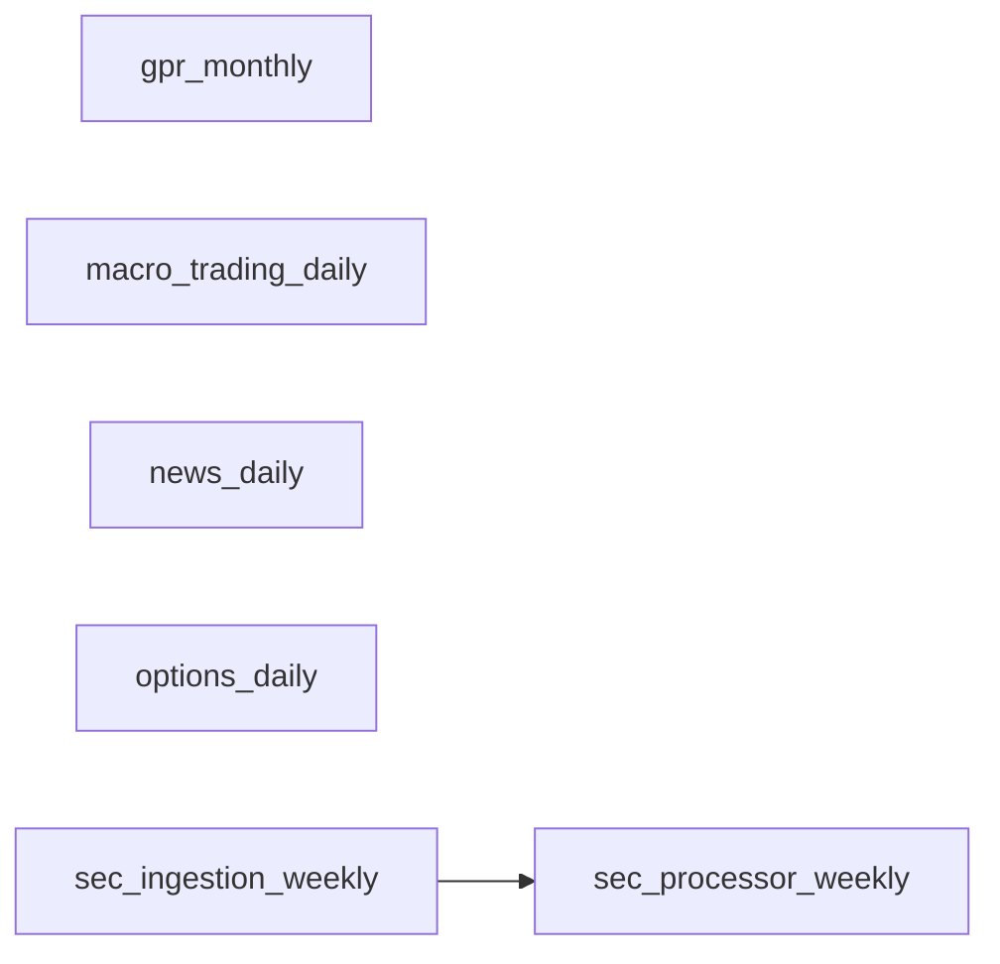
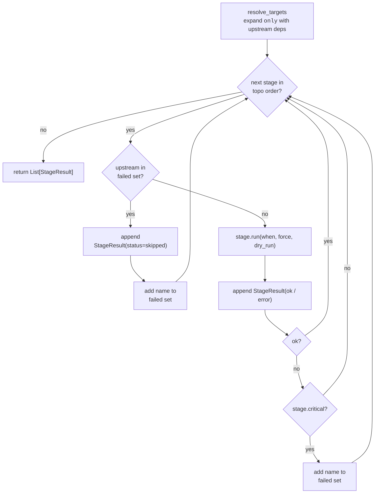

# Orchestration Layer — Pipeline DAG, Runtime State, CLI

_Scope: `Scripts/orchestration/` + `config/runtime/collect_data_state.json`_

This document is a deep-dive companion to
[ARCHITECTURE.md §2.2 and §3](./ARCHITECTURE.md#22-scriptsorchestration--pipeline--cli).
It specifies the contracts the orchestration layer offers to the rest
of the system, the DAG produced by `build_default_pipeline()`, and the
institutional runbook for each CLI subcommand.

---

## 1. Design Principles

1. **Single source of truth for time.** Every module that needs to
   reason about "yesterday", "this week", or "latest partition" reads
   from one file: `config/runtime/collect_data_state.json`. The only
   writer is the orchestration `Pipeline`. Agents never compute time
   anchors from wall-clock directly.
2. **Idempotency by cadence key.** Jobs are keyed by a `run_key` —
   `2026-04-21` for daily, `2026-W16` for weekly, `2026-04` for
   monthly. A job whose stored key matches the key we would compute
   now is *skipped*; no wasted API calls, no duplicate writes.
3. **Atomic state transitions.** The JSON state is written via
   `tempfile + os.replace` — a Ctrl+C during a scheduler tick cannot
   corrupt the file that agents depend on.
4. **Declarative DAG.** Stages declare `depends_on`; the runner
   topologically sorts, detects cycles at build time, and short-
   circuits downstream work when a critical upstream fails.
5. **Zero-migration adapter for legacy scripts.** Every existing
   scraper under `Scripts/data_collection/scrapers/` runs untouched
   via `ScriptStage(subprocess.run)`. New stages can opt into the
   faster in-process `CallableStage`.

---

## 2. The Production DAG

`Scripts/orchestration/pipeline.build_default_pipeline()` assembles six
stages mirroring the reality of the data sources:



The four roots (GPR / macro / news / options) are independent — they
hit different external endpoints. Only the SEC processor has an
upstream dependency because it parses Bronze artefacts the ingestion
job just wrote.

| Stage | Cadence | Timeout | Critical | Purpose |
| --- | --- | --- | --- | --- |
| `gpr_monthly` | MONTHLY | 30 min | yes | Geopolitical Risk index |
| `macro_trading_daily` | TRADING_DAILY | 30 min | yes | FRED + yfinance macro snapshot |
| `news_daily` | DAILY | 30 min | yes | GDELT + Llama 3 sentiment enrichment |
| `options_daily` | DAILY | 30 min | yes | yfinance option chains for 5+48 tickers |
| `sec_ingestion_weekly` | WEEKLY | 45 min | yes | Pull raw SEC filings |
| `sec_processor_weekly` | WEEKLY | 45 min | yes | LLM-parse SEC filings into Silver |

> **Cadence ≠ tier.** "Weekly" describes *when* the stage should run,
> not whether the pipeline should fail if it errors. Criticality is a
> separate field (`Stage.critical`) — all stages default to `True` in
> production today. Dropping a non-critical stage to `False` is a
> one-line change when you're comfortable with the source being flaky.

---

## 3. RunState — the Time-Anchor Contract

### 3.1 On-disk schema

```json
{
  "last_run_keys": {
    "options_daily":         "2026-04-21",
    "macro_trading_daily":   "2026-04-21",
    "news_daily":            "2026-04-21",
    "gpr_monthly":           "2026-04",
    "sec_ingestion_weekly":  "2026-W16",
    "sec_processor_weekly":  "2026-W16"
  },
  "updated_at": "2026-04-22T15:09:02"
}
```

### 3.2 Public API

```python
from Scripts.orchestration import Cadence, RunState, get_run_state

rs = get_run_state()                       # process-wide singleton

# Pipeline-side (writer)
rs.mark_job_complete("options_daily", Cadence.DAILY)   # atomic write
rs.is_up_to_date("options_daily", Cadence.DAILY)       # idempotency check

# Agent-side (reader)
rs.latest_anchor_date("options")                       # -> date(2026,4,21)
rs.latest_anchor_for_granularity("weekly")             # -> date(2026,4,13)
rs.snapshot()                                          # full diagnostic dict
```

### 3.3 Dataset → Anchor-Key Mapping

Agents speak in logical dataset names; `RunState` translates to the
concrete `last_run_keys` field. Extend this table alongside the
scraper's `build_jobs()`:

| `dataset` (argument) | `last_run_keys` field | Typical agent site |
| --- | --- | --- |
| `options` | `options_daily` | `SilverSQLTool._get_anchor_date("options")`, `time_adapter.build_anchor("daily")` |
| `macro` | `macro_trading_daily` | Macro snapshot + `time_adapter` DAILY |
| `news` | `news_daily` | `time_adapter` EVENT |
| `gpr` | `gpr_monthly` | `time_adapter` MONTHLY |
| `sec` | `sec_processor_weekly` | `time_adapter` WEEKLY (downstream-visible) |
| `sec_raw` | `sec_ingestion_weekly` | SEC raw-JSONL retrieval only |

### 3.4 Fault Tolerance

| Failure mode | Behaviour |
| --- | --- |
| State file missing | `latest_anchor_date()` returns `fallback` (default `date.today()`). Agents still serve queries. |
| State file corrupt JSON | Same as missing — `RunState._load` catches `json.JSONDecodeError`. |
| Scheduler Ctrl+C mid-write | `os.replace()` atomicity: the previous valid file is still on disk; the tmp file is garbage-collected. |
| Weekend-anchored daily key | `time_adapter` snaps to previous business day via `Scripts.core.trading_calendar.previous_business_day`. |

---

## 4. Stage Contract

### 4.1 Base class

```python
class Stage(ABC):
    name: str
    cadence: Cadence
    depends_on: Tuple[str, ...] = ()
    critical: bool = True
    timeout_s: int = 60 * 30
    max_retries: int = 2
    retry_backoff_s: int = 10

    @abstractmethod
    def _execute(self, when: datetime) -> Tuple[str, str]: ...

    def is_up_to_date(self, run_state: RunState, when: datetime) -> bool: ...
    def run(self, run_state: RunState, *, force: bool, dry_run: bool) -> StageResult: ...
```

### 4.2 Two concrete adapters

| Adapter | When to use |
| --- | --- |
| `ScriptStage` | Existing scraper scripts under `Scripts/data_collection/`. Spawns `subprocess.run(python script.py)`. Zero migration cost, survives independent invocation. |
| `CallableStage` | New in-process stages (e.g. an embedding re-indexer that reuses the caller's Qdrant client). Avoids subprocess startup; receives `datetime` and returns a metrics dict that is stored on `StageResult.metrics`. |

### 4.3 Retry + failure semantics

- Each stage retries up to `max_retries + 1` times with linear backoff
  (`min(60, 10 × attempt) seconds`).
- On final failure `StageResult.status = "failed"`; only *critical*
  failures abort downstream dependents.
- `Pipeline.run_once` always returns the full `List[StageResult]`,
  never raises. Callers inspect `r.ok` to decide exit codes.

---

## 5. Pipeline Runner

```python
from Scripts.orchestration import Pipeline, build_default_pipeline

pipe = build_default_pipeline()
results = pipe.run_once(
    only=["sec_processor_weekly"],   # auto-includes upstream deps
    force=False,
    dry_run=False,
    when=None,                       # defaults to datetime.now()
)
```

### 5.1 `run_once` algorithm



Key guarantees of the algorithm:

- **Topological order is fixed**, so a stage never runs before its upstream.
- **Skips are recorded**, never silently dropped — every skipped stage
  still emits a `StageResult` for auditing.
- **Non-critical failures do not poison downstream**: only stages flagged
  `critical=True` propagate through the `failed` set.
- **Idempotency is delegated** to each `Stage.is_up_to_date(run_state)`;
  the runner does not re-implement cadence logic.

### 5.2 `run_forever`

Identical per-tick logic, sleeps `poll_seconds` between ticks. Shares
the state file with any concurrent CLI `ingest` invocation — writes go
through the same `RunState` handle so no tick ever re-runs a job the
CLI has already completed.

---

## 6. CLI Runbook

```text
python -m Scripts <subcommand> [--log-level DEBUG|INFO|WARNING|ERROR]
```

| Subcommand | Purpose |
| --- | --- |
| `ingest` | Run all due stages once (idempotent). |
| `daemon` | Long-lived scheduler (replaces legacy `collect_data.py run_forever`). |
| `status` | Print `last_run_keys` and derived agent-side anchors. |
| `query` | One-shot RAG question through the multi-agent graph. |
| `warmup` | Pre-load Ollama models. |

### 6.1 `ingest` flags

| Flag | Semantics |
| --- | --- |
| `--only STAGE [STAGE ...]` | Run only these (upstream deps auto-included). Unknown names exit 2. |
| `--force` | Ignore `is_up_to_date` — re-runs even if today's key already matches. Useful for backfills and QA. |
| `--dry-run` | Log what *would* execute without spawning subprocesses. |

### 6.2 Example session

```powershell
# Quick freshness check before asking a question
PS> python -m Scripts status
state_path: C:\...\config\runtime\collect_data_state.json
updated_at: 2026-04-22T15:09:02

last_run_keys:
  gpr_monthly                  2026-04
  macro_trading_daily          2026-04-21
  news_daily                   2026-04-21
  options_daily                2026-04-21
  sec_ingestion_weekly         2026-W16
  sec_processor_weekly         2026-W16

anchors (agent-side time anchors):
  options    2026-04-21
  macro      2026-04-21
  news       2026-04-21
  gpr        2026-04-01
  sec        2026-04-13
  sec_raw    2026-04-13

# Bring today's data up-to-date
PS> python -m Scripts ingest

# Force-reprocess SEC filings (re-runs sec_ingestion_weekly too)
PS> python -m Scripts ingest --only sec_processor_weekly --force

# Serve queries
PS> python -m Scripts query --warmup "yesterday's AAPL IV skew?"
```

---

## 7. Extending the Pipeline

To add a new scraper (`Scripts/data_collection/scrapers/my_scraper.py`):

1. Choose a cadence and a unique `run_key` field name (e.g. `my_source_daily`).
2. Register it in `Scripts/orchestration/pipeline.py::build_default_pipeline()`:

    ```python
    ScriptStage(
        name="my_source_daily",
        script_path=scrapers / "my_scraper.py",
        cadence=Cadence.DAILY,
        depends_on=(),                     # or (upstream_job_name,)
        critical=True,
        project_root=root,
    ),
    ```

3. If agents need to read the freshness, add the mapping in
   `Scripts/orchestration/run_state.DATASET_ANCHOR_KEYS`:

    ```python
    DATASET_ANCHOR_KEYS["my_source"] = "my_source_daily"
    ```

4. No other code changes. `RunState.snapshot()` and `python -m Scripts status`
   automatically surface the new job.

---

## 8. Backwards Compatibility

`Scripts/data_collection/collect_data.py` continues to run as a
standalone daemon (`python Scripts/data_collection/collect_data.py`).
Its internal `StateStore` now delegates to `RunState`, so the old
daemon and the new CLI see the same state file and cannot double-run
a job.

Migration path for operators:

1. **Today**: keep running `collect_data.py`; start using `python -m Scripts status` and `ingest` interactively.
2. **Sprint n+1**: switch the cron to `python -m Scripts daemon --poll-seconds 30`.
3. **Sprint n+2**: delete legacy subprocess wrappers elsewhere (none known as of 2026-04-22).

No data migration is required — the on-disk state schema is unchanged.
