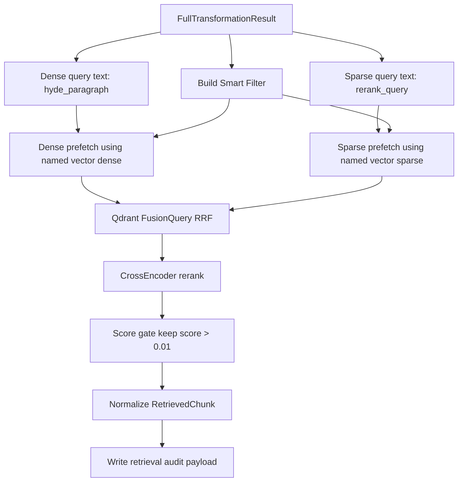

# Qdrant Retriever (Gold Layer) - Institutional Retrieval Spec

## 1. Goal and Retrieval Mandate

`Scripts/retrieval/qdrant_retriever.py` is the Gold-layer semantic retrieval engine.  
Its mandate is to maximize evidence recall while enforcing metadata discipline, per-source time barriers, and explicit fallback telemetry.

Operational objective:
- retain semantic coverage through asymmetric hybrid retrieval (dense + sparse),
- prevent noisy over-recall through smart metadata filtering,
- keep every relaxation step auditable (`strict -> soft_ticker_180d -> drop_ticker_180d`).

## 2. Architecture (Execution Contract)

```text
[FullTransformationResult]
   -> parse metadata + hyde payload
   -> build smart filter (ticker/source/topic/sec/sentiment/time)
   -> dense query vector from hyde_paragraph
   -> sparse query vector from rerank_query
   -> dual prefetch (dense + sparse, each limit=top_k*2)
   -> server-side RRF fusion
   -> cross-encoder rerank
   -> score gate + normalize RetrievedChunk + audit log
```

## 3. Workflow and Retrieval Strategy

### 3.1 End-to-End RRF Workflow



### 3.2 Dense vs Sparse Strategy (Asymmetric Querying)

| Channel | Query Input | Model Path | Why this channel exists |
|---|---|---|---|
| Dense | `hyde.hyde_paragraph` | `get_embedding_model()` -> named vector `dense` | captures abstract semantic intent and causal framing |
| Sparse | `hyde.rerank_query` | `SparseTextEmbedding` (`SPLADE`) -> named vector `sparse` | preserves lexical-exact signals (tickers, forms, event phrases) |
| Fusion | prefetch outputs | `FusionQuery(fusion=RRF)` | rank-based fusion avoids scale mismatch between dense/sparse scores |
| Precision stage | fused candidates | `CrossEncoder` rerank | refines relevance before final output |

Implementation-aligned details:
- both dense and sparse prefetches run with `limit = top_k * 2`,
- shared metadata filter is applied to both channels,
- rerank scores overwrite initial point scores,
- final keep-threshold is `score > 0.01`.

### 3.3 Metadata Strategy for Sparse/Hybrid Retrieval

The sparse channel is not standalone lexical search; it is constrained by the same smart filter as dense.

| Metadata Dimension | Filter Key(s) | Behavior |
|---|---|---|
| Source selection | `source_type` | keeps only Gold-physical sources (`news`, `sec`, `gpr`) |
| Ticker strategy | `ticker` | mode-aware: `hard` in Tier1, `should` in Tier2 (`soft`), omitted in Tier3 |
| Topic broadening (news) | `topic` | injected into `should` when event/category maps to canonical news topics |
| SEC action control | `action_direction` | SELL/BUY logic allows `ACQUIRE/VEST` bridge in SEC mode |
| SEC form control | `form_type` | applies specific form filter unless `ALL` |
| Sentiment gate (news) | `tone_score` | `<0` for negative, `>0` for positive when requested |
| Time barrier | `unified_timestamp` OR `publish_timestamp` | OR-based compatibility layer; union range from per-source predicates |

Fallback cascade:
1. `strict` (`ticker_mode=hard`, user time window),
2. `soft_ticker_180d` (`ticker OR topic`, widened window),
3. `drop_ticker_180d` (drop ticker, keep source/time semantics).

## 4. Output Data Schema and Paths

### 4.1 `RetrievedChunk` contract

| Field | Type | Description | Path |
|---|---|---|---|
| `content` | `str` | Gold text payload (`payload["text"]`) | `Scripts/retrieval/schema.py` |
| `source_type` | `SourceType` | Gold source channel (`news`, `sec`, `gpr`) | `Scripts/retrieval/schema.py` |
| `score` | `float` | post-rerank score after gating | `Scripts/retrieval/qdrant_retriever.py` |
| `metadata` | `Dict[str, Any]` | payload minus excluded fields + runtime tags (`record_date`, `is_fallback_180_days`) | `Scripts/retrieval/qdrant_retriever.py` |
| `bronze_ref` | `str` | lineage pointer: `accession_no` or `url` or `point_id` | `Scripts/retrieval/qdrant_retriever.py` |

### 4.2 Retrieval audit payload

| Field | Description | Path |
|---|---|---|
| `original_query` / `rerank_query_used` | query observability | `logs/retrieval/<YYYY-MM-DD>/retriever_audit_trail.jsonl` |
| `filter_applied` | serialized Qdrant filter | same |
| `fallback_triggered` / `fallback_tier` | cascade visibility | same |
| `results_count` / `top_k_scores` | retrieval quality snapshot | same |
| `latency_sec` / `status` / `error_msg` | runtime health | same |

## 5. How to Test

```bash
python Scripts/tests/test_router_e2e.py
python -m Scripts query "Past week macro geopolitics impact on GLD?"
python Scripts/retrieval/qdrant_retriever.py
```

Validation checklist:
- tier transitions are visible in audit logs when strict retrieval is empty,
- `filter_applied` contains expected source/ticker/topic/time logic,
- final chunks include `bronze_ref`, `record_date`, and valid post-rerank scores.

## 6. Dependency Files, Linked Docs, and One-Line Commands

### 6.1 Core dependency files

- `Scripts/retrieval/qdrant_retriever.py`
- `Scripts/retrieval/master_retriever.py`
- `Scripts/retrieval/query_transform.py`
- `Scripts/retrieval/time_adapter.py`
- `Scripts/vector_store/connection.py`
- `Scripts/retrieval/schema.py`

### 6.2 Linked documentation

- [Retrieval Architecture and Strategy](./Retrieval_Architecture_and_Strategy.md)
- [Query Intent and Transformation](./Query_intent_docs.md)
- [Silver SQL Tools](./Silver_SQL_Tools.md)
- [Time Adapter](./Time_Adapter.md)
- [Qdrant Connection](../Vector_store_docs/Qdrant_connection.md)
- [Data Source Summary](../Data_source_docs/Data_source_summary.md)
- [News Data Profile](../Data_source_docs/market_news_data.md)
- [SEC Data Profile](../Data_source_docs/SEC_data.md)
- [GPR Data Profile](../Data_source_docs/GPR_Index.md)

### 6.3 One-line setup command

```bash
pip install -r requirements.txt
```

