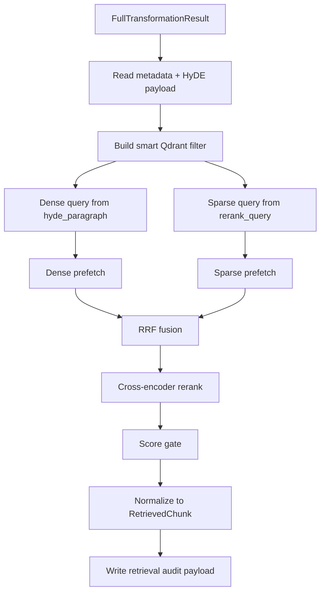
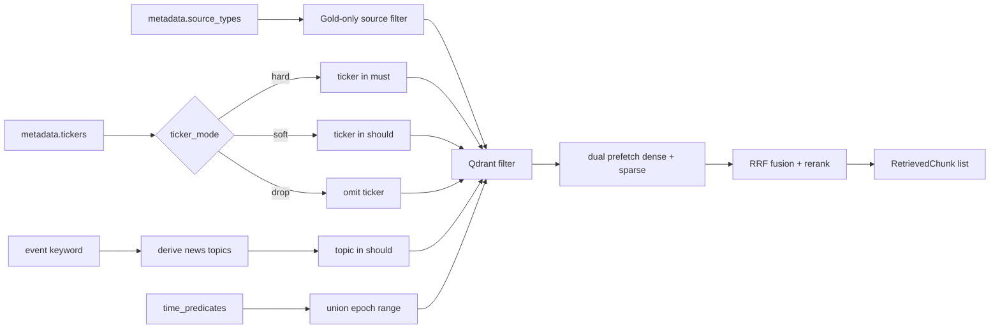

# Qdrant Retriever — Asymmetric Hybrid Gold Retrieval Engine

## 1. Retrieval Mandate and Control Goals

`Scripts/retrieval/qdrant_retriever.py` is the Gold-layer semantic retrieval engine.

Its job is to maximize relevant evidence recall while preserving four control properties:

- source-aware filtering for `news`, `sec`, and `gpr`,
- hard time barriers built from the query's compiled per-source predicates,
- staged fallback visibility across increasingly relaxed ticker logic,
- drill-through metadata preservation so downstream agents can trace a chunk back to source-native identifiers and timestamps.

Operational objective:

- retain semantic breadth through asymmetric hybrid retrieval,
- keep lexical precision through sparse querying and reranking,
- avoid silent over-relaxation by exposing the exact fallback tier that fired.

## 2. Execution Contract



## 3. Workflow and Retrieval Strategy

### 3.1 Retrieval Workflow



### 3.2 Dense, Sparse, and Precision Stages

| Stage | Query Input | Runtime Path | Why it exists |
|---|---|---|---|
| Dense retrieval | `hyde.hyde_paragraph` | `get_embedding_model()` -> named vector `dense` | captures causal framing and semantic intent |
| Sparse retrieval | `hyde.rerank_query` | `SparseTextEmbedding` -> named vector `sparse` | preserves lexical-exact entities such as tickers, SEC forms, and event phrases |
| Fusion | dense + sparse prefetch results | `FusionQuery(fusion=RRF)` | combines channels without assuming score comparability |
| Precision stage | fused candidates | `CrossEncoder` rerank | removes noisy recall before final output |

Implementation-aligned details:

- both dense and sparse prefetches run with `limit = top_k * 2`,
- both channels receive the same metadata filter,
- cross-encoder scores overwrite the initial Qdrant point score,
- final output keeps chunks with `score > 0.01`.

**News-only query path:** When `source_types == {news}`, the retriever substitutes alternative query fields sourced from `financial_narrative_contract`:
- Dense input: `dense_news_semantic_query` (richer topical framing than the generic HyDE paragraph)
- Sparse input: `sparse_news_keyword_query` (keyword-focused, avoids HyDE hallucination on news terms)

### 3.3 Filter Semantics

The filter builder accepts three ticker modes:

| Ticker Mode | Filter Placement | Typical Use |
|---|---|---|
| `hard` | `ticker` in `must` | highest precision when payload ticker tagging is trusted |
| `soft` | `ticker` in `should` together with optional `topic` | restores recall when some news payloads are not yet ticker-tagged |
| `drop` | ticker omitted | final fallback when thematic context is preferable to zero recall |

Other filter dimensions:

| Metadata Dimension | Filter Key(s) | Behavior |
|---|---|---|
| Gold source selection | `source_type` | strips Silver-only labels such as `options` and `macro_history` before querying Gold |
| Topic widening | `topic` | injected into `should` for news queries when event/category maps to canonical topics |
| SEC action control | `action_direction` | `SELL` and `BUY` each allow `ACQUIRE/VEST` bridge behavior |
| SEC form control | `form_type` | form-specific filter unless `ALL` |
| News sentiment | `tone_score` | `< 0` for negative, `> 0` for positive |
| Time barrier | `unified_timestamp`, `publish_timestamp`, SEC event timestamps | OR-style compatibility layer across range-capable timestamp keys |

**`_NEWS_TOPIC_INDEXED_TICKERS`:** `{SPY, QQQ, IWM, GLD, SLV}`. For these ETFs, news is indexed by topic rather than direct ticker tag. The filter builder uses topic-based `should` clauses instead of hard ticker matching to avoid missing topically relevant but not ticker-tagged news chunks.

### 3.4 Time Filter Semantics

Time filtering follows a two-path design:

1. Primary path: use `master_retriever`-compiled per-source `TimePredicate` objects.
2. Legacy path: if no predicates were supplied, derive a single inline window from `schema.TIME_WINDOW_DAYS`.

When predicates are present:

- only predicates relevant to the currently selected Gold sources are used,
- epoch ranges are unioned so mixed-source queries still share one executable Qdrant range,
- range filters are applied against every compatible timestamp key for that source set,
- monthly and weekend-safe widening has already been resolved upstream in `time_adapter.py`.

### 3.5 Fallback Cascade

Fallback tiers are explicit, branched by query type, and surfaced in the retrieval audit payload. The tier should be treated as part of the evidence quality signal, not just debugging metadata.

**Branch A — news-only queries** (`source_types == {news}`):

| Tier | Name | Strategy |
|---|---|---|
| 1 | `news_soft_tight` | soft ticker + per-source time predicates |
| 2 | `news_drop_ticker_180d` | drop ticker entirely + 180-day fallback window |

**Branch B — SEC / GPR / mixed queries**:

| Tier | Name | Strategy |
|---|---|---|
| 1 | `strict` | hard ticker match + per-source time predicates |
| 2 | `soft_ticker_180d` | soft ticker + 180-day fallback window |
| 3 | `drop_ticker_180d` | drop ticker entirely + 180-day fallback window |
| 4 (SEC only) | `sec_iso_date_postfilter` | ignore time filter entirely; post-filter by ISO `filed_at` / `transaction_date` fields |

### 3.6 SEC Payload-First Path

When the query requests specific SEC forms (`8-K`, `4`), the retriever executes a **scroll-based payload lookup** per form type against Qdrant *before* the vector search path. If matching payloads are found, the function returns early with `fallback_tier="sec_payload_existence"`, bypassing the hybrid search pipeline entirely. This ensures high-precision SEC document retrieval without relying on embedding similarity for form-type targeting.

### 3.7 Supplemental News Retrieval

`retrieve_supplemental_news_async()` is a separate retrieval path invoked by `MasterRetriever` to supplement non-news queries with thematic context:

- Forces `source_types=[NEWS]` and drops all ticker filters.
- Scores results using `structured_news_relevance_score` (no hard score cutoff applied).
- Uses an independent timeout and is appended to the Gold context, not replacing the primary Gold result.
- Activated when Gold news coverage is assessed as insufficient for the query's thematic requirements.

## 4. Output Data Schema and Audit Surface

### 4.1 `RetrievedChunk` contract

| Field | Type | Description | Path |
|---|---|---|---|
| `content` | `str` | Gold text payload from `payload["text"]` | `Scripts/retrieval/schema.py` |
| `source_type` | `SourceType` | Gold source channel: `news`, `sec`, or `gpr` | `Scripts/retrieval/schema.py` |
| `score` | `float` | post-rerank score after final gating | `Scripts/retrieval/qdrant_retriever.py` |
| `metadata` | `Dict[str, Any]` | payload minus excluded fields, plus runtime tags such as `record_date` and `is_fallback_180_days` | `Scripts/retrieval/qdrant_retriever.py` |
| `bronze_ref` | `str` | lineage pointer from `accession_no`, `url`, or Qdrant point id | `Scripts/retrieval/qdrant_retriever.py` |

### 4.2 Drill-through metadata preserved in `RetrievedChunk.metadata`

The Gold formatter preserves almost the entire payload so downstream components can drill through to source-native context without re-querying Qdrant.

Common preserved fields include:

| Field Family | Examples | Why it matters |
|---|---|---|
| Source identity | `source_type`, `ticker`, `topic`, `form_type` | source-aware answer composition |
| Event semantics | `action_direction`, `tone_score` | SEC and sentiment reasoning |
| Event timing | `unified_timestamp`, `publish_timestamp`, `transaction_date_epoch_s`, `filed_at_epoch_s` | time-aware evidence ordering |
| Lineage | `accession_no`, `url` | direct trace-back to raw source artifacts |
| Runtime tags | `record_date`, `is_fallback_180_days` | downstream audit and fallback disclosure |

Excluded payload keys at formatting time:

- `text`
- `document_sparse_embedding`

### 4.3 Retrieval audit payload

| Field | Description | Path |
|---|---|---|
| `original_query` | raw user query for observability | `logs/retrieval/<YYYY-MM-DD>/retriever_audit_trail.jsonl` |
| `rerank_query_used` | exact sparse/rerank query text used at retrieval time | same |
| `filter_applied` | serialized Qdrant filter | same |
| `fallback_triggered` | legacy boolean visibility | same |
| `fallback_tier` | exact relaxation tier: `strict`, `soft_ticker_180d`, `drop_ticker_180d`, or `error` | same |
| `results_count` | number of returned chunks | same |
| `top_k_scores` | rounded post-rerank scores | same |
| `latency_sec` | end-to-end Gold retrieval latency | same |
| `status` | `SUCCESS` or `ERROR` | same |
| `error_msg` | error string when retrieval fails | same |

## 5. Validation and Test Procedure

Recommended validation flow:

```bash
python Scripts/tests/test_router_e2e.py
python -m Scripts query "Past week NVDA insider selling and negative news pressure"
```

What to validate:

- source filters drop Silver-only labels before querying Qdrant,
- time filters bind to the correct timestamp keys and reflect serialized `source_predicates`,
- fallback tiers progress in the intended order,
- returned chunks preserve lineage and timing fields inside `metadata`,
- `retriever_audit_trail.jsonl` records the exact filter and fallback tier that fired.

## 6. Dependency Files, Linked Docs, and One-Line Commands

### 6.1 Core dependency files

- `Scripts/retrieval/qdrant_retriever.py`
- `Scripts/retrieval/query_transform.py`
- `Scripts/retrieval/schema.py`
- `Scripts/retrieval/time_adapter.py`

### 6.2 Linked documentation

- [Retrieval Architecture and Strategy](./Retrieval_Architecture_and_Strategy.md)
- [Query Intent and Transformation](./Query_intent_docs.md)
- [Silver SQL Tools](./Silver_SQL_Tools.md)
- [Time Adapter](./Time_Adapter.md)
- [Qdrant Connection](../Vector_store_docs/Qdrant_connection.md)
- [Data Source Summary](../Data_source_docs/Data_source_summary.md)
- [News Data Profile](../Data_source_docs/market_news_data.md)
- [SEC Data Profile](../Data_source_docs/SEC_data.md)
- [GPR Data Profile](../Data_source_docs/GPR_Index.md)
