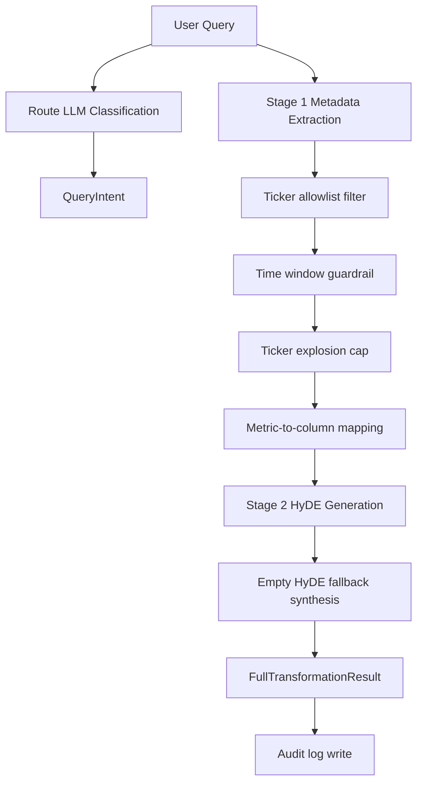

# Query Intent and Transformation — Two-Stage LLM Extraction and Guardrail Contract

## 1. Goal and Reliability Scope

Translate natural-language user intent into deterministic retrieval controls with strict safety guarantees:

- routing intent (`sql_only`, `vector_only`, `hybrid_both`),
- typed metadata extraction for downstream filtering,
- HyDE semantic expansion for vector retrieval robustness.

The component must remain operational under model failures through deterministic fallbacks.

## 2. Architecture (Markdown Block)

```text
[User Query]
  -> Intent Router (MasterRetriever._classify_intent)
      -> QueryIntent.primary_route
  -> QueryTransformer
      -> Stage 1: structured metadata extraction (MetadataExtraction)
      -> Stage 2: HyDE generation (HyDEGeneration)
  -> FullTransformationResult
      -> metadata
      -> hyde
      -> mapped_physical_columns
```

## 3. Code Strategy and Workflow



Model and fallback policy:

| Step | Model | Env var | Fallback | Failure behavior |
|---|---|---|---|---|
| Stage 1 metadata extraction | `gpt-4o-mini` | `TRANSFORM_EXTRACTOR_MODEL` | regex-based deterministic extraction | Keeps pipeline alive with minimal typed metadata |
| Stage 2 HyDE generation | `gpt-4o-mini` | `TRANSFORM_HYDE_MODEL` | deterministic text synthesis from query + metadata | Guarantees non-empty dense retrieval text |

Route classification is performed by the Router node (`MasterRetriever._classify_intent`), not by `QueryTransformer`. The Router uses its own model configuration and defaults to `hybrid_both` if classification fails.

### 3.1 `BuilderQueryContract` merge path

When a UI builder contract is present in the query context, its fields — `tickers`, `signals`, `metrics`, `sources`, `forms`, and `time_window` — are merged into `MetadataExtraction` *before* the five production guardrails run. This ensures that structured UI inputs override or constrain the LLM extraction result, and that guardrails apply uniformly to the merged output regardless of input source.

### 3.2 Five Production Guardrails

Applied in sequence after Stage 1 LLM extraction (and after any `BuilderQueryContract` merge):

| Guardrail | Trigger | Action |
|---|---|---|
| 1. Ticker allowlist | LLM proposes a ticker not in the ontology whitelist | Remove the ticker; results are split into `in_scope` (options-covered) and `out_of_scope` lists |
| 2. Default time window | `time_window` is empty, null, or an invalid value | Normalize to `PAST_SIX_MONTHS` |
| 3. Ticker explosion cap | Ticker count exceeds `TICKER_EXPLOSION_CAP` env var | Keep only the first `TICKER_EXPLOSION_KEEP` tickers; log dropped tickers |
| 4. Empty HyDE paragraph | Stage 2 returns an empty `hyde_paragraph` | Synthesize a deterministic fallback from the original query text + extracted metadata |
| 5. News rerank override | Stage 1 failed or the rerank query is shorter than 3 words | Inject `expanded_news_rerank_query` from `financial_narrative_contract` |

### 3.3 Deterministic post-processing layer

After Stage 1 LLM extraction, a Python normalization layer applies the following transformations — all ontology-bound and output-deterministic regardless of LLM phrasing variation:

- **Canonical news topic mapping:** raw topic strings normalized to the ontology's canonical topic set.
- **News topic expansion:** canonical topics expanded via `NEWS_TOPIC_EXPANSIONS` adjacency map to include semantically adjacent topics.
- **News semantic profile:** structured `financial_narrative_contract` assembled from expanded topics (includes `dense_news_semantic_query`, `sparse_news_keyword_query`, `expanded_news_rerank_query`).
- **Narrative option posture metrics:** for metals and macro query families, option posture metrics are derived from the narrative profile rather than relying solely on LLM-extracted metric names.
- **Primary theme / surface / asset scope / read profile resolution:** canonical classification fields resolved from ontology maps and used downstream by `scope_contract` to set answer ceilings.

## 4. Output Data Schema and Paths

| Schema | Type | Key Fields | Produced In | Path |
|---|---|---|---|---|
| `QueryIntent` | Pydantic model | `primary_route` | Router path | `Scripts/retrieval/schema.py` |
| `MetadataExtraction` | Pydantic model | `tickers`, `metrics`, `source_types`, `time_window`, `event_keyword`, `logical_reasoning` | Stage 1 | `Scripts/retrieval/query_transform.py` |
| `HyDEGeneration` | Pydantic model | `hyde_paragraph`, `rerank_query` | Stage 2 | `Scripts/retrieval/query_transform.py` |
| `FullTransformationResult` | Pydantic model | `metadata`, `hyde`, `mapped_physical_columns` | Transformer final assembly | `Scripts/retrieval/query_transform.py` |
| Query transform audit | JSONL row | query, route, latency, result payload | `_save_audit_trail()` | `logs/query_transform/<YYYY-MM-DD>/query_audit_trail.jsonl` |

## 5. How to Test

```bash
python Scripts/retrieval/query_transform.py
python Scripts/tests/test_router_e2e.py
python -m Scripts query "How did TSLA insider selling align with IV skew over the past month?"
```

Validation checklist:

- `primary_route` is one of the three supported values,
- extracted tickers remain allowlist-compliant,
- empty/invalid time windows are normalized,
- HyDE paragraph is never empty in final output.

## 6. Dependency Files, Linked Docs, and One-Line Commands

### 6.1 Core dependency files

- `Scripts/retrieval/master_retriever.py`
- `Scripts/retrieval/query_transform.py`
- `Scripts/retrieval/schema.py`
- `Scripts/core/prompt_templates.py`
- `Scripts/core/financial_ontology.py`

### 6.2 Linked documentation

- [Retrieval Architecture and Strategy](./Retrieval_Architecture_and_Strategy.md)
- [Qdrant Retriever Docs](./Qdrant_retriever_docs.md)
- [Silver SQL Tools](./Silver_SQL_Tools.md)
- [Time Adapter](./Time_Adapter.md)

### 6.3 One-line setup command

```bash
pip install -r requirements.txt
```

