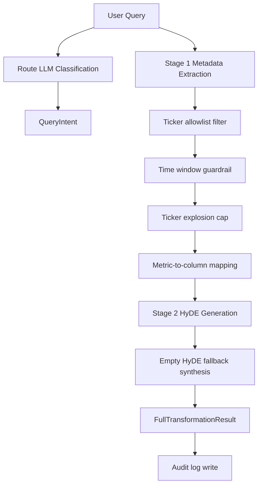

# Query Intent and Transformation - Institutional Control Spec

## 1. Goal and Reliability Scope

Translate natural-language user intent into deterministic retrieval controls with strict safety guarantees:

- routing intent (`sql_only`, `vector_only`, `hybrid_both`),
- typed metadata extraction for downstream filtering,
- HyDE semantic expansion for vector retrieval robustness.

The component must remain operational under model failures through deterministic fallbacks.

## 2. Architecture (Markdown Block)

```text
[User Query]
  -> Intent Router (MasterRetriever._classify_intent)
      -> QueryIntent.primary_route
  -> QueryTransformer
      -> Stage 1: structured metadata extraction (MetadataExtraction)
      -> Stage 2: HyDE generation (HyDEGeneration)
  -> FullTransformationResult
      -> metadata
      -> hyde
      -> mapped_physical_columns
```

## 3. Code Strategy and Workflow



Model and fallback policy:

| Step | Primary | Fallback | Failure behavior |
|---|---|---|---|
| Route classification | Ollama `llama3:latest` | `gpt-4o-mini` | Defaults to `hybrid_both` if both fail |
| Stage 1 metadata extraction | `gpt-4o-mini` structured output | regex extraction | Keeps pipeline alive with minimal typed metadata |
| Stage 2 HyDE generation | `gpt-4o-mini` structured output | deterministic text synthesis | Guarantees non-empty dense retrieval text |

## 4. Output Data Schema and Paths

| Schema | Type | Key Fields | Produced In | Path |
|---|---|---|---|---|
| `QueryIntent` | Pydantic model | `primary_route` | Router path | `Scripts/retrieval/schema.py` |
| `MetadataExtraction` | Pydantic model | `tickers`, `metrics`, `source_types`, `time_window`, `event_keyword`, `logical_reasoning` | Stage 1 | `Scripts/retrieval/query_transform.py` |
| `HyDEGeneration` | Pydantic model | `hyde_paragraph`, `rerank_query` | Stage 2 | `Scripts/retrieval/query_transform.py` |
| `FullTransformationResult` | Pydantic model | `metadata`, `hyde`, `mapped_physical_columns` | Transformer final assembly | `Scripts/retrieval/query_transform.py` |
| Query transform audit | JSONL row | query, route, latency, result payload | `_save_audit_trail()` | `logs/query_transform/<YYYY-MM-DD>/query_audit_trail.jsonl` |

## 5. How to Test

```bash
python Scripts/retrieval/query_transform.py
python Scripts/tests/test_router_e2e.py
python -m Scripts query "How did TSLA insider selling align with IV skew over the past month?"
```

Validation checklist:

- `primary_route` is one of the three supported values,
- extracted tickers remain allowlist-compliant,
- empty/invalid time windows are normalized,
- HyDE paragraph is never empty in final output.

## 6. Dependency Files, Linked Docs, and One-Line Commands

### 6.1 Core dependency files

- `Scripts/retrieval/master_retriever.py`
- `Scripts/retrieval/query_transform.py`
- `Scripts/retrieval/schema.py`
- `Scripts/core/prompt_templates.py`
- `Scripts/core/financial_ontology.py`

### 6.2 Linked documentation

- [Retrieval Architecture and Strategy](./Retrieval_Architecture_and_Strategy.md)
- [Qdrant Retriever Docs](./Qdrant_retriever_docs.md)
- [Silver SQL Tools](./Silver_SQL_Tools.md)
- [Time Adapter](./Time_Adapter.md)

### 6.3 One-line setup command

```bash
pip install -r requirements.txt
```

