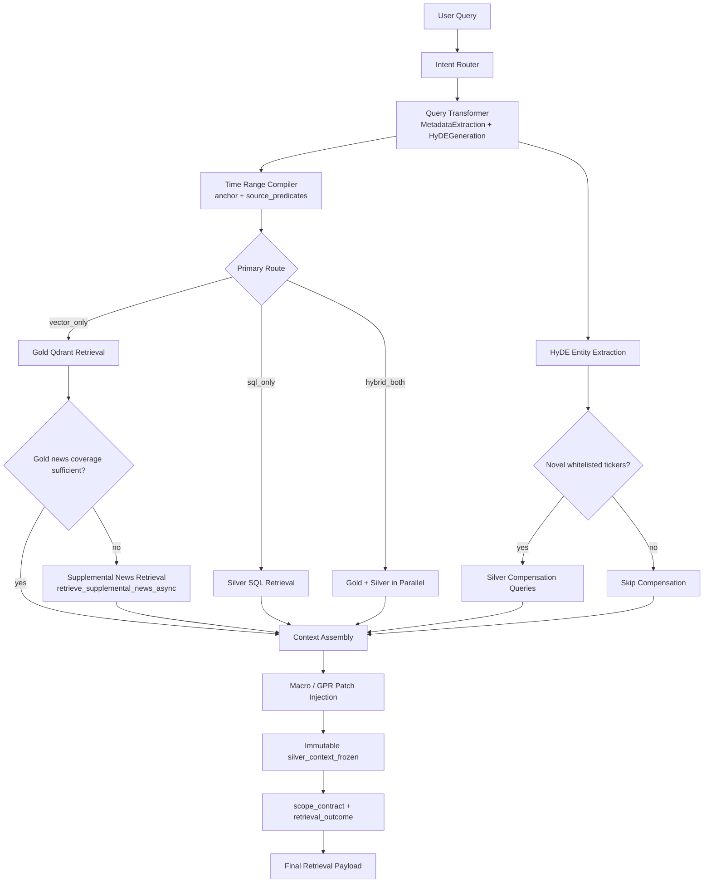

# Retrieval Architecture and Strategy — Production Evidence Envelope Compiler

## 1. Retrieval Mandate and Design Goals

Define the production retrieval contract that transforms a user query into one unified, auditable context payload for the multi-agent pipeline.

The retrieval layer is responsible for four guarantees:

- deterministic numeric grounding from Silver Parquet through DuckDB,
- broad semantic recall from Gold Qdrant collections,
- source-aware time alignment through compiled per-source predicates,
- explicit runtime contracts so downstream agents know what was retrieved, what was missing, and how specific the answer is allowed to be.

## 2. System Workflow and Control Surface

## 3. Execution Strategy and Runtime Guarantees

Strategy highlights:

- Route-specific execution plans prevent over-fetching while preserving fallback visibility:
  - `sql_only`: Silver is primary; Gold still runs as a small semantic hedge.
  - `vector_only`: Gold is primary; Silver can still run through HyDE-driven compensation or explicit user tickers.
  - `hybrid_both`: Gold and Silver run in parallel, with optional HyDE compensation.
- **Independent failure budgets:** Gold and Silver (and optional supplemental news) execute under `asyncio.gather(..., return_exceptions=True)` so a timeout or exception in one lane does not block the other. `GOLD_TIMEOUT` and `SILVER_TIMEOUT` are the per-lane ceiling env vars; a lane that exceeds its budget returns a degraded-context result rather than blocking the pipeline.
- One canonical `time_range` is compiled per query, then expanded into source-specific `TimePredicate` objects so daily, event, and monthly datasets do not share the wrong physical window.
- HyDE-derived novel tickers are isolated under `silver_context.compensation`; they never overwrite primary numeric truth.
- **Macro / GPR patch injection:** After the primary route completes, `MACRO_CHAIN_DIRECTIVE` triggers a post-hoc macro series patch and a GPR index patch, each emitting typed lineage anchors (`MACRO_*`, `GPR_*`). This ensures stable regime context even when macro or GPR series were not in the primary Silver result set.
- `silver_context_frozen` snapshots the fully patched Silver truth before any downstream rescue logic can mutate live context.
- Final payloads carry explicit runtime ceilings through `scope_contract`:
  - `output_mode_ceiling`: `actionable_options`, `directional_watchlist`, or `informational_only`
  - `specificity_ceiling`: `structure_allowed`, `watchlist_only`, or `no_structure`
- Retrieval never degrades silently. Top-level `status` is `success` or `partial_failure`.

## 4. Output Contracts and Runtime Payloads

### 4.1 Top-level retrieval payload

| Field | Type | Description | Source | Path |
|---|---|---|---|---|
| `intent` | `str` | Chosen route: `sql_only`, `vector_only`, or `hybrid_both` | Router | `Scripts/retrieval/master_retriever.py` |
| `metadata` | `MetadataExtraction` | Structured query controls: tickers, metrics, source hints, sentiment, event keyword, time window | Transformer stage 1 | `Scripts/retrieval/schema.py` |
| `time_range` | `Dict[str, Any]` | Canonical query window plus serialized per-source predicates | Time compiler | `Scripts/retrieval/master_retriever.py` |
| `gold_context` | `List[RetrievedChunk]` | Gold semantic evidence after hybrid retrieval, fusion, rerank, and score gating | Qdrant retriever | `Scripts/retrieval/qdrant_retriever.py` |
| `silver_context` | `Dict[str, Any]` | Primary deterministic numeric context plus lineage anchors and status | Silver SQL tool | `Scripts/retrieval/sql_tools.py` |
| `silver_context.compensation` | `Dict[str, Any]` | HyDE-triggered supplemental Silver retrieval, kept physically separate from primary truth | MasterRetriever compensation path | `Scripts/retrieval/master_retriever.py` |
| `silver_context_frozen` | `Dict[str, Any] \| None` | Immutable post-patch Silver snapshot for downstream numeric checking | MasterRetriever | `Scripts/retrieval/master_retriever.py` |
| `hyde_anticipation` | `Dict[str, Any]` | HyDE paragraph, rerank query, extracted ticker candidates, and semantic-hedge tagging | Transformer + MasterRetriever | `Scripts/retrieval/master_retriever.py` |
| `scope_contract` | `Dict[str, Any] \| None` | Retrieval capability ceiling, supported sources, required disclosures, and slot-level evidence contract | Runtime contract compiler | `Scripts/retrieval/schema.py` |
| `retrieval_outcome` | `Dict[str, Any] \| None` | Retrieval hit/miss summary, fallback state, time contract, and source coverage | Runtime contract compiler | `Scripts/retrieval/schema.py` |
| `status` | `str` | Pipeline health: `success` or `partial_failure` | MasterRetriever | `Scripts/retrieval/master_retriever.py` |
| `latency_stats` | `Dict[str, str]` | Retrieval latency summary; currently includes `total_e2e` | MasterRetriever | `Scripts/retrieval/master_retriever.py` |

### 4.2 `time_range` contract

`time_range` is the authoritative query window shared across Gold and Silver.

| Field | Type | Description |
|---|---|---|
| `time_window_label` | `str` | Canonical window label such as `today`, `past_week`, or `past_six_months` |
| `window_days` | `int` | Global day-count translation from `schema.TIME_WINDOW_DAYS` |
| `anchor_date` | `str` | Dynamic anchor date sourced from the latest verified Silver ingestion state |
| `start_date` | `str` | Canonical query start date before per-source widening |
| `end_date` | `str` | Canonical query end date, normally the anchor date |
| `is_default_window_applied` | `bool` | Whether retrieval had to apply the default project time window |
| `source_predicates` | `Dict[str, Dict[str, Any]]` | Serialized per-source execution predicates keyed by `gold.news`, `gold.sec`, `gold.gpr`, `silver.options`, `silver.macro`, `silver.gpr` |

### 4.3 `silver_context` contract

Primary Silver context is the deterministic numeric truth surface used by Analyst and Checker.

| Field | Type | Description |
|---|---|---|
| `values` | `Dict[str, Any]` | Handler outputs such as `latest_atm_iv`, `pcr_volume`, `SPY_open_interest`, `gpr_index_level`, or macro patch values |
| `lineage_anchors` | `List[str]` | Deterministic anchors such as `PCR_AGG_*`, `IVRANK_*`, `LIQ_*`, `PX_*`, `MACRO_*`, `GPR_*` |
| `source_channel` | `str` | `primary` for the main Silver path |
| `status` | `Dict[str, Any]` | Unsupported metric reporting and explicit SQL-side status fields |
| `error` | `str \| None` | Optional fatal retrieval status on the primary Silver path |

HyDE compensation lives under `silver_context.compensation` and adds:

- `source_channel = silver_layer_via_hyde_expansion`
- `trigger_entities`
- `per_ticker_errors`

### 4.4 `hyde_anticipation` contract

| Field | Type | Description |
|---|---|---|
| `paragraph` | `str` | HyDE-generated semantic hedge paragraph |
| `rerank_query` | `str` | Clean factual query used for sparse retrieval and reranking |
| `raw_candidates` | `List[str]` | Regex-extracted uppercase ticker candidates from HyDE |
| `whitelisted_tickers` | `List[str]` | Candidates that passed the ontology whitelist |
| `novel_tickers` | `List[str]` | Whitelisted tickers not present in the user query |
| `source_channel` | `str` | `semantic_hedge` for `sql_only`, otherwise `reference` |

### 4.5 Runtime contracts for downstream agents

`scope_contract` and `retrieval_outcome` are the downstream control surface that turns raw retrieval into answer-governance rules.

`scope_contract` includes:

- query family classification,
- strict versus soft source expectations,
- allowed and unavailable metrics,
- supported tickers,
- requested versus effective time window,
- output specificity ceilings,
- required disclosures,
- query slots and slot-level evidence contracts,
- SEC action taxonomy when the query is insider-flow driven.

`retrieval_outcome` includes:

- strict and soft source hits,
- missing strict sources,
- missing query slots,
- `has_gold_evidence` and `has_silver_evidence`,
- `is_fallback`,
- time defaulting and time widening flags,
- nested `time_contract`,
- nested `source_coverage`.

## 5. Linked documentation

- [Query Intent and Transformation](./Query_intent_docs.md)
- [Qdrant Retriever Docs](./Qdrant_retriever_docs.md)
- [Silver SQL Tools](./Silver_SQL_Tools.md)
- [Time Adapter](./Time_Adapter.md)
- [Observability](../modular_guide/Observability.md)
