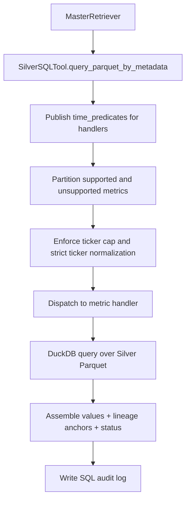
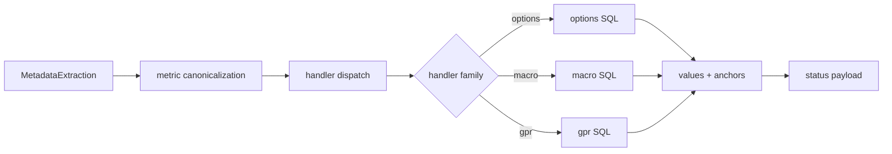

# Silver SQL Tools — Deterministic Numeric Retrieval and Citation Contract

## 1. Control Objective and Design Guarantees

`Scripts/retrieval/sql_tools.py` is the deterministic numeric retrieval engine for the Silver layer.

Its job is to convert `MetadataExtraction` into auditable DuckDB outputs without LLM-side numeric fabrication risk.

Primary guarantees:

- metric routing is whitelist-constrained and ontology-aware,
- ticker matching is strict and never fuzzy,
- time windows are anchored to ingestion reality rather than wall-clock assumptions,
- percentage fields preserve source-native units,
- every SQL path emits typed lineage anchors, a structured `citation_contract`, and audit logs,
- schema drift is surfaced early through contract validation at startup.

Environment variables governing this module:

| Variable | Default | Description |
|---|---|---|
| `SILVER_MAX_TICKERS` | `5` | Maximum tickers processed per query; excess tickers are dropped and logged as `TICKER_CAP` |
| `IV_RANK_LOOKBACK_DAYS` | `180` | ATM IV percentile ranking window in calendar days |

DuckDB session configuration: in-memory database (`:memory:`), `threads=4`, `memory_limit='2GB'`.

## 2. Execution Topology



## 3. Computation and Time Semantics

### 3.1 End-to-End Retrieval Workflow



### 3.2 Handler Computation Logic

| Handler | Core Logic | Key Outputs |
|---|---|---|
| `put_call_ratio` | aggregates put/call `volume` and `open_interest` by `snapshot_date`, then returns the latest row inside the active window | `pcr_volume`, `pcr_open_interest`, `pcr_status` |
| `options_analysis` | selects one ATM-like contract per day using `ABS(moneyness_pct)` then lower `spread_pct`, builds daily ATM IV series, computes `ROUND(100 * PERCENT_RANK() OVER (ORDER BY atm_iv), 2)` over the lookback window, returns the latest observation; also computes put/call IV skew and OTM wing IVs | `latest_atm_iv`, `latest_atm_iv_rank_pct`, `latest_iv_skew`, `latest_otm_put_iv`, `latest_otm_call_iv`, `iv_rank_lookback_days`, `data_freshness` |
| `liquidity_analysis` | latest-snapshot aggregate of `SUM(volume)`, `SUM(open_interest)`, `AVG(spread_pct)`, and liquid contract count | `<ticker>_daily_option_volume`, `<ticker>_open_interest`, `<ticker>_avg_spread_pct`, `<ticker>_liquid_contracts`, `<ticker>_market_impact_risk` |
| `pricing_spread` | latest liquid DTE-bounded quote snapshot around the active option surface | `<ticker>_underlying_price`, `<ticker>_avg_bid`, `<ticker>_avg_ask`, `<ticker>_avg_spread_pct`, `<ticker>_avg_last_price` |
| `macro_analysis` | latest macro-series row after optional ETF-to-index alias translation | `<ticker>_last_value`, `<ticker>_mom_change` or `<ticker>_daily_change` |
| `geopolitical_analysis` | latest monthly GPR row with percentile and MoM trend classification | `gpr_index_level`, `gpr_percentile`, `gpr_trend` |

### 3.3 Percentage and Percentile Contracts

These unit contracts are critical and should not be reinterpreted downstream:

| Field | Stored Unit | Retrieval Rule |
|---|---|---|
| `spread_pct` | percentage points, for example `2.5` means `2.5%` | never multiply by `100` again |
| `daily_change_pct` | percentage points | render as-is |
| `mom_change_pct` | percentage points | render as-is |
| `gpr_percentile` | percentage points, for example `97.58` means `97.58%` | render as a display percentage string only |
| `latest_atm_iv_rank_pct` | percentile score on a `0-100` scale | already multiplied by `100` inside SQL via `PERCENT_RANK()` |

Additional notes:

- `latest_atm_iv_rank_pct` is `NULL` when fewer than two daily ATM IV observations exist in the ranking window.
- `moneyness_pct` is used only for ATM contract selection priority; it is not returned as a final display field here.

### 3.4 Filter and Time-Window Logic

#### A) Metric and ticker filters

- Metric resolution order:
  - exact dispatcher key
  - normalized exact match
  - ontology-backed fuzzy match through `difflib`
- Unsupported metrics are surfaced through:
  - `status.unsupported_metrics`
  - `status.unsupported_metrics_message`
- Tickers remain strict:
  - `.upper().strip()` only
  - capped by `SILVER_MAX_TICKERS`
  - overflow is logged through `TICKER_CAP`

#### B) Dynamic anchor strategy

- Anchor source: `config/runtime/collect_data_state.json`
- Dataset-specific keys:
  - `options` -> `options_daily`
  - `macro` -> `macro_trading_daily`
  - `gpr` -> `gpr_monthly`
- Fallback: `date.today()` when runtime state is unavailable

#### C) Per-source predicate integration

When `MasterRetriever` supplies compiled `TimePredicate` objects:

- `silver.options` uses the predicate's `start_date`, `end_date`, and `window_days` directly,
- `silver.gpr` inherits monthly widening semantics from `time_adapter.py`,
- handlers do not re-derive time widening locally.

When predicates are absent:

- local fallback behavior uses `schema.TIME_WINDOW_DAYS`,
- `put_call_ratio` honors explicit short windows such as `today`, `yesterday`, and `past_week`,
- the historical 5-day floor is applied only when the user did not provide a valid time signal.

#### D) Handler-specific SQL filters

- `put_call_ratio`
  - `WHERE symbol = ?`
  - `snapshot_date BETWEEN start_date AND anchor`
  - grouped by date, latest row only
- `options_analysis`
  - `is_liquid = true`
  - `dte BETWEEN 7 AND 45`
  - IV-rank lookback bounded by `IV_RANK_LOOKBACK_DAYS`
- `liquidity_analysis`
  - latest available `snapshot_date`
  - no strict date `WHERE` clause
- `pricing_spread`
  - `is_liquid = true`
  - `dte BETWEEN 7 AND 45`
- `macro_analysis`
  - optional ETF-to-index aliasing, for example `SPY -> ^GSPC`
  - latest row per symbol
- `geopolitical_analysis`
  - latest monthly row from GPR parquet

#### E) Startup contract validation

On initialization, `_validate_parquet_contract()` verifies:

- parquet globs resolve to files,
- required columns exist,
- parquet metadata is readable.

Statuses surfaced in the audit log:

- `OK`
- `NO_FILES`
- `MISSING_COLUMNS`
- `READ_FAILED`

## 4. Output Data Schema and Audit Surface

### 4.1 Runtime output schema

| Field | Type | Description | Produced By | Path |
|---|---|---|---|---|
| `values` | `Dict[str, Any]` | final numeric and string outputs consumed by downstream agents | handler aggregation | `Scripts/retrieval/sql_tools.py` |
| `lineage_anchors` | `List[str]` | deterministic anchor IDs such as `PCR_AGG_*`, `IVRANK_*`, `LIQ_*`, `PX_*`, `MACRO_*`, `GPR_*` | handler return payloads | `Scripts/retrieval/sql_tools.py` |
| `citation_contract` | `Dict[str, Any]` | per-metric structured object with `preferred_anchor`, `audit_lineage_anchors`, `legacy_aliases`, `observed_at`, and `source_channel`; built by `_build_citation_contract()` | `_build_citation_contract()` | `Scripts/retrieval/sql_tools.py` |
| `citation_anchor_map` | `Dict[str, str]` | flat `{metric_key: preferred_anchor}` compatibility shim derived from `citation_contract` | `query_parquet_by_metadata()` | `Scripts/retrieval/sql_tools.py` |
| `status.unsupported_metrics` | `List[str]` | requested metrics that failed canonical mapping | `_partition_requested_metrics()` | `Scripts/retrieval/sql_tools.py` |
| `status.unsupported_metrics_message` | `str` | user-facing explanation with supported examples | `_build_unsupported_metric_message()` | `Scripts/retrieval/sql_tools.py` |
| `status.error` | `str \| None` | explicit fatal state such as `NO_SUPPORTED_METRICS` | `query_parquet_by_metadata()` | `Scripts/retrieval/sql_tools.py` |

### 4.1a Lineage anchor taxonomy

Each handler emits deterministic anchor IDs embedded in `lineage_anchors` and indexed in `citation_anchor_map`. The Checker uses these anchors to verify numeric claims against `silver_context_frozen`.

| Handler | Anchor pattern |
|---|---|
| Put/Call Ratio | `PCR_AGG_{TICKER}_{snapshot_date}` |
| Options IV / Skew | `IVRANK_{TICKER}_{date}`, `IVSKEW_{TICKER}_{date}`, `contract_symbol` (OTM wings) |
| Liquidity | `LIQ_{TICKER}_{snapshot_date}` |
| Pricing / Spread | `PX_{TICKER}_{snapshot_date}` |
| Macro | `MACRO_{TICKER}_{obs_date}` or `MACRO_{TICKER}_AS_{INDEX}_{obs_date}` (ETF alias path) |
| GPR | `GPR_{YYYYMM}` |

### 4.2 Audit output paths

| Artifact | Description | Path Pattern |
|---|---|---|
| SQL retrieval audit log | schema checks, SQL range mode, anchors, latency, execution errors | `logs/Parquet_Query/<YYYY-MM-DD>/sql_retrieval_audit.log` |

Important audit events written by this module:

- `SCHEMA_CHECK`
- `SQL_RANGE`
- `START_QUERY`
- `FUZZY_MATCH`
- `UNSUPPORTED_METRICS`
- `TICKER_CAP` — logged when the requested ticker count exceeds `SILVER_MAX_TICKERS`; the dropped tickers are recorded alongside the kept set
- `EXECUTION_ERROR`
- `FINISH_QUERY`

## 5. Validation and Test Procedure

Recommended validation flow:

```bash
python -c "from Scripts.retrieval.sql_tools import SilverSQLTool; t=SilverSQLTool(); print('sql_tool_ok', bool(t.metric_dispatcher))"
python Scripts/tests/test_router_e2e.py
python -m Scripts query "Past week SPY put/call ratio and IV skew with liquidity risk"
```

What to validate:

- unsupported metrics produce deterministic status rather than crashes,
- strict ticker handling never fuzzy-matches symbols,
- percentage-point fields are not multiplied twice,
- `put_call_ratio` and `options_analysis` follow the same explicit short-window semantics,
- `lineage_anchors` are present for successful handler outputs,
- SQL audit logs show the correct `SQL_RANGE` mode and effective window.

## 6. Dependency Files, Documentation Links, and One-Line Commands

### 6.1 Core dependency files

- `Scripts/retrieval/sql_tools.py`
- `Scripts/retrieval/master_retriever.py`
- `Scripts/retrieval/time_adapter.py`
- `Scripts/retrieval/schema.py`
- `Scripts/core/financial_ontology.py`

### 6.2 Linked retrieval docs

- [Retrieval Architecture and Strategy](./Retrieval_Architecture_and_Strategy.md)
- [Query Intent and Transformation](./Query_intent_docs.md)
- [Qdrant Retriever Docs](./Qdrant_retriever_docs.md)
- [Time Adapter](./Time_Adapter.md)
