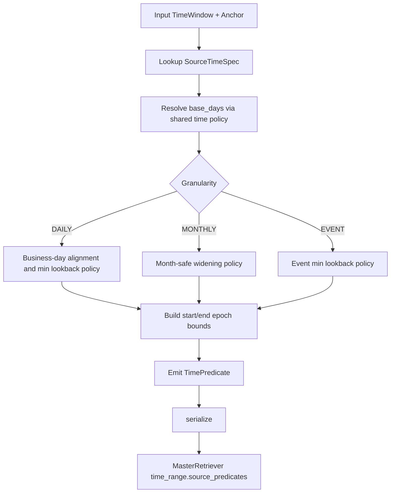

# Time Adapter - Source-Aligned Time Predicate Standard

## 1. Goal and Temporal Integrity Requirement

`Scripts/retrieval/time_adapter.py` compiles semantic windows (for example, `yesterday`, `past_week`) into source-specific physical predicates that can be executed consistently by both Gold (Qdrant) and Silver (DuckDB).

This prevents temporal mismatches caused by mixed data cadences (event-level, daily, monthly).

## 2. Architecture

```text
[Semantic TimeWindow + Anchor Date]
      -> compile_predicate(source_key)
           -> SourceTimeSpec lookup (granularity, keys, units, min lookback)
           -> widening / business-day policy
           -> TimePredicate(start/end date + epoch + reason)
      -> compile_all()
           -> one predicate per registered source
      -> serialized payload consumed by MasterRetriever / Gold / Silver
```

## 3. Code Strategy and Workflow



Policy strategy:

- Daily sources support business-day semantics for `today` and `yesterday`.
- Monthly sources widen short windows to preserve latest monthly observation viability.
- Event sources enforce minimum lookback to avoid empty windows around weekends.
- Predicates are compiled once and reused, preventing cross-retry drift.

## 4. Output Data Schema and Paths

### 4.1 Source specification schema

| Schema | Type | Description | Path |
|---|---|---|---|
| `SourceTimeKey` | Enum | Stable key namespace (`gold.news`, `silver.options`, etc.) | `Scripts/retrieval/time_adapter.py` |
| `SourceTimeSpec` | Dataclass | Physical contract (granularity, keys, units, lookback floor) | `Scripts/retrieval/time_adapter.py` |
| `SOURCE_SPECS` | Dict | Authoritative registry for all retrieval sources | `Scripts/retrieval/time_adapter.py` |

### 4.2 Compiled predicate schema

| Field | Type | Description | Path |
|---|---|---|---|
| `source` | `SourceTimeKey` | Logical source binding | `Scripts/retrieval/time_adapter.py` |
| `label` | `str` | Human-readable window label | `Scripts/retrieval/time_adapter.py` |
| `granularity` | `TimeGranularity` | Event/Daily/Monthly physical cadence | `Scripts/retrieval/time_adapter.py` |
| `start_date`, `end_date` | `date` | Date bounds for SQL-style consumers | `Scripts/retrieval/time_adapter.py` |
| `start_epoch_s`, `end_epoch_s` | `int` | Epoch bounds for Qdrant numeric range filters | `Scripts/retrieval/time_adapter.py` |
| `window_days` | `int` | Effective compiled lookback days | `Scripts/retrieval/time_adapter.py` |
| `widened` | `bool` | Whether widening was applied | `Scripts/retrieval/time_adapter.py` |
| `widen_reason` | `str \| None` | Deterministic widening reason string | `Scripts/retrieval/time_adapter.py` |
| `time_keys`, `key_units` | `Tuple[str, ...]` | Physical keys and units for consumers | `Scripts/retrieval/time_adapter.py` |

### 4.3 Serialization path in pipeline

| Artifact | Description | Path |
|---|---|---|
| `time_range.source_predicates` | Serialized predicate map persisted in retrieval payload | `Scripts/retrieval/master_retriever.py` |

## 5. How to Test

```bash
python -c "from datetime import date; from Scripts.retrieval.time_adapter import compile_all; from Scripts.retrieval.schema import TimeWindow; print({k.value:v.to_dict() for k,v in compile_all(TimeWindow.PAST_WEEK, date.today()).items()})"
python Scripts/tests/test_router_e2e.py
```

Validation focus:

- predicates differ appropriately across `gold.gpr` (monthly) and `silver.options` (daily),
- `yesterday` semantics are business-day safe,
- serialized predicates can be round-tripped via `predicates_from_serialised()`.

## 6. Dependency Files, Linked Docs, and One-Line Commands

### 6.1 Core dependency files

- `Scripts/retrieval/time_adapter.py`
- `Scripts/retrieval/schema.py`
- `Scripts/retrieval/master_retriever.py`
- `Scripts/retrieval/qdrant_retriever.py`
- `Scripts/retrieval/sql_tools.py`

### 6.2 Linked documentation

- [Retrieval Architecture and Strategy](./Retrieval_Architecture_and_Strategy.md)
- [Query Intent and Transformation](./Query_intent_docs.md)
- [Qdrant Retriever Docs](./Qdrant_retriever_docs.md)
- [Silver SQL Tools](./Silver_SQL_Tools.md)

### 6.3 One-line setup command

```bash
pip install -r requirements.txt
```

