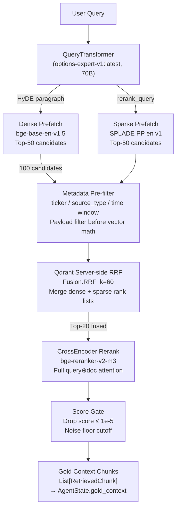

# Embedding, Chunking, and Retrieval Fusion Strategy

_Scope: `Scripts/vector_store/`, `Scripts/retrieval/qdrant_retriever.py`, `Scripts/vector_store/ingestion.py`_

_This document is the authoritative rationale for every model, chunking decision, and fusion parameter in the retrieval pipeline. For the operational model registry (WHAT is deployed WHERE), see `docs/ARCHITECTURE.md §5`. For GPU warmup and Ollama keep-alive, see `docs/LLM_Pool.md`._

---

## I. Strategic Objective

The retrieval layer must resolve two fundamentally different information types in a single query:

| Information Type | Example | Signal | Failure Mode if Missed |
|---|---|---|---|
| **Lexical-exact** | `NVDA Form 4`, `action_direction=SELL`, `CPIAUCSL` | Ticker symbols, SEC codes, acronyms | Wrong ticker retrieved; hallucinated data |
| **Semantic-abstract** | "flight to safety", "IV crush regime", "geopolitical risk premium" | Conceptual proximity | Relevant macro context not retrieved |

A single retrieval channel — dense or sparse alone — cannot serve both. The strategy documented here combines three complementary models (dense encoder, sparse encoder, cross-encoder reranker) with Reciprocal Rank Fusion (RRF), preceded by source-specific chunking that maximises per-vector information density.

---

## II. Architecture

```
┌─────────────────────────────────────────────────────────────────────────────────┐
│                        RETRIEVAL STACK — LAYER OVERVIEW                         │
├─────────────────────┬───────────────────────────────────────────────────────────┤
│  Layer              │  Components                                                │
├─────────────────────┼───────────────────────────────────────────────────────────┤
│ Chunking            │  Per-source strategy: Zero-chunk (SEC), LLM-distilled     │
│                     │  summary unit (News/GPR), No-chunk (Options/Macro Silver) │
├─────────────────────┼───────────────────────────────────────────────────────────┤
│ Encoding            │  Dense: BAAI/bge-base-en-v1.5 (768-dim, cosine, CPU)     │
│                     │  Sparse: prithivida/Splade_PP_en_v1 (SPLADE, ONNX, CPU)  │
├─────────────────────┼───────────────────────────────────────────────────────────┤
│ Asymmetric Input    │  Dense ← HyDE long paragraph (abstract intent)            │
│                     │  Sparse ← rerank_query short factual phrase (lexical)     │
├─────────────────────┼───────────────────────────────────────────────────────────┤
│ Fusion              │  Qdrant server-side Reciprocal Rank Fusion (RRF, k=60)   │
├─────────────────────┼───────────────────────────────────────────────────────────┤
│ Reranking           │  BAAI/bge-reranker-v2-m3 CrossEncoder (top-K, CPU)       │
├─────────────────────┼───────────────────────────────────────────────────────────┤
│ Pre-filter          │  Qdrant payload filter: ticker, source_type,              │
│                     │  action_direction, time window OR (unified_timestamp /    │
│                     │  publish_timestamp)                                        │
├─────────────────────┼───────────────────────────────────────────────────────────┤
│ Score gate          │  Drop candidates with score ≤ 1e-5 (noise floor)         │
└─────────────────────┴───────────────────────────────────────────────────────────┘
```

```
Gold-layer JSONL / MD artefacts
        │
        ├─── SEC (Form 4, 8-K)
        │         │ Zero-chunking: 1 filing entry → 1 vector
        │         └── atomic self-contained sentence per record
        │
        ├─── News / GPR narratives
        │         │ LLM-distilled summary unit: ~150–300 tokens
        │         └── one coherent narrative block per Qdrant point
        │
        └─── Options / Macro (Silver Parquet)
                  │ NOT indexed in Qdrant — queried via DuckDB / SilverSQLTool
                  └── No chunking applies; time-windowed Parquet scan
                              │
                              ▼
              ┌───────────────────────────────┐
              │   QdrantHybridIngestor        │
              │   • Dense embed (bge-base)    │
              │   • Sparse embed (SPLADE)     │
              │   • Deterministic UUID        │
              │   • Batch upsert (size=100)   │
              └───────────────┬───────────────┘
                              │
                              ▼
                   ┌──────────────────┐
                   │   Qdrant Cloud   │
                   │  financial_rag_  │
                   │      gold        │
                   │ named vectors:   │
                   │  dense + sparse  │
                   └─────────┬────────┘
                             │
              ┌──────────────▼──────────────────────┐
              │    FinancialHybridRetriever          │
              │                                      │
              │  Input A (dense): HyDE paragraph     │
              │  Input B (sparse): rerank_query       │
              │                                      │
              │  1. Prefetch dense (top-50)           │
              │  2. Prefetch sparse (top-50)          │
              │  3. Payload filter (metadata gate)    │
              │  4. Qdrant RRF fusion (k=60)          │
              │  5. CrossEncoder rerank (bge-m3)      │
              │  6. Drop score ≤ 1e-5                 │
              └──────────────┬──────────────────────┘
                             │
                             ▼
              MasterRetrievalResult → LangGraph AgentState
```

---

## III. Chunking Strategy — Per Data Source

Chunking is the most consequential upstream decision in any RAG system. The wrong strategy destroys vector quality before a single embedding is computed. Each data source in this system has a fundamentally different information structure, and is therefore treated with a distinct chunking policy.

### A. SEC Filings (Form 4 / Form 8-K) — Zero-Chunking

**Policy: one filing record → one Qdrant point**

```
Bronze JSONL (structured XML extract)
    ↓
sec_processor.py (semantic rewrite + tone scoring)
    ↓
Gold JSONL (one natural-language sentence per transaction):
"ROCHE VINCENT (Chair & CEO) of ADI acquired (via RSU vesting)
 19,712 shares worth $0.00."  [metadata: ticker=ADI, action_direction=ACQUIRE/VEST, ...]
    ↓
One vector point — no further splitting
```

**Justification:**

| Design question | Answer |
|---|---|
| Why no chunking? | Each SEC record is already a **pre-summarised atomic fact** — self-contained, with no inter-sentence dependencies. Splitting a one-sentence record would destroy, not preserve, its meaning. |
| Why not parent-child? | The "parent" would be the raw XML/JSON source — machine code, not natural language. Injecting it into the LLM context degrades attention quality and wastes tokens. Traceability is handled via `accession_no` and `url` in metadata, not via parent expansion. |
| Why not token-based chunking (e.g. 512 tokens)? | Token-based chunking solves the problem of long noisy documents. SEC records after `sec_processor.py` are already 100% information-dense, 20–50 tokens each. Cutting them further produces fragments that destroy the signal. |

**Vector SNR benefit:** An atomic-fact chunk produces a very tight embedding vector. Cosine similarity queries resolve to the correct entity almost exclusively — the retrieval signal-to-noise ratio is maximised.

---

### B. News Articles and GPR Narratives — LLM-Distilled Summary Units

**Policy: one scraper-summarised narrative block → one Qdrant point**

```
Raw article HTML (Bronze)
    ↓
news_scraper.py / GPR_index.py (LLM-summarise + sentiment score)
    ↓
Gold JSONL (one coherent narrative per article or monthly GPR block):
"Escalating Middle East tensions drove gold prices 2.4% higher this week
 as investors rotated into safe-haven assets, with ETF inflows hitting
 a 6-month high."  [metadata: topics=[macro_geopolitics_risk], tone_score=+0.7, ...]
    ↓
One vector point — no further splitting
```

**Justification:**

| Design question | Answer |
|---|---|
| Why not chunk news articles by sentence? | Individual sentences stripped of narrative context score weakly on semantic queries. A chunk like "Gold rose." loses the causal chain. The scraper-produced summary already is the ideal chunk: dense, causal, self-contained. |
| Why not chunk by 512 tokens? | The summaries are already within 150–300 tokens. Additional chunking would create sub-summary fragments with overlapping but incomplete signals, flooding the retrieval pool with near-duplicate low-precision chunks. |
| Why LLM distillation at ingestion time? | Front-loading the LLM work in `news_scraper.py` means retrieval hits pre-curated vectors instead of raw noisy article text. This is the "pre-RAG" approach used by high-quality financial data providers. |

---

### C. Options Chains and Macro Data — Not Chunked (Silver SQL Path)

**Policy: structured numeric data is NEVER ingested into Qdrant**

Parquet files in `Data/2_Silver_Processed/Options_Market_Data/` and `Data/2_Silver_Processed/Macro_History/` are queried exclusively via `SilverSQLTool` (DuckDB). They are not embedded, not chunked, and not stored in Qdrant.

**Justification:**

| Design question | Answer |
|---|---|
| Why not embed numeric time-series? | Embedding `{ATM_IV: 0.34, PCR: 1.2, ...}` produces a vector that encodes the *serialisation* of the number, not its financial meaning. Semantic similarity on numeric data is unreliable — "VIX=19" and "VIX=35" would score similarly. |
| Why DuckDB instead? | Structured queries on Parquet give **exact, reproducible answers** to numeric questions. DuckDB resolves `SELECT avg(atm_iv) WHERE snapshot_date >= '2026-03-24'` in ~70ms with deterministic results — no vector approximation. |
| What is the Silver anchor mechanism? | `SilverSQLTool` writes its results into `silver_context["values"]` with explicit `MACRO_*` and `LIQ_*` lineage anchors. The Analyst cites these anchors; the Checker validates against the same in-memory dict — no vector recall needed. |

---

## IV. Embedding Model Selection

### A. Dense Encoder — `BAAI/bge-base-en-v1.5`

| Attribute | Value |
|---|---|
| **Vector dimension** | 768 |
| **Distance metric** | Cosine (L2-normalised) |
| **Inference device** | CPU (env: `EMBEDDING_DEVICE=cpu`) |
| **HuggingFace ID** | `BAAI/bge-base-en-v1.5` |
| **Env var** | `EMBEDDING_MODEL_NAME` |
| **Singleton** | `@lru_cache` in `connection.py` |

**Selection rationale:**

| Criterion | Assessment |
|---|---|
| **Financial domain performance** | BGE ("Beijing Academy of AI General Embedding") achieves strong MTEB benchmark scores on information retrieval tasks. The `base` variant performs within 2–3% of `bge-large` on financial text while using 40% less memory. |
| **CPU feasibility** | 768-dim BERT-architecture encoder runs at ~50–200ms per query on CPU — well within the retrieval budget. No GPU required, which aligns with the design constraint that GPU resources are reserved exclusively for the 70B Ollama LLM. |
| **Normalisation** | `encode_kwargs={"normalize_embeddings": True}` produces unit vectors, enabling cosine similarity that is numerically equivalent to Qdrant's `Distance.COSINE` index — no post-hoc score rescaling needed. |
| **LangChain integration** | Native `langchain-huggingface` adapter; drop-in compatible with Qdrant's `VectorStore.from_documents()` API. |
| **Alternatives rejected** | `text-embedding-ada-002` (API cost, data privacy constraints), `bge-large-en-v1.5` (1024-dim, ~50% higher memory, marginal quality gain on short financial sentences), `e5-mistral-7b` (GPU-only, too large for CPU embedding path). |

---

### B. Sparse Encoder — `prithivida/Splade_PP_en_v1`

| Attribute | Value |
|---|---|
| **Architecture** | SPLADE (Sparse Lexical and Expansion) |
| **Runtime** | ONNX via `fastembed` |
| **Inference device** | CPU only (`FASTEMBED_THREADS` controls parallelism) |
| **Env var** | `SPARSE_MODEL_NAME` |
| **Qdrant vector name** | `sparse` (Dot product distance) |

**Selection rationale:**

| Criterion | Assessment |
|---|---|
| **Lexical expansion** | SPLADE learns to expand query and document terms into related vocabulary. "IV" expands toward "implied volatility", "VIX", "volatility index". "NVDA" expands toward "NVIDIA", "Form 4", "insider". This makes exact-match recall robust to abbreviation mismatches. |
| **Financial precision** | Ticker symbols, SEC form codes (`Form-4`, `10-K`), and macro acronyms (`CPI`, `FEDFUNDS`, `DXY`) are high-value exact tokens. SPLADE preserves these at high term-weight while BM25 would dilute them with IDF across a corpus that uses them frequently. |
| **ONNX deployment** | `fastembed` loads the SPLADE ONNX graph — no Python ML framework at inference time. Startup is fast; no GPU required; thread count is tunable via `FASTEMBED_THREADS`. |
| **Qdrant-native** | fastembed is maintained by Qdrant; the sparse vector format directly populates `NamedSparseVector` without marshaling overhead. |
| **Alternatives rejected** | BM25 (no expansion — abbreviation mismatches are fatal in financial queries), `naver/splade-v3` (larger, slower, no ONNX release at current evaluation date). |

---

### C. Cross-Encoder Reranker — `BAAI/bge-reranker-v2-m3`

| Attribute | Value |
|---|---|
| **Architecture** | Cross-encoder (full self-attention over query ⊕ document) |
| **Library** | `sentence-transformers` `CrossEncoder` |
| **Inference device** | CPU (env: `RETRIEVER_DEVICE=cpu`) |
| **Env var** | `RERANKER_MODEL_NAME` |
| **Applied to** | Top-K RRF-fused candidates before score gate |

**Selection rationale:**

| Criterion | Assessment |
|---|---|
| **Joint encoding** | The cross-encoder sees the query and the candidate chunk jointly in a single forward pass. This allows full attention across the pair — catching semantic nuances that bi-encoders approximate with a dot product. Example: "insider selling activity" vs "RSU vesting (no open-market sale)" are textually similar but directionally opposite; the cross-encoder resolves this correctly. |
| **Reranking position** | Applied after RRF narrows candidates to top-20. CPU reranking 20 pairs in ~100–200ms is acceptable. Reranking the full prefetch pool (100 candidates) would be prohibitive. |
| **m3 variant** | The `-m3` (Multilingual-3) variant handles English-primary with minor multilingual capability. Financial data often contains mixed content (foreign-language SEC registrants, international macro data); the `m3` architecture is more robust than an English-only model on these edge cases. |
| **Alternatives rejected** | `cross-encoder/ms-marco-MiniLM-L-6-v2` (trained on web Q&A; lower precision on financial domain), `Cohere Rerank` (API cost, data egress), `bge-reranker-large` (2× slower, no quality gain over `v2-m3` on financial retrieval). |

---

## V. Retrieval Fusion — Reciprocal Rank Fusion (RRF)

### A. Why RRF over Score Averaging

Dense and sparse models produce scores on incompatible numerical scales:
- Dense cosine similarity: typically in `[0.5, 1.0]` for positive results
- SPLADE sparse dot product: typically in `[0.001, 5.0]`, scale depends on term frequency

Simple score averaging would allow one channel to dominate based on scale artifacts, not quality. RRF converts both to rank lists and fuses on rank position:

```
RRF_score(doc) = Σᵢ  1 / (k + rankᵢ(doc))
```

Where `k = 60` (Qdrant default). This is rank-based, monotonic, and immune to outlier scores. A document ranked #1 by dense but #50 by sparse still outscores a document ranked #10 by both — the fusion correctly rewards dominant-channel wins.

### B. Asymmetric Input Design

| Channel | Input text | Purpose |
|---|---|---|
| **Dense** | `HyDE paragraph` (~200 tokens, LLM-generated) | Captures abstract intent: "flight to safety", "IV regime", conceptual framing |
| **Sparse** | `rerank_query` (~8–15 tokens, factual phrase) | Enforces exact lexical match: "NVDA Form 4 insider selling past month" |

This asymmetry is deliberate. Feeding the HyDE paragraph to the sparse channel would dilute SPLADE's term weights with narrative filler. Feeding the short factual query to the dense channel would under-activate semantic proximity. The two channels are calibrated to their respective strengths.

### C. RRF Workflow



### D. Deterministic Pre-Filtering

Payload filtering is applied **before** vector math (pushed down to the Qdrant index scan), which ensures vector distance computation is only performed on semantically eligible candidates:

| Filter dimension | Applied for | Implementation |
|---|---|---|
| `ticker` | All queries with extracted tickers | `FieldCondition(key="ticker", match=MatchAny(...))` |
| `source_type` | Metadata-extracted `source_types` | Strips Silver-only types (`options`, `macro`) before Gold search |
| `action_direction` | SEC insider queries | `SELL`, `BUY`, `ACQUIRE/VEST` |
| `form_type` | SEC form queries | `Form-4`, `10-K`, `8-K` |
| `tone_score` | Sentiment-filtered news | `>0` (bullish), `<0` (bearish) |
| `unified_timestamp` OR `publish_timestamp` | All time-windowed queries | OR condition: dual time-key for backwards compatibility with legacy filings |

The OR over `unified_timestamp` and `publish_timestamp` is critical: early SEC filings only carry `publish_timestamp`; newer ones carry `unified_timestamp`. A single-key filter would silently miss one subset.

---

## VI. Hardware Placement — CPU vs GPU

The system is designed with a **strict hardware tier separation**: GPU is reserved exclusively for LLM inference; all retrieval-side models run on CPU.

```
┌────────────────────────────────────────────────────────────────┐
│                     GPU (Ollama VRAM)                          │
│                                                                │
│  options-expert-v1:latest   (Llama-3.3-70B Q4_K_M)           │
│    ├─ Analyst / Checker / Critic / Finalizer                   │
│    └─ QueryTransformer (Extractor + HyDE)                      │
│                                                                │
│  llama3:latest              (Llama-3 8B vanilla)              │
│    ├─ MasterRetriever.router_llm                               │
│    └─ news_scraper sentiment / sec_processor form parser       │
│                                                                │
│  Note: 70B + 8B cannot coexist in one GPU slot →              │
│  llm_pool pins 70B at KEEP_ALIVE=30m; 8B uses idle slots.    │
└────────────────────────────────────────────────────────────────┘

┌────────────────────────────────────────────────────────────────┐
│                      CPU (Host RAM)                            │
│                                                                │
│  BAAI/bge-base-en-v1.5   (Dense encoder, 768-dim)            │
│    • Latency: ~50–200ms / query (CPU)                          │
│    • Env: EMBEDDING_DEVICE=cpu                                 │
│    • Singleton: @lru_cache in connection.py                    │
│                                                                │
│  prithivida/Splade_PP_en_v1   (SPLADE sparse, ONNX)          │
│    • ONNX runtime: no Python ML framework at inference         │
│    • Env: FASTEMBED_THREADS=6                                  │
│                                                                │
│  BAAI/bge-reranker-v2-m3   (CrossEncoder, top-K only)        │
│    • Applied to ≤ 20 candidates → ~100–200ms CPU              │
│    • Env: RETRIEVER_DEVICE=cpu                                 │
│                                                                │
│  DuckDB in-process   (Silver Parquet queries)                  │
│    • Embedded, zero-latency startup                            │
│    • ~50–100ms per Parquet scan                                │
└────────────────────────────────────────────────────────────────┘
```

**Design rationale for CPU retrieval models:**

| Constraint | Implication |
|---|---|
| **Single GPU budget** | The 70B fine-tuned LLM saturates available VRAM (Q4_K_M quantised ≈ 40GB+). Placing any retrieval model on the same GPU would force model-swapping, incurring 30–60s cold starts per query. |
| **Retrieval latency budget** | Dense + sparse encoding + reranking ≤ 500ms on CPU is acceptable within the overall pipeline budget (dominated by the ~200s LLM inference). CPU retrieval is not the bottleneck. |
| **ONNX for sparse** | `fastembed` ONNX runtime eliminates Python ML framework overhead at sparse inference — CPU latency for SPLADE is ~30ms per query. |
| **Upgrade path** | `EMBEDDING_DEVICE` and `RETRIEVER_DEVICE` are env-var controlled. Setting either to `cuda` enables GPU acceleration without code changes — useful on multi-GPU machines where a retrieval-only GPU is available. |

---

## VII. Where Does Model and Hardware Information Live?

This is a common documentation friction point. The answer is a three-document triangle:

```
┌───────────────────────────────────────────────────────────────────┐
│                    Documentation Navigation                        │
│                                                                   │
│  Q: "WHY was this model chosen? What are the trade-offs?"        │
│  A: docs/Strategy_choices_docs/                                   │
│     └── Embedding_Chunking_and_Retrieval_Fusion_Strategy.md ← THIS│
│         SEC_ingestion_retrived_strategy.md                        │
│                                                                   │
│  Q: "WHAT model is deployed WHERE? What are the env vars?"       │
│  A: docs/ARCHITECTURE.md §5 (Model Registry — single source of   │
│     truth for tag names, env vars, and consumers)                 │
│                                                                   │
│  Q: "HOW do I keep the 70B LLM warm? How do I manage GPU?"      │
│  A: docs/LLM_Pool.md (warmup runbook, VRAM tiering, keep-alive)  │
│                                                                   │
│  Q: "HOW does the retrieval pipeline call these models?"         │
│  A: docs/Query_retrieval_docs/                                    │
│     └── Retrieval_Architecture_and_Strategy.md (execution path)  │
│                                                                   │
│  Q: "HOW are embeddings computed at ingestion time?"             │
│  A: docs/Vector_store_docs/                                       │
│     └── Vector_Ingestion.md (batch upsert + HWM state)           │
│     └── Qdrant_connection.md (embedding factory, provider switch) │
└───────────────────────────────────────────────────────────────────┘
```

**Decision rule:** New model-related information should land in:
- `Strategy_choices_docs/` if it answers "why was this design chosen?"
- `ARCHITECTURE.md §5` if it is a new entry in the canonical model registry
- `LLM_Pool.md` if it affects Ollama GPU memory management
- `Query_retrieval_docs/` if it changes the runtime retrieval execution path

---

## VIII. Configuration Matrix (`.env`)

| Variable | Default | Purpose | Tier |
|---|---|---|---|
| `EMBEDDING_MODEL_NAME` | `BAAI/bge-base-en-v1.5` | Dense encoder HuggingFace ID | Retrieval (CPU) |
| `EMBEDDING_DEVICE` | `cpu` | Dense encoder device (`cpu`, `cuda`, `mps`) | Retrieval (CPU) |
| `SPARSE_MODEL_NAME` | `prithivida/Splade_PP_en_v1` | SPLADE model via fastembed | Retrieval (CPU) |
| `FASTEMBED_THREADS` | `6` | ONNX SPLADE thread count | Retrieval (CPU) |
| `RERANKER_MODEL_NAME` | `BAAI/bge-reranker-v2-m3` | CrossEncoder reranker | Retrieval (CPU) |
| `RETRIEVER_DEVICE` | `cpu` | CrossEncoder device | Retrieval (CPU) |
| `QDRANT_HOST` | required | Qdrant Cloud REST endpoint | Infrastructure |
| `QDRANT_API_KEY` | required | Qdrant authentication | Infrastructure |
| `OLLAMA_CUSTOM_MODEL_NAME` | `options-expert-v1:latest` | 70B fine-tuned (agents + QueryTransformer) | LLM (GPU) |
| `OLLAMA_ROUTER_MODEL` | `llama3:latest` | 8B router + ingestion helpers | LLM (GPU) |
| `OLLAMA_KEEP_ALIVE` | `30m` | VRAM pin duration for 70B | LLM (GPU) |

---

## IX. How to Test

### Retrieval sanity check

```python
from Scripts.retrieval.qdrant_retriever import FinancialHybridRetriever
from Scripts.retrieval.schema import QueryIntent

retriever = FinancialHybridRetriever()
chunks = retriever.retrieve(
    query_intent=QueryIntent(
        hyde_paragraph="NVDA insider selling executive Form 4 past month momentum",
        rerank_query="NVDA Form-4 insider selling",
        tickers=["NVDA"],
        source_types=["sec"],
    )
)
print(f"Retrieved {len(chunks)} chunks")
for c in chunks[:3]:
    print(f"  score={c.score:.4f} | ticker={c.metadata.get('ticker')} | {c.content[:80]}")
```

Expected: ≥1 SEC chunk with `ticker=NVDA`, score > 1e-5.

### Dense encoder smoke test

```python
from Scripts.vector_store.connection import get_embedding_model

model = get_embedding_model()
vec = model.embed_query("gold ETF implied volatility geopolitical risk")
assert len(vec) == 768, f"Expected 768-dim, got {len(vec)}"
print(f"Dense vector dim: {len(vec)} ✅")
```

### Sparse encoder smoke test

```python
from fastembed import SparseTextEmbedding

sparse = SparseTextEmbedding("prithivida/Splade_PP_en_v1")
result = list(sparse.query_embed("NVDA Form 4 insider selling"))[0]
top_terms = sorted(zip(result.indices, result.values), key=lambda x: -x[1])[:5]
print("Top SPLADE terms:", top_terms)
```

Expected: indices mapping to tokens related to "nvda", "form", "insider", "selling".

### RRF + rerank end-to-end (integration)

```bash
python -m Scripts query --warmup "Given recent NVDA Form-4 executive selling, how should I position with options?"
# Check logs/retrieval/<today>/retriever_audit_trail.jsonl for:
# - gold_chunks_returned ≥ 3
# - all chunks with score > 1e-5
# - at least one chunk with source_type=sec
```

---

## X. Dependencies

| Library | Purpose | Tier |
|---|---|---|
| `langchain-huggingface` | Dense HuggingFace embedding wrapper | Retrieval |
| `sentence-transformers` | CrossEncoder reranker | Retrieval |
| `fastembed` | SPLADE ONNX sparse encoder | Retrieval |
| `qdrant-client` | Qdrant Cloud REST client + RRF fusion | Retrieval |
| `langchain-ollama` | Ollama LLM client (agents + QueryTransformer) | LLM |
| `langchain-core` | `Embeddings` base class | Retrieval |
| `python-dotenv` | `.env` variable loading | Config |
| `duckdb` | In-process Parquet SQL for Silver layer | Silver SQL |
| `pyarrow` | Parquet read/write | Silver SQL |

```bash
pip install langchain-huggingface sentence-transformers fastembed qdrant-client \
    langchain-ollama langchain-core python-dotenv duckdb pyarrow
```

---

## XI. Change Log

| Date | Change | Rationale |
|---|---|---|
| 2026-04-23 | Document created | Consolidates all model-selection rationale, chunking strategy, and hardware placement into a single Strategy reference. Prior knowledge was implicit in code and scattered across Retrieval_Architecture_and_Strategy.md. |
