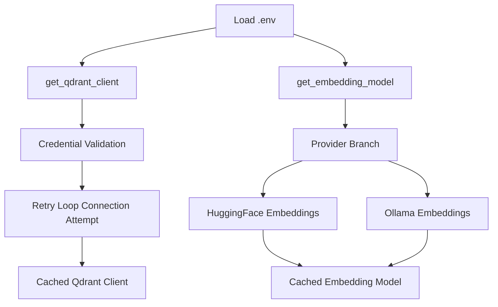

# Qdrant Connection and Embedding Factory - Institutional Runtime Spec

## 1. Goal and Runtime Reliability Objective

`Scripts/vector_store/connection.py` is the shared runtime bootstrap layer for:

- Qdrant client connectivity,
- embedding model provisioning,
- process-level singleton caching.

It ensures ingestion and retrieval components use one consistent, resilient infrastructure entrypoint.

## 2. Architecture (Markdown Block)

```text
[Environment Variables]
   -> get_qdrant_client()
      -> validated credentials
      -> retryable cloud connection
      -> cached QdrantClient singleton

[Environment Variables]
   -> get_embedding_model()
      -> provider selection (huggingface or ollama)
      -> device-aware model bootstrap
      -> cached Embeddings singleton
```

## 3. Code Strategy and Workflow



Core strategy details:

- Both factories use `@lru_cache(maxsize=1)` to avoid repeated heavyweight initialization.
- Qdrant connection uses bounded retries (`max_retries=3`, `delay=2s`) and validates connectivity via `get_collections()`.
- Embedding factory supports provider routing via `EMBEDDING_PROVIDER` with device controls (`EMBEDDING_DEVICE`).
- Logging is day-partitioned (`logs/<YYYY-MM-DD>/connection.log`) for ops traceability.

## 4. Output Data Schema and Paths

| Output | Type | Description | Producer | Path |
|---|---|---|---|---|
| Qdrant client object | `QdrantClient` | Cached vector DB client used by ingestion/retrieval | `get_qdrant_client()` | `Scripts/vector_store/connection.py` |
| Embedding model object | `Embeddings` | Cached embedding engine for dense vectors | `get_embedding_model()` | `Scripts/vector_store/connection.py` |
| Connection telemetry log | log lines | Connect attempts, errors, and health checks | `setup_logger()` | `logs/<YYYY-MM-DD>/connection.log` |

Configuration keys:

| Key | Purpose | Used In |
|---|---|---|
| `QDRANT_HOST` | Qdrant cloud endpoint | `get_qdrant_client()` |
| `QDRANT_API_KEY` | Qdrant authentication key | `get_qdrant_client()` |
| `EMBEDDING_PROVIDER` | Provider selection (`huggingface`/`ollama`) | `get_embedding_model()` |
| `EMBEDDING_MODEL_NAME` | Dense embedding model ID | `get_embedding_model()` |
| `EMBEDDING_DEVICE` | Device placement (`cpu`/`cuda`) | `get_embedding_model()` |
| `OLLAMA_HOST` | Ollama base URL (embedding provider path) | `get_embedding_model()` |

## 5. How to Test

```bash
python -c "from Scripts.vector_store.connection import get_qdrant_client; print(get_qdrant_client().get_collections())"
python -c "from Scripts.vector_store.connection import get_embedding_model; print(len(get_embedding_model().embed_query('health check'))) "
python Scripts/vector_store/connection.py
```

Validation focus:

- cloud connection succeeds with current credentials,
- embedding model loads and returns vector output,
- cached calls reuse initialized instances without repeated cold starts.

## 6. Dependency Files, Linked Docs, and One-Line Commands

### 6.1 Core dependency files

- `Scripts/vector_store/connection.py`
- `Scripts/vector_store/ingestion.py`
- `Scripts/retrieval/qdrant_retriever.py`

### 6.2 Linked documentation

- [Vector Ingestion](./Vector_Ingestion.md)
- [Qdrant Retriever Docs](../Query_retrieval_docs/Qdrant_retriever_docs.md)
- [Retrieval Architecture and Strategy](../Query_retrieval_docs/Retrieval_Architecture_and_Strategy.md)
- [LLM Pool](../LLM_Pool.md)

### 6.3 One-line setup command

```bash
pip install -r requirements.txt
```

