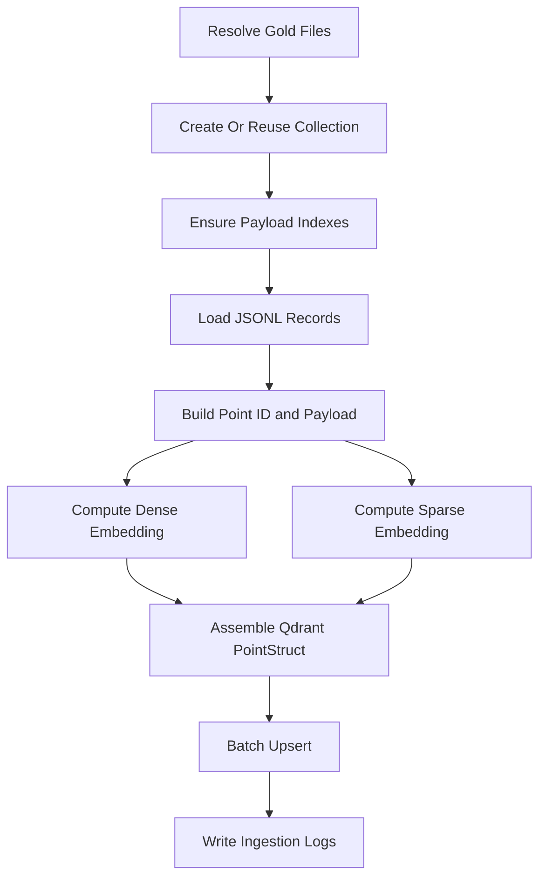

# Vector Ingestion - Institutional Gold Index Specification

## 1. Goal and Ingestion Control Objective

`Scripts/vector_store/ingestion.py` converts Gold-layer semantic JSONL artifacts into indexed Qdrant points for hybrid retrieval.

Control objectives:

- idempotent and replay-safe upsert behavior,
- dual-vector completeness (dense + sparse),
- payload index readiness for all retrieval filters,
- stable lineage fields for downstream citation and audit.

## 2. Architecture (Markdown Block)

```text
[Gold Semantic JSONL Artifacts]
   -> QdrantHybridIngestor
      -> collection bootstrap and index reconciliation
      -> record parsing and payload normalization
      -> deterministic id assignment (UUIDv5 for SEC accession_no)
      -> dense embedding generation
      -> sparse embedding generation
      -> batch upsert into financial_rag_gold
      -> ingestion telemetry and logs
```

## 3. Code Strategy and Workflow



Key strategy notes:

- `init_collection_with_indexes()` always reconciles index schema (not only at initial collection creation).
- `_REQUIRED_INDEXES` includes both `unified_timestamp` and `publish_timestamp` to satisfy Gold time range filtering.
- SEC records use deterministic `uuid5(accession_no)` IDs; non-SEC records fall back to native ID or generated UUID.
- Batch upsert (`batch_size=100`) balances throughput and failure isolation.
- `run_pipeline(full_refresh=False)` supports watermark-driven incremental ingestion via `collect_data_state.json`.

## 4. Output Data Schema and Paths

### 4.1 Qdrant point schema

| Field | Type | Description | Produced In | Path |
|---|---|---|---|---|
| `id` | `str` | Point identifier (`uuid5` for SEC or generated/native) | `process_and_upsert_file()` | `Scripts/vector_store/ingestion.py` |
| `vector.dense` | `List[float]` | Dense semantic embedding | `get_embedding_model().embed_query()` | `Scripts/vector_store/ingestion.py` |
| `vector.sparse` | `SparseVector` | Sparse lexical embedding (`indices`, `values`) | `SparseTextEmbedding.embed()` | `Scripts/vector_store/ingestion.py` |
| `payload.text` | `str` | Retrieval text body | source record | `Scripts/vector_store/ingestion.py` |
| `payload.source_type` | `str` | Gold source channel (`sec`, `news`, `gpr`) | ingestion mapping | `Scripts/vector_store/ingestion.py` |
| `payload.unified_timestamp` | `int` | Canonical numeric time key for filtering | `_to_unix_timestamp()` + fallback logic | `Scripts/vector_store/ingestion.py` |
| `payload.publish_timestamp` | `int/str` | Legacy or native publish key retained in metadata | source record passthrough | `Scripts/vector_store/ingestion.py` |
| `payload.ticker` | `str` | Ticker filter field (`NONE` fallback) | metadata normalization | `Scripts/vector_store/ingestion.py` |
| `payload.form_type` | `str` | SEC form filter field | metadata normalization | `Scripts/vector_store/ingestion.py` |
| `payload.action_direction` | `str` | SEC action filter field | metadata normalization | `Scripts/vector_store/ingestion.py` |
| `payload.topic/topics` | `str/list` | News topical filter fields | metadata normalization | `Scripts/vector_store/ingestion.py` |
| `payload.has_bronze_evidence` | `bool` | Whether source has deterministic bronze anchor | ingestion rule | `Scripts/vector_store/ingestion.py` |

### 4.2 Operational outputs

| Artifact | Description | Path Pattern |
|---|---|---|
| Ingestion run log | upsert progress, errors, index reconciliation traces | `logs/<YYYY-MM-DD>/ingestion.log` |

## 5. How to Test

```bash
python Scripts/vector_store/ingestion.py --indexes-only
python Scripts/vector_store/ingestion.py --no-full-refresh
python Scripts/tests/test_router_e2e.py
```

Validation focus:

- collection exists and index reconciliation completes,
- ingestion writes non-zero upserts for current watermark files,
- retrieval tests pass without Qdrant index-missing errors.

## 6. Dependency Files, Linked Docs, and One-Line Commands

### 6.1 Core dependency files

- `Scripts/vector_store/ingestion.py`
- `Scripts/vector_store/connection.py`
- `Scripts/retrieval/qdrant_retriever.py`
- `config/runtime/collect_data_state.json`

### 6.2 Linked documentation

- [Qdrant Connection](./Qdrant_connection.md)
- [Retrieval Architecture and Strategy](../Query_retrieval_docs/Retrieval_Architecture_and_Strategy.md)
- [Qdrant Retriever Docs](../Query_retrieval_docs/Qdrant_retriever_docs.md)
- [Observability](../Observability.md)

### 6.3 One-line setup command

```bash
pip install -r requirements.txt
```

