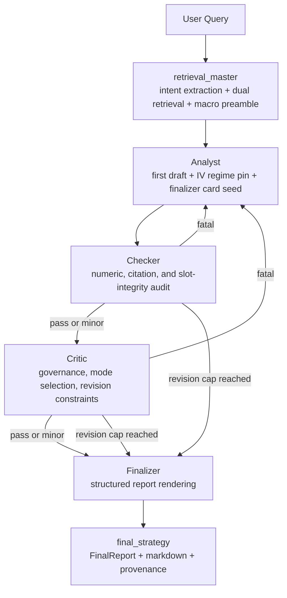

# Agent Architecture Blueprint

## 1. Goal

Define a production-grade, auditable multi-agent workflow that converts one user query into a bounded, evidence-backed, risk-reviewed options answer.

The architecture is designed around four requirements:

- **Deterministic evidence control:** Silver metrics and Gold narrative evidence are frozen into one state envelope before iterative reasoning begins.
- **Contract-first governance:** retrieval scope, query-family slot contracts, data-capability limits, and output-mode controls are explicit runtime objects rather than hidden prompt assumptions.
- **Replayable orchestration:** each node writes typed deltas into a shared `AgentState`, so every revision loop is inspectable and reproducible.
- **Bounded delivery:** the graph always terminates in a structured final payload, even under repeated Checker or Critic objections.

---

## 2. Architecture and Workflow

The live graph is compiled in [router.py](../../Scripts/agents/router.py). Its effective topology is:

- `retrieval_master`
- `analyst`
- `checker`
- `critic`
- `finalizer`

with conditional routing after Checker and Critic, and a hard circuit breaker controlled by `AGENT_MAX_REVISIONS`.

---

## 3. Code Strategy

- **Orchestration:** [router.py](../../Scripts/agents/router.py) compiles the LangGraph topology and owns all state-transition boundaries.
- **State discipline:** [state.py](../../Scripts/agents/state.py) defines the typed, replayable envelope used across every node.
- **Prompt discipline:** [prompts.py](../../Scripts/agents/prompts.py) encodes role-specific operating mandates and structured-output expectations.
- **Contract discipline:** [financial_ontology.py](../../Scripts/core/financial_ontology.py), [financial_reasoning_contract.py](../../Scripts/core/financial_reasoning_contract.py), and [evidence_contracts.py](../../Scripts/core/evidence_contracts.py) convert business logic into deterministic runtime controls.

### 3.1 Contract Layers That Drive The Graph

The orchestration is no longer just prompt chaining. It is driven by five contract layers:

1. **Global state contract** in [state.py](../../Scripts/agents/state.py)
2. **Financial ontology contract** in [financial_ontology.py](../../Scripts/core/financial_ontology.py)
3. **Reasoning and actionability contract** in [financial_reasoning_contract.py](../../Scripts/core/financial_reasoning_contract.py)
4. **Slot-evidence and disclosure contract** in [evidence_contracts.py](../../Scripts/core/evidence_contracts.py)
5. **Role prompt contract** in [prompts.py](../../Scripts/agents/prompts.py)

Together, these layers determine:

- what the query is allowed to ask for,
- which source families and metrics are in scope,
- which query slots must be answered or explicitly disclosed,
- whether the system can support `actionable_options`, `directional_watchlist`, or `informational_only`,
- and how those decisions are carried across the Analyst, Checker, Critic, and Finalizer.

### 3.2 Deterministic Retrieval Envelope

The graph entry node, `master_retrieval_node`, materializes the evidence envelope for the entire run.

It writes:

- `metadata`
- `gold_context`
- `silver_context`
- `silver_context_frozen`
- `scope_contract`
- `retrieval_outcome`
- `time_range`
- `hyde_anticipation`
- `macro_context`

Key design properties:

- **`silver_context`** is the working numeric surface for downstream drafting.
- **`silver_context_frozen`** is the immutable Checker baseline, preventing revision-loop numeric drift.
- **`scope_contract`** is the retrieval-time statement of what the run is allowed to produce.
- **`retrieval_outcome`** makes source and slot completeness explicit, including missing strict sources and missing query slots.
- **`time_range`** and **`hyde_anticipation`** are always coerced into schema-valid shapes, even in degraded retrieval modes.

### 3.3 Shared Mode And Constraint Vocabulary

The system uses four linked governance fields. They should be interpreted consistently across all node documents.

| Field | Owner | Meaning | Value Domain / Shape |
|---|---|---|---|
| `recommendation_mode` | Critic | Final answer class selected after governance review | `actionable_options`, `directional_watchlist`, `informational_only` |
| `actionability_mode` | Critic | Downstream mirror of `recommendation_mode`; used so Finalizer and evaluators consume an explicit mode field instead of inferring from prose | same three values as `recommendation_mode` |
| `structure_visibility_mode` | Critic | How much structure language the final answer may surface | `recommended_structure`, `illustrative_structure`, `no_structure` |
| `revision_constraints` | Critic | Full downstream rendering contract that tells Finalizer what must be preserved, disclosed, or suppressed | `Dict[str, Any]` with mode, disclosure, risk, and illustrative-structure flags |

#### `recommendation_mode` / `actionability_mode`

The system currently supports three modes only:

- **`actionable_options`**
  - use when there is no hard missing data,
  - options evidence is present,
  - `can_support_concrete_option_structure = true`,
  - and the retrieval ceiling permits a live structure.

- **`directional_watchlist`**
  - use when there is no hard missing data,
  - direction or market posture is supportable,
  - but concrete strike-level structure is not supportable or not allowed by the ceiling.

- **`informational_only`**
  - use when hard missing data exists,
  - or the retrieval ceiling already limits the run to informational scope,
  - or the evidence supports only background, caveats, or high-level context.

`actionability_mode` intentionally mirrors `recommendation_mode`. The duplicate field exists so downstream consumers do not need to guess whether the mode was inherited, downgraded, or only implied in text.

#### `structure_visibility_mode`

- **`recommended_structure`**
  - the final answer may keep a live structure and populated `trade_ideas`.
  - this normally corresponds to `actionable_options`.

- **`illustrative_structure`**
  - the final answer may show at most one clearly non-live example.
  - this is typically used for `directional_watchlist`, and for some non-actionable outputs where an example helps explain the view.

- **`no_structure`**
  - the final answer should not surface structure language.

#### `revision_constraints`

`revision_constraints` is the governing object for downstream rendering. Key fields include:

- `actionability_mode`
- `structure_visibility_mode`
- `forbid_actionable_recommendation`
- `allow_illustrative_structure`
- `must_explain_why_not_now`
- `market_read_only`
- `must_disclose_risk`
- `must_disclose_missing_slots`
- `main_risk_text`
- `why_not_now_text`
- `what_must_change`
- `illustrative_structure_hint`
- `high_risk`
- `market_impact_risk`
- `missing_hard_data`

This object is the single source of truth for Finalizer boundary behavior.

### 3.4 Router-Owned Iteration Semantics

The router defines a strict revision loop:

- Analyst is the **sole owner** of `revision_count`
- Checker audits factual and lineage integrity first
- Critic only runs after Checker has cleared fatal factual issues
- both Checker and Critic can route back to Analyst on fatal findings
- the graph hard-stops at `_MAX_REVISIONS` and forces Finalizer

This keeps the loop interpretable:

- **Checker** controls factual admissibility
- **Critic** controls governance and actionability
- **Finalizer** is a terminal renderer, not a strategic reasoner

### 3.5 Cross-Node State Spine

The current architecture relies on a small set of fields that travel across multiple nodes rather than being recomputed locally.

#### Retrieval and scope spine

- `metadata`
- `scope_contract`
- `retrieval_outcome`
- `time_range`
- `hyde_anticipation`

These fields define what the question means, what data was retrieved, and where the retrieval contract is incomplete.

#### Evidence and audit spine

- `silver_context`
- `silver_context_frozen`
- `gold_context`
- `macro_context`
- `node_audit_log`

These fields define the evidence pool and the replay trail.

#### Governance spine

- `data_capability_profile`
- `critic_reasoning_profile`
- `recommendation_mode`
- `actionability_mode`
- `structure_visibility_mode`
- `revision_constraints`

These fields are built or refined by the Critic layer and then govern final rendering.

#### Final rendering spine

- `analyst_contract_audit`
- `finalizer_input_card`
- `checker_edit_suggestions`
- `critic_edit_suggestions`

These fields define what the Finalizer is allowed to say and how it should say it, without re-litigating upstream reasoning.

### 3.6 Ontology As Runtime Scope Control

The financial ontology in [financial_ontology.py](../../Scripts/core/financial_ontology.py) is the single source of truth for:

- allowed source families,
- allowed metric labels,
- metric-to-physical-column mappings,
- query-family slot definitions,
- and source-to-slot expectations.

This ontology drives retrieval and later governance in several ways:

- unknown or unsupported metrics are surfaced as unavailable rather than hallucinated,
- query families such as `insider_flow_driven`, `single_name_options`, `cross_asset_regime`, and `geopolitical_commodity` carry explicit slot expectations,
- missing source families can be translated into missing query slots deterministically.

### 3.7 Reasoning Contract As Actionability Control

The compact reasoning contract in [financial_reasoning_contract.py](../../Scripts/core/financial_reasoning_contract.py) supplies:

- IV-regime strategy archetypes,
- option-structure policy,
- investor suitability rules,
- abstention rules,
- data-capability rules,
- and the deterministic `data_capability_profile`.

This profile is central to mode selection because it tells the Critic whether the current state can support:

- macro or directional framing only,
- a directional watchlist,
- or a concrete options structure.

### 3.8 Evidence Contracts As Slot-Level Quality Control

The evidence contract layer in [evidence_contracts.py](../../Scripts/core/evidence_contracts.py) turns query-family expectations into slot-level validation rules.

It defines:

- slot-level evidence groups,
- disclosure requirements,
- semantic slot-evidence evaluation,
- truth-slot evaluation,
- and slot-coverage scoring.

This matters because the system now distinguishes between:

- a slot that is answered with evidence,
- a slot that is unanswerable but honestly disclosed,
- a slot that is unsupported by retrieval,
- and a slot that was simply missed.

### 3.9 Prompt Contracts As Role Boundaries

The prompt layer in [prompts.py](../../Scripts/agents/prompts.py) mirrors the runtime architecture:

- **Analyst** is an evidence-backed drafter with strict citation and word-budget discipline
- **Checker** is a data-integrity auditor and is explicitly forbidden from strategy evaluation
- **Critic** is a governance and suitability gate with explicit mode semantics
- **Finalizer** is a structured renderer with strict section and disclosure rules

The current deployment standard is:

- **Analyst:** OpenAI primary path configured to `gpt-4o`, with fallback support managed in code
- **Finalizer:** OpenAI primary path configured to `gpt-4o`, with fallback support managed in code

The implementation remains environment-configurable, but the architecture assumes those two nodes use the higher-capability OpenAI path as primary.

### 3.10 Finalizer Card As The Terminal Handoff

The Finalizer does not reconstruct governance from scattered state. Instead, the system builds a dedicated `finalizer_input_card`, seeded by the Analyst and refreshed by the Critic.

That card carries the terminal handoff contract:

- recommendation mode
- structure visibility mode
- revision constraints
- minor edit instructions
- evidence and regime context
- retrieval completeness summary

This is the main anti-drift mechanism at the end of the graph.

---

## 4. Output Data Schema and Paths

| Layer | Contract | Primary Path |
|---|---|---|
| Global graph state | `AgentState` (`TypedDict`) | [../../Scripts/agents/state.py](../../Scripts/agents/state.py) |
| Feedback object | `AgentFeedback` (`BaseModel`) | [../../Scripts/agents/state.py](../../Scripts/agents/state.py) |
| Retrieval scope layer | `scope_contract`, `retrieval_outcome`, `time_range`, `hyde_anticipation` | [../../Scripts/agents/router.py](../../Scripts/agents/router.py) |
| Ontology contract | allowed metrics, source families, query-family slots, metric-column mappings | [../../Scripts/core/financial_ontology.py](../../Scripts/core/financial_ontology.py) |
| Reasoning contract | strategy archetypes, abstention rules, `data_capability_profile` | [../../Scripts/core/financial_reasoning_contract.py](../../Scripts/core/financial_reasoning_contract.py) |
| Evidence contract | slot-level evidence groups, semantic slot coverage, disclosure checks | [../../Scripts/core/evidence_contracts.py](../../Scripts/core/evidence_contracts.py) |
| Governance layer | `critic_reasoning_profile`, `recommendation_mode`, `revision_constraints` | [../../Scripts/agents/critic.py](../../Scripts/agents/critic.py) |
| Finalizer handoff | `finalizer_input_card` | [../../Scripts/agents/router.py](../../Scripts/agents/router.py) |
| Final payload | `final_strategy` dict (`FinalReport` envelope + markdown + provenance) | [../../Scripts/agents/finalizer.py](../../Scripts/agents/finalizer.py) |
| Runtime trace | append-only `node_audit_log` events | [../../Scripts/agents/router.py](../../Scripts/agents/router.py) |

### 4.1 Current High-Value Penetrating Fields

| Field | First Materialized | Consumed By | Role |
|---|---|---|---|
| `scope_contract` | Retrieval Master | Analyst, Critic, Finalizer | output ceiling, slot contract, route-level scope |
| `retrieval_outcome` | Retrieval Master | Analyst, Critic, Finalizer, evaluator | source completeness, missing strict sources, missing query slots |
| `silver_context_frozen` | Retrieval Master | Checker | immutable numeric baseline |
| `iv_regime_pinned` | Analyst | Analyst revisions, Critic, Finalizer | stable regime interpretation across revisions |
| `data_capability_profile` | Critic reasoning layer | Critic, Finalizer, evaluator | supportability of concrete options structure |
| `critic_reasoning_profile` | Critic | evaluator, diagnostics, docs | auditable mode and merge rationale |
| `revision_constraints` | Critic | Finalizer, evaluator | downgrade, disclosure, illustrative-structure boundaries |
| `finalizer_input_card` | Analyst seed + Critic refresh | Finalizer | single structured final rendering handoff |
| `node_audit_log` | every router node | observability and replay | per-node runtime trace |

### Related Docs

- [Node_Retrieval_Master](./Node_Retrieval_Master.md)
- [Node_Analyst](./Node_Analyst.md)
- [Node_Checker](./Node_Checker.md)
- [Node_Critic](./Node_Critic.md)
- [Node_Finalizer](./Node_Finalizer.md)
- [Backend System Blueprint](../modular_guide/Backend_README.md)
- [System Topology](../modular_guide/ARCHITECTURE.md)
- [Orchestration Runtime](../modular_guide/Orchestration.md)
- [Observability Contracts](../modular_guide/Observability.md)
- [User Query Policy](../modular_guide/User_Query_Guide.md)
