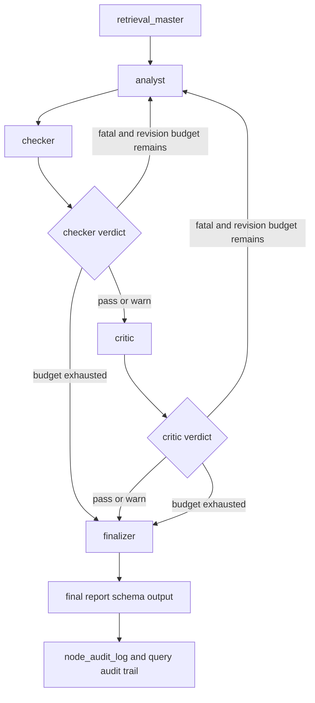

# Institutional Agent Architecture Blueprint

## 1. Goal

Define a production-grade, auditable multi-agent workflow that turns one user query into a fact-checked, risk-reviewed, schema-constrained options strategy output.

---

## 2. Architecture


## 3. Code Strategy and Workflow
- **Orchestration:** `Scripts/agents/router.py` compiles LangGraph topology and conditional routing.
- **State discipline:** each node writes deterministic deltas into `AgentState`.
- **Governance:** Checker (facts/lineage) gates Critic (logic/risk), then Finalizer structures output.
- **Model strategy:** Analyst and Finalizer both default to `gpt-4o-mini` (OpenAI API) as the primary engine; `options-expert-v1:latest` (Ollama) is the automatic backup on failure.

---

## 4. Output Data Schema and Paths
| Layer | Contract | Primary Path |
|---|---|---|
| Global state | `AgentState` (`TypedDict`) | `Scripts/agents/state.py` |
| Feedback item | `AgentFeedback` (`BaseModel`) | `Scripts/agents/state.py` |
| Final payload | `final_strategy` dict (`FinalReport.model_dump()`) | `Scripts/agents/finalizer.py` |
| Runtime traces | node-level audit events (`node_audit_log`) | `Scripts/agents/router.py` |

---

## 5. How to Test
- **Graph e2e:** `python Scripts/tests/test_router_e2e.py`
- **Single query path:** `python -m Scripts query "What is the best risk-defined setup for QQQ this week?"`
- **Warmup:** `python -m Scripts warmup`

---

## 6. Dependence Files and One-Line Command
### Inputs
- `Scripts/agents/router.py`
- `Scripts/agents/state.py`
- `Scripts/agents/analyst.py`
- `Scripts/agents/checker.py`
- `Scripts/agents/critic.py`
- `Scripts/agents/finalizer.py`

### Outputs
- schema-constrained final strategy payload;
- auditable node verdict and revision lineage for each query run.

### Related Docs
- [Backend System Blueprint](../modular_guide/Backend_README.md)
- [System Topology](../modular_guide/ARCHITECTURE.md)
- [Orchestration Runtime](../modular_guide/Orchestration.md)
- [Observability Contracts](../modular_guide/Observability.md)
- [User Query Policy](../modular_guide/User_Query_Guide.md)

Node-level runbooks:
- `Node_Retrieval_Master.md`
- `Node_Analyst.md`
- `Node_Checker.md`
- `Node_Critic.md`
- `Node_Finalizer.md`

```bash
pip install -r requirements.txt
```
