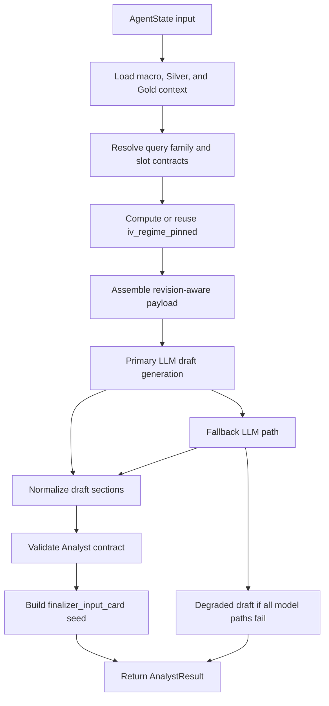

# Analyst Node Specification

## 1. Role

The Analyst node is the pipeline's query-first evidence carrier.

Its job is to:

- translate retrieval output into a compact, evidence-backed draft,
- preserve the most query-relevant Silver and Gold facts before downstream compression,
- pin and reuse the implied-volatility regime across revisions,
- surface retrieval limits honestly,
- and seed the structured handoff used later by Finalizer.

It does **not** own final governance. It drafts inside the current evidence envelope and passes that work forward.

Primary implementation entrypoints:

- Router wrapper: [../../Scripts/agents/router.py](../../Scripts/agents/router.py)
- Node engine: [../../Scripts/agents/analyst.py](../../Scripts/agents/analyst.py)
- Prompt contract: [../../Scripts/agents/prompts.py](../../Scripts/agents/prompts.py)

---

## 2. Architecture and Workflow

### Execution sequence

1. Read runtime state, preferring `silver_context_frozen` when available for deterministic numeric grounding.
2. Resolve `query_family`, `query_slots`, and any slot-level evidence contracts.
3. Compute or reuse `iv_regime_pinned`.
4. Build an LLM payload that includes macro context, Silver metrics, Gold snippets, revision feedback, and current revision constraints.
5. Invoke the primary model.
6. If the primary path fails, optionally invoke the fallback path.
7. Normalize the draft into the required section contract.
8. Validate contract compliance and compute a structured Analyst audit.
9. Build `finalizer_input_card`.
10. Return an `AnalystResult` envelope to the router.

---

## 3. Strategy

### 3.1 Shared mode and constraint vocabulary

Analyst does not author the final mode, but it must preserve the current mode vocabulary consistently.

| Field | How Analyst Treats It |
|---|---|
| `recommendation_mode` | Reads current mode on revision passes and carries it into `finalizer_input_card` without redefining it |
| `actionability_mode` | Treated as the downstream mirror of `recommendation_mode`; passed through for Finalizer compatibility |
| `structure_visibility_mode` | Used to decide whether any structure hint should remain analytical, illustrative, or absent |
| `revision_constraints` | Read as a downstream rendering contract; Analyst respects it but does not redefine it |

### 3.2 Query-family and slot-contract discipline

Analyst relies on the runtime contract stack rather than free-form query heuristics.

It consumes:

- [../../Scripts/core/financial_ontology.py](../../Scripts/core/financial_ontology.py)
- [../../Scripts/core/evidence_contracts.py](../../Scripts/core/evidence_contracts.py)

That lets it work from:

- `query_family`
- `query_slots`
- `slot_evidence_contracts`
- `sec_action_taxonomy`

instead of hardcoding behavior to individual query strings.

### 3.3 Deterministic regime control

Analyst computes IV regime once and persists it into `iv_regime_pinned` so revisions do not flip thesis direction.

The pinned object is later reused by:

- Analyst revisions
- Critic
- Finalizer

### 3.4 Draft contract and honesty rules

Analyst is expected to:

- carry the strongest query-relevant evidence,
- disclose missing strict sources and missing query slots honestly,
- avoid placeholder leakage such as `None` or `null` being treated as data,
- and produce a draft that remains compatible with downstream mode enforcement.

### 3.5 Model strategy

The current deployment standard is:

- **Primary OpenAI path:** `gpt-4o`
- **Fallback path:** environment-configured fallback, including the Ollama path when enabled

The implementation is environment-configurable, but the documentation assumes `gpt-4o` is the primary Analyst model.

---

## 4. Input Data Schema

The Analyst consumes the global `AgentState` and uses a subset of fields directly.

### A. Core runtime inputs

| Field | Type | Purpose |
|---|---|---|
| `original_query` | `str` | Query to answer directly and classify into a query family. |
| `macro_context` | `str` | Macro snapshot used for macro-to-asset framing. |
| `metadata` | `QueryMetadata` | Structured retrieval intent used for family inference and source hints. |
| `silver_context` | `Dict[str, Any]` | Live Silver context, including `values` and `lineage_anchors`. |
| `silver_context_frozen` | `Optional[Dict[str, Any]]` | Preferred deterministic numeric baseline when present. |
| `gold_context` | `List[Dict[str, Any]]` | Retrieved qualitative chunks such as SEC, GPR, or news snippets. |
| `time_range` | `Optional[Dict[str, Any]]` | Retrieval time-window contract passed into downstream handoff. |
| `scope_contract` | `Optional[Dict[str, Any]]` | Runtime scope contract compiled by retrieval. |
| `retrieval_outcome` | `Optional[Dict[str, Any]]` | Runtime evidence status, including missing strict sources and missing query slots. |
| `critic_feedback` | `List[AgentFeedback]` | Append-only revision feedback. |
| `revision_constraints` | `Optional[Dict[str, Any]]` | Current governance constraints that the draft should respect. |
| `iv_regime_pinned` | `Optional[Dict[str, Any]]` | Previously pinned IV regime reused on revision passes. |
| `recommendation_mode` | `Optional[Literal[...]]` | Current mode context on revision passes. |
| `actionability_mode` | `Optional[Literal[...]]` | Mode mirror passed through to the card. |
| `structure_visibility_mode` | `Optional[Literal[...]]` | Governs whether structure language is allowed. |
| `data_capability_profile` | `Optional[Dict[str, Any]]` | Capability context when slot contracts must be rebuilt locally. |

### B. Contract fragments Analyst reads from `scope_contract`

- `query_family`
- `query_slots`
- `strict_sources`
- `soft_context_sources`
- `output_mode_ceiling`
- `specificity_ceiling`
- `required_disclosures`
- `slot_evidence_contracts`
- `sec_action_taxonomy`

### C. Contract fragments Analyst reads from `retrieval_outcome`

- `strict_sources_hit`
- `soft_sources_hit`
- `missing_strict_sources`
- `missing_query_slots`
- `has_gold_evidence`
- `has_silver_evidence`
- `is_fallback`

---

## 5. Output Data Schema

Analyst returns an `AnalystResult` envelope and seeds the structured finalizer handoff.

### A. Direct node return: `AnalystResult`

| Field | Type | Description |
|---|---|---|
| `draft` | `str` | Normalized Markdown draft that becomes `state["draft_report"]`. |
| `iv_regime` | `Dict[str, Any]` | Deterministic regime object used to populate `iv_regime_pinned`. |
| `used_fallback` | `bool` | Whether the fallback model path was used successfully. |
| `model_used` | `str` | Concrete model identifier or `"degraded"` if all model paths failed. |
| `contract_audit` | `Dict[str, Any]` | Structured Analyst self-audit used by router and evaluator. |

### B. `contract_audit` structure

The Analyst audit currently includes:

- `missing_source_disclosure_present`
- `missing_slot_disclosure_present`
- `none_placeholder_leak`
- `main_risk_present`
- `live_recommendation_phrase`
- `violations`
- `query_family`
- `slot_status`
- `required_evidence_count_met`
- `coverage_score`
- `hard_gate_pass`

### C. `finalizer_input_card` seed

Analyst builds the first version of `finalizer_input_card`. Key fields include:

- `query_family`
- `strict_sources_hit`
- `key_numbers`
- `required_silver_anchors`
- `required_gold_refs`
- `analyst_evidence_lines`
- `analyst_conclusion`
- `recommendation_mode`
- `actionability_mode`
- `structure_visibility_mode`
- `revision_constraints`
- `minor_edits`
- `fallback_status`
- `time_window`
- `macro_backdrop`
- `scope_contract_summary`
- `retrieval_outcome_summary`
- `missing_query_slots`
- `query_slots`
- `slot_evidence_contracts`
- `sec_action_taxonomy`
- `analyst_contract_audit`

### D. Router-owned state mutations after Analyst returns

The router, not Analyst itself, writes:

- `draft_report`
- `revision_count`
- `checker_verdict`
- `critic_verdict`
- `analyst_fallback_used`
- `iv_regime_pinned`
- `analyst_contract_audit`
- `finalizer_input_card`
- `node_audit_log`
