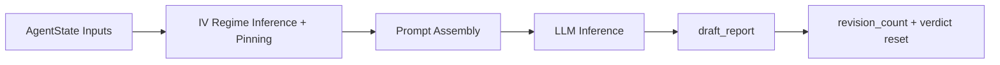

# Node Specification: Analyst

## 1. Goal

Produce the institutional strategy draft (`draft_report`) from retrieval-prepared context while enforcing causal reasoning, strict citation discipline, and revision continuity.

Primary mission controls:
- Convert mixed Gold/Silver evidence into a compact actionable options thesis.
- Keep strategy direction stable across revisions through IV regime pinning.
- Resolve every upstream fatal finding without losing prior context.
- Emit a fallback-safe draft when model execution is degraded.

---

## 2. Architecture

Execution entrypoints:
- Router wrapper: `Scripts/agents/router.py` -> `analyst_node()`
- Node engine: `Scripts/agents/analyst.py` -> `AnalystAgent.generate_report()`

---

## 3. Code Strategy and Workflow

- **Regime consistency control:** first pass computes deterministic IV regime from Silver context; subsequent passes reuse `iv_regime_pinned`.
- **Revision memory contract:** append-only `critic_feedback` is transformed into a structured revision block so each rewrite addresses unresolved failures.
- **Prompt payload governance:** payload includes macro context, Silver metric table, Gold snippets, valid citation ID pools, and strict anti-hallucination policy.
- **Citation hardening:** only IDs listed in `VALID_SILVER_IDS` and `VALID_GOLD_IDS` are allowed; placeholders are explicitly blocked.
- **Model resilience path:** primary `gpt-4o-mini` (OpenAI API, env `ANALYST_PRIMARY_MODEL`); automatic switch to `options-expert-v1:latest` (Ollama, env `OLLAMA_ANALYST_MODEL`) on failure; degraded draft output when both paths fail.
- **Router contract separation:** `analyst.py` returns structured envelope (`draft`, `iv_regime`, fallback info), while `router.py` owns state mutation (`revision_count`, verdict reset).

Workflow sequence:
1. Read `macro_context`, `silver_context`, `gold_context`, and revision feedback.
2. Compute or reuse pinned IV regime.
3. Build bounded payload with context truncation safeguards.
4. Invoke primary model with retry policy.
5. Fallback to secondary model if enabled and needed.
6. Return typed `AnalystResult`; router writes state delta and audit log.

---

## 4. Output Data Schema (and Path)

| Output Key | Schema / Type | Core Fields | Path Ownership |
|---|---|---|---|
| `draft_report` | `str` | markdown strategy draft | emitted by `Scripts/agents/analyst.py`, written in `Scripts/agents/router.py` |
| `revision_count` | `int` | incremented only by Analyst node | `Scripts/agents/router.py` |
| `checker_verdict` | `None` | reset each Analyst pass to trigger new Checker decision | `Scripts/agents/router.py` |
| `critic_verdict` | `None` | reset each Analyst pass to trigger new Critic decision | `Scripts/agents/router.py` |
| `iv_regime_pinned` | `Optional[Dict[str, Any]]` | `iv_regime`, `atm_iv`, `iv_rank_pct`, `pcr_volume`, `pcr_status`, thresholds | computed in `Scripts/agents/analyst.py`, persisted in `Scripts/agents/router.py` |
| `analyst_fallback_used` | `bool` | indicates whether secondary model path was used | `Scripts/agents/router.py` |
| `node_audit_log` | `List[Dict[str, Any]]` (append-only) | node, revision, latency, key state in/out | `Scripts/agents/router.py` |

---

## 5. How to Test

- **Single-node behavior via full graph:** `python -m Scripts query "Analyze GLD options under current macro regime."`
- **Revision-loop regression:** `python Scripts/tests/test_router_e2e.py`
- **Syntax integrity:** `python -m py_compile Scripts/agents/analyst.py`
- **Warmup path validation:** `python -m Scripts warmup --roles analyst`

---

## 6. Dependency Files and One-Line Install

Dependency files:
- `Scripts/agents/analyst.py`
- `Scripts/agents/prompts.py`
- `Scripts/agents/state.py`
- `Scripts/core/financial_config.py`
- `Scripts/agents/router.py`
- `Data/Agent_Context/latest_macro_context.md`

Related docs:
- [Agent Architecture](./Agent_Architecture.md)
- [Retrieval Architecture and Strategy](../Query_retrieval_docs/Retrieval_Architecture_and_Strategy.md)
- [Data Source Summary](../Data_source_docs/Data_source_summary.md)
- [LLM Pool Operations Guide](../modular_guide/LLM%20Pool%20Operations%20Guide.md)

