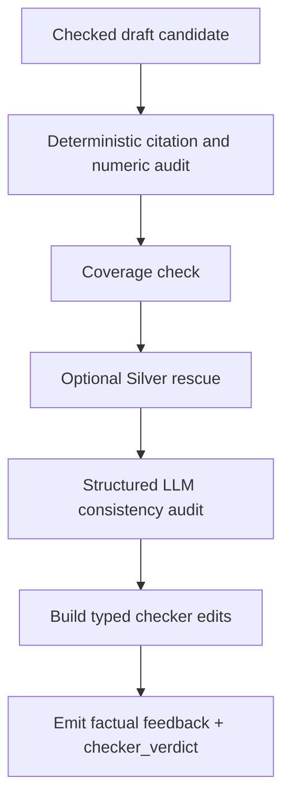

# Checker Node Specification

## 1. Role

The Checker node is the pipeline's factual, citation, and slot-integrity gate.

Its job is to:

- validate the Analyst draft against deterministic Silver and Gold truth,
- enforce citation-anchor integrity,
- detect unsupported numeric or factual claims,
- optionally rescue recoverable missing-anchor failures,
- and emit either revision-blocking factual feedback or non-blocking typed edits.

It does **not** decide final recommendation mode. It protects the evidence surface that Critic and Finalizer depend on.

Primary implementation entrypoints:

- Router wrapper: [../../Scripts/agents/router.py](../../Scripts/agents/router.py)
- Node engine: [../../Scripts/agents/checker.py](../../Scripts/agents/checker.py)
- Prompt contract: [../../Scripts/agents/prompts.py](../../Scripts/agents/prompts.py)

---

## 2. Architecture and Workflow

### Execution sequence

1. Read the Analyst draft and retrieval state.
2. Run deterministic audit against Silver and Gold truth.
3. Run coverage checks for required metric classes and slot expectations.
4. If missing lineage anchors are recoverable, attempt a Silver rescue refresh.
5. Run the structured LLM consistency audit as a secondary layer.
6. Convert surviving issues into:
   - fatal Analyst feedback
   - typed Finalizer edit suggestions
7. Return a state delta with verdict and optional refreshed `silver_context`.

---

## 3. Strategy

### 3.1 Relationship to the shared mode vocabulary

Checker does not author `recommendation_mode`, `actionability_mode`, `structure_visibility_mode`, or `revision_constraints`.

Its job is upstream of those fields:

- it validates whether the draft is factually admissible,
- it protects `silver_context_frozen` as the numeric baseline,
- and it ensures Critic receives a trustworthy draft before making mode decisions.

### 3.2 Deterministic-first design

Checker's primary audit path is deterministic. It uses:

- citation parsing,
- numeric extraction,
- tolerance-based numeric matching,
- anchor validation,
- and structural placeholder rejection.

The LLM layer is secondary and constrained.

### 3.3 Frozen-truth preference

When available, Checker prefers `silver_context_frozen` over live `silver_context`. This prevents rescue-driven drift from rewriting the numeric baseline mid-round.

### 3.4 Coverage and slot discipline

Checker validates more than raw numbers. It also checks whether important metrics or slots were omitted when the query and runtime contract imply they should have appeared.

That logic is aligned with:

- [../../Scripts/core/financial_ontology.py](../../Scripts/core/financial_ontology.py)
- [../../Scripts/core/evidence_contracts.py](../../Scripts/core/evidence_contracts.py)

### 3.5 Split output channels

Checker emits:

- `critic_feedback`
  - only revision-blocking factual findings
- `checker_edit_suggestions`
  - typed, non-blocking cleanup edits for Finalizer

This prevents local cleanup from reopening the Analyst loop when a smaller Finalizer edit is enough.

---

## 4. Input Data Schema

The Checker consumes the global `AgentState`, focusing on draft truth and retrieval lineage.

### A. Core runtime inputs

| Field | Type | Purpose |
|---|---|---|
| `draft_report` | `str` | Analyst draft to audit. |
| `revision_count` | `int` | Used for loop control and audit replay. |
| `original_query` | `str` | Used by coverage logic to decide which omissions matter. |
| `silver_context` | `Dict[str, Any]` | Live Silver numeric context. |
| `silver_context_frozen` | `Optional[Dict[str, Any]]` | Preferred immutable truth surface for deterministic audit. |
| `gold_context` | `List[Dict[str, Any]]` | Gold qualitative evidence and anchor source. |
| `macro_context` | `str` | Passed into the secondary LLM consistency layer. |
| `metadata` | `QueryMetadata` or `Dict[str, Any]` | Used for source-family and metric-family coverage checks. |
| `time_range` | `Optional[Dict[str, Any]]` | Used when Silver rescue rebuilds time predicates. |
| `scope_contract` | `Optional[Dict[str, Any]]` | Used indirectly for slot and disclosure expectations. |
| `retrieval_outcome` | `Optional[Dict[str, Any]]` | Used indirectly for missing-source and missing-slot context. |

### B. Internally derived checking inputs

Checker builds or uses:

- numeric source pools,
- citation anchor pools,
- coverage applicability rules,
- deterministic fatal and minor findings.

### C. Optional tool dependency

If rescue is enabled, Checker also depends on a Silver tool capable of refreshing:

- `values`
- `lineage_anchors`

under the current query metadata and time predicates.

---

## 5. Output Data Schema

Checker returns a state delta to the router.

### A. Core output fields

| Field | Type | Description |
|---|---|---|
| `critic_feedback` | `List[AgentFeedback]` | Fatal factual findings forwarded to Analyst revision. |
| `checker_verdict` | `Literal["pass","fatal","minor"]` | Router control signal after Checker review. |
| `checker_edit_suggestions` | `List[FinalizerEdit]` | Non-blocking typed edits for Finalizer. |
| `silver_context` | `Optional[Dict[str, Any]]` | Refreshed Silver context when rescue succeeded. |

### B. Semantics of `checker_verdict`

- `pass`
  - no fatal Analyst feedback and no typed cleanup edits are needed
- `fatal`
  - factual integrity problems must be corrected before Critic runs
- `minor`
  - no fatal Analyst revision is needed, but Finalizer should still apply local cleanup edits

### C. Router-owned audit output

The router appends one Checker audit event to `node_audit_log` containing:

- `node="checker"`
- `revision_n`
- latency
- `verdict`
- `findings_n`

Checker itself does not own route transitions; it only emits the signals the router uses to decide the next hop.
