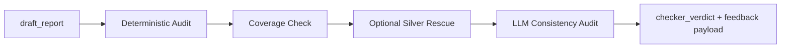

# Node Specification: Checker

## 1. Goal

Enforce data integrity and citation correctness on the analyst draft before any logic critique proceeds.

---

## 2. Architecture



Node entrypoint:
- `Scripts/agents/router.py` → `checker_node()`
- auditor implementation: `Scripts/agents/checker.py` → `CheckerAgent.audit()`

---

## 3. Code Strategy and Workflow

- **Layered audit:** deterministic regex rules first, LLM semantic pass second.
- **Frozen truth source:** numeric checks use `silver_context_frozen` to prevent revision drift.
- **Anchor rescue mode:** can requery Silver when missing lineage IDs are detected.
- **Operational fallback:** when local Ollama checker model fails, optional OpenAI fallback can run.

---

## 4. Output Data Schema (and Path)

| Output Key | Type | Notes | Path |
|---|---|---|---|
| `critic_feedback` | `List[AgentFeedback]` | Checker findings appended to global log | `Scripts/agents/checker.py` |
| `checker_verdict` | `"pass" \| "fatal" \| "minor"` | route control signal | `Scripts/agents/checker.py` |
| `silver_context` | `Optional[Dict[str, Any]]` | only when rescue refresh succeeds | `Scripts/agents/checker.py` |
| `node_audit_log` | `List[Dict[str, Any]]` | node telemetry record | `Scripts/agents/router.py` |

---

## 5. How to Test

- **E2E path:** `python Scripts/tests/test_router_e2e.py`
- **Quick query:** `python -m Scripts query "What is current AAPL ATM IV and put-call ratio?"`
- **Compile check:** `python -m py_compile Scripts/agents/checker.py`

---

## 6. Dependency Files and One-Line Install

Key files:
- `Scripts/agents/checker.py`
- `Scripts/retrieval/sql_tools.py`
- `Scripts/agents/state.py`
- `Scripts/agents/prompts.py`

Install:

```bash
pip install -r requirements.txt
```

