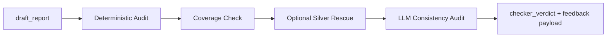

# Node Specification: Checker

## 1. Goal

Serve as the Blue-Team factual gate that blocks any strategy draft with numeric drift, invalid citation anchors, or unsupported source claims before logic-level critique is allowed.

Primary governance objectives:
- Enforce deterministic number-to-source consistency.
- Validate citation IDs against real Silver and Gold evidence pools.
- Preserve revision stability by auditing against immutable truth snapshots.
- Return machine-actionable verdicts (`pass` / `fatal` / `minor`) for router control.

---

## 2. Architecture



Execution entrypoints:
- Router wrapper: `Scripts/agents/router.py` -> `checker_node()`
- Node engine: `Scripts/agents/checker.py` -> `CheckerAgent.audit()`

---

## 3. Code Strategy and Workflow

- **Deterministic-first architecture:** regex and rule-based audits run before any LLM validation to keep failure reasons reproducible.
- **Frozen numeric baseline:** Checker prefers `silver_context_frozen` as immutable source-of-truth to prevent rescue-driven oscillation across revisions.
- **Citation anchor controls:** rejects placeholder anchors, forbids internal control anchors, and supports constrained fuzzy matching for valid lineage IDs.
- **Coverage assurance:** key metrics (`latest_atm_iv`, `pcr_volume`, `gpr_index_level`) are checked for omission and reported as minor gaps.
- **Rescue protocol:** when missing lineage IDs are detected, optional Silver re-query merges refreshed values/anchors and can downgrade recoverable failures.
- **LLM secondary audit:** structured consistency pass validates contradiction patterns not fully captured by deterministic regex rules.
- **Fallback continuity:** if local checker model fails, optional OpenAI fallback preserves audit availability.

Workflow sequence:
1. Read draft + Silver/Gold context + revision index.
2. Run deterministic citation and numeric audits.
3. Apply key-metric coverage check.
4. Optionally perform Silver rescue for missing anchors.
5. Run LLM consistency pass and append findings.
6. Emit `critic_feedback` + `checker_verdict` (+ optional refreshed `silver_context`).

---

## 4. Output Data Schema (and Path)

| Output Key | Schema / Type | Core Fields | Path Ownership |
|---|---|---|---|
| `critic_feedback` | `List[AgentFeedback]` | `sender`, `error_type`, `comment`, `missing_lineage_id`, `revision_index` | produced in `Scripts/agents/checker.py`, accumulated via `Scripts/agents/state.py` reducer |
| `checker_verdict` | `Literal["pass","fatal","minor"]` | route control signal for post-checker edge | `Scripts/agents/checker.py` |
| `silver_context` (optional) | `Dict[str, Any]` | merged rescue payload: `values`, `lineage_anchors`, plus inherited metadata | `Scripts/agents/checker.py` |
| `node_audit_log` | `List[Dict[str, Any]]` (append-only) | node, latency, verdict, findings_n, key state in/out | emitted in `Scripts/agents/router.py` |

---

## 5. How to Test

- **End-to-end route behavior:** `python Scripts/tests/test_router_e2e.py`
- **Guardrail-specific tests:** `python -m pytest Scripts/tests/test_guardrails.py`
- **Interactive factual audit run:** `python -m Scripts query "What is current AAPL ATM IV and put-call ratio?"`
- **Syntax integrity:** `python -m py_compile Scripts/agents/checker.py`

---

## 6. Dependency Files and One-Line Install

Dependency files:
- `Scripts/agents/checker.py`
- `Scripts/agents/prompts.py`
- `Scripts/agents/state.py`
- `Scripts/retrieval/sql_tools.py`
- `Scripts/retrieval/time_adapter.py`
- `Scripts/agents/router.py`

Related docs:
- [Node Analyst](./Node_Analyst.md)
- [Node Critic](./Node_Critic.md)
- [Silver SQL Tools](../Query_retrieval_docs/Silver_SQL_Tools.md)
- [Data Source Summary](../Data_source_docs/Data_source_summary.md)
- [Agent Architecture](./Agent_Architecture.md)

One-line install:
```bash
pip install -r requirements.txt
```

