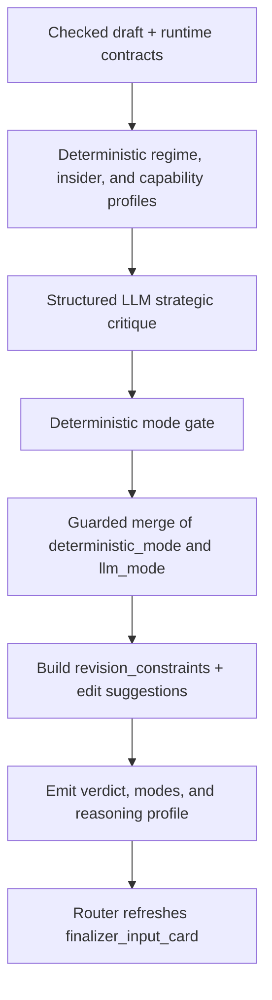

# Critic Node Specification

## 1. Role

The Critic node is the pipeline's governance, mode-selection, and strategic challenge layer.

Its job is to:

- challenge strategy logic after Checker has already cleared factual integrity,
- decide the appropriate output mode under current data support,
- separate revision-blocking issues from non-blocking polish suggestions,
- generate deterministic revision constraints for Finalizer,
- and prevent watchlist-capable answers from being flattened into unnecessary `informational_only`.

Primary implementation entrypoints:

- Router wrapper: [../../Scripts/agents/router.py](../../Scripts/agents/router.py)
- Node engine: [../../Scripts/agents/critic.py](../../Scripts/agents/critic.py)
- Prompt contract: [../../Scripts/agents/prompts.py](../../Scripts/agents/prompts.py)
- Reasoning contract: [../../Scripts/core/financial_reasoning_contract.py](../../Scripts/core/financial_reasoning_contract.py)
- Evidence contract: [../../Scripts/core/evidence_contracts.py](../../Scripts/core/evidence_contracts.py)
- Ontology contract: [../../Scripts/core/financial_ontology.py](../../Scripts/core/financial_ontology.py)

---

## 2. Architecture and Workflow

### Execution sequence

1. Read the checked Analyst draft and downstream-facing runtime contracts.
2. Build deterministic side profiles:
   - IV regime
   - insider confidence
   - strategy family
   - catalyst profile
   - data capability profile
3. Run the structured LLM strategic critique.
4. Compute a deterministic recommendation mode from runtime evidence support.
5. Merge deterministic mode with LLM mode using guarded precedence rules.
6. Build:
   - `critic_feedback`
   - `critic_minor_suggestions`
   - `critic_edit_suggestions`
   - `revision_constraints`
   - `critic_reasoning_profile`
7. Return the Critic state delta and let the router refresh `finalizer_input_card`.

---

## 3. Strategy

### 3.1 Shared mode and constraint vocabulary

Critic is the owner of the system's mode vocabulary.

| Field | Definition | Owner |
|---|---|---|
| `recommendation_mode` | Final output class after governance review | Critic |
| `actionability_mode` | Mirror of `recommendation_mode` for downstream consumers | Critic |
| `structure_visibility_mode` | Allowed structure surface in the final answer | Critic |
| `revision_constraints` | Full rendering and disclosure contract for Finalizer | Critic |

### 3.2 `recommendation_mode` and `actionability_mode`

The value domain is:

- `actionable_options`
- `directional_watchlist`
- `informational_only`

`actionability_mode` intentionally mirrors `recommendation_mode`. It exists so downstream nodes and evaluators consume an explicit mode field instead of trying to infer actionability from prose.

#### `actionable_options`

Use when all of the following are true:

- no hard missing data,
- options evidence is present,
- `can_support_concrete_option_structure = true`,
- and the retrieval ceiling permits a live structure.

#### `directional_watchlist`

Use when all of the following are true:

- no hard missing data,
- direction, posture, or monitoring value is supportable,
- but concrete strike-level structure is not supportable or not allowed by the ceiling.

This is the correct home for market-read and posture cases that should not be mislabeled as `informational_only`.

#### `informational_only`

Use when any of the following are true:

- hard missing data exists,
- the retrieval ceiling already limits the run to informational scope,
- or the evidence supports only context, caveats, or high-level framing.

### 3.3 `structure_visibility_mode`

The value domain is:

- `recommended_structure`
- `illustrative_structure`
- `no_structure`

#### `recommended_structure`

- used when the final output may keep a live structure,
- normally paired with `actionable_options`.

#### `illustrative_structure`

- used when the answer may show one clearly non-live example,
- typically paired with `directional_watchlist`,
- and sometimes paired with non-actionable outputs when a structure example helps explain the view.

#### `no_structure`

- used when the answer should not surface structure language.

### 3.4 `revision_constraints`

`revision_constraints` is the full downstream rendering contract. Key fields include:

- `actionability_mode`
- `structure_visibility_mode`
- `forbid_actionable_recommendation`
- `allow_illustrative_structure`
- `must_explain_why_not_now`
- `market_read_only`
- `must_disclose_risk`
- `must_disclose_missing_slots`
- `main_risk_text`
- `why_not_now_text`
- `what_must_change`
- `illustrative_structure_hint`
- `high_risk`
- `market_impact_risk`
- `missing_hard_data`

This object is what Finalizer should obey, not reinterpret.

### 3.5 Deterministic mode gate

Critic computes a deterministic recommendation mode using runtime proxies rather than only prose review.

Primary inputs:

- `retrieval_outcome.missing_strict_sources`
- `retrieval_outcome.missing_query_slots`
- `retrieval_outcome.strict_sources_hit`
- `scope_contract.output_mode_ceiling`
- `scope_contract.specificity_ceiling`
- `data_capability_profile`

High-level rules:

- hard missing forces `informational_only`
- no hard missing plus options support but no concrete structure support yields `directional_watchlist`
- no hard missing plus concrete options support can yield `actionable_options`
- scope ceilings can only demote, not elevate

### 3.6 Guarded merge precedence

Critic does not blindly take the more conservative of deterministic mode and LLM mode.

The guarded merge includes:

- fatal floor
- hard-missing floor
- protected directional floor
- actionable corridor merge

Most importantly:

- `market_read_only + no hard missing + options present`
  is protected from being pushed back down into `informational_only`

### 3.7 Split feedback channels

Critic emits two distinct channels:

- `critic_feedback`
  - revision-blocking issues only
- `critic_minor_suggestions` and `critic_edit_suggestions`
  - polish, mode-shaping, and rendering guidance for Finalizer without reopening the Analyst loop

---

## 4. Input Data Schema

The Critic consumes the global `AgentState`, with an emphasis on checked draft state and runtime contracts.

### A. Core runtime inputs

| Field | Type | Purpose |
|---|---|---|
| `draft_report` | `str` | Checked Analyst draft to challenge strategically. |
| `original_query` | `str` | Keeps review aligned with user intent and slot expectations. |
| `revision_count` | `int` | Used for loop control and audit replay. |
| `macro_context` | `str` | Used in strategic contradiction review. |
| `silver_context` | `Dict[str, Any]` | Used for IV regime and execution-risk reasoning. |
| `gold_context` | `List[Dict[str, Any]]` | Used for catalyst and insider-signal reasoning. |
| `retrieval_outcome` | `Optional[Dict[str, Any]]` | Used for hard-missing detection and source-support gating. |
| `scope_contract` | `Optional[Dict[str, Any]]` | Used for output ceilings, slot semantics, and disclosure requirements. |
| `metadata` | `QueryMetadata` | Used when rebuilding capability context or reading source-family intent. |
| `critic_feedback` | `List[AgentFeedback]` | Existing append-only feedback stream; Critic appends to it. |
| `finalizer_input_card` | `Optional[Dict[str, Any]]` | Existing downstream handoff card, later refreshed by the router. |

### B. Derived governance inputs

Critic locally computes or consumes:

- IV regime info
- insider confidence
- strategy profile
- catalyst profile
- `data_capability_profile`
- market impact risk

### C. Contract fragments Critic reads

From `scope_contract`:

- `query_family`
- `query_slots`
- `strict_sources`
- `output_mode_ceiling`
- `specificity_ceiling`

From `retrieval_outcome`:

- `strict_sources_hit`
- `missing_strict_sources`
- `missing_query_slots`
- evidence presence flags

---

## 5. Output Data Schema

Critic returns a structured governance delta to the router.

### A. Core output fields

| Field | Type | Description |
|---|---|---|
| `critic_feedback` | `List[AgentFeedback]` | Revision-blocking findings only. |
| `critic_verdict` | `Literal["pass","fatal","minor"]` | Router control signal after Critic review. |
| `critic_minor_suggestions` | `List[str]` | Non-blocking polish or mode-shaping notes. |
| `critic_edit_suggestions` | `List[FinalizerEdit]` | Typed Finalizer-only local edits. |
| `data_capability_profile` | `Dict[str, Any]` | Structured capability assessment for downstream consumers. |
| `critic_reasoning_profile` | `Dict[str, Any]` | Structured governance trace, including deterministic mode, llm mode, final mode, and merge policy. |
| `recommendation_mode` | `Literal["actionable_options","directional_watchlist","informational_only"]` | Final output class selected by Critic. |
| `actionability_mode` | `Literal["actionable_options","directional_watchlist","informational_only"]` | Mirror field for downstream consumers. |
| `structure_visibility_mode` | `Literal["recommended_structure","illustrative_structure","no_structure"]` | Governs whether Finalizer may render concrete, illustrative, or no structure. |
| `revision_constraints` | `Dict[str, Any]` | Canonical rendering and governance contract for Finalizer. |

### B. Router-owned card refresh after Critic returns

Critic itself does not write the final card into state. The router refreshes `finalizer_input_card` with:

- `recommendation_mode`
- `actionability_mode`
- `structure_visibility_mode`
- `revision_constraints`
- merged `minor_edits` from Checker and Critic

That router-owned refresh is part of the effective Critic output contract.
