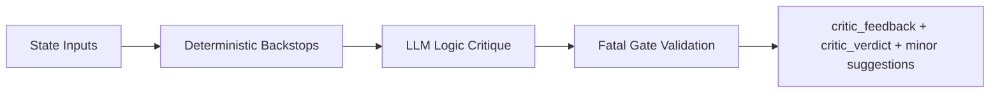

# Node Specification: Critic

## 1. Goal

Challenge strategy logic (not factual values) with deterministic guardrails to reduce false-fatal rejection noise.

---

## 2. Architecture



Node entrypoint:
- `Scripts/agents/router.py` → `critic_node()`
- critic engine: `Scripts/agents/critic.py` → `CriticAgent.audit()`

---

## 3. Code Strategy and Workflow

- **Deterministic first:** regime/insider contradiction checks run before LLM.
- **Prompt-level policy tightening:** `UNKNOWN` IV regime and `NOISE` insider verdict are not allowed to become Fatal.
- **Post-LLM fatal gate:** non-actionable Fatal issues are demoted to `critic_minor_suggestions`.
- **Output split:** blocking findings in `critic_feedback`; non-blocking polish in `critic_minor_suggestions`.

---

## 4. Output Data Schema (and Path)

| Output Key | Type | Notes | Path |
|---|---|---|---|
| `critic_feedback` | `List[AgentFeedback]` | Fatal-only blockers after gating | `Scripts/agents/critic.py` |
| `critic_verdict` | `"pass" \| "fatal" \| "minor"` | route control signal | `Scripts/agents/critic.py` |
| `critic_minor_suggestions` | `List[str]` | non-blocking polish notes for finalizer | `Scripts/agents/critic.py` |
| `node_audit_log` | `List[Dict[str, Any]]` | node telemetry record | `Scripts/agents/router.py` |

---

## 5. How to Test

- **Regression target:** reproduce prior false-fatal cases in e2e suite  
  `python Scripts/tests/test_router_e2e.py`
- **Compile check:** `python -m py_compile Scripts/agents/critic.py`
- **Prompt policy validation:** inspect `get_critic_prompt()` hard constraints.

---

## 6. Dependency Files and One-Line Install

Key files:
- `Scripts/agents/critic.py`
- `Scripts/agents/prompts.py`
- `Scripts/agents/analyst.py` (shared regime formatting helpers)
- `Scripts/agents/state.py`

Install:

```bash
pip install -r requirements.txt
```

