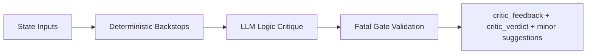

# Node Specification: Critic

## 1. Goal

Act as the Red-Team strategic challenge layer by stress-testing logic quality (not factual correctness) after Checker approval, and only escalating truly actionable strategic contradictions.

Primary controls:
- Detect regime-strategy mismatches (IV and macro).
- Enforce insider-signal discipline for directional conviction.
- Separate blocking issues from non-blocking optimization suggestions.
- Prevent false-fatal loops through deterministic actionability gates.

---

## 2. Architecture



Execution entrypoints:
- Router wrapper: `Scripts/agents/router.py` -> `critic_node()`
- Node engine: `Scripts/agents/critic.py` -> `CriticAgent.audit()`

---

## 3. Code Strategy and Workflow

- **Scope isolation:** Critic assumes factual validation is complete; it audits strategic coherence only.
- **Deterministic backstops first:** hard rules detect direct insider contradiction and regime-structure conflict before LLM critique.
- **Structured logic pass:** LLM returns `CriticResult` with strict split between `issues` (fatal) and `minor_suggestions` (non-blocking).
- **Actionability gating:** fatal candidates are validated against policy (for example, `UNKNOWN` IV regime and `NOISE` insider state cannot justify fatal blocks).
- **Demotion policy:** unsupported fatal findings are demoted to `critic_minor_suggestions` to avoid unnecessary rewrite loops.
- **Feedback channel split:** `critic_feedback` carries only revision-blocking findings, while polish recommendations are forwarded to Finalizer.

Workflow sequence:
1. Read draft + context signals (`silver_context`, `gold_context`, `macro_context`).
2. Compute deterministic IV regime and insider confidence.
3. Run deterministic contradiction checks.
4. Execute structured LLM logic critique.
5. Gate fatal findings for policy compliance and actionability.
6. Emit route verdict and minor-suggestion channel.

---

## 4. Output Data Schema (and Path)

| Output Key | Schema / Type | Core Fields | Path Ownership |
|---|---|---|---|
| `critic_feedback` | `List[AgentFeedback]` | fatal-only revision blockers with category-tagged comments | `Scripts/agents/critic.py` |
| `critic_verdict` | `Literal["pass","fatal","minor"]` | route control signal for post-critic edge | `Scripts/agents/critic.py` |
| `critic_minor_suggestions` | `List[str]` | non-blocking improvements for Finalizer polish integration | `Scripts/agents/critic.py` |
| `node_audit_log` | `List[Dict[str, Any]]` (append-only) | node, latency, verdict, findings count | emitted in `Scripts/agents/router.py` |

---

## 5. How to Test

- **Revision-loop logic regression:** `python Scripts/tests/test_router_e2e.py`
- **Guardrail policy regression:** `python -m pytest Scripts/tests/test_guardrails.py`
- **Interactive stress query:** `python -m Scripts query "Build a GLD options trade under elevated geopolitical risk and mixed insider flows."`
- **Syntax integrity:** `python -m py_compile Scripts/agents/critic.py`

---

## 6. Dependency Files and One-Line Install

Dependency files:
- `Scripts/agents/critic.py`
- `Scripts/agents/prompts.py`
- `Scripts/agents/analyst.py` (shared regime helper usage)
- `Scripts/agents/state.py`
- `Scripts/agents/router.py`

Related docs:
- [Node Checker](./Node_Checker.md)
- [Node Finalizer](./Node_Finalizer.md)
- [Agent Architecture](./Agent_Architecture.md)
- [Retrieval Architecture and Strategy](../Query_retrieval_docs/Retrieval_Architecture_and_Strategy.md)

One-line install:
```bash
pip install -r requirements.txt
```

