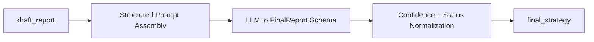

# Node Specification: Finalizer

## 1. Goal

Translate the validated draft strategy into the canonical structured delivery object for frontend rendering, downstream automation, and audit replay, while preserving deterministic confidence and evidence lineage semantics.

Primary mission controls:
- Enforce `FinalReport` schema output consistency.
- Carry forward evidence traceability into `supporting_evidence` and `evidence_links`.
- Reflect degraded runtime conditions in status and confidence ceilings.
- Emit stable machine-consumable payload (`final_strategy`) for all clients.

---

## 2. Architecture

Execution entrypoints:
- Router wrapper: `Scripts/agents/router.py` -> `finalizer_node()`
- Node engine: `Scripts/agents/finalizer.py` -> `FinalizerAgent.format_and_clean()`

---

## 3. Code Strategy and Workflow

- **Structured-output first:** Finalizer uses typed `FinalReport` output to avoid free-form markdown drift.
- **Evidence pool determinism:** citations are assembled from Silver lineage anchors and Gold `bronze_ref` metadata before model invocation.
- **Deterministic field overrides:** report date and citation source types are reconciled post-generation using pipeline-known truth.
- **Confidence governance policy:** score is capped by degradation state and revision depth to prevent overconfident outputs.
- **Fallback continuity:** primary `gpt-4o-mini` (OpenAI API, env `FINALIZER_PRIMARY_MODEL`); automatic switch to `options-expert-v1:latest` (Ollama, env `OLLAMA_FINALIZER_MODEL`) on failure; full failure yields safe degraded report skeleton.
- **Polish-channel integration:** `critic_minor_suggestions` are integrated as non-blocking quality improvements without changing directional thesis.
- **Delivery normalization:** output object is serialized as stable `final_strategy` dict for backend and frontend contract compatibility.

Workflow sequence:
1. Read draft + runtime flags + evidence context.
2. Build deterministic evidence pool.
3. Assemble finalizer payload (including minor suggestions).
4. Invoke structured model path with retries/fallbacks.
5. Reconcile deterministic fields and confidence bounds.
6. Emit `final_strategy` with markdown, report dict, and evidence links.

---

## 4. Output Data Schema (and Path)

| Output Key | Schema / Type | Core Fields | Path Ownership |
|---|---|---|---|
| `final_strategy.status` | `Literal["complete","degraded"]` | terminal status of finalization flow | `Scripts/agents/finalizer.py` |
| `final_strategy.degraded_reason` | `Optional[str]` | reason code for degraded path | `Scripts/agents/finalizer.py` |
| `final_strategy.final_report` | `FinalReport.model_dump()` | `report_date`, `macro_summary`, `trade_ideas`, `key_risks_and_hedges`, `confidence_score`, `conversation_reply` | `Scripts/agents/finalizer.py` |
| `final_strategy.markdown` | `str` | markdown-rendered report for UI download/rendering | `Scripts/agents/finalizer.py` |
| `final_strategy.evidence_links` | `List[SourceCitation.model_dump()]` | source_type + detail lineage links | `Scripts/agents/finalizer.py` |
| `final_strategy.confidence_score` | `float` | post-governance bounded confidence | `Scripts/agents/finalizer.py` |
| `node_audit_log` | `List[Dict[str, Any]]` (append-only) | node, revision, latency, status verdict | emitted in `Scripts/agents/router.py` |

---

## 5. How to Test

- **End-to-end final payload integrity:** `python Scripts/tests/test_router_e2e.py`
- **Interactive finalization run:** `python -m Scripts query "Generate a risk-defined GLD options strategy."`
- **Fallback/degradation sanity:** run query with unavailable primary model and inspect `final_strategy.status`
- **Syntax integrity:** `python -m py_compile Scripts/agents/finalizer.py`

---

## 6. Dependency Files and One-Line Install

Dependency files:
- `Scripts/agents/finalizer.py`
- `Scripts/agents/prompts.py`
- `Scripts/agents/state.py`
- `Scripts/agents/router.py`
- `Frontend/contracts.py`
- `Frontend/renderers.py`

Related docs:
- [Node Critic](./Node_Critic.md)
- [Frontend Runtime Guide](../modular_guide/Frontend%20Runtime%20Guide.md)
- [Observability](../modular_guide/Observability.md)
- [Agent Architecture](./Agent_Architecture.md)

