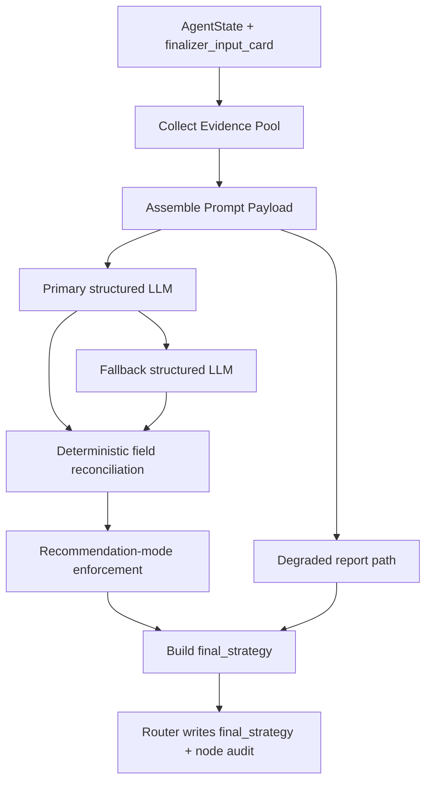

# Finalizer Node Specification

## 1. Role

The Finalizer node is the pipeline's structured delivery and mode-boundary renderer.

Its job is to:

- convert the checked Analyst draft into the deterministic `FinalReport` schema,
- preserve evidence lineage through `supporting_evidence` and `evidence_links`,
- enforce the final output mode decided upstream,
- render query-first, user-facing language without violating governance constraints,
- and emit the terminal `final_strategy` payload for UI and downstream consumers.

Primary implementation entrypoints:

- Router wrapper: [../../Scripts/agents/router.py](../../Scripts/agents/router.py)
- Node engine: [../../Scripts/agents/finalizer.py](../../Scripts/agents/finalizer.py)
- Prompt contract: [../../Scripts/agents/prompts.py](../../Scripts/agents/prompts.py)

---

## 2. Architecture and Workflow

### Execution sequence

1. Read the validated draft, runtime flags, and `finalizer_input_card`.
2. Build a deterministic evidence pool from Silver lineage anchors and Gold references.
3. Assemble the finalizer prompt with:
   - draft text
   - scope contract block
   - data capability block
   - time-range block
   - macro context
   - constrained minor edits
   - revision boundary block
4. Invoke the primary structured-output model.
5. If the primary path fails, invoke the fallback structured-output path.
6. Reconcile deterministic fields such as report date, source types, and confidence caps.
7. Enforce the current output mode.
8. Emit `final_strategy` with `final_report`, `markdown`, evidence links, and confidence.

---

## 3. Strategy

### 3.1 Shared mode and constraint vocabulary

Finalizer is the main consumer of the mode vocabulary authored by Critic.

| Field | How Finalizer Uses It |
|---|---|
| `recommendation_mode` | Primary answer class to enforce in the final report |
| `actionability_mode` | Mirror field used for downstream consistency and compatibility |
| `structure_visibility_mode` | Determines whether Finalizer may keep live structure, show one non-live example, or suppress structure entirely |
| `revision_constraints` | Full rendering contract that Finalizer must obey rather than reinterpret |

### 3.2 Mode definitions at render time

#### `actionable_options`

Finalizer may preserve:

- populated `trade_ideas`
- concrete options structure
- `recommended_structure`

#### `directional_watchlist`

Finalizer must:

- remove live trade promotion,
- keep the answer monitoring-oriented,
- and may surface at most one clearly non-live illustrative structure when `allow_illustrative_structure = true`.

#### `informational_only`

Finalizer must branch into one of two sub-cases:

- **market-read path**
  - when `market_read_only = true`
  - the answer should remain confident, posture-oriented, and non-apologetic
- **degraded / why-not-now path**
  - when `must_explain_why_not_now = true`
  - the answer must state the missing-data or extreme-risk reason and avoid promoting a live structure

### 3.3 `structure_visibility_mode`

Finalizer interprets:

- `recommended_structure`
  - concrete structure may remain
- `illustrative_structure`
  - one non-live example may remain if the constraints allow it
- `no_structure`
  - structure language should not surface

### 3.4 `revision_constraints`

Finalizer reads `revision_constraints` as the governing object for boundary behavior. Key fields include:

- `forbid_actionable_recommendation`
- `allow_illustrative_structure`
- `must_explain_why_not_now`
- `market_read_only`
- `must_disclose_risk`
- `main_risk_text`
- `why_not_now_text`
- `what_must_change`
- `illustrative_structure_hint`
- `high_risk`
- `market_impact_risk`
- `missing_hard_data`

Finalizer should obey this object, not derive substitute governance from free-form wording.

### 3.5 Card-first consumption

Finalizer prefers `finalizer_input_card` over scattered upstream state. This keeps ownership clean:

- Analyst provides evidence packaging
- Critic provides governance and mode constraints
- Finalizer renders the terminal answer

### 3.6 Model strategy

The current deployment standard is:

- **Primary OpenAI path:** `gpt-4o`
- **Fallback path:** environment-configured fallback, including the Ollama path when enabled

The implementation is environment-configurable, but the documentation assumes `gpt-4o` is the primary Finalizer model.

---

## 4. Input Data Schema

The Finalizer consumes the global `AgentState`, but it is intentionally card-driven.

### A. Core runtime inputs

| Field | Type | Purpose |
|---|---|---|
| `draft_report` | `str` | Fact-checked and logic-reviewed draft to convert into `FinalReport`. |
| `original_query` | `str` | Used to build the query-first `conversation_reply`. |
| `revision_count` | `int` | Used for degradation handling and confidence capping. |
| `is_fallback` | `bool` | Signals retrieval degradation. |
| `macro_context` | `str` | Used only for macro-summary enrichment. |
| `silver_context` | `Dict[str, Any]` | Used to construct evidence links and deterministic Silver citations. |
| `gold_context` | `List[Dict[str, Any]]` | Used to construct evidence links and deterministic Gold citations. |
| `critic_minor_suggestions` | `Optional[List[str]]` | Current-pass non-blocking polish notes. |
| `checker_edit_suggestions` | `Optional[List[FinalizerEdit]]` | Typed local edits from Checker. |
| `critic_edit_suggestions` | `Optional[List[FinalizerEdit]]` | Typed local edits from Critic. |
| `recommendation_mode` | `Optional[Literal["actionable_options","directional_watchlist","informational_only"]]` | Fallback source of final mode if the card is absent. |
| `critic_reasoning_profile` | `Optional[Dict[str, Any]]` | Fallback source of recommendation mode and reasoning context. |

### B. Preferred structured handoff: `finalizer_input_card`

Finalizer prefers these fields from `finalizer_input_card`:

- `recommendation_mode`
- `actionability_mode`
- `structure_visibility_mode`
- `revision_constraints`
- `minor_edits`
- `macro_backdrop`
- `scope_contract_summary`
- `retrieval_outcome_summary`
- `time_window`
- `data_capability_profile`
- `analyst_evidence_lines`
- `analyst_conclusion`
- `key_numbers`
- `required_silver_anchors`
- `required_gold_refs`
- `missing_query_slots`
- `query_slots`
- `slot_evidence_contracts`
- `analyst_contract_audit`

### C. Constraint fragments Finalizer consumes directly

The node uses these `revision_constraints` members in deterministic rendering:

- `actionability_mode`
- `structure_visibility_mode`
- `forbid_actionable_recommendation`
- `allow_illustrative_structure`
- `must_explain_why_not_now`
- `market_read_only`
- `must_disclose_risk`
- `main_risk_text`
- `why_not_now_text`
- `what_must_change`
- `illustrative_structure_hint`
- `high_risk`
- `market_impact_risk`
- `missing_hard_data`

---

## 5. Output Data Schema

Finalizer returns one terminal payload: `final_strategy`. The router writes it into `state["final_strategy"]`.

### A. `final_strategy` envelope

| Field | Type | Description |
|---|---|---|
| `status` | `Literal["complete","degraded"]` | Terminal finalization status. |
| `degraded_reason` | `Optional[str]` | Degradation reason when fallback rendering was required. |
| `final_report` | `Dict[str, Any]` | `FinalReport.model_dump()` payload. |
| `markdown` | `str` | Deterministic markdown rendering of the final report. |
| `evidence_links` | `List[Dict[str, Any]]` | Structured citation list derived from the evidence pool. |
| `report_provenance` | `Dict[str, Any]` | Provenance summary used for replay and downstream inspection. |
| `confidence_score` | `float` | Final bounded confidence after mode and degradation enforcement. |

### B. `FinalReport` structure

The `final_report` payload includes these top-level fields:

- `report_date`
- `macro_summary`
- `trade_ideas`
- `key_risks_and_hedges`
- `confidence_score`
- `conversation_reply`

When `trade_ideas` are present, each `TradeIdea` includes:

- `ticker`
- `asset_class`
- `market_outlook`
- `option_strategy`
- `strike_details`
- `expiration_date`
- `rationale`
- `catalysts`
- `risk_profile`
- `supporting_evidence`

### C. Router-owned state mutation after Finalizer returns

The router is responsible for writing:

- `final_strategy`
- `node_audit_log`

No other governance or revision-control fields are mutated by Finalizer itself.
