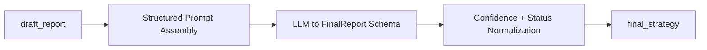

# Node Specification: Finalizer

## 1. Goal

Convert the latest markdown draft plus audited context into the canonical structured `FinalReport` payload for downstream consumers.

---

## 2. Architecture



Node entrypoint:
- `Scripts/agents/router.py` → `finalizer_node()`
- formatter implementation: `Scripts/agents/finalizer.py` → `FinalizerAgent.format_and_clean()`

---

## 3. Code Strategy and Workflow

- **Single-pass finalization:** no extra enrichment model branch.
- **Schema strictness:** output normalized into a deterministic dict from `FinalReport`.
- **Confidence governance:** score bounded by evidence quality, fallback state, and revision depth.
- **Delivery contract:** writes only `final_strategy` (+ node audit telemetry).

---

## 4. Output Data Schema (and Path)

| Output Key | Type | Notes | Path |
|---|---|---|---|
| `final_strategy.status` | `str` | `ok` / `degraded` / fallback variants | `Scripts/agents/finalizer.py` |
| `final_strategy.conversation_reply` | `str` | end-user strategy narrative | `Scripts/agents/finalizer.py` |
| `final_strategy.rationale` | `List[str]` | concise supporting logic points | `Scripts/agents/finalizer.py` |
| `final_strategy.risk_flags` | `List[str]` | explicit risk controls and caveats | `Scripts/agents/finalizer.py` |
| `final_strategy.evidence_links` | `List[Dict]` | data lineage anchors and source links | `Scripts/agents/finalizer.py` |
| `final_strategy.confidence_score` | `float` | bounded confidence score | `Scripts/agents/finalizer.py` |
| `node_audit_log` | `List[Dict[str, Any]]` | finalizer telemetry event | `Scripts/agents/router.py` |

---

## 5. How to Test

- **End-to-end output check:** `python Scripts/tests/test_router_e2e.py`
- **Single-run inspection:** `python -m Scripts query "Generate a risk-defined GLD options strategy."`
- **Compile check:** `python -m py_compile Scripts/agents/finalizer.py`

---

## 6. Dependency Files and One-Line Install

Key files:
- `Scripts/agents/finalizer.py`
- `Scripts/agents/prompts.py`
- `Scripts/agents/state.py`
- `Scripts/agents/router.py`

Install:

```bash
pip install -r requirements.txt
```

