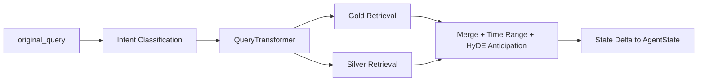

# Node Specification: Retrieval Master

## 1. Goal

Establish a deterministic, audit-ready retrieval envelope for the full agent graph by converting one user query into a complete state payload that is safe for Analyst consumption under both normal and degraded conditions.

Institutional objectives:
- Route each query to `sql_only`, `vector_only`, or `hybrid_both` with bounded latency.
- Preserve time-window compliance (`anchor_date`, `start_date`, `end_date`) across Gold and Silver engines.
- Expose semantic hedge context (`hyde_anticipation`) without breaking deterministic numeric truth.
- Guarantee downstream schema stability even if one retrieval engine fails.

---

## 2. Architecture



Execution entrypoints:
- Router node wrapper: `Scripts/agents/router.py` -> `master_retrieval_node()`
- Retrieval facade: `Scripts/retrieval/master_retriever.py` -> `MasterRetriever.retrieve()`
- Time predicate compiler: `Scripts/retrieval/time_adapter.py`

---

## 3. Code Strategy and Workflow

- **Atomic facade contract:** `MasterRetriever.retrieve()` centralizes intent routing, transform, Gold/Silver fetch planning, and payload assembly in one return object.
- **Per-route retrieval policy:** route-specific plans (`hybrid_both`, `vector_only`, `sql_only`) enforce deterministic behavior for primary retrieval and compensation retrieval.
- **Timeout isolation:** Gold and Silver calls are wrapped independently, so one stalled backend does not block the full graph.
- **HyDE governance:** semantic expansion is whitelist-gated and capped before Silver compensation queries are dispatched.
- **Time-window determinism:** one compiled source-predicate set drives both Qdrant and SQL retrieval, reducing date drift across modalities.
- **Degradation transparency:** fallback states carry explicit `status` and error channels instead of hidden silent failures.
- **Router-level coercion:** `router.py` normalizes `time_range` and `hyde_anticipation` into fully shaped defaults when upstream payloads are partial.

Operational workflow (high-level):
1. Classify route from raw query.
2. Run two-stage transform (`metadata` + HyDE).
3. Compile canonical time range and source predicates.
4. Execute route-specific retrieval tasks concurrently.
5. Apply macro/GPR/snapshot patching into Silver context.
6. Freeze deterministic Silver baseline and return state delta.

---

## 4. Output Data Schema (and Path)

| Output Key | Schema / Type | Required Core Fields | Path Ownership |
|---|---|---|---|
| `metadata` | `MetadataExtraction` (Pydantic, retrieval layer) | tickers, metrics, source_types, time_window, event_keyword | `Scripts/retrieval/master_retriever.py` |
| `gold_context` | `List[RetrievedChunk-like]` | content, bronze_ref, source_type, metadata.record_date | `Scripts/retrieval/master_retriever.py` |
| `silver_context` | `Dict[str, Any]` | `values`, `lineage_anchors`, `source_channel`, optional `compensation` | `Scripts/retrieval/master_retriever.py` |
| `silver_context_frozen` | `Optional[Dict[str, Any]]` | immutable Silver snapshot for Checker deterministic audit | `Scripts/retrieval/master_retriever.py` |
| `time_range` | `Dict[str, Any]` | `time_window_label`, `window_days`, `anchor_date`, `start_date`, `end_date`, `source_predicates` | `Scripts/retrieval/master_retriever.py` then coerced in `Scripts/agents/router.py` |
| `hyde_anticipation` | `Dict[str, Any]` | paragraph, rerank_query, raw_candidates, whitelisted_tickers, novel_tickers, source_channel | `Scripts/retrieval/master_retriever.py` then coerced in `Scripts/agents/router.py` |
| `macro_context` | `str` | markdown snapshot text for prompt preamble | loaded in `Scripts/agents/router.py` |
| `revision_count` | `int` | initialized to `0` on new graph entry | `Scripts/agents/router.py` |
| `checker_verdict` / `critic_verdict` | `Optional[Literal["pass","fatal","minor"]]` | reset to `None` at graph entry | `Scripts/agents/router.py` |
| `is_fallback` | `bool` | indicates retrieval partial failure mode | `Scripts/agents/router.py` |
| `node_audit_log` | `List[Dict[str, Any]]` (append-only) | node name, revision, latency, verdict, key I/O | `Scripts/agents/router.py` |

---

## 5. How to Test

- **Retriever + graph integration:** `python -m Scripts query "Past month AAPL Form-4 selling signal and put positioning?"`
- **Route regression set:** `python Scripts/tests/test_router_e2e.py`
- **Retriever contract test:** `python Scripts/tests/test_master_retriever.py`
- **Warmup before heavy runs:** `python -m Scripts warmup --roles analyst router checker`
- **Operational state check:** `python -m Scripts status`

---

## 6. Dependency Files and One-Line Install

Dependency files:
- `Scripts/retrieval/master_retriever.py`
- `Scripts/retrieval/query_transform.py`
- `Scripts/retrieval/qdrant_retriever.py`
- `Scripts/retrieval/sql_tools.py`
- `Scripts/retrieval/time_adapter.py`
- `Scripts/retrieval/schema.py`
- `Scripts/agents/router.py`
- `Scripts/agents/state.py`

Related docs:
- [Retrieval Architecture and Strategy](../Query_retrieval_docs/Retrieval_Architecture_and_Strategy.md)
- [Time Adapter Contract](../Query_retrieval_docs/Time_Adapter.md)
- [Silver SQL Tools](../Query_retrieval_docs/Silver_SQL_Tools.md)
- [Qdrant Retriever Docs](../Query_retrieval_docs/Qdrant_retriever_docs.md)
- [Agent Architecture](./Agent_Architecture.md)

One-line install:
```bash
pip install -r requirements.txt
```

