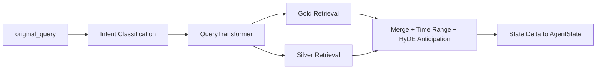

# Node Specification: Retrieval Master

## 1. Goal

Deliver a fully prepared retrieval context for downstream reasoning by orchestrating:
- intent classification,
- query transform (metadata + HyDE),
- Gold retrieval (Qdrant),
- Silver retrieval (DuckDB/Parquet),
- macro preamble and fallback-safe state shaping.

---

## 2. Architecture



Primary implementation path:
- `Scripts/agents/router.py` → `master_retrieval_node()`
- delegated orchestrator: `Scripts/retrieval/master_retriever.py`

---

## 3. Code Strategy and Workflow

- **Atomic retrieval façade:** `MasterRetriever.retrieve()` owns route planning and returns one structured payload.
- **Dual-track retrieval:** semantic Gold + numeric Silver run with timeout isolation.
- **Fallback-safe contracts:** router-level coercion fills missing `time_range` and `hyde_anticipation` keys.
- **Auditability:** node emits `node_audit_log` entries with latency, verdict, and key state IO.

---

## 4. Output Data Schema (and Path)

| Output Key | Type | Notes | Path |
|---|---|---|---|
| `metadata` | `QueryMetadata`-like object | extracted routing metadata | `Scripts/agents/router.py` |
| `gold_context` | `List[Dict[str, Any]]` | Qdrant chunks + refs | `Scripts/retrieval/master_retriever.py` |
| `silver_context` | `Dict[str, Any]` | values + lineage anchors | `Scripts/retrieval/master_retriever.py` |
| `time_range` | `Dict[str, Any]` | canonical audit window | `Scripts/agents/router.py` |
| `hyde_anticipation` | `Dict[str, Any]` | HyDE semantic hedge payload | `Scripts/retrieval/master_retriever.py` |
| `macro_context` | `str` | loaded from macro snapshot | `Scripts/agents/router.py` |
| `revision_count` | `int` | initialized to `0` at entry | `Scripts/agents/router.py` |
| `checker_verdict` / `critic_verdict` | `Optional[str]` | reset to `None` | `Scripts/agents/router.py` |

---

## 5. How to Test

- **Node path in e2e:** `python Scripts/tests/test_router_e2e.py`
- **Retriever integration sanity:** `python -m Scripts query "Past month AAPL Form-4 selling signal and put positioning?"`
- **Warmup before heavy tests:** `python -m Scripts warmup --roles analyst router checker`

---

## 6. Dependency Files and One-Line Install

Key dependencies:
- `Scripts/retrieval/master_retriever.py`
- `Scripts/retrieval/query_transform.py`
- `Scripts/retrieval/qdrant_retriever.py`
- `Scripts/retrieval/sql_tools.py`
- `Scripts/agents/state.py`

Install:

```bash
pip install -r requirements.txt
```

