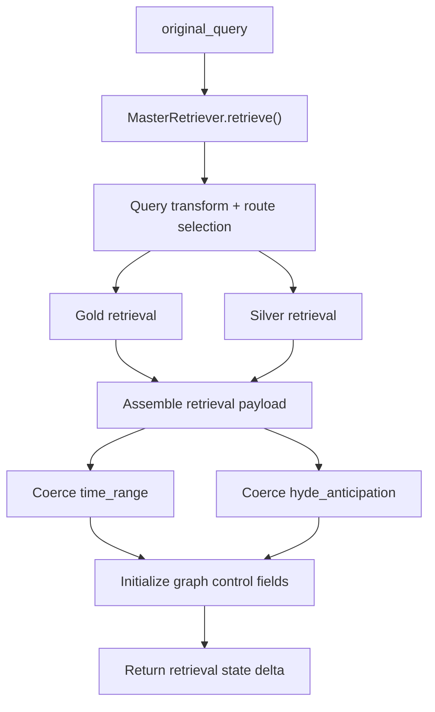

# Retrieval Master Node Specification

## 1. Role

The Retrieval Master node is the pipeline's deterministic evidence envelope compiler.

Its job is to turn one raw user query into a schema-stable retrieval state that every downstream node can trust. It does not draft analysis, audit logic, or render the final answer. Its job is to:

- classify and transform the query into structured retrieval intent,
- execute route-aware Gold and Silver retrieval,
- normalize time-window audit data and HyDE anticipation fields,
- emit `scope_contract` and `retrieval_outcome` for downstream governance,
- initialize graph-control fields so the workflow starts from a clean state.

Primary implementation entrypoints:

- Router wrapper: [../../Scripts/agents/router.py](../../Scripts/agents/router.py)
- Retrieval facade: [../../Scripts/retrieval/master_retriever.py](../../Scripts/retrieval/master_retriever.py)
- State contract: [../../Scripts/agents/state.py](../../Scripts/agents/state.py)
- Ontology contract: [../../Scripts/core/financial_ontology.py](../../Scripts/core/financial_ontology.py)

---

## 2. Architecture and Workflow

### Execution sequence

1. Read `original_query` from `AgentState`.
2. Invoke `MasterRetriever.retrieve()` to obtain:
   - `metadata`
   - `gold_context`
   - `silver_context`
   - `silver_context_frozen`
   - `scope_contract`
   - `retrieval_outcome`
   - optional `time_range`
   - optional `hyde_anticipation`
3. Load the macro snapshot into `macro_context`.
4. Coerce `time_range` into a fully shaped audit object even when retrieval degraded.
5. Coerce `hyde_anticipation` into a fully shaped object even when HyDE is absent.
6. Reset graph-control and governance fields for a fresh run.
7. Emit an append-only retrieval audit event into `node_audit_log`.

---

## 3. Strategy

### 3.1 Retrieval-owned contract surfaces

Retrieval Master is the first node to emit the runtime contracts later consumed by Checker, Critic, and Finalizer:

- `scope_contract`
- `retrieval_outcome`
- `silver_context_frozen`

These are not cosmetic payloads. They are the upstream contract layer used later for:

- slot-coverage validation,
- missing-source honesty,
- mode ceilings,
- downgrade enforcement.

### 3.2 Relationship to the shared mode vocabulary

Retrieval Master does not author the final mode, but it defines the ceiling within which later nodes must work.

It initializes:

- `recommendation_mode = None`
- `actionability_mode = None`
- `structure_visibility_mode = None`
- `revision_constraints = None`

and emits the contract objects later used to decide them.

#### `scope_contract` contribution

Retrieval Master is the first place where the graph learns:

- `query_family`
- `query_slots`
- `strict_sources`
- `output_mode_ceiling`
- `specificity_ceiling`
- `required_disclosures`
- `slot_evidence_contracts`

Those fields are later consumed by Critic when defining:

- `recommendation_mode`
- `actionability_mode`
- `structure_visibility_mode`
- `revision_constraints`

#### `retrieval_outcome` contribution

Retrieval Master also emits:

- `strict_sources_hit`
- `soft_sources_hit`
- `missing_strict_sources`
- `missing_query_slots`

These are the main hard-missing signals used later in mode selection.

### 3.3 Baseline freezing

`silver_context_frozen` is written here and later treated as immutable by Checker. This creates a stable numeric baseline even if later rescue or compensation logic updates the live `silver_context`.

### 3.4 Run reset semantics

This node clears or reinitializes state that must not leak across runs:

- `checker_verdict`
- `critic_verdict`
- `recommendation_mode`
- `actionability_mode`
- `structure_visibility_mode`
- `revision_constraints`
- `finalizer_input_card`
- `iv_regime_pinned`

That reset behavior is part of the node's core responsibility.

---

## 4. Input Data Schema

The Retrieval Master consumes the global `AgentState`, but it directly depends on a small set of fields.

### A. Core runtime inputs

| Field | Type | Purpose |
|---|---|---|
| `original_query` | `str` | Single required retrieval input. Used for route classification and retrieval planning. |
| `node_audit_log` | `List[Dict[str, Any]]` | Append-only audit stream; retrieval appends its own event to it. |

### B. Practical state assumptions

Although the node reads only a small surface, it behaves as the graph reset boundary. Its output overwrites or reinitializes multiple downstream-facing control fields so that a rerun under a checkpointer does not inherit stale mode or revision state.

---

## 5. Output Data Schema

The Retrieval Master returns a state delta to the router. The router writes these fields directly into `AgentState`.

### A. Retrieval payload fields

| Field | Type | Description |
|---|---|---|
| `metadata` | `QueryMetadata` or `Dict[str, Any]` | Structured retrieval intent, including tickers, metrics, source families, and normalized time window. |
| `gold_context` | `List[Dict[str, Any]]` | Gold retrieval payload used later by Analyst, Checker, Critic, and Finalizer. |
| `silver_context` | `Dict[str, Any]` | Live Silver numeric context, including `values` and `lineage_anchors`. |
| `silver_context_frozen` | `Optional[Dict[str, Any]]` | Immutable Silver baseline for downstream deterministic audit. |
| `scope_contract` | `Optional[Dict[str, Any]]` | Runtime scope envelope, including family, slots, source ceilings, and disclosure requirements. |
| `retrieval_outcome` | `Optional[Dict[str, Any]]` | Runtime evidence-status envelope, including strict-source hits and missing query slots. |
| `time_range` | `Dict[str, Any]` | Fully shaped retrieval time contract, including label, anchor date, start date, end date, and serialized source predicates. |
| `hyde_anticipation` | `Dict[str, Any]` | Fully shaped semantic hedge payload, including paragraph, rerank query, whitelisted tickers, and source channel. |
| `macro_context` | `str` | Macro preamble loaded from the latest snapshot and reused by all downstream nodes. |

### B. Graph-control fields initialized by Retrieval Master

| Field | Type | Description |
|---|---|---|
| `revision_count` | `int` | Reset to `0` at graph entry. |
| `is_fallback` | `bool` | Indicates degraded retrieval status. |
| `checker_verdict` | `Optional[Literal["pass","fatal","minor"]]` | Reset to `None` at graph entry. |
| `critic_verdict` | `Optional[Literal["pass","fatal","minor"]]` | Reset to `None` at graph entry. |
| `recommendation_mode` | `Optional[Literal["actionable_options","directional_watchlist","informational_only"]]` | Reset to `None` at graph entry. |
| `actionability_mode` | `Optional[Literal["actionable_options","directional_watchlist","informational_only"]]` | Reset to `None` at graph entry. |
| `structure_visibility_mode` | `Optional[Literal["recommended_structure","illustrative_structure","no_structure"]]` | Reset to `None` at graph entry. |
| `revision_constraints` | `Optional[Dict[str, Any]]` | Reset to `None` at graph entry. |
| `checker_edit_suggestions` | `Optional[List[FinalizerEdit]]` | Reset to `None` at graph entry. |
| `critic_edit_suggestions` | `Optional[List[FinalizerEdit]]` | Reset to `None` at graph entry. |
| `analyst_fallback_used` | `Optional[bool]` | Reset to `None` at graph entry. |
| `finalizer_input_card` | `Optional[Dict[str, Any]]` | Reset to `None` at graph entry. |
| `iv_regime_pinned` | `Optional[Dict[str, Any]]` | Reset to `None` so the new Analyst pass recomputes it from fresh retrieval. |

### C. Audit output

The node appends one structured event to `node_audit_log` containing:

- `node="retrieval_master"`
- `revision_n=0`
- latency and timing
- `verdict="success"` or `"fallback"`
- summary of `gold_n`, `silver_n`, and `is_fallback`
