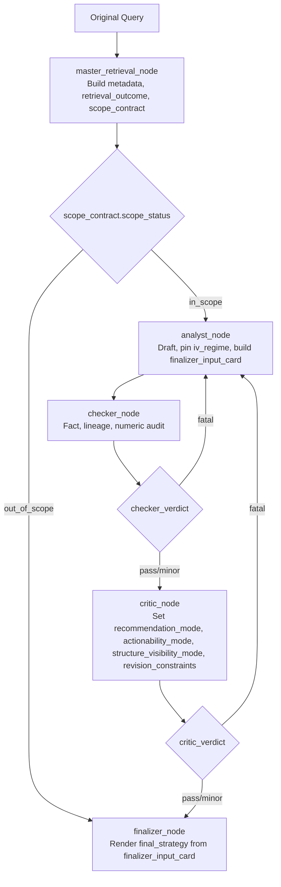

# Financial Contracts Control Plane

## Executive Summary

This document defines the financial contracts that govern the pipeline across retrieval, analysis, critique, and final rendering.

The most important design principle is that **not all "modes" live at the same layer**. The system uses several contract layers:

- **problem classification contracts** decide what kind of question this is
- **evidence and coverage contracts** decide what data is required to answer it
- **output governance contracts** decide how far the answer may go
- **posture synthesis contracts** decide how current market posture and transition risk are described

Treating these layers separately keeps the workflow deterministic, auditable, and cleanly owned by each node.

## Contract Topology

### Layer 1: Query Classification

These contracts describe **what kind of problem is being solved**.

- `query_family`
- `analysis_mode`
- `market_analysis_only`
- `coverage_basis`

These are established upstream in retrieval and scope construction, then passed forward through `scope_contract`.

### Layer 2: Evidence Sufficiency

These contracts describe **what evidence is needed** and whether the answer is sufficiently grounded.

- slot-level evidence contracts
- requested vs available metrics
- requested vs strict vs soft sources
- evidence coverage severity

These contracts are defined in core modules and carried through retrieval and critique.

### Layer 3: Output Governance

These contracts describe **how actionable the answer may be**.

- `recommendation_mode`
- `actionability_mode`
- `structure_visibility_mode`
- `section_ownership`

These are set in the Critic layer and consumed by the Finalizer.

### Layer 4: Posture Interpretation

These contracts describe **what the current market posture is** and **what its next adverse transition would be**.

- `posture_label`
- `posture_takeaway`
- `posture_rationale`
- `base_regime_read`
- `escalation_risk_archetype`
- `escalation_risk_read`

These are activated only for valid read-style posture outputs.

## Canonical Mode Inventory

### 1. `query_family`

**Where it lives**

- `Scripts/core/financial_ontology.py`
- carried in `scope_contract`

**What it means**

`query_family` is the top-level problem family. It determines the financial domain, expected signal types, and downstream reasoning path.

**Current canonical families**

- `insider_flow_driven`
- `single_name_options`
- `options_microstructure`
- `cross_asset_regime`
- `macro_regime`
- `geopolitical_commodity`

**What it controls**

- which slot/evidence contracts are built
- whether the query is posture-capable
- what kind of analyst synthesis is expected

### 2. `analysis_mode`

**Where it lives**

- carried in `scope_contract`
- used downstream in render and compliance logic

**What it means**

`analysis_mode` describes the answer pattern, not the final recommendation level.

**Current values**

- `default_read`
- `data_backed_read`

**How to read it**

- `default_read`: standard answer path
- `data_backed_read`: answer must be grounded in retrieved evidence and handled as a data-backed read

### 3. `market_analysis_only`

**Where it lives**

- carried in `scope_contract`
- consumed by posture and governance logic

**What it means**

This is the authoritative contract for whether the query may end as a **read-only market answer** without needing a promotable strike-level options structure.

It is the key activation signal for posture synthesis.

**What it controls**

- whether read-only posture output is a valid end state
- whether posture synthesis should activate
- whether a concrete options structure is required

### 4. `coverage_basis`

**Where it lives**

- carried in `scope_contract`
- produced by source-requirement normalization

**What it means**

`coverage_basis` describes the truthness basis of the answer, not the retrieval route by itself.

**Current values**

- `silver_only`
- `silver_primary_with_soft_gold`
- `hybrid_required`

**How to read it**

- `silver_only`: the answer can be grounded entirely in structured Silver evidence
- `silver_primary_with_soft_gold`: Silver is primary; Gold may enrich but is not hard-required
- `hybrid_required`: both structured and unstructured evidence are part of the strict answer contract

### 5. `recommendation_mode`

**Where it lives**

- `Scripts/agents/state.py`
- set by Critic and merged into `finalizer_input_card`

**What it means**

This is the main downstream output mode. It controls how far the answer is allowed to go.

**Current values**

- `actionable_options`
- `directional_watchlist`
- `informational_only`

**How to read it**

- `actionable_options`: concrete options structure discussion is allowed
- `directional_watchlist`: directional or watchlist-grade output is allowed, but not a concrete promoted structure
- `informational_only`: the answer remains read-only or contextual

### 6. `actionability_mode`

**Where it lives**

- `Scripts/agents/state.py`
- set by Critic

**What it means**

This mirrors the current actionability ceiling for the answer. In the present code path it shares the same value space as `recommendation_mode`, but it exists as a separate governance surface so actionability can remain explicit even if recommendation language later evolves.

**Current values**

- `actionable_options`
- `directional_watchlist`
- `informational_only`

### 7. `structure_visibility_mode`

**Where it lives**

- `Scripts/agents/state.py`
- set by Critic

**What it means**

This controls how much options structure detail may be displayed.

**Current values**

- `recommended_structure`
- `illustrative_structure`
- `no_structure`

**How to read it**

- `recommended_structure`: a concrete structure may be shown as an actual recommendation
- `illustrative_structure`: a structure may appear only as an illustration, not as a promoted trade
- `no_structure`: no structure should be shown

### 8. `evidence_coverage_severity`

**Where it lives**

- `Scripts/agents/state.py`
- carried inside `revision_constraints`

**What it means**

This contract separates evidence coverage disclosure from market risk.

**Current values**

- `none`
- `soft_note`
- `hard_gap`

**How to read it**

- `none`: required evidence is present
- `soft_note`: the read still stands, but a minor coverage note may be disclosed
- `hard_gap`: required evidence is missing, and the read is materially impaired or degraded

This contract must not be confused with the `Risks` section, which is reserved for market and invalidation risk.

### 9. `posture_label`

**Where it lives**

- `Scripts/core/posture_contract.py`

**What it means**

`posture_label` is the canonical financial-state label for read-only posture outputs.

**Current values**

- `constructive`
- `neutral`
- `neutral_to_defensive`
- `defensive`
- `stressed`

**Activation rule**

Posture synthesis activates only when all three conditions hold:

1. `market_analysis_only = true`
2. `query_family` is in `READ_STYLE_POSTURE_FAMILIES`
3. `recommendation_mode != actionable_options`

This means posture synthesis is bound to the scope contract, not to query phrasing.

### 10. `escalation_risk_archetype`

**Where it lives**

- `Scripts/core/posture_contract.py`

**What it means**

This is the canonical transition-risk type for posture reads. It does not describe generic caveats. It describes the most likely **next adverse evolution** from the current posture.

**Current values**

- `defensive_flow_acceleration`
- `vol_spike_repricing`
- `premium_compression`
- `execution_fragility`
- `regime_reversal`

**How to read it**

- `defensive_flow_acceleration`: defensive positioning is already present and may intensify into more aggressive downside hedging
- `vol_spike_repricing`: volatility may reprice sharply higher and make hedges much more expensive
- `premium_compression`: already-rich protection may mean-revert, exposing overpayment risk
- `execution_fragility`: implementation cost and slippage are the dominant risk
- `regime_reversal`: the current signal may fade or reverse

## Financial State Contracts

### Posture State Machine

The posture contract does not generate prose directly from raw numbers. It first derives normalized financial states.

**Current intermediate states**

- `pcr_state`
  - `protection_heavy`
  - `neutral_flow`
  - `call_skewed`
  - `unknown`
- `iv_regime_state`
  - `LOW`
  - `NORMAL`
  - `HIGH`
  - `UNKNOWN`
- `iv_richness_state`
  - `cheap`
  - `mid_range`
  - `firm`
  - `rich`
  - `unknown`
- `skew_state`
  - `positive_put_premium`
  - `flat`
  - `negative_call_premium`
  - `unknown`
- `skew_intensity`
  - `modest`
  - `strong`
  - `flat`
  - `unknown`
- `liquidity_state`
  - `healthy`
  - `fragile`
  - `unknown`
- `market_impact_risk`
  - `Low`
  - `Medium`
  - `High`
  - `Unknown`
- `posture_transition_risk`
  - same archetype space as `escalation_risk_archetype`

These states are carried in `posture_reasoning_trace`, which makes the reasoning path explicit and auditable.

### Liquidity and Execution Contracts

**Where they live**

- `Scripts/core/liquidity_policy.py`

**Canonical modes**

- `LiquidityTier`
  - `tier1`
  - `tier2`
  - `tier3`
  - `unknown`
- `MarketImpactRisk`
  - `Low`
  - `Medium`
  - `High`
  - `Unknown`

**What they control**

- ticker-level execution quality
- whether the dominant risk should be execution fragility
- whether posture is still practically implementable

## Evidence Sufficiency Contracts

### Slot Evidence Contract

**Where it lives**

- `Scripts/core/evidence_contracts.py`

**What it means**

The slot evidence contract defines what evidence is needed to satisfy each requested financial question.

Each slot contract includes:

- `slot_name`
- `slot_label`
- `satisfaction_mode`
- `required_disclosures`
- `min_groups_required`
- `evidence_groups`

**Typical satisfaction modes**

- `evidence_required`
- `evidence_or_disclose`

This is the bridge between query semantics and evidence sufficiency.

### Data Capability Profile

**Where it lives**

- `Scripts/core/financial_reasoning_contract.py`

**What it means**

The data capability profile describes what the system can actually support for the current query.

Representative fields include:

- `requested_metrics`
- `requested_sources`
- `requested_time_window`
- `available_metrics`
- `unavailable_metrics`
- `has_options_source`
- `has_options_chain_support`
- `has_iv_signal`
- `has_liquidity_signal`
- `has_strike_support`
- `has_dte_support`
- `has_price_signal`
- `has_gold_evidence`
- `can_support_concrete_option_structure`

This contract feeds Critic-side governance and recommendation-mode selection.

## Node Ownership Model

### Retrieval and Scope

**Primary file**

- `Scripts/agents/router.py`

**Node**

- `master_retrieval_node`

**Owns**

- `metadata`
- `gold_context`
- `silver_context`
- `silver_context_frozen`
- `scope_contract`
- `retrieval_outcome`
- `time_range`
- `hyde_anticipation`

**Sets or resets**

- `recommendation_mode = None`
- `actionability_mode = None`
- `structure_visibility_mode = None`
- `revision_constraints = None`
- `finalizer_input_card = None`
- `iv_regime_pinned = None`

This node decides whether the request is in scope and what the upstream financial contract looks like. It does **not** decide posture labels or final recommendation level.

### Analyst

**Primary files**

- `Scripts/agents/router.py`
- `Scripts/agents/state.py`
- `Scripts/core/posture_contract.py`

**Node**

- `analyst_node`

**Owns**

- first-pass draft synthesis
- `iv_regime_pinned` on the first valid pass
- posture synthesis when the posture contract is active
- assembly of `finalizer_input_card`

**Posture-specific outputs**

- `posture_label`
- `posture_takeaway`
- `posture_rationale`
- `base_regime_read`
- `posture_reasoning_trace`

Analyst owns the **current-state interpretation**. It does not own the final `Risks` section semantics.

### Checker

**Primary files**

- `Scripts/agents/router.py`
- `Scripts/agents/state.py`

**Node**

- `checker_node`

**Owns**

- factual audit
- lineage audit
- deterministic numeric checking
- fatal/minor audit feedback

Checker does not define financial modes. It validates whether the current draft is compliant with evidence and lineage.

### Critic

**Primary files**

- `Scripts/agents/router.py`
- `Scripts/agents/state.py`
- `Scripts/core/posture_contract.py`
- `Scripts/core/financial_reasoning_contract.py`

**Node**

- `critic_node`

**Owns**

- `recommendation_mode`
- `actionability_mode`
- `structure_visibility_mode`
- `revision_constraints`
- `critic_reasoning_profile`

**Posture-specific ownership**

When the posture contract is active, Critic consumes:

- `posture_label`
- `posture_reasoning_trace`
- `escalation_risk_archetype`
- `escalation_risk_read`

Critic then:

- checks consistency between posture, evidence, and recommendation level
- sets `true_risk_text` from the contract-driven transition-risk read
- enforces output governance

Critic owns **risk governance**, but not the original financial ontology of posture or transition risk.

### Finalizer

**Primary files**

- `Scripts/agents/router.py`
- `Scripts/agents/state.py`

**Node**

- `finalizer_node`

**Owns**

- final section placement
- final structured output assembly

**Consumes**

- `recommendation_mode`
- `actionability_mode`
- `structure_visibility_mode`
- `revision_constraints`
- `posture_takeaway`
- `posture_rationale`
- `base_regime_read`
- `escalation_risk_read`

Finalizer does not derive new financial logic. It only renders structured upstream outputs into the correct sections.

## Cross-Node Handoff Surface

### `scope_contract`

The central upstream control surface. It carries:

- problem family
- answer pattern
- source strictness basis
- posture eligibility
- coverage basis

This is the handoff from retrieval into the analytical path.

### `iv_regime_pinned`

Pinned by Analyst on the first pass and then reused verbatim across revisions so the regime interpretation does not drift mid-pipeline.

### `revision_constraints`

The main Critic-to-Finalizer governance bundle. It may carry:

- `mode_boundary_text`
- `illustrative_structure_text`
- `true_risk_text`
- `evidence_coverage_note`
- `evidence_coverage_severity`
- `read_valid_despite_coverage_gap`
- `section_ownership`

### `finalizer_input_card`

The single structured Finalizer handoff.

**Analyst contributes**

- evidence synthesis
- posture synthesis
- structure hints

**Critic contributes**

- governance constraints
- output mode
- render ownership
- risk channel

**Finalizer consumes**

- the merged card only

## Workflow and Mode Transitions

## Mode Determination Sequence

### Stage 1: Retrieval establishes upstream contracts

In `Scripts/agents/router.py`, `master_retrieval_node` writes:

- `scope_contract`
- `retrieval_outcome`
- `silver_context`
- `gold_context`

At this point the system knows:

- the problem family
- the evidence basis
- whether the query is in scope
- whether the answer may be a read-only market output

### Stage 2: Analyst activates posture synthesis if eligible

Analyst reads:

- `scope_contract`
- `silver_context`
- `iv_regime_pinned`
- current recommendation constraints from state, if present

Analyst activates posture synthesis only when:

- `market_analysis_only = true`
- `query_family` is posture-capable
- `recommendation_mode != actionable_options`

The posture contract then derives:

- financial interpretation states
- `posture_label`
- `posture_takeaway`
- `posture_rationale`
- `base_regime_read`
- `escalation_risk_archetype`
- `escalation_risk_read`

### Stage 3: Checker validates the draft

Checker does not decide modes. It decides whether the current draft is factually and evidentially admissible.

### Stage 4: Critic sets governance modes

Critic decides:

- `recommendation_mode`
- `actionability_mode`
- `structure_visibility_mode`
- `revision_constraints`

When posture synthesis is active, Critic uses the posture contract outputs to keep:

- current-state interpretation
- transition-risk interpretation
- render governance

aligned with one another.

### Stage 5: Finalizer renders the controlled answer

Finalizer receives the merged `finalizer_input_card` and places content by section:

- `Direct Conclusion`
  - posture takeaway
  - strict evidence
- `Asset / Options Read`
  - posture rationale
  - base regime interpretation
  - supporting metrics
- `Recommendation Mode`
  - actionability boundary only
- `Risks / What Would Change the View`
  - transition-risk read only

## Practical Interpretation Rules

### Not all modes are peers

The most common mistake is to treat all control fields as if they are parallel modes. They are not.

Use this mental model instead:

- `query_family` = what kind of question this is
- `analysis_mode` = what kind of answer workflow this requires
- `market_analysis_only` = whether a read-only answer is valid
- `coverage_basis` = what evidence basis makes the answer true enough
- `recommendation_mode` = how far the answer may go
- `structure_visibility_mode` = how much structure detail may be shown
- `posture_label` = what the current market posture is
- `escalation_risk_archetype` = what the next adverse transition would be

### Current state and risk must not be conflated

The posture contract deliberately separates:

- `base_regime_read`
  - the current priced state
- `escalation_risk_read`
  - the next deterioration path

This prevents the common failure mode where Asset Read and Risks appear to contradict each other even though they are meant to describe different time horizons.

## File Map

- `Scripts/core/financial_ontology.py`
  - family taxonomy and semantic mapping
- `Scripts/core/evidence_contracts.py`
  - slot-level evidence sufficiency contracts
- `Scripts/core/financial_reasoning_contract.py`
  - capability profile and structure-governance support logic
- `Scripts/core/liquidity_policy.py`
  - liquidity tiers and market-impact interpretation
- `Scripts/core/posture_contract.py`
  - posture labels, posture reasoning trace, current-state interpretation, transition-risk interpretation
- `Scripts/agents/state.py`
  - global state schema and handoff contracts
- `Scripts/agents/router.py`
  - node-level workflow, mode resets, and cross-node handoff assembly

## Closing Principle

The control plane is cleanest when each layer owns exactly one kind of decision:

- retrieval decides **what kind of problem and evidence basis exists**
- Analyst decides **what the current market state means**
- Critic decides **how far the answer may go and what risk framing is valid**
- Finalizer decides **where each already-defined output belongs**

That separation is what keeps the system deterministic, interpretable, and stable across revisions.
