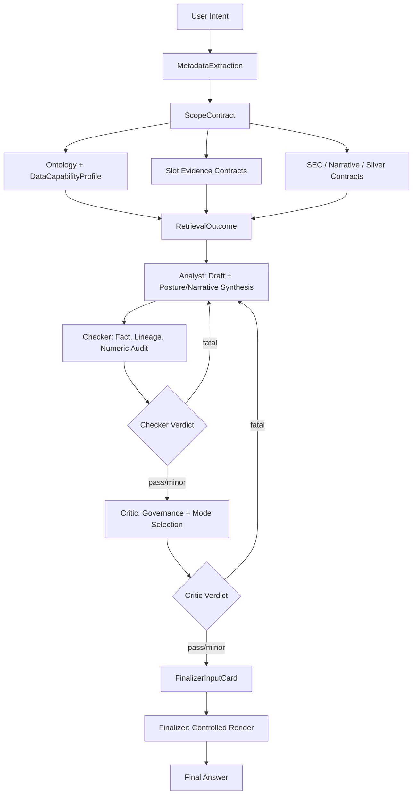

# Financial Contracts Control Plane

## Executive Summary

This document is the high-level institutional reference for the financial RAG contract control plane. It defines how user intent becomes a scoped financial problem, how evidence requirements are compiled, how deterministic financial interpretation is derived, and how final output actionability is governed.

The system is built around one central principle:

**Not all modes live at the same layer.**

Different contract layers answer different questions:

| Layer | Question Answered | Primary Owner |
|---|---|---|
| Intent and scope | What kind of problem is this? | Query transform and retrieval |
| Ontology and capability | What can the system support with current data? | Core ontology and reasoning contracts |
| Evidence and coverage | What evidence is required, found, missing, or disclosable? | Retrieval, Checker, Critic |
| SEC analysis | What do SEC filings actually imply by subtype? | SEC contract and SEC analysis helpers |
| Posture and liquidity | What is the current market state and next adverse transition? | Analyst with deterministic core helpers |
| Narrative synthesis | What macro/news transmission can be rendered safely? | Narrative contract and Analyst |
| Governance and finalization | How actionable may the answer be, and where does each section belong? | Critic and Finalizer |

This separation keeps the workflow deterministic, auditable, and stable across revisions.

## Contract Layering Model

The control plane is best understood as a narrowing pipeline. Early contracts classify and bound the question. Middle contracts determine evidence and interpretation. Late contracts govern output strength and rendering.

| Layer | Representative Contracts | Purpose | Output |
|---|---|---|---|
| Intent extraction | `MetadataExtraction` | Convert user language into structured financial intent | tickers, metrics, sources, surfaces, `read_profile` |
| Scope construction | `ScopeContract` | Compile answerability, source strictness, ceilings, and slot requirements | `query_family`, `coverage_basis`, `query_slots`, ceilings |
| Ontology mapping | `financial_ontology.py` | Map business metrics to physical data support | allowed metrics, unavailable metrics, column mappings |
| Silver context normalization | `effective_silver_context` | Expose canonical structured values without mutating provenance | effective Silver view |
| SEC contract | `SECAnalysisBundle` | Separate Form 4 and 8-K evidence semantics | coverage, features, filing analysis, disclosures |
| Evidence sufficiency | slot evidence contracts | Define required evidence groups per query family | slot status and coverage constraints |
| Data capability | `DataCapabilityProfile` | Determine how much structure/actionability data can support | concrete structure gate |
| Posture and liquidity | `derive_posture_contract`, liquidity policy | Derive market posture, execution risk, and transition risk | posture label, trace, base read, escalation risk |
| Narrative contract | `NewsSemanticProfile`, `NarrativeBrief` | Produce deterministic macro/news render fields | narrative fields |
| Governance | `recommendation_mode`, `revision_constraints` | Enforce actionability and section ownership | finalizer-safe constraints |
| Final rendering | `finalizer_input_card` | Render controlled answer without new financial reasoning | final strategy |

## End-To-End Workflow

The workflow is intentionally staged. Downstream nodes may consume upstream contracts, but they should not take over upstream ownership.

## Primary Contract Surfaces

### `MetadataExtraction`

`MetadataExtraction` is the structured intent payload. It answers what the user appears to be asking for before retrieval begins.

| Field | Meaning |
|---|---|
| `tickers` | Primary symbols extracted from the query |
| `metrics` | Requested business metrics such as IV, PCR, GPR, or insider activity |
| `source_types` | Requested source families such as `sec`, `news`, `gpr`, `options` |
| `primary_theme` | Main theme: `insider`, `geopolitics`, `cross_asset`, `options` |
| `primary_surface` | Main analytical surface: `options_surface` or `macro_news_surface` |
| `asset_scope` | `single_name`, `benchmark`, `basket`, or `unspecified` |
| `read_profile` | `board_state`, `posture_read`, `event_risk`, or `structure_request` |
| `time_window` | Normalized retrieval horizon |

### `ScopeContract`

`ScopeContract` is the central upstream control surface. It is compiled by retrieval and consumed by all downstream nodes.

| Field | Meaning |
|---|---|
| `query_family` | Canonical financial problem family |
| `strict_sources` | Required evidence sources |
| `soft_context_sources` | Optional enrichment sources |
| `allowed_metrics` | Supported requested metrics |
| `unavailable_metrics` | Valid intent metrics not supported by current data |
| `query_slots` | Semantic slots for the family |
| `slot_evidence_contracts` | Evidence requirements per slot |
| `analysis_mode` | Answer workflow pattern |
| `coverage_basis` | Truth basis for the answer |
| `market_analysis_only` | Whether a read-only market answer is valid |
| `output_mode_ceiling` | Maximum permitted actionability |
| `specificity_ceiling` | Maximum permitted options-structure specificity |
| `scope_status` | `in_scope` or `out_of_scope` |

Current canonical `query_family` values:

| Family | Purpose |
|---|---|
| `options_microstructure` | Options board, IV, skew, PCR, liquidity, and executable structure context |
| `insider_flow_driven` | SEC Form 4 / insider-flow-driven reads with optional options posture |
| `cross_asset_regime` | Macro, volatility, and cross-asset regime reads |
| `geopolitical_macro_read` | GPR/news/impact-basket geopolitical macro reads |
| `geopolitical_options_read` | Geopolitical risk connected to options volatility posture |

Compatibility aliases exist for older taxonomy names, including `macro_regime -> cross_asset_regime`, `macro_geopolitics_risk -> geopolitical_macro_read`, and `geopolitical_commodity -> geopolitical_options_read`.

### Ontology And Data Capability

The ontology maps financial intent to available physical data.

| Contract | Role |
|---|---|
| `ALLOWED_METRICS` | Defines business metrics the extractor may emit |
| `METRIC_TO_COLUMN_MAPPING` | Maps metrics to physical or derived data support |
| `DATASET_PHYSICAL_SCHEMA` | Defines the authoritative physical schema surface |
| `QUERY_FAMILY_SLOTS` | Defines semantic slots per family |
| `DataCapabilityProfile` | Describes what the current run can actually support |

An empty metric mapping `[]` means the metric is recognized as a valid business intent but has no current physical support. Examples include reserved or unsupported metrics such as Greeks, yield spreads, or institutional flows.

`DataCapabilityProfile` includes:

| Field | Meaning |
|---|---|
| `available_metrics` | Requested metrics supported by ontology and data |
| `unavailable_metrics` | Requested metrics not supported by current data |
| `has_options_source` | Whether options evidence is requested |
| `has_options_chain_support` | Whether options-board evidence exists |
| `has_iv_signal` | Whether IV, IV rank, skew, or implied-volatility support exists |
| `has_liquidity_signal` | Whether liquidity, spread, OI, volume, or impact support exists |
| `has_strike_support` | Whether strike, moneyness, or underlying-price support exists |
| `has_dte_support` | Whether expiration or DTE support exists |
| `has_gold_evidence` | Whether Gold context exists |
| `can_support_concrete_option_structure` | Whether strike-level options structure is supportable |

Key rule: Gold/news/SEC evidence may support direction, catalyst, or macro narrative, but it cannot create strike-level options precision without Silver options support.

### Silver Context Contract

`silver_context` carries structured values, lineage anchors, citation contracts, and citation anchor maps. `silver_context_frozen` is the immutable audit baseline written by retrieval.

The helper `effective_silver_context` exposes nested compensation evidence into the agent-facing view without mutating retrieval provenance.

| Silver Surface | Purpose |
|---|---|
| `values` | Structured numeric and categorical evidence |
| `lineage_anchors` | Audit provenance refs |
| `citation_contract` | Raw Silver citation payload |
| `citation_anchor_map` | Metric-to-anchor compatibility shim |
| `compensation` | Supplemental nested evidence lane |
| `silver_context_frozen` | Stable truth snapshot across revisions |

### SEC Contracts

SEC contracts prevent Form 4 insider activity and 8-K event filing evidence from being conflated.

| Contract | Role |
|---|---|
| `SECRequestedForms` | Records requested SEC forms |
| `SECExistenceResult` | Records retrieved forms and payload chunks |
| `SECCoverageContract` | Computes `full`, `partial`, or `none` coverage |
| `Form4Feature` | Normalizes insider transaction evidence |
| `Form8KFeature` | Normalizes event filing evidence |
| `Form4AnalysisContract` | Summarizes insider selling, buying, vesting, planning, and clustering |
| `Form8KAnalysisContract` | Summarizes tone, event pressure, categories, and repeat pattern |
| `SECMissingDisclosure` | Carries missing SEC form and slot disclosures |
| `SECAnalysisBundle` | Aggregates SEC coverage, features, analysis, and disclosure |

SEC modes:

| Mode | Values |
|---|---|
| `SECFormType` | `4`, `8-K` |
| `SECCoverageMode` | `full`, `partial`, `none` |
| `SECTone` | `negative`, `neutral`, `positive` |
| Form 4 `directional_read` | `selling_pressure`, `buying_support`, `compensation_vesting`, `mixed` |
| 8-K `event_pressure` | `elevated`, `contained`, `constructive`, `mixed` |

Key rule: Form 4 insider transactions and 8-K event filings are not interchangeable evidence.

### Evidence Sufficiency Contracts

Slot evidence contracts define what evidence is needed to satisfy each requested financial question.

Each slot contract includes:

| Field | Meaning |
|---|---|
| `slot_name` | Canonical slot identifier |
| `slot_label` | Human-readable label |
| `satisfaction_mode` | Evidence satisfaction mode |
| `required_disclosures` | Disclosure targets when evidence is absent |
| `min_groups_required` | Minimum required evidence groups |
| `evidence_groups` | Acceptable evidence token groups |

Satisfaction modes:

| Mode | Meaning |
|---|---|
| `evidence_required` | Evidence must be present |
| `evidence_or_disclose` | Missing evidence can be handled only with explicit disclosure |
| `optional_evidence` | Evidence enriches the read but does not gate it |

Representative slot inventory:

| Query Family | Representative Slots |
|---|---|
| `insider_flow_driven` | `sec_insider_signal`, `sec_event_signal`, `options_liquidity_posture` |
| `options_microstructure` | `pcr_signal`, `atm_iv_signal`, `iv_skew_signal`, `iv_or_skew_signal`, `liquidity_signal` |
| `cross_asset_regime` | `equity_vol_signal`, `macro_vol_signal`, `supporting_context` |
| `geopolitical_macro_read` | `latest_geopolitical_risk_anchor`, `geopolitical_news_signal`, `impact_basket_context` |
| `geopolitical_options_read` | `geopolitical_risk_signal`, `options_vol_signal` |

Evidence coverage severity is carried separately from market risk:

| Severity | Meaning |
|---|---|
| `none` | Required evidence is present |
| `soft_note` | Read stands, but a minor coverage note may be disclosed |
| `hard_gap` | Required evidence is missing and materially constrains the answer |

### Posture And Liquidity Contracts

Posture contracts derive current market state and next adverse transition risk from validated financial states.

Current implementation activates posture synthesis when:

1. `read_profile == "posture_read"`;
2. `query_family` is one of `options_microstructure`, `cross_asset_regime`, `geopolitical_macro_read`, or `geopolitical_options_read`;
3. `recommendation_mode != "actionable_options"`.

`market_analysis_only` remains an answerability signal, but it is not the sole posture activation trigger in current code.

Posture intermediate states:

| State | Values |
|---|---|
| `pcr_state` | `protection_heavy`, `neutral_flow`, `call_skewed`, `unknown` |
| `iv_regime_state` | `LOW`, `NORMAL`, `HIGH`, `UNKNOWN` |
| `iv_richness_state` | `cheap`, `mid_range`, `firm`, `rich`, `unknown` |
| `skew_state` | `positive_put_premium`, `flat`, `negative_call_premium`, `unknown` |
| `skew_intensity` | `modest`, `strong`, `flat`, `unknown` |
| `liquidity_state` | `healthy`, `fragile`, `unknown` |
| `market_impact_risk` | `Low`, `Medium`, `High`, `Unknown` |

Posture labels:

| Label | Meaning |
|---|---|
| `constructive` | Protection demand is light relative to premium regime |
| `neutral` | Flow and volatility are balanced |
| `neutral_to_defensive` | Baseline downside protection is present but not stressed |
| `defensive` | Protection demand is clearly elevated |
| `stressed` | Protection demand and premium regime indicate stress |

Transition risk archetypes:

| Archetype | Meaning |
|---|---|
| `defensive_flow_acceleration` | Defensive positioning may intensify into heavier downside hedging |
| `vol_spike_repricing` | Volatility may reprice sharply higher |
| `premium_compression` | Already-rich protection may mean-revert |
| `execution_fragility` | Slippage and implementation cost dominate |
| `regime_reversal` | Current signal may fade or reverse |

Liquidity modes:

| Contract | Values |
|---|---|
| `LiquidityTier` | `tier1`, `tier2`, `tier3`, `unknown` |
| `MarketImpactRisk` | `Low`, `Medium`, `High`, `Unknown` |

### Narrative Contracts

Narrative contracts create deterministic macro/news render fields. They are used for geopolitical, macro, metals, dollar/yield, and cross-asset narratives.

| Contract | Purpose |
|---|---|
| `NewsSemanticProfile` | Defines tickers, topics, search terms, impacted aliases, and impact basket |
| `NarrativeBrief` | Defines frontend-safe narrative fields for rendering |

`NarrativeBrief` fields:

| Field | Render Role |
|---|---|
| `headline_read` | Direct narrative conclusion |
| `news_driver` | Primary retrieved news driver |
| `macro_transmission` | Rates, dollar, volatility, growth, or geopolitical channel |
| `asset_reaction` | Asset or basket response anchored to retrieved evidence |
| `game_theory_read` | Strategic interaction or policy-path framing |
| `volatility_setup` | Options-volatility setup when supported |
| `risk_read` | Narrative risk statement |
| `risk_trigger` | Concrete trigger that changes the read |
| `what_would_change` | Evidence or market condition that would revise the view |

Key rule: Narrative fields are deterministic render inputs, not permission for unrestricted Finalizer reasoning.

### Governance And Finalizer Contracts

Critic governs how far the answer may go. Finalizer renders the controlled answer.

Recommendation modes:

| Mode | Meaning |
|---|---|
| `actionable_options` | Concrete options structure discussion is allowed |
| `directional_watchlist` | Directional/watchlist-grade output is allowed, but not a live promoted structure |
| `informational_only` | The answer remains read-only or contextual |

Structure visibility modes:

| Mode | Meaning |
|---|---|
| `recommended_structure` | A concrete structure may be shown as an actual recommendation |
| `illustrative_structure` | A structure may appear only as a non-live illustration |
| `no_structure` | No options structure should be shown |

`revision_constraints` may carry:

| Field | Meaning |
|---|---|
| `mode_boundary_text` | Required actionability boundary language |
| `illustrative_structure_text` | Non-live structure language when allowed |
| `true_risk_text` | Contract-owned market risk text |
| `evidence_coverage_note` | Coverage limitation note |
| `evidence_coverage_severity` | `none`, `soft_note`, or `hard_gap` |
| `read_valid_despite_coverage_gap` | Whether the read can stand despite a gap |
| `section_ownership` | Finalizer section ownership policy |

`finalizer_input_card` is the single preferred handoff to final rendering. Analyst contributes evidence, posture, narrative, and render-safe seeds. Critic contributes governance, output mode, risk channel, and section ownership.

## Mode Ownership Matrix

| Mode | Layer | Meaning | Must Not Be Used For |
|---|---|---|---|
| `query_family` | Scope | Top-level problem family | Final recommendation strength |
| `analysis_mode` | Scope | Answer workflow pattern | Evidence completeness by itself |
| `coverage_basis` | Scope | Truth basis for the answer | Retrieval route alone |
| `read_profile` | Scope | Answer-shaping profile | Final actionability by itself |
| `market_analysis_only` | Scope | Read-only market output is valid | Sole posture activation trigger |
| `recommendation_mode` | Governance | How actionable the answer may be | Problem classification |
| `actionability_mode` | Governance | Explicit actionability ceiling | Query family routing |
| `structure_visibility_mode` | Governance | How much options structure may be shown | Evidence sufficiency |
| `posture_label` | Interpretation | Current market posture | Recommendation level |
| `escalation_risk_archetype` | Interpretation | Next adverse transition path | Generic caveat bucket |

## Node Ownership Model

| Node | Owns | Must Not Own |
|---|---|---|
| Retrieval | `metadata`, `scope_contract`, `retrieval_outcome`, Silver/Gold context, time range | Final recommendation mode |
| Analyst | First-pass synthesis, `iv_regime_pinned`, posture synthesis, narrative synthesis, initial `finalizer_input_card` | Final actionability governance |
| Checker | Factual audit, lineage audit, numeric validation, fatal/minor audit feedback | Financial modes or recommendation strength |
| Critic | `recommendation_mode`, `actionability_mode`, `structure_visibility_mode`, `revision_constraints`, risk governance | Raw fact validation |
| Finalizer | Section placement and final structured output assembly | New financial reasoning |

## Section Ownership In Final Output

| Final Section | Allowed Content |
|---|---|
| Direct Conclusion | Evidence-backed answer, posture takeaway, strict evidence summary |
| Asset / Options Read | Posture rationale, base regime read, supporting metrics |
| Recommendation Mode | Actionability boundary and why the answer is or is not actionable |
| Risks / What Would Change The View | Transition-risk read and true market invalidation risk |

Evidence coverage notes are not market risks. They should remain in boundary or coverage language, not be rendered as thesis invalidation risk.

## Detailed Handoff Sequence

### Stage 1: Intent Extraction

The query transform resolves tickers, metrics, source types, surfaces, themes, time window, and `read_profile`. This stage captures intent but does not decide whether a final trade is allowed.

### Stage 2: Scope Construction

Master retrieval compiles `ScopeContract`, source requirements, query slots, output ceilings, and specificity ceilings. It also identifies unsupported metrics and out-of-scope symbols.

### Stage 3: Evidence Retrieval And Normalization

The retrieval layer populates:

- `gold_context`,
- `supplemental_news_context`,
- `silver_context`,
- `silver_context_frozen`,
- `retrieval_outcome`,
- SEC analysis bundle fields when SEC is requested.

`effective_silver_context` exposes compensation-lane Silver evidence to agents without mutating provenance.

### Stage 4: Evidence Sufficiency And Capability

Slot evidence contracts determine which evidence groups are required or disclosable. `DataCapabilityProfile` determines whether the retrieved evidence can support concrete options structures or only directional/contextual output.

### Stage 5: Analyst Interpretation

Analyst synthesizes the first draft and derives deterministic helper outputs:

- `iv_regime_pinned`,
- posture contract outputs when eligible,
- narrative brief fields for macro/news reads,
- render-safe seeds for the Finalizer.

### Stage 6: Checker Audit

Checker validates factual consistency, citations, lineage, numeric precision, and contract compliance. Checker does not set financial modes.

### Stage 7: Critic Governance

Critic determines:

- `recommendation_mode`,
- `actionability_mode`,
- `structure_visibility_mode`,
- `revision_constraints`,
- `critic_reasoning_profile`.

Critic also aligns posture transition risk, evidence coverage severity, and final section ownership.

### Stage 8: Finalizer Rendering

Finalizer consumes `finalizer_input_card` and `revision_constraints`. It renders already-defined content into the correct sections and enforces mode boundaries. It should not derive new financial logic from raw evidence.

## Current State Versus Transition Risk

The posture system deliberately separates:

| Field | Meaning |
|---|---|
| `base_regime_read` | The current priced market state |
| `escalation_risk_read` | The next adverse transition path |

This prevents the Asset / Options Read and Risks section from appearing contradictory. A market can be currently neutral-to-defensive while still having a volatility spike as the next adverse transition.

## Documentation Map

The detailed module documents live under `docs/core/contracts/`.

| Document | Focus |
|---|---|
| [Intent And Scope Contracts](contracts/Intent_and_Scope_Contracts.md) | Intent extraction, `ScopeContract`, mode ceilings |
| [Ontology And Data Capability Contracts](contracts/Ontology_and_Data_Capability_Contracts.md) | Metric ontology and support profile |
| [Evidence And Coverage Contracts](contracts/Evidence_and_Coverage_Contracts.md) | Slot evidence contracts and coverage audit |
| [SEC Contracts](contracts/SEC_Contracts.md) | Form 4, 8-K, and SEC coverage semantics |
| [Posture And Liquidity Contracts](contracts/Posture_and_Liquidity_Contracts.md) | Market posture, transition risk, execution risk |
| [Narrative Contracts](contracts/Narrative_Contracts.md) | Macro/news narrative profiles and render fields |
| [Governance And Finalizer Contracts](contracts/Governance_and_Finalizer_Contracts.md) | Actionability, structure visibility, final rendering |

## Source Of Truth

| File | Responsibility |
|---|---|
| `Scripts/core/silver_context.py` | Effective Silver view and frozen Silver preference |
| `Scripts/core/sec_contract.py` | SEC Pydantic contracts and SEC bundle shape |
| `Scripts/core/sec_analysis.py` | SEC existence, coverage, feature extraction, and analysis composition |
| `Scripts/core/posture_contract.py` | Posture labels, reasoning trace, base read, escalation risk |
| `Scripts/core/liquidity_policy.py` | Liquidity tiers, ticker metric resolution, market impact risk |
| `Scripts/core/financial_reasoning_contract.py` | Data capability profile and strategy governance rules |
| `Scripts/core/financial_ontology.py` | Query family taxonomy, metric mapping, source aliases, topic taxonomy |
| `Scripts/core/financial_narrative_contract.py` | News semantic profile and narrative brief |
| `Scripts/core/evidence_contracts.py` | Slot evidence contracts, citation registries, semantic coverage evaluation |
| `Scripts/retrieval/schema.py` | Retrieval schemas, `ScopeContract`, `RetrievalOutcome`, time and source coverage contracts |
| `Scripts/agents/state.py` | Global agent state and cross-node handoff schema |
| `Scripts/agents/critic.py` | Recommendation mode, structure visibility, revision constraints |
| `Scripts/agents/finalizer.py` | Final report rendering and mode enforcement |

## Closing Principle

The system is safest when each layer owns exactly one class of decision:

- Retrieval decides the problem boundary and evidence basis.
- Core contracts define what data means and what evidence is required.
- Analyst interprets current state from validated evidence.
- Checker validates facts, lineage, and numeric correctness.
- Critic determines actionability and risk governance.
- Finalizer renders the controlled answer.

This ownership model is the control plane. It is what prevents the RAG system from drifting from evidence-backed financial analysis into unsupported recommendation generation.

