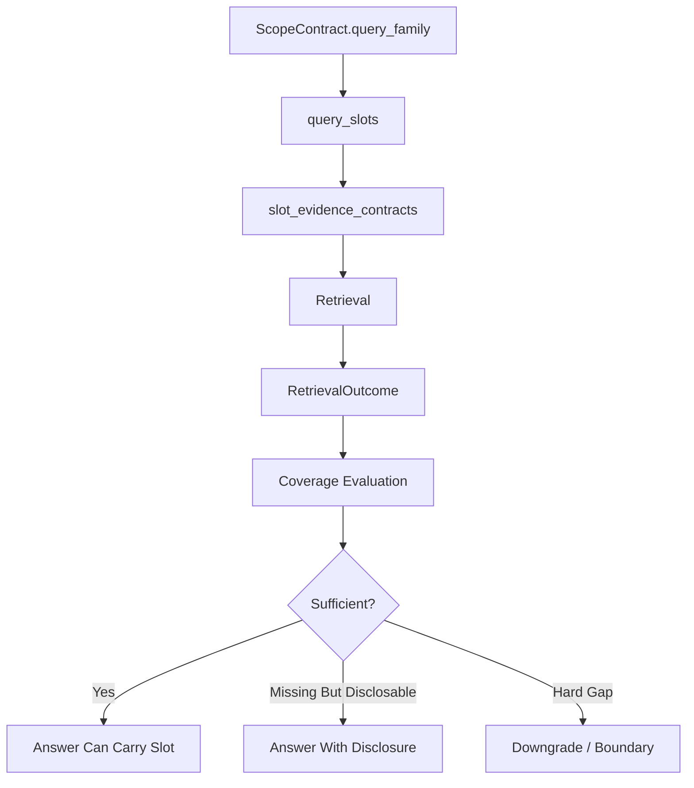

# Evidence And Coverage Contracts

## Purpose

Evidence and coverage contracts define what must be retrieved, cited, disclosed, or downgraded before a financial answer can be considered admissible.

They translate query semantics into slot-level evidence requirements.

## Slot Evidence Contract Model

Each slot contract contains:

| Field | Meaning |
|---|---|
| `slot_name` | Canonical slot identifier |
| `slot_label` | Human-readable slot name |
| `satisfaction_mode` | How the slot can be satisfied |
| `required_disclosures` | Disclosure targets required when evidence is absent |
| `min_groups_required` | Minimum evidence groups required |
| `evidence_groups` | Acceptable evidence token groups |

## Satisfaction Modes

| Mode | Meaning | Expected Behavior |
|---|---|---|
| `evidence_required` | Evidence must be present | Missing evidence creates a coverage gap |
| `evidence_or_disclose` | Evidence is preferred, but absence can be disclosed | Answer may proceed with explicit limitation |
| `optional_evidence` | Evidence is useful but not required | Missing evidence does not block the read |

## Query Family Slot Inventory

| Query Family | Representative Slots |
|---|---|
| `insider_flow_driven` | `sec_insider_signal`, `sec_event_signal`, `options_liquidity_posture` |
| `options_microstructure` | `pcr_signal`, `atm_iv_signal`, `iv_skew_signal`, `iv_or_skew_signal`, `liquidity_signal` |
| `cross_asset_regime` | `equity_vol_signal`, `macro_vol_signal`, `supporting_context` |
| `geopolitical_macro_read` | `latest_geopolitical_risk_anchor`, `geopolitical_news_signal`, `impact_basket_context` |
| `geopolitical_options_read` | `geopolitical_risk_signal`, `options_vol_signal` |

## RetrievalOutcome Coverage Fields

| Field | Meaning |
|---|---|
| `strict_sources_hit` | Required source families retrieved |
| `soft_sources_hit` | Optional context sources retrieved |
| `missing_strict_sources` | Required sources not retrieved |
| `missing_query_slots` | Required semantic slots not satisfied |
| `news_coverage_status` | Fresh-news status for narrative reads |
| `background_only_read` | Whether the answer is constrained to background evidence |
| `has_gold_evidence` | Gold evidence exists |
| `has_silver_evidence` | Silver evidence exists |

## Semantic Coverage Evaluation

Coverage evaluation checks whether the answer carries retrieved evidence tokens and whether missing slots are disclosed honestly. It produces slot statuses, evidence strength, disclosure honesty, carry score, and contract-conflict indicators.

## Evidence Gaps Versus Market Risks

Evidence gaps and market risks are separate channels.

| Channel | Meaning | Render Destination |
|---|---|---|
| Evidence gap | Required evidence is absent, weak, or only disclosable | Coverage note, status note, or recommendation boundary |
| Market risk | The financial thesis may deteriorate | Risks / What Would Change the View |

`evidence_coverage_severity` values:

| Severity | Meaning |
|---|---|
| `none` | Required evidence is present |
| `soft_note` | Read stands, but a minor coverage note may be disclosed |
| `hard_gap` | Required evidence is missing and materially constrains the answer |

## Known Limits / Engineering Risks

- Semantic coverage partly depends on answer text, token aliases, and section wording.
- Alias coverage is auditable but can be brittle when phrasing changes.
- Evidence contracts should remain the source of slot sufficiency; market-risk sections should not absorb evidence-gap disclosures.

## Source Of Truth

- `Scripts/core/evidence_contracts.py`
- `Scripts/retrieval/schema.py`
- `Scripts/agents/checker.py`
- `Scripts/agents/critic.py`

