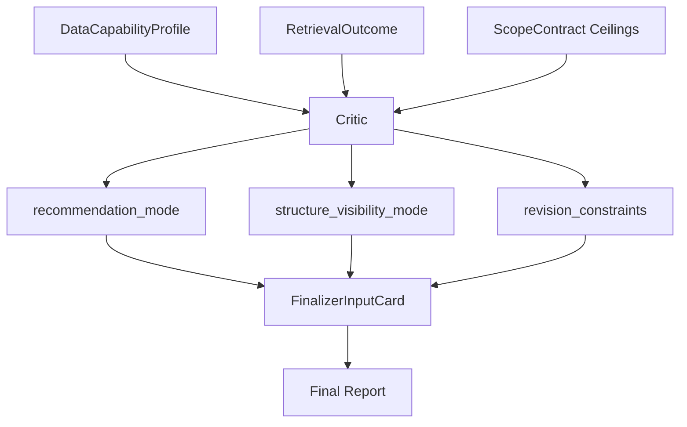

# Governance And Finalizer Contracts

## Purpose

Governance and finalizer contracts decide how actionable the answer may be and how already-derived content is rendered. They prevent the system from promoting unsupported analysis into live options recommendations.

## Recommendation Modes

| Mode | Meaning | Output Boundary |
|---|---|---|
| `actionable_options` | Concrete options structure discussion is allowed | May show recommended structure when supported |
| `directional_watchlist` | Directional or watchlist-grade read is allowed | No live strike-level recommendation |
| `informational_only` | Read-only or contextual answer | No options structure promotion |

`recommendation_mode` is owned by the Critic layer after considering scope ceilings, retrieval gaps, data capability, strategy profile, and feedback.

## Actionability Mode

`actionability_mode` currently shares the same value space as `recommendation_mode`. It exists as a separate governance surface so actionability can remain explicit if recommendation language later evolves.

## Structure Visibility Mode

| Mode | Meaning |
|---|---|
| `recommended_structure` | A concrete structure may be shown as a recommendation |
| `illustrative_structure` | A structure may appear only as a non-live example |
| `no_structure` | No options structure should be shown |

The structure visibility decision is downstream of recommendation mode and strategy-profile detection.

## Critic Governance Rules

Critic governance considers:

- fatal feedback,
- missing strict sources,
- missing query slots,
- output ceilings,
- specificity ceilings,
- options evidence,
- concrete structure support,
- stale catalyst evidence,
- market impact risk.

Checker validates facts and lineage. Critic decides actionability and qualitative overreach.

## Revision Constraints

`revision_constraints` is the Critic-to-Finalizer governance bundle.

| Field | Meaning |
|---|---|
| `mode_boundary_text` | Required actionability boundary language |
| `illustrative_structure_text` | Non-live structure language when allowed |
| `true_risk_text` | Contract-owned market risk text |
| `evidence_coverage_note` | Coverage limitation note |
| `evidence_coverage_severity` | `none`, `soft_note`, or `hard_gap` |
| `read_valid_despite_coverage_gap` | Whether a read can stand despite a gap |
| `answer_status_note` | Frontend-safe status note |
| `section_ownership` | Finalizer section ownership policy |

## FinalizerInputCard

`finalizer_input_card` is the preferred single handoff into final rendering. Analyst contributes evidence, posture, narrative, and render-safe seeds. Critic contributes governance constraints, output mode, risk channel, and section ownership.

The Finalizer should consume the merged card rather than recomputing financial logic from raw state.

## Section Ownership

| Section | Ownership |
|---|---|
| Direct Conclusion | Evidence-only conclusion and posture takeaway |
| Asset / Options Read | Evidence recap, posture rationale, base regime read |
| Recommendation Mode | Boundary language only |
| Risks / What Would Change the View | True market risk and transition-risk read |

Evidence coverage notes should not be rendered as market risks.

## Downgrade Behavior

| Trigger | Expected Downgrade |
|---|---|
| Fatal feedback | `informational_only` |
| Hard missing source or slot | `informational_only` |
| Options evidence without concrete structure support | `directional_watchlist` |
| Market-analysis-only with valid signals | Usually `directional_watchlist` or read-only boundary |
| Specificity ceiling `watchlist_only` | Prevent `actionable_options` |
| Specificity ceiling `no_structure` | Prevent structure visibility |

## Known Limits / Engineering Risks

- `recommendation_mode` and `actionability_mode` currently overlap by design.
- `revision_constraints` and `finalizer_input_card` are dictionary-shaped handoffs and should be candidates for stronger schema enforcement.
- Finalizer behavior is governed by policy and tests; hard schema boundaries would reduce future drift.

## Source Of Truth

- `Scripts/agents/state.py`
- `Scripts/agents/critic.py`
- `Scripts/agents/finalizer.py`
- `Scripts/core/financial_reasoning_contract.py`
- `Scripts/core/posture_contract.py`

