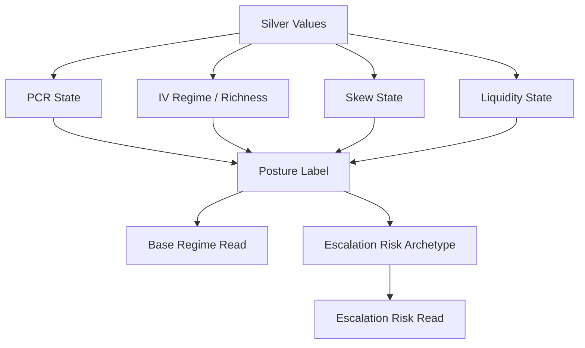

# Posture And Liquidity Contracts

## Purpose

Posture and liquidity contracts convert validated market metrics into current-state interpretation and next-step deterioration risk. They keep market posture, premium regime, skew, flow, and execution risk auditable.

## Activation Rules

Current implementation activates posture synthesis when:

- `read_profile == "posture_read"`,
- `query_family` is one of `options_microstructure`, `cross_asset_regime`, `geopolitical_macro_read`, or `geopolitical_options_read`,
- `recommendation_mode != "actionable_options"`.

`market_analysis_only` remains an important answerability signal, but it is not the sole activation rule in current code.

## Posture State Machine

Intermediate states:

| State | Values |
|---|---|
| `pcr_state` | `protection_heavy`, `neutral_flow`, `call_skewed`, `unknown` |
| `iv_regime_state` | `LOW`, `NORMAL`, `HIGH`, `UNKNOWN` |
| `iv_richness_state` | `cheap`, `mid_range`, `firm`, `rich`, `unknown` |
| `skew_state` | `positive_put_premium`, `flat`, `negative_call_premium`, `unknown` |
| `skew_intensity` | `modest`, `strong`, `flat`, `unknown` |
| `liquidity_state` | `healthy`, `fragile`, `unknown` |

## Posture Labels

| Label | Interpretation |
|---|---|
| `constructive` | Protection demand is light relative to premium regime |
| `neutral` | Flow and volatility are balanced |
| `neutral_to_defensive` | Baseline downside protection is present but not stressed |
| `defensive` | Protection demand is clearly elevated |
| `stressed` | Protection demand and premium regime indicate stress |

## Transition Risk Archetypes

| Archetype | Meaning |
|---|---|
| `defensive_flow_acceleration` | Downside hedging demand may intensify |
| `vol_spike_repricing` | Volatility may reprice sharply higher |
| `premium_compression` | Already-rich protection may mean-revert |
| `execution_fragility` | Slippage and implementation cost dominate |
| `regime_reversal` | Current signal may fade or reverse |

## Liquidity Tier Contract

`LiquidityTier` values:

| Tier | Meaning |
|---|---|
| `tier1` | Broad-market ETFs or highly liquid override single names |
| `tier2` | Covered single names |
| `tier3` | Commodity ETFs and thinner tracked instruments |
| `unknown` | Ticker not classified |

Liquidity tier controls spread and contract-count thresholds used for market-impact classification.

## Market Impact Risk Contract

`MarketImpactRisk` values:

| Risk | Meaning |
|---|---|
| `Low` | Spread and liquid contracts clear low-risk thresholds |
| `Medium` | Execution is acceptable but not pristine |
| `High` | Execution is fragile or expensive |
| `Unknown` | Required liquidity inputs or tier are unavailable |

High market-impact risk can force risk disclosure or prevent promotion into a live structure.

## Current State Versus Escalation Risk

`base_regime_read` describes the current priced state. `escalation_risk_read` describes the next adverse transition. These fields must not be collapsed into one generic risk paragraph.

Example: a market can currently be `neutral_to_defensive` while the next adverse transition is `vol_spike_repricing`. That is not a contradiction; it separates current posture from forward deterioration.

## Known Limits / Engineering Risks

- PCR, IV rank, skew, and liquidity thresholds are deterministic and centrally owned, but hard-coded.
- Documentation and tests should track threshold semantics before tuning them.
- Current posture activation should remain documented from implementation truth to prevent drift.

## Source Of Truth

- `Scripts/core/posture_contract.py`
- `Scripts/core/liquidity_policy.py`
- `Scripts/core/universe.py`
- `Scripts/agents/critic.py`

