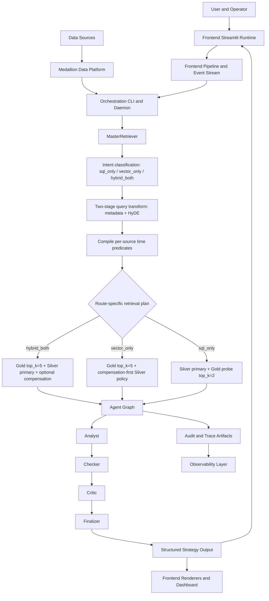

# System Topology Reference

## 1. Goal
Provide the canonical cross-layer architecture for ingestion, retrieval, multi-agent reasoning, and frontend delivery in one institutional reference.
The platform converts financial questions into governed options strategies by 
integrating:

- orchestrated data freshness across medallion layers,
- dual retrieval (Gold semantic + Silver deterministic numeric),
- multi-agent review loops with deterministic escalation controls,
- a Streamlit frontend for real-time node streaming and analyst-facing reporting.

This file is the **frontend+backend system map**.  
Detailed backend runtime internals are preserved in [`Backend_README.md`](./Backend_README.md).

## 2. Architecture

## 3. Code Strategy and Workflow
- Separate numerical truth (Silver) from semantic context (Gold).
- Use one retriever entrypoint and one shared agent state contract.
- Gate final outputs through Checker/Critic revision policies.
- Keep frontend event stream and backend audits schema-compatible.
- Keep this document at platform-map granularity; backend node-level runbooks stay in `Backend_README.md`.

## 4. Retrieval and Agent Strategy
- `MasterRetriever` classifies query route (`sql_only`, `vector_only`, `hybrid_both`).
- `QueryTransformer` runs two-stage extraction and HyDE generation (`gpt-4o-mini` 
defaults).
- Gold retrieval uses Qdrant hybrid fusion + rerank; Silver retrieval uses DuckDB Parquet SQL handlers.
- `time_adapter` compiles per-source predicates once and reuses them across retrieval and rescue paths.
- Frontend consumes node-level stream events and renders phase-wise outputs before final report completion.

## 5. Model Strategy (Current)

| Layer | Primary | Fallback |
|---|---|---|
| Query transform | `gpt-4o-mini` | regex/heuristic in-transform fallbacks |
| Router intent | `llama3:latest` (Ollama) | `gpt-4o-mini` (OpenAI-compatible) |
| Analyst | `options-expert-v1:latest` (Ollama OpenAI-compatible path) | OpenAI-compatible fallback path configured in agent |
| Checker | `llama3:latest` (Ollama) | `gpt-4o-mini` fallback |
| Critic | `options-expert-v1:latest` | deterministic fatal-gating logic |
| Finalizer | `options-expert-v1:latest` | OpenAI-compatible fallback + degraded output mode |

## 6. Platform Contracts and Frontend Observability
- Shared state contract: `Scripts/agents/state.py` (`AgentState`, `AgentFeedback`).
- Retrieval contract: `Scripts/retrieval/schema.py`.
- Immutable Silver baseline for deterministic checks: `silver_context_frozen`.
- Frontend query bundle contract: `Frontend/audit.py` writes trace/final_state/summary 
artifacts.
- Revision governance: `AGENT_MAX_REVISIONS`.

## 7. Documentation Map

### Related Docs
- [Backend System Blueprint](./Backend_README.md)
- [Frontend Runtime](./Frontend%20Runtime%20Guide.md)
- [Orchestration Runtime](./Orchestration.md)
- [LLM Pool Operations](./LLM%20Pool%20Operations%20Guide.md)
- [Observability Contracts](./Observability.md)
- [User Query Policy](./User_Query_Guide.md)
- [Agent Architecture](../agent/Agent_Architecture.md)
- [Retrieval Architecture and Strategy](../Query_retrieval_docs/Retrieval_Architecture_and_Strategy.md)
- [Embedding/Chunking/Fusion Strategy](../Strategy_choices_docs/Embedding_Chunking_and_Retrieval_Fusion_Strategy.md)

