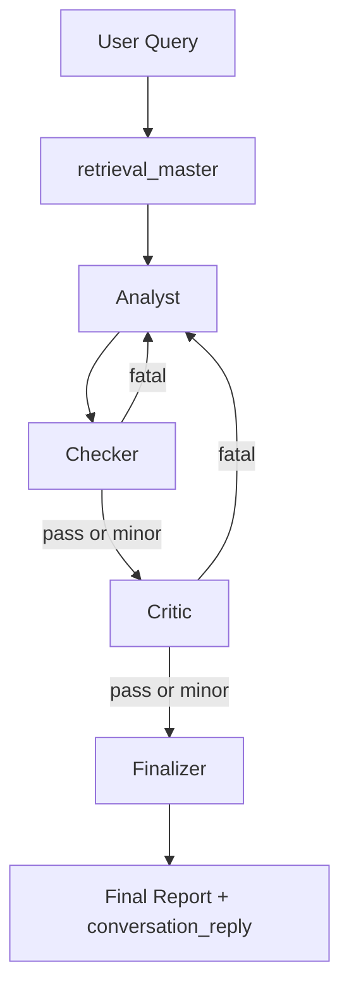
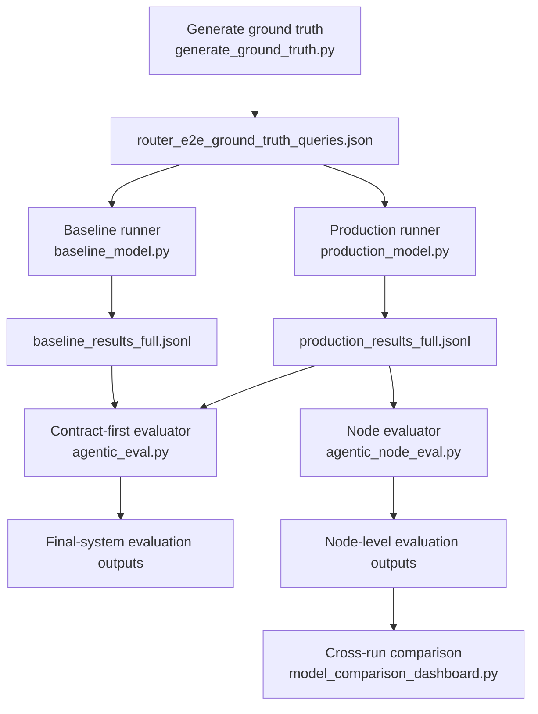

# Agentic Evaluation Framework

## Part 1. Design Summary: Report Style and Node Responsibilities

This agent is a query-first, report-style financial RAG system rather than a plain short-answer retriever. The final delivery has two layers:

1. a user-facing `conversation_reply` that answers the question directly and keeps the actionability boundary explicit
2. a structured report payload that can carry `direct_conclusion`, `macro_summary`, `asset_read`, optional `trade_ideas`, evidence links, and deterministic rendering fields

This matters for evaluation because the system is not only trying to "answer the question." It is also trying to:

- stay inside retrieval-backed financial truth,
- downgrade safely when evidence is thin,
- preserve useful information under non-actionable modes,
- and render a compliant final report instead of a raw retrieval echo.

The production graph is documented in [../agent/Agent_Architecture.md](../agent/Agent_Architecture.md). The final rendering contract is documented in [../agent/Node_Finalizer.md](../agent/Node_Finalizer.md).

### Runtime graph

### Node responsibilities

| Node | Primary responsibility | What it contributes to the final answer |
| --- | --- | --- |
| `retrieval_master` | Build the retrieval package and runtime scope contract | Controls source coverage, time window, slot evidence contract, and fallback state |
| `analyst` | Produce the first evidence-backed interpretation | Creates the first draft answer, evidence line selection, and initial slot coverage |
| `checker` | Audit numbers, anchors, unsupported claims, and missing-data honesty | Prevents basic factual drift and improves downstream correction quality |
| `critic` | Enforce actionability boundary, downgrade logic, and report governance | Decides whether a live structure is allowed, whether risk language is required, and whether the answer must explain why not now |
| `finalizer` | Render the terminal report object and user-facing answer | Converts upstream state into a structured final report with deterministic boundaries |

### Output style summary

The intended report style is:

- query-first in the opening answer,
- evidence-bounded rather than recommendation-forcing,
- readable to a non-expert,
- and mode-aware through `actionable_options`, `directional_watchlist`, or `informational_only`.

In practice, this means the system may preserve options structure only when the upstream contract allows it. Otherwise, the same workflow is expected to produce a macro, news, or regime-oriented answer without pretending that missing strike-level evidence exists.

## Part 2. Evaluation Objectives

The evaluation stack serves two distinct purposes.

### 2.1 Baseline vs production validation

The first objective is to compare the legacy baseline path against the full production graph in order to answer two questions:

1. does the production architecture reduce financial errors relative to a single-pass model
2. do the additional nodes improve answer safety and truth handling enough to justify the extra workflow complexity

This comparison is implemented through:

- [../../Scripts/evaluation/baseline_model.py](../../Scripts/evaluation/baseline_model.py)
- [../../Scripts/evaluation/production_model.py](../../Scripts/evaluation/production_model.py)
- [../../Scripts/evaluation/agentic_eval.py](../../Scripts/evaluation/agentic_eval.py)

### 2.2 Internal node validation

The second objective is to compare the nodes inside the production workflow itself. This answers a different question:

1. whether the four-node path is only "safer because it is stricter"
2. or whether each node makes a measurable contribution to better logic, truth handling, coverage, and final report quality

This comparison is implemented through:

- [../../Scripts/evaluation/agentic_node_eval.py](../../Scripts/evaluation/agentic_node_eval.py)

### What "effective" means in this project

In this stack, a better system is not defined by aggressiveness or by how often it outputs a trade idea. It is defined by whether it:

- avoids direction-changing financial logic errors,
- avoids unsupported factual claims,
- discloses missing evidence honestly,
- preserves slot coverage when the evidence exists,
- degrades to non-actionable modes when the evidence does not exist,
- and still remains useful after that downgrade.

## Part 3. Baseline Model vs Production Model

### 3.1 Baseline model

The baseline model in [../../Scripts/evaluation/baseline_model.py](../../Scripts/evaluation/baseline_model.py) is intentionally simple. It is the control arm for the benchmark, not a reduced version of the full workflow.

Its design is:

- dense cosine retrieval only
- no metadata filtering
- Gold / Qdrant only
- no Silver SQL context
- no node loop
- no governance contract
- no structured final report
- one LLM call with free-text output

Operationally, it reuses the production embedding and Qdrant connection layer for infrastructure parity, but keeps the reasoning path intentionally minimal.

Baseline summary fields written by the runner include:

- `model`: value of `BASELINE_LLM_MODEL`
- `embed_model`: value of `EMBEDDING_MODEL_NAME`
- `top_k`

### 3.2 Production model

The production model in [../../Scripts/evaluation/production_model.py](../../Scripts/evaluation/production_model.py) is not a single model call. It is the real multi-node graph executed through `build_financial_rag_graph()`.

Its defining characteristics are:

- retrieval contract plus graph orchestration instead of one-shot prompting
- Analyst -> Checker -> Critic -> Finalizer state transitions
- structured finalizer handoff through `finalizer_input_card`
- explicit node event capture
- mode-aware rendering rather than unconstrained text generation

So the right comparison is:

- baseline = one-pass LLM answer
- production = full graph execution with node state, contracts, revisions, and structured rendering

### 3.3 Why this distinction matters

If production wins, the gain is not just "a better model answered better." It means the graph, contracts, and node boundaries improved the result. That is exactly what this benchmark is designed to test.

## Part 4. Evaluation Flow and Ground-Truth Construction

### 4.1 End-to-end benchmark flow

The orchestrator lives in [../../Scripts/evaluation/run_agentic_benchmark.py](../../Scripts/evaluation/run_agentic_benchmark.py).

### 4.2 Fresh run vs reuse run

The orchestrator supports two modes:

- fresh run: regenerate baseline and production outputs, then evaluate
- reuse run: load an existing run directory containing `baseline_results_full.jsonl` and `production_results_full.jsonl`, then re-evaluate without re-running the agent

This is why the benchmark tool can support both:

- full benchmark generation
- direct re-scoring of saved production outputs

### 4.3 Ground-truth generation logic

Ground truth is generated by [../../Scripts/evaluation/generate_ground_truth.py](../../Scripts/evaluation/generate_ground_truth.py).

The generator is deliberately contract-first. It does not create generic reference answers. It creates benchmark cases that are aligned with:

- [../../Scripts/core/financial_ontology.py](../../Scripts/core/financial_ontology.py)
- [../../Scripts/core/financial_reasoning_contract.py](../../Scripts/core/financial_reasoning_contract.py)
- [../Data_source_docs/Time_Schema_Audit.md](../Data_source_docs/Time_Schema_Audit.md)
- [../modular_guide/User_Query_Guide.md](../modular_guide/User_Query_Guide.md)

### 4.4 What each ground-truth case contains

Each case contains:

- `name`
- `query`
- `ground_truth`
- `expected_sources`
- `expected_time_window`
- `structured_truth`
- `case_meta`
- `notes`

The `structured_truth` block includes:

- `query_family`
- `intent_slots`
- `expected_sources`
- `expected_mode_ceiling`
- `required_disclosures`
- `forbidden_claims`
- `financial_logic_expectations`
- `coverage_allows_disclosure_pass`
- `sec_action_taxonomy_expectation` when the query family is insider-flow-driven

The free-text `ground_truth` also includes an explicit "Expected reasoning path" covering Analyst, Checker, Critic, and Finalizer expectations.

### 4.5 Why the ground truth is built this way

This benchmark is not trying to reward a model for sounding fluent. It is trying to test whether the workflow obeys:

- source scope,
- time scope,
- slot coverage boundaries,
- actionability ceilings,
- and financial reasoning constraints.

That is why the truth file is both semantic and structural.

## Part 5. Node Metric Definitions and Measurement Methods

This section maps the node metrics back to the actual scoring logic in [../../Scripts/evaluation/agentic_node_eval.py](../../Scripts/evaluation/agentic_node_eval.py) and [../../Scripts/core/evidence_contracts.py](../../Scripts/core/evidence_contracts.py).

### 5.1 Shared scoring primitives

Before the node scores are computed, the evaluator builds a shared set of primitives.

#### A. Financial truthfulness

`_financial_truthfulness(...)` combines these checks:

- `unsupported_fact_pass`
- `missing_info_honesty_pass`
- `financial_common_sense_pass`
- `regime_logic_pass`
- `sec_taxonomy_pass`
- `risk_disclosure_pass`
- `illustrative_structure_allowed_pass`
- `structure_support_pass`

It then groups failures into:

- `critical_failures`
- `material_failures`
- `compliance_failures`

and derives:

- `highest_failure_severity`
- overall boolean `pass`

This is the core hard-boundary validator used by both contract eval and node eval.

#### B. Slot coverage

`_intent_coverage(...)` delegates slot scoring to `evaluate_truth_slot_semantics(...)`, which uses:

- runtime slot evidence contracts,
- retrieval outcome,
- Silver values,
- Gold context,
- and the final answer text

to produce:

- `slot_status`
- `slot_evidence_strength`
- `slot_disclosure_honesty`
- `slot_answer_rate`
- `slot_disclosure_honesty_rate`
- `semantic_evidence_carry_score`

#### C. Evidence retention

`_evidence_retention(...)` measures how much information survived from the Analyst draft into the final rendered answer. It averages:

- `key_number_retention_rate`
- `anchor_retention_rate`
- `provenance_retention_pass`

where:

- `key_number_retention_rate` checks whether labeled values from the Analyst draft still appear numerically in the final answer
- `anchor_retention_rate` checks whether key evidence labels such as PCR, ATM IV, VIX, GPR, open interest, and liquidity survived
- `provenance_retention_pass` checks whether the final markdown preserved the expected report sections

### 5.2 Slot scoring semantics

The slot-based metrics are especially important because they are the main bridge between retrieval coverage and answer usefulness.

#### `slot_answer_rate`

Computed as:

- numerator: slots with status `answered` or `disclosed_unanswerable`
- denominator: applicable slots

Slots marked `unsupported_by_retrieval` are excluded from the denominator because the system should not be punished for unavailable evidence if it recognizes that boundary honestly.

#### `slot_disclosure_honesty_rate`

Computed as:

- successful disclosure judgments over all slots where a disclosure judgment is applicable

This metric is about honesty when the answer cannot be completed, not about completeness itself.

#### `semantic_evidence_carry_score`

This is the most important slot-quality metric. It is computed as the average per-slot semantic carry score:

- `1.0` for strongly supported answered slots
- `0.75` for acceptably supported answered slots
- `0.75` for honestly disclosed unanswerable slots
- `0.5` for weak but still answered slots
- `0.0` for missed slots

This makes the metric deliberately asymmetric:

- honest abstention can still receive non-zero credit
- unsupported answering cannot

### 5.3 Analyst metrics

The Analyst metrics are built in `_analyst_metrics(...)`.

| Metric | How it is measured |
| --- | --- |
| `runs` | Number of Analyst executions from `node_counts` |
| `intent_coverage_score` | Slot-level score returned by `_intent_coverage(...)` |
| `slot_status` | Per-slot answered / disclosed / missed state |
| `slot_answer_rate` | Coverage ratio described above |
| `slot_evidence_strength` | Per-slot `strong` / `acceptable` / `weak` evidence assessment |
| `slot_disclosure_honesty` | Per-slot honest missing-data handling |
| `semantic_evidence_carry_score` | Average per-slot semantic carry score |
| `truthfulness_pass` | Whether the Analyst draft already passes the hard truth checks |
| `coverage_disclosure_pass` | Whether missing sources or slots were disclosed honestly |
| `concrete_structure_present` | Whether the draft already contains concrete option structure language |
| `logic_integrity_rate` | Mean of `regime_logic_pass` and `sec_taxonomy_pass` |
| `truth_integrity_rate` | Mean of `unsupported_fact_pass`, `missing_info_honesty_pass`, and `financial_common_sense_pass` |
| `structure_hint_present` | Whether at least one usable non-live structure idea survives in the draft |
| `legacy_raw_metric_retention_score` | Retrieval-to-Analyst carry diagnostic based on numeric capture plus anchor capture |

Interpretation:

- Analyst is judged as the first reasoning surface
- not as the final compliance surface
- so strong Analyst performance means "good first draft quality," not "production-ready answer quality"

### 5.4 Checker metrics

The Checker metrics are built in `_checker_metrics(...)`.

| Metric | How it is measured |
| --- | --- |
| `runs` | Number of Checker executions from the node audit log |
| `verdict_counts` | Count of Checker verdict labels across passes |
| `findings_total` | Sum of `findings_n` across Checker events |
| `findings_per_run` | `findings_total / runs` |
| `minor_verdict_count` | Count of `minor` verdicts |
| `fatal_verdict_count` | Count of `fatal` verdicts |
| `fix_adoption_score` | Mean downstream adoption of the corrections Checker should have triggered |
| `contributed_to_fix` | True when Checker had findings and the downstream adoption score is at least partial |

`fix_adoption_score` is not a raw verdict metric. It is a downstream effect metric. The evaluator checks whether Analyst failures were fixed later:

- unsupported facts corrected
- missing-data honesty corrected
- structure-support violations corrected

If Checker produced findings but none of those direct signals were available, the fallback test is:

- final truthfulness pass
- plus final coverage disclosure pass

So Checker is rewarded only when its intervention actually changes the terminal answer quality.

### 5.5 Critic metrics

The Critic metrics are built in `_critic_metrics(...)`.

| Metric | How it is measured |
| --- | --- |
| `runs` | Number of Critic executions |
| `verdict_counts` | Count of Critic verdict labels |
| `findings_total` | Sum of Critic findings across runs |
| `fatal_feedback_n` | Count of fatal Critic feedback items |
| `minor_suggestions_n` | Count of non-blocking Critic suggestions |
| `suggestion_categories` | Extracted governance categories such as `iv_regime_fit`, `evidence_sufficiency_and_abstention`, `macro_contradiction`, `insider_signal_weakness` |
| `feedback_adoption_score` | Mean of applicable downstream governance adoption checks |
| `concrete_structure_demoted` | Whether a structure-bearing Analyst draft was later downgraded out of live mode |
| `mode_downgrade_adopted` | Whether the final mode became `informational_only` or `directional_watchlist` |
| `actionability_downgrade_success` | Whether the final mode obeyed the no-live-recommendation constraint when required |
| `risk_disclosure_success` | Whether required risk text survived into the final answer |
| `non_actionable_information_retention_delta` | `final semantic evidence carry - analyst semantic evidence carry` in downgraded cases |
| `non_actionable_information_retention_delta_score` | Normalized form of the previous metric, centered around zero |
| `spurious_fatal_proxy` | Fatal Critic verdict proxy that fired without real downstream demotion |

`feedback_adoption_score` is category-sensitive. The evaluator checks different downstream signals depending on what Critic complained about:

- live structure was removed when actionability was too high
- disclosure survived when evidence was weak
- final regime logic no longer contradicted the retrieved signal
- risk disclosure was retained when required
- mode was downgraded when actionable output was forbidden

`non_actionable_information_retention_delta` is especially important:

- near `0` means the downgraded answer preserved roughly the same semantic evidence load as the Analyst draft
- negative values mean the answer was flattened during safety rendering
- positive values mean the final answer became clearer than the draft

### 5.6 Finalizer metrics

The Finalizer metrics are built in `_finalizer_metrics(...)`.

| Metric | How it is measured |
| --- | --- |
| `runs` | Number of Finalizer executions |
| `status` | Finalizer terminal status such as `complete` or `degraded` |
| `trigger_node` | Which upstream node handed control into Finalizer |
| `confidence` | Finalizer confidence field from runtime state |
| `degraded_reason` | Why the run degraded, when applicable |
| `mode` | Resolved final output mode |
| `query_first_answer_pass` | Whether the final answer remains query-first rather than report-first |
| `disclosure_retention_pass` | Whether the final answer preserved missing-source disclosure |
| `risk_disclosure_required` | Whether the current contract required explicit risk language |
| `risk_disclosure_pass` | Whether that risk language survived |
| `illustrative_applicable` | Whether an illustrative structure was allowed in this case |
| `illustrative_structure_present` | Whether an illustrative structure actually appeared |
| `illustrative_boundary_clear` | Whether the illustrative structure stayed non-live |
| `illustrative_compliance_pass` | Whether the illustrative rendering was legally and contractually framed |
| `boundary_pass` | Whether the final mode stayed inside the allowed non-actionable boundary |
| `downgraded_answer_usefulness_floor` | Minimum usefulness retained in downgraded answers |
| `logic_integrity_rate` | Mean of `regime_logic_pass` and `sec_taxonomy_pass` on the final answer |
| `truth_integrity_rate` | Mean of `unsupported_fact_pass`, `missing_info_honesty_pass`, and `financial_common_sense_pass` |
| `information_value_score` | Composite completeness score for the final answer |
| `rendering_drift_flag` | Whether rendering introduced a truthfulness failure |
| `final_truthfulness_pass` | Final hard-pass result after compliance adjustments |
| `highest_failure_severity` | Final highest severity bucket |
| `critical_failures` / `material_failures` / `compliance_failures` | Final failure lists |
| `intent_coverage_score` | Final slot-level coverage score |
| `slot_answer_rate` | Final slot answer rate |
| `semantic_evidence_retention_score` | Final slot-level semantic evidence score |
| `disclosure_honesty_rate` | Final slot-level honest-disclosure rate |
| `evidence_retention_score` | Analyst-to-final report retention score |

#### `downgraded_answer_usefulness_floor`

This metric is discrete by design for non-actionable outputs:

- `0.0`: downgrade failed in a meaningful way, such as missing required risk text, missing why-not-now text, or losing the answer entirely
- `0.5`: information survived but the answer is no longer strongly query-first
- `1.0`: information survived and the answer stayed query-first

#### `information_value_score`

This is the mean of:

- query-first pass
- slot coverage score
- risk component
- boundary pass
- illustrative compliance pass, when illustrative mode is applicable

So this metric asks: after all the safety gates fired, how much useful answer value still survived?

### 5.7 Failure-rate summary metrics

The top-level node summary aggregates several case-level metrics:

- `critical_failure_case_rate`
- `material_failure_case_rate`
- `compliance_failure_case_rate`
- `mean_revision_count`
- `degraded_case_rate`
- `checker_circuit_break_count`
- `completed_after_critic_count`

These are not node-specific quality scores. They are workflow-level stability indicators.

## Part 6. Cross-Node Contribution Aggregation

The node evaluator also computes composite contribution scores in `_node_contribution(...)`.

### 6.1 Analyst contribution

Average of:

- Analyst logic integrity
- Analyst truth integrity
- Analyst semantic evidence carry
- Analyst slot answer rate

### 6.2 Checker contribution

Average of:

- `fix_adoption_score`
- non-fatal outcome flag
- whether Checker either contributed to a fix or found nothing to fix

### 6.3 Critic contribution

Average of:

- `feedback_adoption_score`
- inverse of `spurious_fatal_proxy`
- `actionability_downgrade_success`
- risk disclosure success when applicable
- normalized non-actionable information retention score

### 6.4 Finalizer contribution

Weighted score:

- `0.25 * final logic integrity`
- `0.25 * final truth integrity`
- `0.35 * final semantic evidence retention`
- `0.15 * final informational completeness`

### 6.5 Analyst-to-final deltas

The evaluator also records:

- `analyst_to_final_logic_gain`
- `analyst_to_final_truth_gain`
- `analyst_to_final_information_gain`
- `analyst_to_final_intent_gain`
- `structure_safing_gain`
- `disclosure_added_gain`

These deltas are what make node evaluation useful. They show whether the later nodes merely compress the answer, or whether they improve it.

## Part 7. Cross-Run Production Model Comparison

Cross-run production comparison is implemented in [../../Scripts/evaluation/model_comparison_dashboard.py](../../Scripts/evaluation/model_comparison_dashboard.py).

This tool does not compare baseline vs production. It compares multiple saved production node-evaluation runs against each other.

### 7.1 Inputs

Each input run is passed as:

- `LABEL::PATH`

where `PATH` points to a directory containing `agentic_node_metrics.json`.

### 7.2 What it compares

The comparison dashboard reads `COMPARISON_METRICS`, which are grouped by:

- Analyst
- Checker
- Critic
- Finalizer
- Risk

It supports three scoring directions:

- `higher`
- `lower`
- `center_zero`

The `center_zero` mode is used for `critic_non_actionable_information_retention_delta_avg`, because the desired outcome is closeness to zero, not a simple larger-is-better result.

### 7.3 Output artifacts

The tool writes:

- `model_comparison_report.md`
- `model_comparison_dashboard.html`
- `model_comparison_payload.json`

under:

- `logs/agentic_eval/model_comparison/<timestamp>/`

### 7.4 Why this tool exists

This script is the production-side iteration tracker. It is the right place to answer:

- which production version improved final truth pass
- which version improved slot coverage
- which version flattened downgraded answers less
- which version reduced compliance failures without losing useful information

## Part 8. Output Artifact Map

### 8.1 Ground-truth artifacts

Generated by [../../Scripts/evaluation/generate_ground_truth.py](../../Scripts/evaluation/generate_ground_truth.py):

| Path | Contents |
| --- | --- |
| `logs/ground_truth/<timestamp>/ground_truth_cases.json` | Full generated ground-truth catalogue |
| `logs/ground_truth/<timestamp>/queries.jsonl` | Query-only export with expected sources and time window |
| `Scripts/tests/router_e2e_ground_truth_queries.json` | Benchmark truth file used by the evaluation stack when `--update-tests` is enabled |

### 8.2 Fresh benchmark run directory

The orchestrator writes under:

- `logs/agentic_eval/YYYY-MM-DD/<timestamp>/`

Typical root files:

| Path | Contents |
| --- | --- |
| `queries_snapshot.json` | Snapshot of the truth/query file used for the run |
| `benchmark_orchestrator_audit.jsonl` | Orchestrator step log |
| `benchmark_manifest.json` | Run manifest with mode, flags, and output paths |
| `baseline_results_full.jsonl` | Full baseline outputs with case metadata |
| `baseline_answers.jsonl` | Baseline answer-only export |
| `baseline_summary.json` | Baseline run summary |
| `baseline_audit.jsonl` | Baseline audit trail |
| `production_results_full.jsonl` | Full production outputs with node and contract state |
| `production_answers.jsonl` | Production answer-only export |
| `production_summary.json` | Production run summary |
| `production_audit.jsonl` | Production run audit trail |
| `production_node_events.jsonl` | Per-node event stream extracted from runtime state |

### 8.3 Contract-first evaluation artifacts

Written by [../../Scripts/evaluation/agentic_eval.py](../../Scripts/evaluation/agentic_eval.py):

| Path | Contents |
| --- | --- |
| `agentic_eval_cases.jsonl` | Paired baseline vs production case-level results |
| `agentic_eval_summary.json` | Aggregate summary plus baseline and production summaries |
| `agentic_eval_report.md` | Human-readable contract-first evaluation report |
| `agentic_eval_dashboard.html` | Visual dashboard for contract-first results |

### 8.4 Node-evaluation artifacts

Written by [../../Scripts/evaluation/agentic_node_eval.py](../../Scripts/evaluation/agentic_node_eval.py):

| Path | Contents |
| --- | --- |
| `agentic_node_audit.jsonl` | Case-level node audit rows |
| `agentic_node_events.jsonl` | Event stream extracted from node audit logs |
| `agentic_node_eval_detailed.csv` | Flattened per-case node metrics |
| `agentic_node_events.csv` | Flattened node event table |
| `agentic_node_metrics.json` | Summary metrics plus all per-case payloads |
| `agentic_node_report.md` | Human-readable node-evaluation report |
| `agentic_node_dashboard.html` | Visual dashboard for node evaluation |

These files can live:

- directly under the run directory, or
- under a dedicated subdirectory such as `logs/agentic_eval/2026-05-09/20260509_180947/reeval_node/`

depending on how the re-evaluation was executed.

## Part 9. Why RAGAS Was Retired for This Stack

The old RAGAS comparison path still exists for historical reference in [../../Scripts/Legacy_Baseline/ragas_compare.py](../../Scripts/Legacy_Baseline/ragas_compare.py), but it is no longer the primary evaluator for this agent.

### 9.1 The core mismatch

RAGAS is better suited to a simpler QA-style RAG system where success mostly means:

- answering directly,
- citing retrieved chunks closely,
- and staying semantically near the question surface

This agent is different. It is a report agent with:

- multi-node governance,
- explicit downgrade behavior,
- non-actionable answer modes,
- structured final rendering,
- and finance-specific disclosure boundaries

That creates a metric mismatch.

### 9.2 Where the mismatch appears

The old RAGAS reports show the mismatch clearly.

In [../../logs/RAGAS/2026-05-07/20260507_174934/paired_comparison.md](../../logs/RAGAS/2026-05-07/20260507_174934/paired_comparison.md):

- Baseline wins `Faithfulness` (`0.170` vs `0.108`)
- Baseline wins `Answer Relevancy` (`0.527` vs `0.182`)
- Baseline wins `Context Precision` (`0.200` vs `0.000`)
- Finalizer wins `Answer Correctness` (`0.452` vs `0.329`)

But in [../../logs/RAGAS/2026-05-07/20260507_174934/agentic_eval_report.md](../../logs/RAGAS/2026-05-07/20260507_174934/agentic_eval_report.md), the contract-first view shows:

- baseline truthfulness pass rate: `0.00`
- finalizer truthfulness pass rate: `1.00`
- baseline financial sanity avg: `0.17`
- finalizer financial sanity avg: `1.00`
- agentic delta avg: `0.93`

So RAGAS made the safer production system look worse on several generic metrics even when the finance-specific evaluator showed it was much better.

### 9.3 Why this happens

There are five main reasons.

#### A. Report-style rendering is not chunk-echo QA

The Finalizer produces:

- query-first answers,
- mode-aware wording,
- multi-section markdown,
- and safe downgrades

Generic reference-free metrics often prefer answers that repeat retrieved phrasing more directly.

#### B. Compliance language can look "less relevant"

Finance-specific disclosures such as:

- missing-evidence statements,
- risk language,
- why-not-now language,
- and non-live illustrative framing

may lower `Answer Relevancy` even when they are exactly the correct thing to say.

#### C. The system scores honest abstention positively

This agent intentionally gives partial credit for:

- `disclosed_unanswerable`

under slot-based semantics. RAGAS does not model this logic in a finance-aware way.

#### D. The workflow uses structured state, not only surface text

The production path uses:

- `scope_contract`
- `retrieval_outcome`
- `revision_constraints`
- `finalizer_input_card`
- slot evidence contracts

RAGAS mostly sees final text plus retrieved text. It cannot evaluate the correctness of the internal actionability boundary itself.

#### E. Finance-specific ontology boundaries matter

The project distinguishes insider actions such as:

- `SELL`
- `BUY`
- `ACQUIRE/VEST`

This boundary is critical for a Form-4 agent, but generic RAGAS metrics do not understand that taxonomy. The node and contract evaluators do.

### 9.4 What is used instead

The current stack replaces RAGAS as the main decision layer with:

- contract-first final-output evaluation in [../../Scripts/evaluation/agentic_eval.py](../../Scripts/evaluation/agentic_eval.py)
- node-centric workflow evaluation in [../../Scripts/evaluation/agentic_node_eval.py](../../Scripts/evaluation/agentic_node_eval.py)
- cross-run production comparison in [../../Scripts/evaluation/model_comparison_dashboard.py](../../Scripts/evaluation/model_comparison_dashboard.py)

This matches the actual product objective much more closely:

- unified financial information delivery
- safe downgrade behavior
- better non-expert usability
- and honest boundary handling when evidence is incomplete
