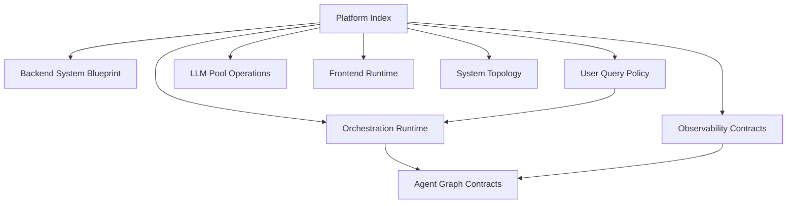

# Institutional Documentation Control Plane

## 1. Goal
Establish a single, modular documentation entrypoint for the financial RAG platform, with consistent structure, reduced repetition, and reliable cross-document navigation.

## 2. Architecture


## 3. Code Strategy and Workflow
- Define one canonical reading path and consumer persona per module.
- Keep module-specific logic inside each guide; move shared context into this index.
- Require each modular guide to expose fixed sections: `Inputs`, `Outputs`, `Related Docs`.
- Keep all links relative to `docs/modular_guide/` to avoid path drift.

## 4. Output Data Schema and Path
| Document Module | Audience | Primary Output | Canonical Path |
| --- | --- | --- | --- |
| Backend System Blueprint | architects, platform engineers | end-to-end backend lifecycle contract | `docs/modular_guide/Backend_README.md` |
| User Query Policy | analysts, end users | query phrasing and routing quality standards | `docs/modular_guide/User_Query_Guide.md` |
| Orchestration Runtime | backend operators | CLI execution and state lifecycle runbook | `docs/modular_guide/Orchestration.md` |
| LLM Pool Operations | ML/platform operators | model warmup and provider routing contract | `docs/modular_guide/LLM_Pool.md` |
| Observability Contracts | SRE, QA | run-scoped logging and audit schema | `docs/modular_guide/Observability.md` |
| Frontend Runtime | product operators | frontend execution and audit bundle contract | `docs/modular_guide/frontend_readme.md` |
| System Topology | leads and maintainers | macro architecture baseline | `docs/modular_guide/ARCHITECTURE.md` |

## 5. How to Test
- Open each linked file and confirm header format is consistent (`Goal` through `Dependence Files` + fixed template block).
- Validate all markdown links in this index resolve from `docs/modular_guide/`.
- Run one backend query and one frontend query to ensure referenced audit paths exist.

## 6. Dependence Files and One-Line Command
### Inputs
- Existing documentation modules under `docs/modular_guide/`.
- Runtime design documents under `docs/agent/`, `docs/Query_retrieval_docs/`, and `docs/Vector_store_docs/`.

### Outputs
- A normalized documentation surface with consistent section naming and link integrity.
- A modular navigation map for onboarding and operations.

### Related Docs
- [Backend System Blueprint](./Backend_README.md)
- [User Query Policy](./User_Query_Guide.md)
- [Orchestration Runtime](./Orchestration.md)
- [LLM Pool Operations](./LLM_Pool.md)
- [Observability Contracts](./Observability.md)
- [Frontend Runtime](./frontend_readme.md)
- [System Topology](./ARCHITECTURE.md)
- [Agent Architecture](../agent/Agent_Architecture.md)

```bash
pip install -r requirements.txt
```
