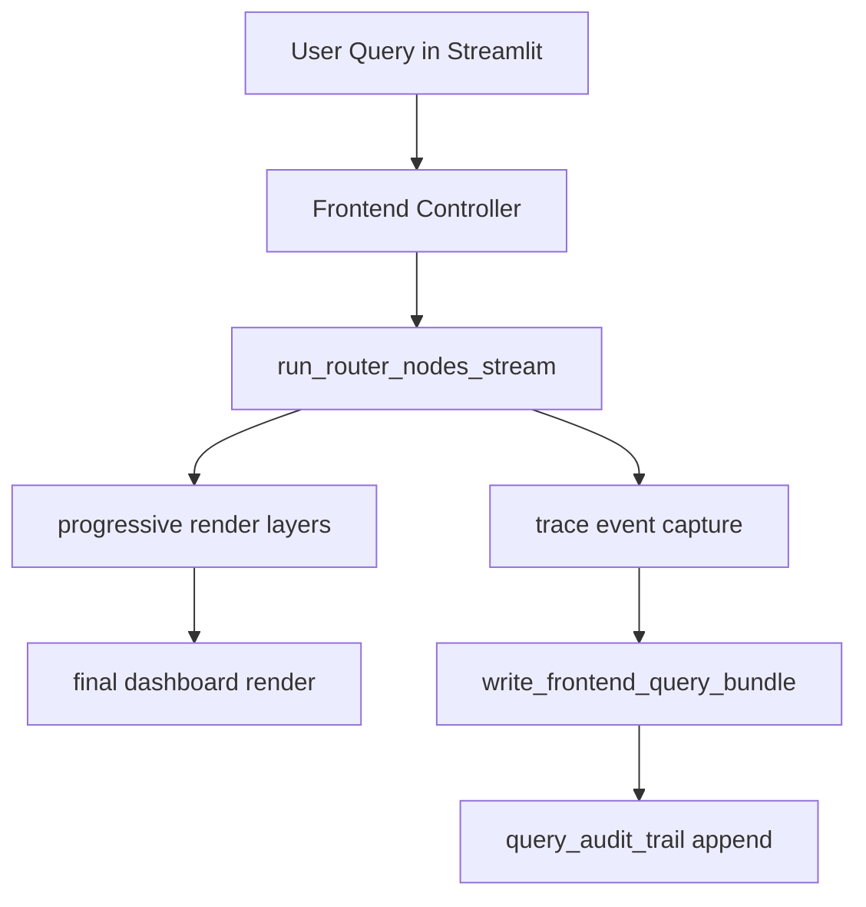

# Institutional Frontend Runtime Guide

## 1. Goal
Define how the Streamlit frontend executes, renders, and audits multi-agent query runs while staying consistent with backend observability contracts.

## 2. Architecture


## 3. Code Strategy and Workflow
- Stream node-level events to surface intermediate retrieval and reasoning context.
- Render phase outputs before full graph completion to reduce perceived latency.
- Write trace, summary, and final-state artifacts for every query (including failure paths).
- Keep frontend event schema aligned with backend `router_e2e` contracts.

## 4. Output Data Schema and Path
| Artifact | Schema | Core Fields | Path |
| --- | --- | --- | --- |
| session chat state | in-memory UI state | user message, assistant response | Streamlit session state |
| streamed node events | trace event row | node, event, elapsed_s, route, delta_keys | `Frontend/app.py` runtime |
| frontend trace | `*_trace.jsonl` | `_meta` + event rows | `logs/frontend_query/<YYYY-MM-DD>/` |
| frontend final state | `*_final_state.json` | merged graph state snapshot | `logs/frontend_query/<YYYY-MM-DD>/` |
| frontend summary | `*_summary.json` | outcome, confidence, nodes, artifacts | `logs/frontend_query/<YYYY-MM-DD>/` |
| frontend index trail | `query_audit_trail.jsonl` | query metadata + artifact links | `logs/frontend_query/<YYYY-MM-DD>/query_audit_trail.jsonl` |

## 5. How to Test
```bash
streamlit run Frontend/app.py
python -m Scripts query "Today GLD IV skew and geopolitical risk context?"
```

Validation checklist:
- progressive rendering appears before final report;
- three frontend bundle files are created per query;
- index trail points to valid trace/final_state/summary paths.

## 6. Dependence Files and One-Line Command
### Inputs
- `Frontend/app.py`
- `Frontend/pipeline.py`
- `Frontend/renderers.py`
- `Frontend/audit.py`
- `Frontend/contracts.py`

### Outputs
- analyst-facing progressive dashboard;
- frontend query bundle for replay and post-mortem.

### Related Docs
- [Backend System Blueprint](./Backend_README.md)
- [Observability Contracts](./Observability.md)
- [Orchestration Runtime](./Orchestration.md)
- [System Topology](./ARCHITECTURE.md)
- [Agent Architecture](../agent/Agent_Architecture.md)
- [Retrieval Strategy](../Query_retrieval_docs/Retrieval_Architecture_and_Strategy.md)

```bash
pip install -r requirements.txt
```
