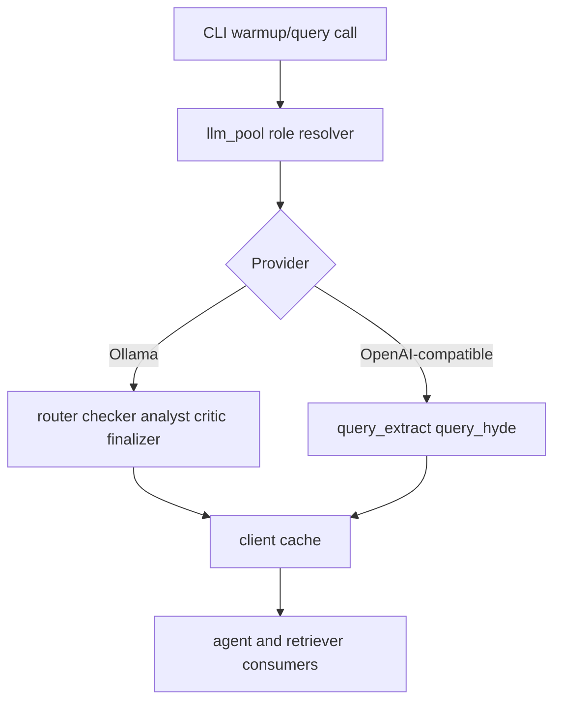

# Institutional LLM Pool Operations Guide

## 1. Goal
Define model-provider routing, role-based warmup behavior, and operational guardrails for stable low-latency multi-agent execution.

## 2. Architecture


## 3. Code Strategy and Workflow
- Centralize all model access through `Scripts/core/llm_pool.py`.
- Keep role assignment explicit and provider-aware.
- Warm heavy roles first (`analyst`) before lightweight support roles.
- Use cache re-use and `KEEP_ALIVE` controls to reduce cold-start failures.

## 4. Output Data Schema and Path
| Component | Contract | Core Fields | Path |
| --- | --- | --- | --- |
| Warmup result row | warmup status payload | role, provider, status, detail | `Scripts/core/llm_pool.py` |
| Role table | role binding map | role, model name, provider | `Scripts/core/financial_config.py` |
| Runtime cache | in-process client cache | role key, initialized client | process memory |
| Warmup CLI output | terminal status rows | success/fail per role | `python -m Scripts warmup` |

## 5. How to Test
```bash
python -m Scripts warmup --roles analyst
python -m Scripts warmup --roles router checker
python -m Scripts query --warmup "Today SPY put-call ratio and ATM IV?"
```

## 6. Dependence Files and One-Line Command
### Inputs
- `Scripts/core/llm_pool.py`
- `Scripts/core/financial_config.py`
- `.env` model/provider settings

### Outputs
- role-level model readiness status;
- cached client instances for query-serving paths.

### Related Docs
- [Orchestration Runtime](./Orchestration.md)
- [Backend System Blueprint](./Backend_README.md)
- [System Topology](./ARCHITECTURE.md)
- [Agent Architecture](../agent/Agent_Architecture.md)

```bash
pip install -r requirements.txt
```

