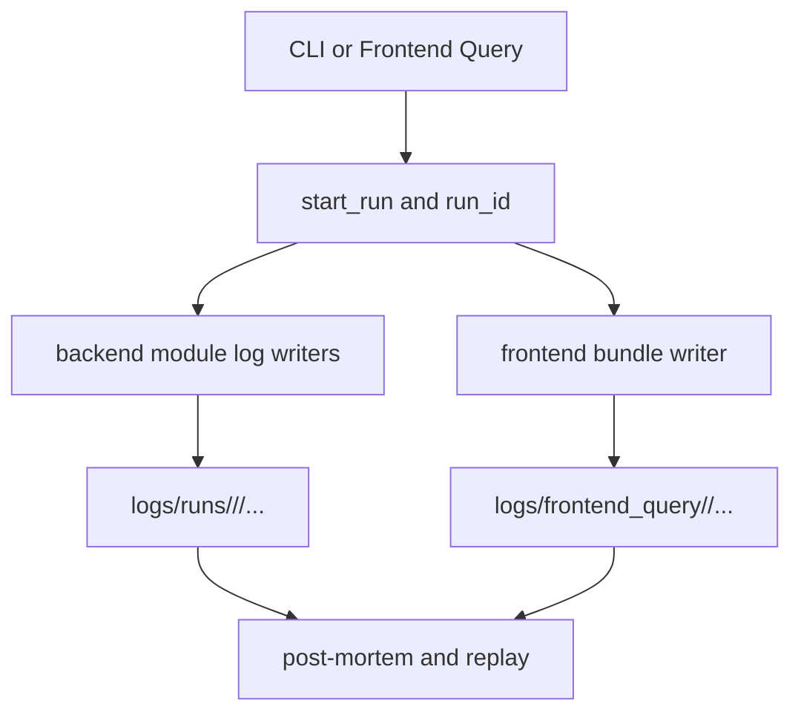

# Institutional Observability Contracts Guide

## 1. Goal
Define a unified, run-scoped logging and audit framework across backend orchestration and frontend query execution.

## 2. Architecture


## 3. Code Strategy and Workflow
- Use `audit_path(...)` as the only path-construction interface.
- Keep backend logs run-scoped and module-partitioned.
- Keep frontend output as trace/final_state/summary plus index trail.
- Preserve legacy flat paths only for migration compatibility.

Target layout:
```text
logs/
├── runs/<YYYY-MM-DD>/<run_id>/{orchestrator.log,retrieval/,query_transform/,router_e2e/,sql_range/}
├── frontend_query/<YYYY-MM-DD>/{*_trace.jsonl,*_summary.json,*_final_state.json,query_audit_trail.jsonl}
├── scheduler/collect_data.log
└── <legacy_flat_modules>/<YYYY-MM-DD>/...
```

## 4. Output Data Schema and Path
| Artifact | Schema | Core Fields | Path |
| --- | --- | --- | --- |
| run id | run identifier | `{YYYYMMDD}_{HHMMSS}_{tag}_{uuid6}` | runtime context |
| orchestrator log | root runtime log | level, timestamp, message | `logs/runs/<YYYY-MM-DD>/<run_id>/orchestrator.log` |
| retrieval trail | audit JSONL | query, filters, hit counts, timing | `logs/runs/<YYYY-MM-DD>/<run_id>/retrieval/retriever_audit_trail.jsonl` |
| query transform trail | audit JSONL | extraction, hyde, metadata filters | `logs/runs/<YYYY-MM-DD>/<run_id>/query_transform/query_audit_trail.jsonl` |
| router trace bundle | e2e artifacts | trace events, summary, final state | `logs/runs/<YYYY-MM-DD>/<run_id>/router_e2e/` |
| frontend bundle | query bundle artifacts | trace, summary, final state, links | `logs/frontend_query/<YYYY-MM-DD>/` |

## 5. How to Test
```bash
python -m Scripts query "Today SPY put-call ratio and ATM IV for 30-DTE puts?"
python Scripts/tests/test_router_e2e.py
streamlit run Frontend/app.py
```

Validation checklist:
- run-scoped folders are created under `logs/runs/<today>/<run_id>/`;
- frontend bundle files are created under `logs/frontend_query/<today>/`;
- trail files contain resolvable cross-artifact paths.

## 6. Dependence Files and One-Line Command
### Inputs
- `Scripts/observability/`
- `Scripts/orchestration/cli.py`
- `Frontend/audit.py`
- `Scripts/tests/test_router_e2e.py`

### Outputs
- traceable execution lineage for backend and frontend query paths;
- replay-ready artifacts for QA and incident response.

### Related Docs
- [Backend System Blueprint](./Backend_README.md)
- [Orchestration Runtime](./Orchestration.md)
- [Frontend Runtime](./frontend_readme.md)
- [System Topology](./ARCHITECTURE.md)
- [Agent Architecture](../agent/Agent_Architecture.md)

```bash
pip install -r requirements.txt
```
