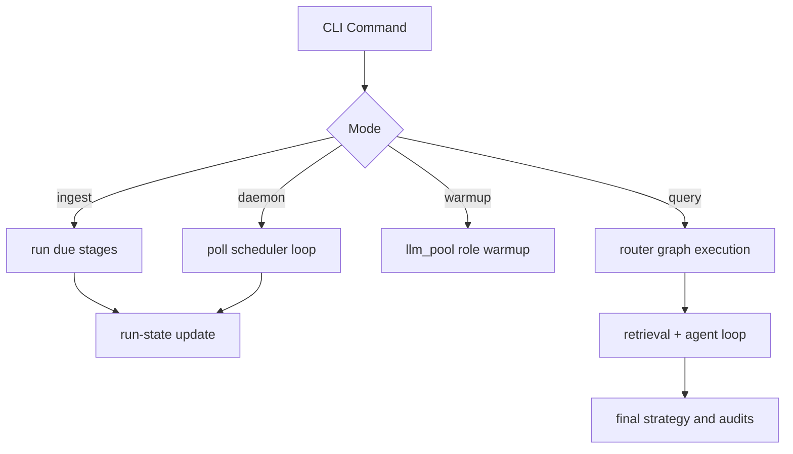

# Institutional Orchestration Runtime Guide

## 1. Goal
Define the authoritative execution lifecycle for ingestion, warmup, query serving, and daemon scheduling under deterministic run-state control.

## 2. Architecture


## 3. Code Strategy and Workflow
- Use `python -m Scripts` as the canonical runtime surface.
- Keep `collect_data_state.json` as the single source of state anchors.
- Route all warmup calls through `llm_pool.warmup_sync`.
- Preserve idempotency for ingest and deterministic anchors for retrieval/audit.

## 4. Output Data Schema and Path
| Runtime Surface | Contract | Core Fields | Path |
| --- | --- | --- | --- |
| run state | ingestion state snapshot | stage name, last run timestamp, status | `config/runtime/collect_data_state.json` |
| CLI command result | command status output | command, status, message | CLI stdout |
| query execution state | graph state payload | route, contexts, revisions, final strategy | `Scripts/agents/state.py` |
| run-scoped logs | orchestrator and module trails | run_id, module, event timeline | `logs/runs/<YYYY-MM-DD>/<run_id>/...` |

## 5. How to Test
```bash
python -m Scripts status
python -m Scripts warmup --roles analyst router
python -m Scripts ingest
python -m Scripts query "Past week FOMC and 10Y yields impact on SPY puts?"
python -m Scripts daemon --warmup
```

## 6. Dependence Files and One-Line Command
### Inputs
- `Scripts/orchestration/cli.py`
- `Scripts/core/llm_pool.py`
- `config/runtime/collect_data_state.json`

### Outputs
- deterministic runtime control across ingest/query/daemon flows;
- run-scoped operational traces for incident replay.

### Related Docs
- [Backend System Blueprint](./Backend_README.md)
- [LLM Pool Operations](./LLM_Pool.md)
- [Observability Contracts](./Observability.md)
- [Frontend Runtime](./frontend_readme.md)
- [Agent Architecture](../agent/Agent_Architecture.md)

```bash
pip install -r requirements.txt
```

