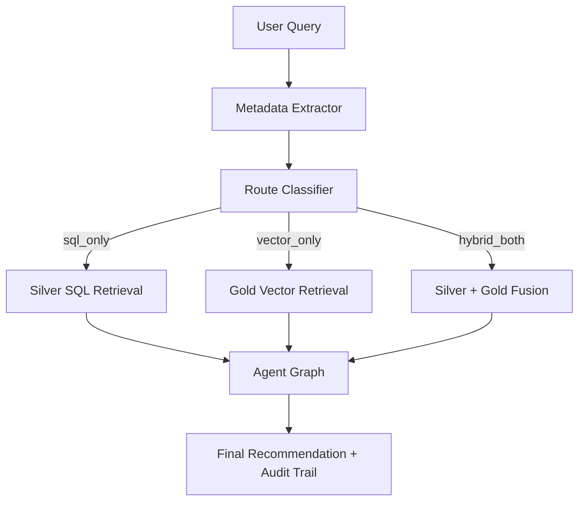

# User Query Guide

## Architecture


## 1. High-Quality Query Template

Use this structure:

`[ticker or macro asset] + [metric] + [time window] + [intent]`

Examples:
- `Past month AAPL Form-4 selling signal and put positioning?`
- `Today SPY put-call ratio and ATM IV for 30-DTE puts`
- `Past week FOMC and 10Y yields impact on QQQ options`

## 2. Router and Retrieval Behavior

- Router chooses one route: `sql_only`, `vector_only`, `hybrid_both`.
- Retrieval always includes structured time-range metadata.
- HyDE can contribute novel ticker expansion when relevant.

## 3. Supported Domains

- Options microstructure (IV/skew/PCR/liquidity).
- Macro regime context (VIX, yields, dollar, GPR).
- SEC insider/event context for covered universe tickers.
- News narrative evidence via Gold semantic retrieval.

## 4. Common Failure Patterns

- Missing ticker + missing macro anchor -> weak retrieval signal.
- Ambiguous time phrase -> broad default window.
- Out-of-universe symbol -> Silver evidence gap.

## 5. Best Practices

- Keep one primary intent per query.
- Always include time phrase (`today`, `yesterday`, `past week`, `past month`).
- Ask follow-up queries instead of stacking too many constraints in one sentence.

## 6. Verification

```bash
python -m Scripts query "Past week GLD IV skew and geopolitical risk context?"
python Scripts/tests/test_router_e2e.py
```

# User Query Guide

> **Audience.** End-users and analysts who want to ask the
> Options-Recommendation RAG meaningful questions.
> **Goal.** Show what this system *can* answer, what data it has behind
> each answer, and how to phrase a query so the router, retriever and
> analyst agents can do their job cleanly.
>
> If your query runs through the router and you see `route=vector_only`,
> `fallback_tier=drop_ticker_180d`, or the final report says
> *"INSUFFICIENT DATA"*, re-read §2 and §4 of this document before
> opening a bug — 90 % of the time the query was under-specified.

---

## 1. What this system is (and is not) for

The bot is a **multi-agent retrieval stack** that answers **options-trading
and cross-asset macro questions** grounded in four live data layers:

| Layer          | Storage                       | Updated          | Typical questions it answers |
|---------------|-------------------------------|------------------|------------------------------|
| Options chain  | Parquet (Silver)              | Daily (trading)  | IV, skew, Put/Call Ratio, OI, liquidity |
| Macro history  | Parquet + Markdown (Silver/Gold) | Daily         | VIX, DXY, yields, GPR index, Fed tone |
| News           | Qdrant vectors (Gold)         | 1–3× per week    | Event-driven narrative (Fed, CPI, geopolitics, metals) |
| SEC filings    | Qdrant vectors + JSONL (Bronze) | Weekly         | Insider (Form-4), 8-K, 10-K/Q risk language |

It is **not** built for:
- Real-time intraday quotes (we're end-of-day).
- Stocks outside the tracked universe (§2).
- Fundamental valuation (DCF, multiples).
- Crypto, FX majors, or single-name bonds.

### 1.1 Operational limitations (critical)

- Gold strict retrieval may return 0 even when data exists, then fall back to Tier2/Tier3.
  This is expected when strict metadata filters are too narrow (for example ticker+topic+form constraints).
- Unsupported metrics are ignored by Silver handlers (for example `Yield Spread` is currently unauthorized).
- `iv_regime_block` is a deterministic runtime control block, not a parquet column; treat it as a synthetic anchor only.
- Use `today` instead of `current` in all production queries and tests to reduce parser ambiguity.

### 1.2 Query complexity budget (latency guardrail)

- Prefer **one primary intent per query** (macro OR options OR SEC) for best latency.
- Keep production prompts around **8-12 words**, with explicit ticker + time phrase + metric.
- Avoid chaining more than two analytical demands in one sentence.
- If you need multi-step reasoning, split into two sequential queries.

---

## 2. Tickers the system actually knows about

Only tickers listed in `config/universe/` are in our options & SEC pipelines.
Anything else will either fall back to a macro-only reading or return no
Silver evidence at all.

### 2.1 Single-name equities (options + SEC Form-4/8-K/10-K)

Current coverage: **48 Nasdaq-100 constituents**

```
AAPL  MSFT  NVDA  AMZN  META  GOOGL TSLA  AVGO  COST  PEP
NFLX  AMD   CSCO  TMUS  ADBE  QCOM  TXN   INTU  AMGN  ISRG
HON   CMCSA INTC  AMAT  IBM   BKNG  VRTX  SBUX  PANW  MDLZ
GILD  REGN  LRCX  ADP   ADI   MU    SNPS  CDNS  MELI  CSX
KLAC  PYPL  CRWD  MAR   ASML  CTAS  MNST  NXPI
```
### 2.2 ETFs (options only, no SEC)

| Role             | Tickers        | Use for |
|------------------|----------------|---------|
| Broad-market     | `SPY QQQ IWM`  | Index sentiment, beta, regime |
| Commodity / hedge| `GLD SLV`      | Precious-metals exposure, inflation hedge |

> **Tip.** If you ask about "the market" without a ticker, the router
> will usually anchor on SPY/QQQ. If you want a commodity angle, say
> *gold*, *silver*, *GLD*, or *SLV* explicitly.

---

## 3. Data sources and the metadata they expose

### 3.1 Options chain (Silver / Parquet)

Path: `Data/2_Silver_Processed/Options_Market_Data/<YYYY-MM-DD>/<TICKER>_options_<date>.parquet`

Per-contract fields the router can filter on:

| Field               | Meaning                                       |
|---------------------|-----------------------------------------------|
| `ticker`            | Underlying symbol                             |
| `expiration`, `dte` | Expiry date & days-to-expiry                  |
| `option_type`       | `call` / `put`                                |
| `strike`, `moneyness_pct`, `in_the_money` | Position on the chain |
| `implied_volatility`| Per-contract IV                               |
| `volume`, `open_interest` | Liquidity primitives                    |
| `spread_pct`        | (ask − bid) / mid                             |
| `is_liquid`         | Derived boolean (volume & OI thresholds)      |
| `last_price`, `bid`, `ask`, `underlying_price` | Pricing quad  |

Derived metrics the system can compute on the fly: **IV Skew**, **Put/Call
Ratio** (volume *and* open-interest flavours), **latest ATM IV**,
**liquidity scan**, **OTM/ITM** filters.

### 3.2 Macro history (Silver parquet + Gold markdown)

Paths:
- `Data/2_Silver_Processed/Macro_History/<date>/macro_snapshot_<date>.parquet`
- `Data/3_Gold_Semantic/Macro_Narratives/<date>/macro_context_<date>.md`
- `Data/Agent_Context/latest_macro_context.md` (always-current mirror)

Indicators ingested daily (subset):

| Symbol    | Name                               |
|-----------|------------------------------------|
| `^VIX`    | Volatility index                   |
| `^GSPC`, `^IXIC`, `^RUT` | S&P 500, Nasdaq, Russell 2000 |
| `^TNX`    | 10-Year Treasury Yield             |
| `DX-Y.NYB`| US Dollar Index                    |
| `GC=F`, `SI=F` | Gold / Silver futures          |
| `GPR`     | Caldara-Iacoviello geopolitical-risk index |

Available macro metrics: `Price`, `Price Change (%)`, `Daily/Monthly/Yearly
Change (%)`, `Macro Trend`, `GPR Index` (+ `GPR Threats / Acts / Components`).

### 3.3 News (Qdrant Gold layer)

Pre-curated GDELT topic buckets (see `news_scraper.py`):

| Topic                              | Typical triggers |
|------------------------------------|------------------|
| `macro_central_banks`              | Fed/FOMC, Powell, ECB, BOJ, rate decisions |
| `macro_inflation_employment`       | CPI, PCE, payrolls, wage growth            |
| `macro_yields_dollar`              | 10Y yields, DXY, Treasuries                |
| `macro_geopolitics_risk`           | Middle East, Ukraine, Taiwan, sanctions    |
| `asset_precious_metals_spot`       | Gold, silver spot / bullion / safe haven   |
| `asset_metals_derivatives`         | COMEX, metals options, metals ETF flows    |

Metadata per chunk: `unified_timestamp`, `publish_timestamp`, `impacted_assets`,
`tone`, `topic`.

### 3.4 SEC filings (Qdrant Gold + JSONL Bronze)

Form coverage: **Form 4 (insider)**, **8-K (material events)**, **10-K / 10-Q**
for the 48 single-names in §2.1.

Metadata: `ticker`, `form_type`, `accession_no`, `filed_at`,
`transaction_date`, `action_direction` (BUY / SELL / ACQUIRE/VEST / NONE),
`tone_score`, `url`.

---

## 4. How to phrase a query so the router does the right thing

The router runs two LLM stages — a **Metadata Extractor** and a **HyDE
Writer** (see `docs/Query_retrieval_docs/Query_intent_docs.md`). They look
for specific signals. Give them those signals.

### 4.1 The five ingredients of a well-formed query

| Ingredient         | Why it matters                                        | Examples |
|--------------------|-------------------------------------------------------|----------|
| **Ticker(s)**      | Pins Silver filters; prevents `vector_only` fallback  | `AAPL`, `NVDA`, `SPY`, `GLD` |
| **Metric(s)**      | Drives the SQL dispatcher in `sql_tools.py`           | *Put/Call Ratio*, *IV Skew*, *liquidity*, *VIX*, *GPR* |
| **Time window**    | Picks `today / yesterday / past_week / past_month / past_six_months` | *today*, *yesterday*, *past week*, *6-month* |
| **Source signal**  | Nudges the router toward SEC / News / Macro           | *Form 4*, *insider*, *Fed minutes*, *CPI print*, *geopolitics* |
| **Trade intent**   | Lets the Analyst compose an options view              | *should I buy puts*, *sell covered calls*, *position for an IV crush* |

### 4.2 Good vs. weak queries

```text
# ✅ GOOD — short, precise, low-latency
"AAPL today put-call ratio and IV skew for 30-DTE puts?"

# ✅ GOOD — macro + hedge intent, bounded scope
"Past week FOMC and 10Y yields impact on SPY 30-DTE puts?"

# ⚠️  WEAK — no ticker, no time, vague metric
"Is the market bullish?"         # router will default to past_six_months,
                                 # no Silver anchors, Analyst returns generic.

# ⚠️  WEAK — ticker outside universe
"What is the IV skew on F (Ford)?"
# Ford is not in config/universe; options Silver layer will be empty.
```

### 4.3 Time-phrasing cheat sheet

| You write...                     | Router picks            | Window on Silver |
|----------------------------------|-------------------------|------------------|
| "today", "right now"             | `TimeWindow.TODAY`      | 1 business day   |
| "yesterday", "last session"      | `TimeWindow.YESTERDAY`  | 2 business days (weekend-safe) |
| "past week", "this week"         | `TimeWindow.PAST_WEEK`  | 7 days           |
| "last month", "over the month"   | `TimeWindow.PAST_MONTH` | 30 days          |
| "last 6 months", "YTD-ish"       | `TimeWindow.PAST_SIX_MONTHS` | 180 days    |
| nothing explicit                 | `PAST_SIX_MONTHS` (default) | 180 days    |

> Because the Silver layer snaps to **business days**, "yesterday" on
> a Monday means *last Friday* automatically — you do not need to
> hedge for weekends yourself.

### 4.4 What to say if you want a specific data source

- **Options Silver only:** name metrics (`Put/Call Ratio`, `IV Skew`,
  `liquidity`, `open interest`) plus a ticker.
- **Macro Silver only:** name the indicator (`VIX`, `DXY`, `yields`,
  `gold`, `GPR index`) plus a time phrase.
- **News Gold:** mention an event (`FOMC`, `CPI print`, *"headlines about"*,
  *"market reaction to"*).
- **SEC Gold:** mention *"Form 4"*, *"insider selling/buying"*, *"10-K risk
  factors"*, *"recent 8-K"*.

---

## 5. Reference query taxonomy

| Intent family                    | Template                                                                          |
|----------------------------------|-----------------------------------------------------------------------------------|
| Single-name options posture      | *"What is {TICKER}'s {metric} today and what options strategy fits?"*             |
| Relative-value options           | *"Compare {TICKER_A} vs {TICKER_B} IV skew over the past week."*                  |
| Event-driven                     | *"How did the {event} affect {TICKER or macro} and what exposure would you take?"*|
| Insider-flow driven              | *"Given the recent {TICKER} Form-4 {direction}, should I {strategy}?"*            |
| Macro regime                     | *"With {macro indicator} at {level/trend}, what does that imply for {TICKER/ETF}?"*|
| Geopolitical / commodity         | *"How would rising Middle-East risk move precious metals and GLD options?"*       |
| Liquidity screen                 | *"Which {TICKER} expirations are most liquid for a {strategy} right now?"*        |

---

## 6. Things that will make the system fall back or refuse

1. **Ticker not in universe** → no Silver evidence → Analyst can only reason off Macro/News.
2. **No ticker + no event + no macro indicator** → router runs `vector_only` and may return *"INSUFFICIENT DATA"* on purpose.
3. **Asking for Greeks (Δ/Γ/Θ/ν)** → we list them in the ontology but have not ingested them; you will get an honest "not available" note.
4. **Asking for real-time or intraday** → everything is end-of-day.
5. **Time signal that contradicts the data you request** — e.g. asking for *"yesterday's 10-K filing"*. 10-Ks are quarterly; the Checker will flag time-mismatch in the audit trail.

---

## 7. Where the audit trail lives

Every query writes a per-day JSONL trail:

```text
logs/router_e2e/<YYYY-MM-DD>/<run_ts>_<NN>_<test_name>_trace.jsonl
logs/router_e2e/<YYYY-MM-DD>/<run_ts>_run_summary.json
```

Use this when a report looks wrong: the JSONL captures router decisions, retrieval filters (including the exact `start_date`/`end_date` the Silver SQL used), Critic and Checker verdicts, and the final Finalizer output.

---

## 8. TL;DR — the three rules

1. **Put a ticker in.** If you can't, put a macro indicator or a named event in.
2. **Put a time phrase in.** Implicit defaults to 6 months, which is almost never what you want for an options question.
3. **State your trade intent.** The Analyst tunes its answer to what you asked for (scan / score / position / hedge).

---

## 9. Low-Latency Query Templates (10-word class)

Use these templates for production throughput:

- `Today SPY put-call ratio and ATM IV for 30-DTE puts`
- `Past week FOMC and 10Y yields impact on SPY puts`
- `Today GLD IV skew and liquid 30-DTE hedge strikes`
- `Past month AAPL insider selling signal and put strategy`
- `Today QQQ ATM IV versus VIX divergence hedge signal`

