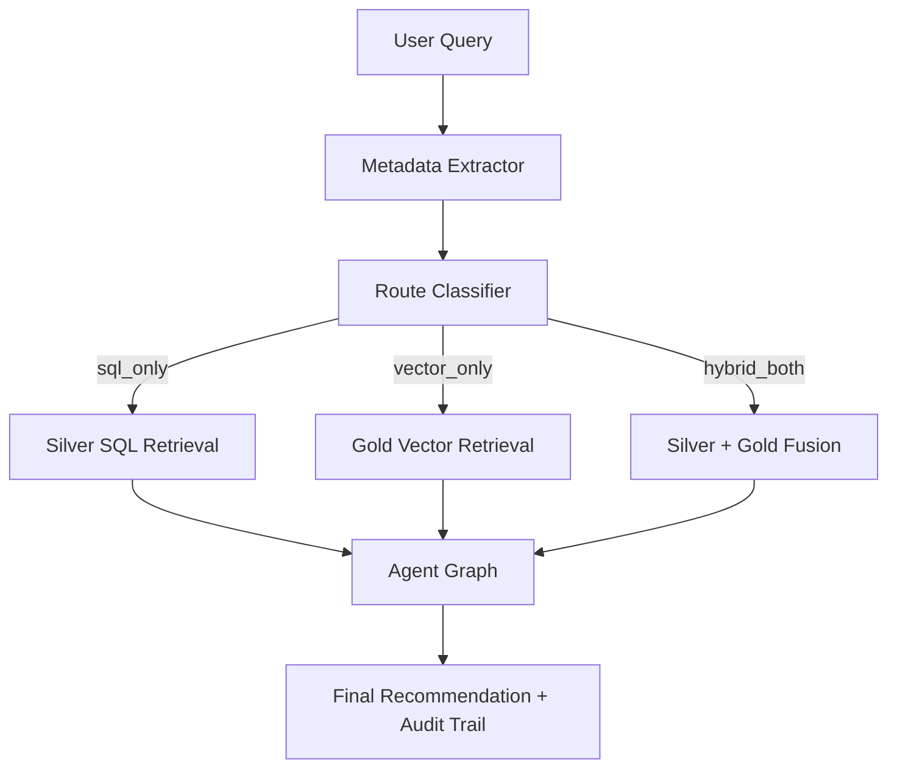

# User Query Guide

## Architecture


## 1. High-Quality Query Template

Use this structure:

`[ticker or macro asset] + [metric or event] + [time window] + [intent]`

Examples:
- `Today SPY put-call ratio and IV skew for hedge posture`
- `Past week GLD GPR context and 10Y yields for setup to watch`
- `Past month AAPL Form 4 insider selling and liquidity for signal impact`
- `Past week QQQ VIX regime and news narrative for options read`

What performs best today:
- **ticker-first options posture queries**
- **one-event plus one-asset macro questions**
- **insider-flow questions that explicitly mention Form 4 / insider buying / insider selling**
- **watchlist or hedge wording** when you want a directional read but not necessarily a live structure
- **query-builder style phrasing**: asset, time window, one to three signal chips, then goal

What performs less well:
- long multi-part questions that mix SEC, macro, and options structure in one sentence
- unsupported strike-precise requests without enough options-chain support
- vague market questions with no ticker, no macro indicator, and no time anchor

## 2. Router and Retrieval Behavior

- Router chooses one route: `sql_only`, `vector_only`, or `hybrid_both`.
- Retrieval always includes structured time-range metadata.
- HyDE can contribute novel ticker expansion when relevant.
- The system now distinguishes more cleanly between:
  - **live-structure-capable answers**
  - **directional watchlist answers**
  - **informational-only answers**

What this means for users:
- if you ask for a **market posture**, **hedge view**, or **setup to watch**, the system often performs better than when you force a strike-level structure too early
- if the data does not support a concrete options structure, the system will often downgrade to:
  - `directional_watchlist` when the directional or posture read is still strong
  - `informational_only` when hard data is missing

## 3. Supported Domains

- Options microstructure (IV, skew, PCR, liquidity).
- Macro regime context (VIX, yields, dollar, GPR).
- SEC insider/event context for covered-universe tickers.
- News narrative evidence via Gold semantic retrieval.

Current strongest query families:
- **single-name options posture**
- **ETF / index hedge posture**
- **options microstructure scans**
- **macro-to-ETF regime questions**

Current weaker query families:
- questions that require unsupported metrics such as Greeks
- out-of-universe single names
- overly broad “what should I do now?” prompts with no explicit asset or time anchor
- queries that require a precise live options structure when Silver options support is thin

## 4. Common Failure Patterns

- Missing ticker + missing macro anchor -> weak retrieval signal.
- Ambiguous time phrase -> broad default window.
- Out-of-universe symbol -> Silver evidence gap.
- Asking for a live structure when the evidence only supports a watchlist-level answer.
- Mixing too many intents in one query, for example:
  - insider flow
  - macro regime
  - and strike-specific structure
  in one sentence.
- Asking SEC questions without naming the source signal, for example saying only “management flow” instead of `Form 4`, `insider buying`, or `insider selling`.

## 5. Best Practices

- Keep one primary intent per query.
- Always include a time phrase (`today`, `yesterday`, `past week`, `past month`).
- Ask follow-up queries instead of stacking too many constraints in one sentence.
- For best performance, use **asset + metric/event + time + intent** in that order.
- If you want the best current behavior, prefer queries framed as:
  - `posture`
  - `hedge`
  - `setup to watch`
  - `options read`
  rather than forcing a full live structure before the system has enough support.
- For insider-flow questions, name the direction explicitly:
  - `insider selling`
  - `insider buying`
  - `vesting`
  because the system treats `SELL`, `BUY`, and `ACQUIRE/VEST` as different signals.
- If you do want a concrete options idea, ask for it **after** establishing posture. A two-step flow performs better than forcing everything into one prompt.

## 6. Verification

```bash
python -m Scripts query "Past week GLD IV skew and geopolitical risk context?"
python Scripts/tests/test_router_e2e.py
```

# User Query Guide

> **Audience.** End-users and analysts who want to ask the
> options-recommendation RAG meaningful questions.
> **Goal.** Show what this system *can* answer, what data it has behind
> each answer, and how to phrase a query so the router, retriever and
> agent workflow can do its job cleanly.
>
> If your query runs through the router and you see `route=vector_only`,
> `fallback_tier=drop_ticker_180d`, or the final report says
> *"INSUFFICIENT DATA"*, re-read §2 and §4 before opening a bug — in most
> cases the query was under-specified or asked for precision the current
> data contract does not support.

---

## 1. What this system is (and is not) for

The bot is a **multi-agent retrieval stack** that answers **options-trading
and cross-asset macro questions** grounded in four live data layers:

| Layer          | Storage                       | Updated          | Typical questions it answers |
|---------------|-------------------------------|------------------|------------------------------|
| Options chain  | Parquet (Silver)              | Daily (trading)  | IV, skew, Put/Call Ratio, OI, liquidity |
| Macro history  | Parquet + Markdown (Silver/Gold) | Daily         | VIX, DXY, yields, GPR index, Fed tone |
| News           | Qdrant vectors (Gold)         | 1–3× per week    | Event-driven narrative (Fed, CPI, geopolitics, metals) |
| SEC filings    | Qdrant vectors + JSONL (Bronze) | Weekly         | Insider (Form-4), 8-K, 10-K/Q risk language |

It is **not** built for:
- real-time intraday quotes
- stocks outside the tracked universe
- fundamental valuation
- crypto, FX majors, or single-name bonds

### 1.1 Operational limitations (critical)

- Gold strict retrieval may return 0 even when data exists, then fall back to Tier2/Tier3.
  This is expected when strict metadata filters are too narrow.
- Unsupported metrics are ignored by Silver handlers. For example, `Yield Spread` and Greeks are currently unauthorized or unavailable.
- `iv_regime_block` is a deterministic runtime control block, not a parquet column.
- The workflow is strongest on **directional and posture-aware options analysis**. It is weaker when asked for a highly precise live structure without enough options support.
- Current production behavior is intentionally conservative:
  - if evidence is strong but not structure-ready, you are likely to get a **directional watchlist**
  - if hard data is missing, you are likely to get an **informational-only** answer
- Use `today` instead of `current` in production queries and tests to reduce parser ambiguity.

### 1.2 Query complexity budget (latency guardrail)

- Prefer **one primary intent per query** for best latency and best mode classification.
- Keep production prompts around **8-16 words**, with explicit ticker + time phrase + metric/event.
- Avoid chaining more than two analytical demands in one sentence.
- If you need multi-step reasoning, split into two sequential queries.
- The current system performs better with:
  - `What is the posture?`
  - `What is the hedge setup to watch?`
  - `How does this event affect SPY / QQQ / GLD options?`
  than with:
  - `Give me the exact strikes, expiry, and full trade plan` in the first question.

---

## 2. Tickers the system actually knows about

Only tickers listed in `config/universe/` are in our options and SEC pipelines.
Anything else will either fall back to a macro-only reading or return no
Silver evidence at all.

### 2.1 Single-name equities (options + SEC Form-4/8-K/10-K)

Current coverage: **48 Nasdaq-100 constituents**

```
AAPL  MSFT  NVDA  AMZN  META  GOOGL TSLA  AVGO  COST  PEP
NFLX  AMD   CSCO  TMUS  ADBE  QCOM  TXN   INTU  AMGN  ISRG
HON   CMCSA INTC  AMAT  IBM   BKNG  VRTX  SBUX  PANW  MDLZ
GILD  REGN  LRCX  ADP   ADI   MU    SNPS  CDNS  MELI  CSX
KLAC  PYPL  CRWD  MAR   ASML  CTAS  MNST  NXPI
```

### 2.2 ETFs (options only, no SEC)

| Role             | Tickers        | Use for |
|------------------|----------------|---------|
| Broad-market     | `SPY QQQ IWM`  | Index sentiment, beta, regime, downside hedge posture |
| Commodity / hedge| `GLD SLV`      | Precious-metals exposure, inflation hedge, geopolitical-risk posture |

> **Tip.** If you ask about "the market" without a ticker, the router
> will usually anchor on SPY/QQQ. If you want a commodity angle, say
> *gold*, *silver*, *GLD*, or *SLV* explicitly.

---

## 3. Data sources and the metadata they expose

### 3.1 Options chain (Silver / Parquet)

Path: `Data/2_Silver_Processed/Options_Market_Data/<YYYY-MM-DD>/<TICKER>_options_<date>.parquet`

Per-contract fields the router can filter on:

| Field               | Meaning                                       |
|---------------------|-----------------------------------------------|
| `ticker`            | Underlying symbol                             |
| `expiration`, `dte` | Expiry date & days-to-expiry                  |
| `option_type`       | `call` / `put`                                |
| `strike`, `moneyness_pct`, `in_the_money` | Position on the chain |
| `implied_volatility`| Per-contract IV                               |
| `volume`, `open_interest` | Liquidity primitives                    |
| `spread_pct`        | Bid/ask spread percentage                     |
| `is_liquid`         | Derived boolean                               |
| `last_price`, `bid`, `ask`, `underlying_price` | Pricing quad  |

Derived metrics the system can compute on the fly:

- IV Skew
- Put/Call Ratio
- latest ATM IV
- liquidity scan
- OTM / ITM filters

These are currently some of the system’s strongest data surfaces.

### 3.2 Macro history (Silver parquet + Gold markdown)

Paths:
- `Data/2_Silver_Processed/Macro_History/<date>/macro_snapshot_<date>.parquet`
- `Data/3_Gold_Semantic/Macro_Narratives/<date>/macro_context_<date>.md`
- `Data/Agent_Context/latest_macro_context.md`

Indicators ingested daily (subset):

| Symbol    | Name                               |
|-----------|------------------------------------|
| `^VIX`    | Volatility index                   |
| `^GSPC`, `^IXIC`, `^RUT` | S&P 500, Nasdaq, Russell 2000 |
| `^TNX`    | 10-Year Treasury Yield             |
| `DX-Y.NYB`| US Dollar Index                    |
| `GC=F`, `SI=F` | Gold / Silver futures          |
| `GPR`     | Caldara-Iacoviello geopolitical-risk index |

Available macro metrics include:

- `Price`
- `Price Change (%)`
- `Daily / Monthly / Yearly Change (%)`
- `Macro Trend`
- `GPR Index`

Macro-plus-options questions perform best when you name both:

- the macro driver
- and the target ETF or asset

### 3.3 News (Qdrant Gold layer)

Pre-curated GDELT topic buckets:

| Topic                              | Typical triggers |
|------------------------------------|------------------|
| `macro_central_banks`              | Fed/FOMC, Powell, ECB, BOJ, rate decisions |
| `macro_inflation_employment`       | CPI, PCE, payrolls, wage growth            |
| `macro_yields_dollar`              | 10Y yields, DXY, Treasuries                |
| `macro_geopolitics_risk`           | Middle East, Ukraine, Taiwan, sanctions    |
| `asset_precious_metals_spot`       | Gold, silver spot / bullion / safe haven   |
| `asset_metals_derivatives`         | COMEX, metals options, metals ETF flows    |

Metadata per chunk:

- `unified_timestamp`
- `publish_timestamp`
- `impacted_assets`
- `tone`
- `topic`

News helps most when you explicitly name an event or topic. It is weaker as a catch-all substitute for options data.

### 3.4 SEC filings (Qdrant Gold + JSONL Bronze)

Form coverage: **Form 4, 8-K, 10-K / 10-Q** for the single names in §2.1.

Metadata:

- `ticker`
- `form_type`
- `accession_no`
- `filed_at`
- `transaction_date`
- `action_direction` (`BUY`, `SELL`, `ACQUIRE/VEST`, `NONE`)
- `tone_score`
- `url`

Important user-side implication:

- `SELL`, `BUY`, and `ACQUIRE/VEST` are not treated as the same thing
- if you care specifically about selling pressure or buying conviction, say so explicitly

---

## 4. How to phrase a query so the router does the right thing

The router runs two LLM stages — a **Metadata Extractor** and a **HyDE
Writer**. They look for explicit signals. Give them those signals.

### 4.1 The five ingredients of a well-formed query

| Ingredient         | Why it matters                                        | Examples |
|--------------------|-------------------------------------------------------|----------|
| **Ticker(s)**      | Pins Silver filters; prevents weak fallback behavior  | `AAPL`, `NVDA`, `SPY`, `GLD` |
| **Metric(s)**      | Drives the SQL dispatcher and slot contract           | *Put/Call Ratio*, *IV Skew*, *liquidity*, *VIX*, *GPR* |
| **Time window**    | Anchors retrieval cleanly                             | *today*, *yesterday*, *past week*, *past month* |
| **Source signal**  | Nudges the router toward SEC / News / Macro           | *Form 4*, *insider*, *Fed minutes*, *CPI print*, *geopolitics* |
| **Intent**         | Tells the workflow whether you want posture, hedge, scan, or structure | *hedge posture*, *setup to watch*, *liquidity scan* |

### 4.2 Good vs. weak queries

```text
# GOOD — short, precise, strong current fit
"AAPL today put-call ratio and IV skew for downside posture?"

# GOOD — macro + hedge intent, bounded scope
"Past week FOMC and 10Y yields impact on SPY downside hedge?"

# GOOD — insider + options read
"Past month AMD Form-4 selling signal and options liquidity posture?"

# WEAK — no ticker, no time, vague metric
"Is the market bullish?"

# WEAK — forces too much precision too early
"Give me the exact GLD strikes and expiry to trade Middle East risk now"

# WEAK — ticker outside universe
"What is the IV skew on F (Ford)?"
```

### 4.3 Time-phrasing cheat sheet

| You write...                     | Router picks            | Window on Silver |
|----------------------------------|-------------------------|------------------|
| "today", "right now"             | `TimeWindow.TODAY`      | 1 business day   |
| "yesterday", "last session"      | `TimeWindow.YESTERDAY`  | 2 business days (weekend-safe) |
| "past week", "this week"         | `TimeWindow.PAST_WEEK`  | 7 days           |
| "last month", "over the month"   | `TimeWindow.PAST_MONTH` | 30 days          |
| "last 6 months", "YTD-ish"       | `TimeWindow.PAST_SIX_MONTHS` | 180 days    |
| nothing explicit                 | `PAST_SIX_MONTHS` (default) | 180 days    |

> For options questions, explicit short windows usually perform better than the default 6-month window.

### 4.4 What to say if you want a specific data source

- **Options Silver only:** name metrics like `Put/Call Ratio`, `IV Skew`, `ATM IV`, `liquidity`, `open interest`.
- **Macro Silver only:** name the indicator (`VIX`, `DXY`, `yields`, `gold`, `GPR index`) plus a time phrase.
- **News Gold:** mention an event (`FOMC`, `CPI`, `Middle East risk`, `headlines about ...`).
- **SEC Gold:** mention `Form 4`, `insider selling`, `insider buying`, `vesting`, `recent 8-K`, or `10-K risk factors`.

If you want best performance, avoid making the system guess the source family.

---

## 5. Reference query taxonomy

| Intent family                    | Template                                                                          |
|----------------------------------|-----------------------------------------------------------------------------------|
| Single-name options posture      | *"What is {TICKER}'s {metric} today and what options posture fits?"*              |
| Relative-value options           | *"Compare {TICKER_A} vs {TICKER_B} IV skew over the past week."*                  |
| Event-driven                     | *"How did the {event} affect {TICKER or macro asset} and what hedge setup fits?"* |
| Insider-flow driven              | *"Given recent {TICKER} Form-4 {direction}, what is the options posture?"*        |
| Macro regime                     | *"With {macro indicator} at {level/trend}, what does that imply for {TICKER/ETF}?"* |
| Geopolitical / commodity         | *"How does rising geopolitical risk affect GLD or SLV options posture?"*          |
| Liquidity screen                 | *"Which {TICKER} expirations look most liquid for a hedge or watchlist setup?"*   |

Queries in these families perform best when they stay within one primary objective.

---

## 6. Things that will make the system fall back or refuse

1. **Ticker not in universe** -> no Silver evidence -> the answer may fall back to macro/news context only.
2. **No ticker + no event + no macro indicator** -> weak retrieval anchor -> often generic or informational output.
3. **Asking for Greeks** -> currently unsupported.
4. **Asking for real-time or intraday** -> the stack is end-of-day.
5. **Asking for exact live structure when options support is thin** -> likely downgrade to `directional_watchlist` or `informational_only`.
6. **Over-stacked query design** -> too many simultaneous asks can reduce answer quality even when the data exists.

---

## 7. Where the audit trail lives

Every query writes a per-day JSONL trail:

```text
logs/router_e2e/<YYYY-MM-DD>/<run_ts>_<NN>_<test_name>_trace.jsonl
logs/router_e2e/<YYYY-MM-DD>/<run_ts>_run_summary.json
```

Use this when a report looks wrong: the JSONL captures router decisions, retrieval filters, Critic and Checker verdicts, and the final Finalizer output.

---

## 8. TL;DR — the three rules

1. **Put a ticker in.** If you cannot, put a macro indicator or named event in.
2. **Put a time phrase in.** The 6-month default is rarely ideal for options questions.
3. **State your intent clearly.** `posture`, `hedge`, `setup to watch`, and `liquidity` currently perform better than jumping straight to strike-level execution.

---

## 9. Low-Latency Query Templates (10-word class)

Use these templates for production throughput:

- `Today SPY put-call ratio and IV skew for hedge posture`
- `Past week GLD GPR context and 10Y yields for setup to watch`
- `Past month AAPL Form 4 insider selling and liquidity for signal impact`
- `Past week QQQ VIX regime and news narrative for options read`
- `Today QQQ VIX regime and IV skew for downside hedge posture`
